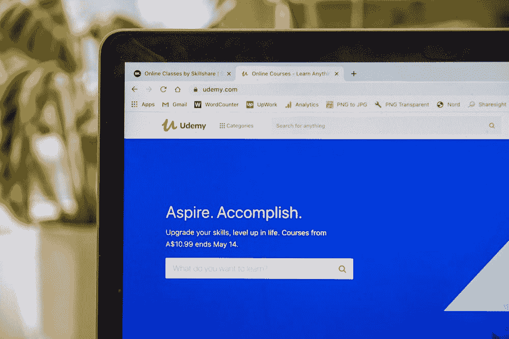

# 我在 Chrome 网上商店发布了我的第一个 Chrome 扩展！

> 原文：<https://levelup.gitconnected.com/i-published-my-first-chrome-extension-on-the-chrome-web-store-b20f0f75cb03>

## ⚡Supercharge 你的 workflow⚡和🚀提高您的生产力🚀通过提取 YouTube 的文字记录/标题，⚡quickly 可以快速浏览视频内容，而✍可以更高效地做笔记

如果你有兴趣试用 chrome 扩展，可以在这里下载:[https://chrome . Google . com/web store/detail/YouTube-transcript-extrac/lclpibfglbkghjkdmpjkgehcnadcffdl](https://chrome.google.com/webstore/detail/youtube-transcript-extrac/lclpibfglbkghjkdmpjkgehcnadcffdl)

***注意*在下载扩展时，您可能会收到一条警告消息:“此扩展不受增强型安全浏览信任”。这是因为*** [***全新的开发者不会立刻被认为是谷歌信任的。***](https://www.theverge.com/2021/6/3/22466386/chrome-91-enhanced-safe-browsing-extensions-download-scanning#:~:text=That%20means%20brand%2Dnew%20developers%20won%E2%80%99t%20immediately%20be%20considered%20trusted%20by%20Google.)

***请放心扩展是完全安全的！
这里可以看到 GitHub 上的项目源代码:***[https://github.com/cyberjj999/youtube-transcript-extractor](https://github.com/cyberjj999/youtube-transcript-extractor)

***对于 GitHub 版本，还提供了 python 版本的工具。***

如果你有兴趣了解我创建这个 chrome 扩展背后的思维过程，我欢迎你继续读下去！

# 关于学习

学习可能具有挑战性。但是今天的学习比过去的学习容易多了。随着科技的发展，我们现在拥有了令人难以置信的搜索引擎，可以在几秒钟内回答我们的问题，还有许多有价值的在线学习资源。

在这些有价值的学习资源中，YouTube 脱颖而出。

如今，YouTube 包含从娱乐到教育的各种内容。

> 毫不奇怪，2017 年， [86%的美国观众报告称，他们经常使用 YouTube 学习新技能。](https://www.thinkwithgoogle.com/marketing-strategies/video/youtube-learning-statistics/)

YouTube 是一个如此突出的学习平台，你会认为它有很棒的学习支持功能，对吗？

嗯，虽然 YouTube 的自动字幕功能对学习很有帮助，但我个人认为，通过效仿 Coursera、edX 和 Udemy 等大型开放在线课程(MOOC)网站，YouTube 可以在几个方面得到改进。

尽管如此，YouTube 并没有被设计成一个 MOOC 平台，因为尽管许多人将它用于学习目的，但它在很大程度上仍然是一个娱乐平台。

然而，如果我告诉你，我们不需要等待 YouTube 实现内置的学习支持功能来优化我们在 YouTube 上学习的学习工作流程，会怎么样？

**这就是 chrome 扩展的用武之地！**

# 关于 Chrome 扩展

也许 Chrome 扩展不需要介绍。我的意思是，现在几乎每个人都在使用它。从广告拦截器到密码管理器，许多精通互联网的 chrome 用户都意识到要寻找 chrome 扩展来改善他们的网络浏览体验。

## 开发 Chrome 扩展

作为一名开发人员，我当然对 chrome 扩展在提升我的网络体验方面的价值感到惊讶。自从我在南洋理工学院开始为我的学校项目学习它们以来，它们就引起了我的兴趣。

**边注*** [**在我之前的文章**](https://medium.com/@lyejiajun/python-flask-a-powerful-and-flexible-web-app-framework-crystalizemylearning-mar-2022-6890e39e6c1e) **中提到，在我过去的一个项目中，我开发了一个机器学习恶意网站检测器 chrome extension。你可以在这里查看视频演示:**[**https://www.youtube.com/watch?v=_wF7eDu6wdQ**](https://www.youtube.com/watch?v=_wF7eDu6wdQ)

无论如何，当我开始更多地利用 YouTube 作为学习平台时，我意识到我最大的一个痛点是反复观看 YouTube 视频的一部分以理解一个困难的概念。

> 虽然一个人不太可能避免经历沉重的认知负荷来进行学习，但我相信学习工作流程是可以优化的。

这最终促使我开发了 Youtube 抄本提取器 chrome 扩展。

# 介绍 YouTube 抄本提取器 Chrome 扩展

这个工具做到了它所说的:它提取 YouTube 视频脚本。

…好极了！但是这有什么用呢？

我开始为自己构建这个工具。到目前为止，它在两个方面给了我很大的帮助。

1.  更快地捕捉视频的精髓
2.  更有效地记笔记

你看，有些教程视频信息量极大，但也非常冗长。为了克服信息过载，如果我把整个文稿粘贴在一个页面上，让我只扫几眼就能快速浏览视频内容，会有所帮助。

如果我想快速记录视频的某些部分，我也可以轻松地提取文字记录中的关键点。

总的来说，这个工具让我的 YouTube 学习流程更加优化！

## 您的里程可能会有所不同

事实上，虽然有许多人喜欢将 YouTube 作为一个学习平台，但也有一些人更喜欢阅读文章或技术文档来学习。

事实上，我有一个非常聪明的朋友，他绝对讨厌从视频中学习，更喜欢其他形式的学习内容。顺便说一句，他也非常专业，擅长他所做的事情。

然而，对于那些在观看信息丰富的 YouTube 视频时做大量笔记的人来说， 我相信这个工具会在这个艰苦的过程中给你带来很大的帮助。

## 太好了！我被迷住了。我如何使用该工具？

首先可以在网络商店下载 chrome 扩展:[https://chrome . Google . com/web store/detail/YouTube-transcript-extrac/lclpibfglbkghjkdmpjkgehcnadcffdl](https://chrome.google.com/webstore/detail/youtube-transcript-extrac/lclpibfglbkghjkdmpjkgehcnadcffdl)

***注意*下载时，您可能会收到消息:“增强型安全浏览不信任此扩展”。这是因为*** [***全新的开发者不会立刻被认为是谷歌信任的。***](https://www.theverge.com/2021/6/3/22466386/chrome-91-enhanced-safe-browsing-extensions-download-scanning#:~:text=That%20means%20brand%2Dnew%20developers%20won%E2%80%99t%20immediately%20be%20considered%20trusted%20by%20Google.) ***请放心 chrome 扩展是 100%安全的。***

接下来，使用 chrome 扩展非常简单，因为只有 3 个简单的步骤。

1.  导航到任何有字幕/文字记录的 YouTube 视频，点击 chrome 扩展图标。
    将出现一个弹出窗口(“提取 YouTube 脚本…(按“确定”继续)”)—单击“确定”开始脚本提取过程。

2.点击“确定”后，将会打开 youtube 副本正文，该工具将尝试提取所有副本文本并将其复制到您的剪贴板。

如果操作成功，将出现一条成功消息。

3.现在，您的剪贴板中有了 YouTube 脚本，您可以将它粘贴到任何文本编辑器(Ctrl + V)中，以查看笔记或使用脚本作为笔记记录过程的一部分。

***本质上，当你点击一个 YouTube 页面上的 chrome 扩展，它会试图打开抄本正文，提取抄本文本。然后，它将内容格式化并复制到您的剪贴板中。***

然后，你可以将这些内容粘贴到任何笔记软件上，并从中阅读或提炼笔记。

这似乎是一个整洁的小工具，对不对？嗯……和任何软件一样，它有优点也有缺点。

为了帮助你理解这一点，我想分享一下我创建这个工具背后的技术思维过程。

# 思维过程

这个工具的主要目的是提取任何给定 YouTube 视频的副本。

根据一些研究，似乎最好的方法是通过 Youtube 数据 API。

然而，YouTube 数据 API 的默认配额分配为每天 10，000 个单位，下载字幕曲目需要 200 个单位。

来源:[https://developers . Google . com/YouTube/v3/docs/captions/download](https://developers.google.com/youtube/v3/docs/captions/download)

这意味着，用不了多久，一堆用户就会提取 50 个 youtube 视频的字幕，直到达到配额。使用 YouTube 数据 API 是可行的，但它不会永远持续下去，直到我们需要为信用付费。

我们如何设计一个解决方案来解除这个限制？

## 运用一点创造力

在我看来，软件工程是一个非常适合创造性逻辑思考者的工作。

通过我使用 YouTube 的经验，我依稀记得有一种方法可以通过点击几个按钮来打开 YouTube 抄本。脚本正文中提供了所有的脚本文本，尽管我们浏览起来有些混乱。

通过几行 Javascript 代码，我可以访问脚本按钮的 HTML DOM，并调用几次点击来提取脚本主体的文本。

通过直接提取副本正文，我们可以绕过 YouTube 数据 API 限制，允许用户提取任意多的 YouTube 视频副本。

你猜怎么着？有用！

## 权衡利弊

在开发软件时，开发人员通常需要权衡各种选择，以决定最佳的前进方向。

在这里，我的方法的好处是，我不会受到 YouTube 的数据 API 配额的限制。不利的一面是，如果 YouTube 以修改与脚本相关的 DOM 组件的方式更新其 HTML DOM，我的 chrome 扩展将不再工作。

## 绕过它

目前，最简单的解决方案是在 YouTube 每次更新时，更新 chrome 扩展代码，以匹配最新的 HTML DOM。

然而，我发现这也相当费力，于是决定创建一个 python 脚本，利用一个[非官方的 YouTube 脚本 API](https://pypi.org/project/youtube-transcript-api/)) 来提取脚本。

如果你有兴趣了解我是如何创建 Python 脚本的，请随意参考我的 GitHub:【https://github.com/cyberjj999/youtube-transcript-extractor】T4——所有源代码都是公开的。

目前，这个工具对我来说非常好用，我没有什么抱怨。这是一个简单的项目，激发了很多学习，也为我提供了很多价值。

# 走向

我认为这个工具很不耐用。然而，我很高兴能逐渐改进这个工具。

也许第一步是让它更健壮。我一直在探索在我的 chrome 扩展中直接使用 python 代码的选项，这样我就可以利用非官方的 YouTube 脚本 API。然而，到目前为止，像 Brython(浏览器 Python)这样的选项似乎不是这项工作的好工具，因为导入功能只包括 Python 中的标准库。

我还在考虑将我目前的方法与 YouTube 数据 API 结合起来，以增加一层健壮性。

不管怎样，我很乐意听到任何想法和建议。我的读者们，如果你们对我如何改进这个工具有任何建议，请随时通过 LinkedIn 联系我！

# 结束语

如果你一路走到这里，我感谢你花时间阅读我创建一个简单的 chrome 扩展背后的思考过程！

通常，像这样的项目让我对学习软件工程领域的不同技术感到非常兴奋。我计划在未来开发更酷更有用的工具，我也欢迎你这样做！

不管怎样，如果你对 chrome 扩展感兴趣，你可以在这里下载:[https://chrome . Google . com/web store/detail/YouTube-transcript-extrac/lclpibfglbkghjkdmpjkgehcnadcffdl](https://chrome.google.com/webstore/detail/youtube-transcript-extrac/lclpibfglbkghjkdmpjkgehcnadcffdl)

感谢您的阅读，我将在下一篇文章中与您联系。干杯！