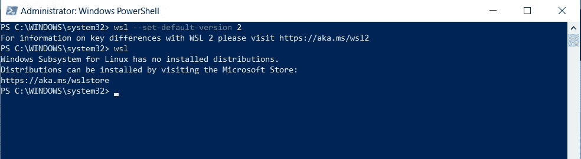
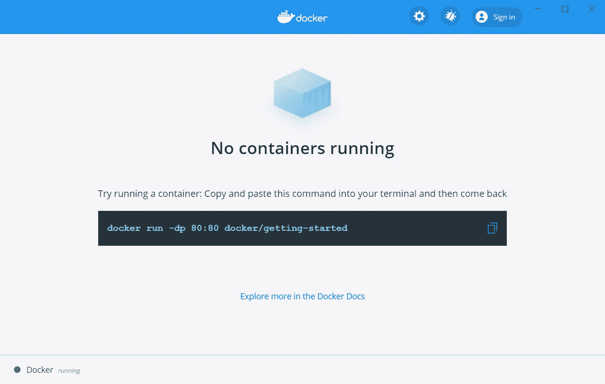

# 我在 Linux 的 Windows 子系统中运行了一个 Docker 容器！

> 原文：<https://levelup.gitconnected.com/i-ran-a-docker-container-inside-windows-subsystem-for-linux-fce0b6e28c08>


大家好！这是 2 部分教程的第 1 部分，我在这里教你如何在 Windows 10 中运行你的第一个 docker 容器。

因为一张图可以说一千个字，我已经包括了每个可能步骤的截图，让每个人都清楚这个过程。

在第一部分中，我将向您展示如何开始在您的 Windows 设备上运行 WSL 2。

WSL (Windows Subsystem for Linux)版本 2 与其前身 WSL 1 相比有很大不同，在 WSL 1 中，WSL 2 没有在 Linux 和 Windows 之间使用转换层，而是使用虚拟化技术来直接在 Windows 10 上运行轻量级虚拟机。

微软讨厌 Linux 的日子一去不复返了！微软在过去几年发生了巨大的变化，他们收购了 GitHub，他们在 Azure 方面做了很多工作，以改善云计算，他们的目标是成为“世界计算机”，现在他们给你一个带 Windows 的 Linux 内核！是啊！

这使得任何拥有 Windows 笔记本电脑的人都可以很容易地学习 Linux，在 Linux 上开发等等。

Windows 操作系统开发与 WSL 2 紧密集成。好了，让我开始解释安装 WSL 2 的步骤:

1.  Windows 10 家庭版，2004 版或更高版本。


2.现在转到开始菜单，搜索“Windows 功能”


3.继续启用“虚拟机平台”和“Linux 的 Windows 子系统”,然后单击确定。


4.上述步骤将搜索所需的文件并应用所需的更改，然后重新启动计算机。

5.现在进入[这个](https://docs.microsoft.com/en-in/windows/wsl/wsl2-kernel)网站，下载更新包并安装 WSL 更新设置。


现在，这已经成功地在您的计算机上安装了 WSL 2。

6.重启后，将 WSL 2 设置为打开的 PowerShell 的默认版本
,并键入以下内容:

```
wsl --set-default-version 2
```



7.接下来，我们必须安装一个 Linux 发行版，打开微软商店并选择您最喜欢的发行版。


我已经安装了 Ubuntu，你可以用任何你觉得舒服的东西。

8.现在，作为一个额外的生产力工具，也可以从商店下载 Windows 终端。


9.安装完成后，从开始菜单打开 Ubuntu，它会要求你创建一个用户并设置密码，一旦完成，你会收到以下信息:


祝贺您，您已经成功地在您的 Windows 计算机中启用并安装了 Linux 发行版(花点时间拍拍您的背！).
10。现在很可能你正在使用 VS 代码进行开发，如果你现在打开它，你会看到下面的提示。继续添加“Remote-WSL”扩展。


好了，现在我们已经启用了 WSL 2，安装了一个 Linux 发行版，并为将来的 Linux 发行版准备好了 VS 代码。现在让我来指导您安装 Docker desktop for WSL 2。

1.  首先，我们去 Docker 官方网站下载 Docker 桌面
    [https://www.docker.com/products/docker-desktop](https://www.docker.com/products/docker-desktop)


2.安装程序下载完成后，安装 Docker，确保在打开安装程序并继续安装时选择了“启用 WSL2 Windows 功能”。


很快你就会看到 docker 已经安装。万岁！！！我们现在已经成功安装了 Docker。


3.让我们尝试使用 ubuntu 终端运行“入门”容器:



# Docker 仪表板:

在深入讨论之前，我想强调一下 Docker 仪表板，它可以让您快速查看机器上运行的容器。它让您快速访问容器日志，让您获得容器内部的外壳，并让您轻松管理容器生命周期(停止、删除等)。).

如果您现在打开仪表板，您将看到本教程正在运行！容器名(下面的 beautiful_agnesi)是一个随机创建的名称。所以，你很可能会有一个不同的名字。


现在，您的容器正在 docker 中运行，您可以通过在浏览器中打开 [http://localhost:80](http://localhost:80) 来检查它，您将看到以下页面:


让我总结一下:

1.  已在 Windows 10 家庭版中启用 WSL 2
2.  安装了一个 Linux 发行版
3.  将远程 WSL 扩展添加到 VS 代码中
4.  为 WSL 安装 Docker 桌面
5.  拉出第一个样本容器(入门)

有了这些，我们现在可以在 Linux 环境下开发一个运行的 Docker 引擎，完全不用担心拥有一个复杂的双引导操作系统。就我个人而言，我对微软引领 Windows 的方向感到非常兴奋。所有这些对于每个总是想两全其美的开发人员来说都是好消息。在我结束这篇博客之前，我想分享一个对每一个不熟悉 WSL 的开发人员都很重要的技巧，以获得最佳性能，那就是将所有的项目文件放在 Linux 发行版中。
要了解关于 Docker 开发最佳实践的更多信息，请点击[这里](https://www.docker.com/blog/docker-desktop-wsl-2-best-practices/)

在我的下一篇博客中，我将带你浏览一个教程，在那里我将教你创建我们的第一个 Docker 映像，并在你的 Linux 内核中运行它。