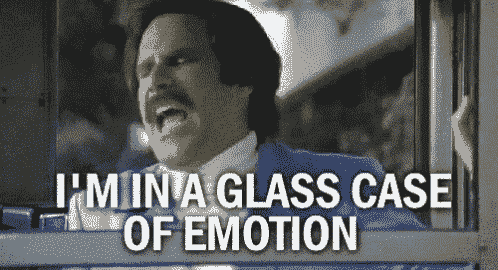

# 我拒绝了我的第一份工作

> 原文：<https://levelup.gitconnected.com/i-rejected-my-first-job-offer-ad0d57367edf>

## 我终于得到了初级开发人员的工作机会！但我拒绝了。

这是事实。确切地说，就在一个多月前，我得到了一份初级开发人员的工作。我拒绝了。我不得不说不，这有点伤我的心，但是让我告诉你，有太多的事情是…太有问题了。

仅供参考:在这篇文章中，你可能会看到一个危险信号🚩。这表明一个观察或实例让我停下来，并在脑海中记下任何我认为可能奇怪或有问题的东西。我发现了很多”🚩“当我继续这个面试过程时，最终我认为有太多的人不值得接受这份工作。我们最后会把这些加起来。

## 职位描述

因此，在一月底，我收到了一份初级 Web 开发人员职位的通知。我看了工作描述，大概是这样的:

*   与✔️设计团队合作
*   支持现有站点(确定)
*   熟悉 HTML，CSS ✔️
*   有 JavaScript 经验者优先考虑✔️
*   熟悉 CMS，如 Wix(当然)

我不会撒谎说我对这份工作描述有一些不满。但它们都是次要的。首先，这家公司是一家代理公司，根据我从事这类工作的技术朋友的意见，客户和代理公司的工作可能会很有挑战性。就好像所有的事情都是最重要的，所有的事情都需要在昨天就完成，而且你要不断地从一个项目切换到另一个项目。其次，公司也要求员工到办公室来。对于一家成立于 2020 年的公司来说，这似乎很奇怪，它的大部分时间都是通过 COVID 度过的，并且主要从事可以在家里完成的工作。

除了这两件事，我觉得我抓住了需求。我没有在开发团队中工作过，但是我在我的教学团队中工作过。我可以支持现有的网站。我对 HTML 和 CSS 有很好的了解。我有 JS 的经验。我过去用过 WordPress 和 SquareSpace，所以 Wix 不会有太大不同。我完全符合这个职位描述！我认为这将是一份很棒的第一份工作，我会学到很多东西。

我收到了我的申请，写了一封求职信，感谢这家公司公开招聘初级开发人员，最后我得到了一次面试机会！对我来说，甚至连面试都很难，所以得到一个面试机会是令人兴奋的！我和我丈夫一起做了大量的准备。我鼓起勇气，向另一位开发人员朋友寻求问题思路，她给了我所有这些资源。我完全准备好了，老实说，可能准备过度了，但我他妈的想搞定这次采访。

## 面试 1

面试那天，我到了这个地方，这实际上是一个全新的办公室。这个空间的大部分是空的。*🚩奇怪，但是还好。它们是新的，正在成长。*我会见首席开发人员和首席设计师。这两个人都很酷，他们浏览了我的作品，并且非常坦率地表示他们非常喜欢这一切。我在 26 分钟内进出那里。🚩*相当快，但只预定了半个小时。*一回到家，我就询问了丈夫的情况，告诉他我对此感觉很好，对自己的回答很有信心，喜欢我面试的女士和办公室。

> 2 个大拇指竖起！

第二天，我接到一个电话，要和首席执行官进行第二轮面试。*🚩已经和首席执行官第二轮了？不管怎样，这是我第一次通过筛选。我被抽了！我认为这是个好兆头。*

我开始研究首席执行官。他只有 25 岁左右，主要为自己工作(据我所知，他实际上没有多少经验*在某个地方当*雇员)，而且🚩"他喜欢参与每个阶段。"我对这次面试感到有点不自信，只是因为…比如首席执行官会问我什么？这将是非常高层次的东西，对不对？他不是开发人员，所以他不可能问我技术问题。

## 面试 2

我参加了第二轮面试，很明显，首席执行官被一个客户缠住了，所以他还没准备好见我。相反，我第一次见到的女士们带我四处逛了逛，并带我多参观了一下办公室。

首席设计师然后问我“你的第一天是什么时候？”*🚩呃，我只面试过一次。只经过一次面试就雇佣一个人，这不是一个非常彻底的过程，对吗？她不知道我去那里参加复试，我觉得很奇怪。不管怎样，我就在那里，只是等待并确保我**观察到了**事物**。**以下是我注意到的:*

*   🚩*每个人都有漂亮的新款 iMacs。那太棒了，但为什么不像大多数其他机构那样，给每个人都配备笔记本电脑呢？iMacs 让人们感觉管理层就是这样确保人们来办公室的。如果您生病了或想在家工作，就不能像携带笔记本电脑一样轻松地将 iMac 带回家。*
*   🚩首席执行官的办公室是一个巨大的、凸起的玻璃盒子。你必须走上几级台阶，打开他的玻璃门，进入玻璃办公室。它的位置让他看到了整个办公室和所有员工的全景。感觉有点恶心。

*   🚩那里一片寂静。显然，这可能是因为人们戴着耳机或需要打电话，但从我所见，并不是每个人都戴着耳机。没人打过电话。
*   🚩这里实际上没有多少开发团队。我与首席开发人员交谈过，也可能是我。那些是开发商。其他人都是“设计师”，但是为什么只有两个开发人员却有 12 个设计师呢？

好吧。也许我开始过于苛刻地看待这些东西。但是我忍不住！我知道我的朋友们有什么，我知道他们喜欢如何工作，他们的喜好，我知道他们所有糟糕的经历。我在望风。

大约 10 分钟后，*🚩CEO 给首席开发人员打了一个私人助理电话*。我忍不住问她，这是不是现实生活中办公室里的迈克尔·斯科特！她说这就是她现在的感受，因为他安装了扩音系统。

她带我去了玻璃包厢，为我打开了门，但是没有介绍我。让我进去然后离开。*🚩好吧，不管怎样，我可以介绍我自己，我是个老师，我一直都这样。*首席执行官和我开始了我们的采访，我有一些收获。

*   *🚩他显然在用他的电脑做事。(这可能是他在做笔记，或者在看面试问题提示。但感觉不像。)*
*   *🚩我面试的时候他接了个电话。我想至少他试图缩短这段对话。)*
*   *🚩有两台巨大的电视(每台大概 42 英寸)播放着循环的安全监控录像。* *现场镜头。*大部分是停车场，但时不时地，办公室和员工会从几个不同的角度掠过。
*   *🚩他提出了以每小时美元计算的报酬。*(等等，什么？这是一个按小时计算的职位，还是像工作描述和我第一次面试所说的那样有工资和福利的职位？)
*   *🚩*他公开地将我与另一位候选人相提并论，透露了足够多关于这位候选人的信息，这让我不禁思考，“你为什么要告诉我这些？”
*   *🚩他没有留给我任何时间来问我问题。*
*   *🚩尽管我们晚了 10 分钟才开始，但在原定的 30 分钟时间到之前，我还是出去了。*

总的来说，他很好。但很大程度上属于 CEO 类型:销售型，对自己和自己的企业评价很高，显然非常聪明，有点过度自信或傲慢，有大想法，但可能没有考虑过小细节。

不管怎样，他决定在前进之前给我一个技术任务。他告诉我首席开发人员明天会给我一个任务。

> 太好了！进入下一轮。我的第一个技术任务！

老实说，我很兴奋！在这一点上，我仍然感觉良好。在与首席执行官会面后，我肯定会感到有些奇怪。我看到红旗开始在我面前升起。但是该死的，我希望这个工作。我想得到这份工作只是为了获得一些真正的经验。

## 技术任务

第二天，我得到了我的技术任务。首席开发人员给我发了电子邮件，感谢我来见首席执行官。她说我应该受到鼓励，因为他通常会把这些任务交给他认为能给公司带来很多价值的人。我翻看了一下，感觉…泄气了。他们给我发了 3 个他们网站不同页面的链接，我要做的就是重新创建其中的一个🚩*在 Wix* 一周之内。

就这样。我想要更有挑战性的东西。我不否认我有点失望。也许不止一点。我还是开始了。

***而我却不喜欢。*** 🚩🚩🚩🚩🚩🚩🚩🚩🚩🚩

我特意选择了最复杂的页面，但它仍然很容易重新创建，因为它是一个实时网站。我打开了 DevTools，找到了我需要的任何东西。一切都是图像，甚至背景颜色。🚩*我根本没做任何编码。一切都是拖拖拉拉的。我想做的是修理一堆东西。我固定了间距(尽我所能，考虑到一切都是靠眼睛)。我修复了字体。我修改了菜单。我调整了被遗漏或忽略的风格。但我没有发育。不涉及任何编码。我用 Velo 写了大概 6 行做一个打字动画，一路都懒得写完。整件事花了我几个小时。*

完成这项任务后，我知道我不想要这份工作。我从来没有觉得我在开发任务中构建了任何东西。我不喜欢在 Wix 工作。

## 讨论

感谢上帝，我的生活中有人是非常好的倾听者。他们一致同意——我的丈夫、我的朋友、我的父母、我的导师——不要接受那份工作。其中一些“怪癖”可能是更深层次问题的迹象。那个技术任务是我每天要做的事情的一瞥，如果我现在不喜欢它，我将来也不会喜欢它。我不能指望工作会变成我想要的样子。我不打算写太多代码。我没有在团队中工作的经历。

尽管我很失望，但我还是接受了如果我得到一份工作，就必须拒绝的事实。我可以预见一次糟糕的经历即将到来。我正在做一个重大的职业改变，我不想把自己放在一个我的第一份工作经历很糟糕的位置，而且我没有学到足够的东西来获得一份更好的工作。我对自己拒绝的决定充满信心。

> 然后我真的拿到了 offer。

## 要约

它就在那里，在一封电子邮件里！他们说他们喜欢我重新设计时的“方法”。*我的方法？*首席执行官打算“做好”(他的原话！)对他的薪水提议。🚩*没有要约合同要审核。不谈利益。没有文件需要我审阅。下周一我就可以开始工作了。*

突然间，我对拒绝这个提议产生了强烈的疑虑！那时我已经申请了将近 6 个月的工作，这是第三家让我参加面试的公司。我想，“但这是第一次报价！我知道这有点可怕，但是我可以自己继续学习！我所需要的就是迈出第一步，然后下一份工作就容易多了，对吗？!"

对吗？

我回了邮件，说因为这是一个职业改变的决定，我想确保这是一个很好的选择，我需要时间来权衡我的选择。我告诉他们我会在两天内做出决定。就像我说的，我已经知道我会说不，但看到那封邮件让事情变得更加真实。这让我感到有点绝望，怀疑很难爬进来，我想重新思考整个面试过程。

这真的让我有点心碎。我非常希望那份工作能成功。我想到了我已经收到的所有拒绝邮件。我想到了我毫无结果的筛选面试。但我知道这不是我想要的。我不会学到足够的知识来为我最终想要的职位做准备。所有这些原因都摆在我面前，说不，但这并没有让事情变得更容易。

# 我不得不说不。我说了。

## 拒绝

两天后，我给他们回了邮件。我告诉他们，我还有其他的面试，有更多的成熟的工程团队在定制开发项目上工作，我想继续下去(这些都是真的)。当我发送那封邮件时，我感到非常沮丧。公司祝我好运，我很感激，但是伙计，我真的很难过。

我已经如此接近最终进入开发世界，但是我知道我不想进入那份工作。如果没有我周围所有人的建议和指导，我可能会接受那份工作。我觉得这是一个完美的例子，一个地方声称它是进步的，它很酷，它不是公司，但然后…有点利用它的员工。它利用了他们对科技公司如何能够/应该/如何工作缺乏了解，有可怕的福利，迫使员工保持“高效”，并且秘密地超公司化。当首席执行官才 25 岁左右时，这怎么可能呢？！那是不同时间的不同谈话，但是…我对这个地方说不。尽管我很想让它起作用，但我就是无法证明它是正确的。

不过没关系。如果我能等，会有好事发生。有事情要发生了，我不知道是什么，但一定会很棒。

如果你能说出那首曲子，格兰芬多得 10 分:)

总数🚩: 31