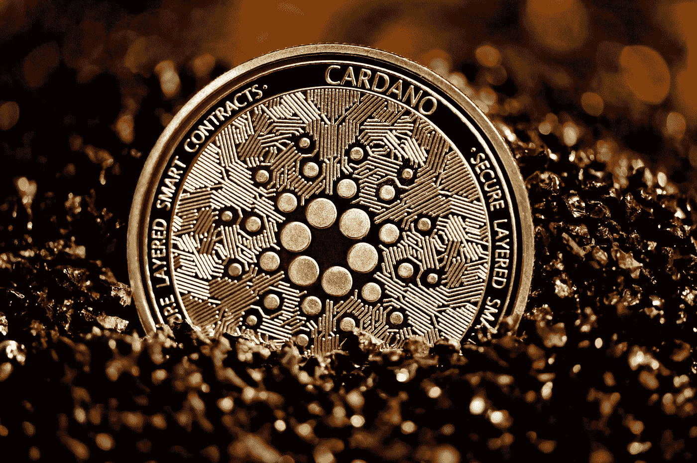
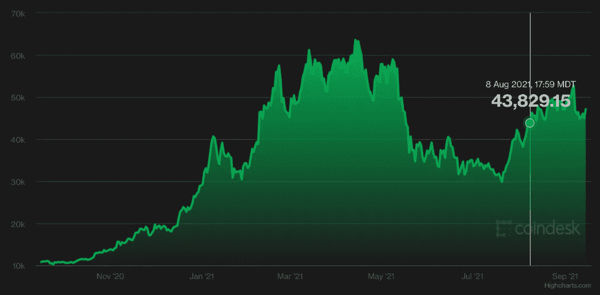

# 我过早地卖掉了我的密码——从我的错误中吸取教训

> 原文：<https://levelup.gitconnected.com/i-sold-my-crypto-too-soon-learn-from-my-mistakes-cad1ba6f5b5c>

## 这个领域仍然有无限的机会

从 [Unsplash](https://images.unsplash.com/photo-1622538425721-3996753e747d?ixid=MnwxMjA3fDB8MHxwaG90by1wYWdlfHx8fGVufDB8fHx8&ixlib=rb-1.2.1&auto=format&fit=crop&w=1652&q=80)

啊，加密空间，我从哪里开始？我第一次购买 crypto 是在 2020 年 11 月。多年来我一直听说加密浪潮，但我刚刚开始我的第一份全职工作，终于在我的银行账户上有了一点钱。在 YouTube 上我最喜欢的一位软件工程师偏离了为什么在 2021 年之前不投资加密会被认为是**不负责任的话题后，我也决定开始买进。我很少关注任何加密 YouTubers，因为我发现它们大多是用一堆多余的交易指标对一个以破坏交易指标而闻名的空间进行炒作，但这个视频为我打开了局面。**

> *时间快进到 2021 年 8 月 8 日，我把所有的密码都换成了 USDC 稳定币——**把 9k 变成了 15k** 。虽然在如此短的时间内这是一个令人难以置信的回报，但如果我只持有我最初购买的股票，我现在会坐在大约 30k 美元的位置上。作为一个 25 岁的大学毕业生，耐心可以在很多方面改变我的生活。*

*这篇文章旨在快速详述我进入加密领域的旅程，我是如何违背我的 HODL 计划的，以及我是如何在一个周日的早上卖掉所有东西的。最后，希望你能从我的错误中吸取教训。*

# *我如何开始投资加密*

*我第一次开始在比特币基地购买比特币和以太坊。在我意识到 4%的借记卡收费完全是一种欺骗之前，比特币基地至少让我购买 crypto 变得简单而容易。刚从大学毕业，我决定在投资上真正大胆一点(至少在我看来是这样)，把每份薪水的 10%投入到 crypto。*

*我最近一直在阅读投资建议，其中最值得一提的是丹尼尔·卡内曼的《快速思考，慢速思考》。这本书认为最活跃的交易者收益最差，而交易最少的投资者收益最高。经过几十年的研究和数以千计的美元平均成本战胜市场的例子，卡尼曼简单地说。*

> *“对于绝大多数个人投资者来说，洗个澡什么都不做，比实施他们想到的想法更好。”—丹尼尔·卡内曼*

*因此，我会购买我认为自己最相信的加密货币，除了在洗澡时梦想指数回报之外，什么也不做。当谈到选择投资加密货币时，我有三个简单的因素要考虑。*

1.  *我对加密货币的理解有多透彻？*
2.  *它的预计市值和社会影响是什么？*
3.  *加密货币的影响让我兴奋到什么程度？*

> *毕竟，随着加密空间的波动性和完全不可预测性，我没有理由去尝试和寻找替代硬币。我只是想在我的财务未来上领先一步，宁愿有几千美元的高概率回报，而不是 100 倍于我的钱的渺茫机会。也就是说，随着时间的推移，我对加密货币的了解和兴趣不断增加，这反映在我的投资组合中。*

# *我如何建立一个简单而有效的投资组合*

*我最近拿到的另一本好书是斯科特·e·佩奇的《模型思考者》。它涵盖了数学模型，从线性模型到功率分布，系统动力学等等。虽然这本书的范围是面包，但关键的一点是**简单的模型通常可以击败复杂的分析**。*

*特别是在过去的一年里，这是我在自己的学习中经常看到的一个主题。说到投资，少即是多。因此，当谈到向我的投资组合中添加新的加密货币时，我更喜欢将列表保持在我能从脑海中回忆起每种加密货币的数量的位置。*

## *我的 5 种加密货币投资组合*

*当然，**比特币**之所以在我的列表中名列前茅，主要是因为它在加密市场上已经建立并不断发展。它的协议绝不是微不足道的，但学习采矿如何奖励计算机、工作证明和比特币的通缩性质得到了高度记录，并为加密货币技术提供了一个很好的介绍。*

*紧随比特币之后的是**以太坊**。“智能合约”的概念是理解加密基础的另一个仪式。对我来说，以太坊有如此大的潜力来创造“可编程货币”。这里有一个简单的例子给那些需要的人。飓风过后，人们不必等待保险索赔来发放资金，而基于以太坊区块链的智能合同可以让救援物资立即发放给天气灾难的受害者。以太坊的应用几乎是无止境的，但这也是为什么这个系统如此臃肿，像 NFTs 和高昂的汽油费。*

*接下来我们有**卡尔达诺**。简而言之，我相信卡尔达诺将会改变世界。它的研究驱动的设计以及它的创始人查尔斯·霍金森是真正鼓舞人心的。Cardano 的目标是为那些被排除在现代金融生态系统之外的国家建立以区块链为基础的快速金融系统。就在 2021 年 4 月，Cardano [与埃塞俄比亚政府](https://www.coindesk.com/markets/2021/04/30/cardano-in-africa-inside-iohks-ethiopia-blockchain-deal/)达成了一份合同，为其国家学校系统利用其区块链。*

*名单上第四个是**链节**。这是一个创建节点的协议，这些节点充当提供高度一致的数据点的“先知”。它建立在以太坊的基础上，用于智能合约。*

*最后，还有**波尔卡多**。这种加密的独特之处在于它的目标是建立一个互联的区块链互联网。它也是利益的证明，并且随着它致力于发布一个功能性的和活跃的网络(它目前仍处于开发阶段)，它一直在不断地交付成果。*

## *从 2020 年 11 月到 2021 年 9 月返回*

*密码市场的回报简直疯狂。更好的是，不像房地产或其他高收入的金融机会，你可以用几块钱开始投资加密。*

1.  *比特币——1.4 万至 4.5 万美元| +220%*
2.  *以太坊——400 美元到 3，200 美元| +700%*
3.  *卡尔达诺——0.1 美元至 2.4 美元| +2，300%*
4.  *链环—11 美元至 25 美元| +130%*
5.  *波尔卡多特——4 美元到 35 美元| +775%*

# *为什么我过早卖掉了我的密码*

*那么，到底哪里出了问题？首先，在使用 Crypto.com 交易所时，我参加了他们的赌注奖励计划。基本上，你可以留出一定数量的密码，在三个月内你不能碰它——但在此期间你将获得高额利息回报。*

*Crypto.com 有一个模型，你持有的本国加密货币 CRO 越多，你在其他所有股份上获得的利息就越高。押注比特币可以让你获得高达 8.5%的利息，押注 USDC 等稳定的比特币可以让你获得高达 14%的利息。如果你愿意承担你的密码不受联邦存款保险公司保护的财务风险，那你可能会获得一些严重的被动收入。*

*我要带着这个去哪里？嗯，当我第一次开始投资时，我读到的很多分析都认为,**比特币减半**将导致整个市场在 2021 年冬天的某个时候达到顶峰。所以我告诉自己，在我开始寻找机会套现之前，我会把我的密码至少押到 11 月份。*

> *嗯，在五月下旬的“崩盘”之后，我吓坏了。我的投资组合中仍有很多被押了进去，谢天谢地，我不能碰它们，但我现在想要一个窗口，这样我至少可以保证回报。这是一个错误。*

*因此，一旦我的最后一笔股份在 8 月 8 日的一个周日上午到期，我就决定卖掉我的比特币和以太坊。但是在计算了我的利润和纯粹的感情后，我把我所有的秘密都变成了稳定的资本。把 9k 变成 15k 很棒，但是如果我坚持我的计划，继续保持耐心，我就能获得两倍或三倍的回报。*

**

## *我的五大投资经验*

*自从第一次投资 crypto 以来，我学到了很多东西。这一领域的技术和协议不仅真正具有创新性，而且有潜力让世界变得更好。只要我们能在去中心化和不可避免的监管压力之间找到平衡，我对加密技术就只有很高的期望。话虽如此，以下是我在这个领域投资的经验教训。*

1.  *除非你喜欢赌博，否则不要投资任何你无法向朋友解释清楚的事情。*
2.  *投资时，**少即是多**。持有几只指数基金通常能胜过专家建立的共同基金。这同样适用于加密，保持你的投资组合的主要驱动力市场。*
3.  ***制定计划**，除非有紧急情况或灵光一现，否则不要偏离计划。你的头脑在投资开始时是平稳的，在所有的起伏之前，这是你最聪明的时候。*
4.  *你投资的第一大工具是耐心。在过去几十年的几乎所有投资研究中，市场中的时间总是胜过市场时机。*
5.  ***将您的加密投资锁定在高利息赌注上。你不仅会在加密回报的基础上获得被动收入，锁定股权机制还会迫使你度过波动期。如果我没有赌上我的密码，我可能几乎赚不到钱。***

*我的名单到此结束。我仍然是加密空间的忠实拥护者，并继续将我的一部分薪水(尽管更少)投资于我喜欢的货币。一旦市场再次下跌，我将把我的大部分赌注转移到其他加密货币上。*

*如果你想亲自参与加密货币的赌注，你可以使用我的推荐代码 **w6jyux2vcq** 获得**25 美元的 crypto.com 代币 CRO。**该平台拥有一款屡获殊荣的移动应用程序和一些任何平台都不具备的高安全性评级。此外，他们有一个坚实的金属借记卡，在 CRO 为您提供现金返还奖励。它们至少值得一试。*

* [## Crypto.com-立即购买比特币 Google Play 上的应用

### 下载 Crypto.com 应用程序并在几分钟内注册一个帐户。开始赚取高达 6.5%的年利率。成长…

play.google.com](https://play.google.com/store/apps/details?id=co.mona.android)* 

**以上内容仅代表一种观点，仅供参考。它无意成为投资建议。找一个有正式执照的专业人士寻求投资建议。**