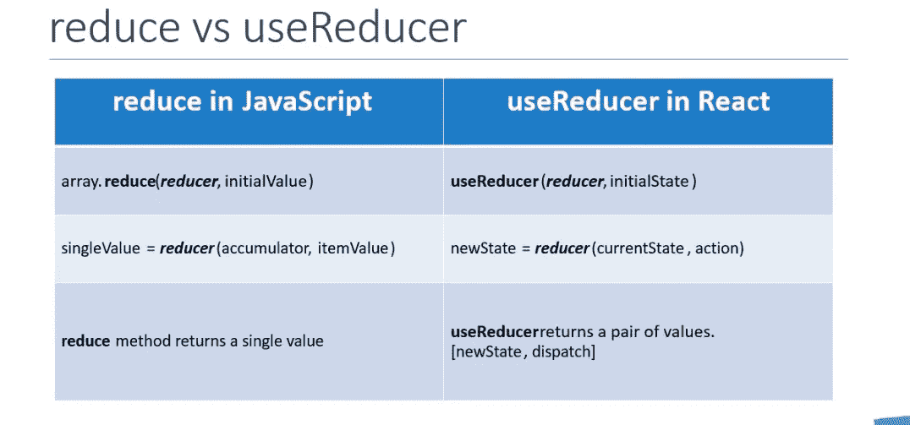

# 我开始学习 useReducer 钩子

> 原文：<https://levelup.gitconnected.com/i-started-learning-the-usereducer-hook-4b0b86be5b49>

## 以下是我所学到的和我的代码操场-第 1 部分


useReducer 是我最喜欢的钩子之一，今天我将分享我是如何一步步学会它的。在本文中，我将介绍理解 useReducer 钩子的基础。

本教程将介绍`useReducer`钩子的基础知识。

useReducer 用于管理应用程序中的状态，它是`useState`钩子的替代物。我们使用 useReducer 进行高级状态操作。

如果我们经过其他州，它影响的区域可以如下列出。

[](https://javascript.plainenglish.io/react-useeffect-hook-tutorial-for-beginners-30626402b739) [## React useEffect Hook 初学者教程

### React useEffect 初学者教程，提供真实示例和日常使用模式。

javascript.plainenglish.io](https://javascript.plainenglish.io/react-useeffect-hook-tutorial-for-beginners-30626402b739) [](/learn-react-usestate-hook-a09ccf955537) [## 学习反应使用状态挂钩

### 有例子和练习

levelup.gitconnected.com](/learn-react-usestate-hook-a09ccf955537) 

> useState — state
> useEffect —副作用
> useContext —上下文 API
> useReducer — reducers

在进入`useReducer`钩子之前，让我们了解一下纯 Java 脚本中的缩减器

下面是 MDN 示例，我已经解释了下面的代码示例。

[](https://developer.mozilla.org/en-US/docs/Web/JavaScript/Reference/Global_Objects/Array/reduce) [## array . prototype . reduce()-JavaScript | MDN

### reduce()方法在数组的每个元素上执行用户提供的“reducer”回调函数，以便…

developer.mozilla.org](https://developer.mozilla.org/en-US/docs/Web/JavaScript/Reference/Global_Objects/Array/reduce) 

Reducers 获取一个函数作为参数，并在每个数组元素上执行该函数。它返回一个值作为结果。

如果我们仔细阅读上面的代码，我们可以看到 reduce 方法有两个参数，而第二个是可选参数。

作为第一个参数，它采用一个函数，在本例中是`func1`。第二个参数默认为 0。上面的 reduce 方法将数组中所有元素的总和作为单个值返回。

在第 9 行中，我们发送了一个初始值 5，它被添加到 array1[0]的初始值中。

## React 中的用户

```
const [state, dispatch] = useReducer(reducer, initialState);
```

另一方面，react useReducer 接受 2 个参数并返回 2 个参数。

useReducer 获取 Reducer 函数和一个初始值(初始状态)作为参数。

它返回最终状态和一个函数(通常称为 dispatch)作为输出。

下面是 react 中纯 Javascript reduce 与 useReducer 的区别概述。



reduce 和 useReducer 都有两个参数。Js reduce 函数获取 Reducer 函数和初始值作为参数，而 useReducer 也获取 reducer 函数和初始状态作为初始参数

Javascript reduce 只返回一个值，而`useReducer`返回一对值。

一对值是一个新的状态和一个作为 reducer 函数执行的函数。

## 创建第一个用户

这是代码沙箱

最终确定的 app.js 文件

第一次导入用户

```
import React, { useReducer } from "react";
```

在功能应用内使用`useReducer`功能

```
const [color, dispatch] = useReducer(reducer, initialColor);
```

我们已经将 reducer 和`initialColor`作为参数传递给了`useReducer`。让我们像下面这样定义 App 函数之外的`initialColor`和传球减速器函数

在上面的代码中，你可以看到我们是如何实现 reducer 函数的。它获取状态和动作作为输入。基于动作，我们运行开关，操作状态值并返回它。

返回的状态值映射为`color`

你可以看到我们已经从`useReducer` 返回了`color, dispatch`，现在我们将使用它们。

我们可以使用`color`变量获得最终状态值，并且可以使用`dispatch`函数传递动作值(红色或绿色或黄色)

每次点击按钮时，我们都使用了`dispatch`函数来传递相关的动作值。因此`useReducer`根据动作返回修改后的状态值。

你可能会看到上面的功能可以使用`useState`钩子来完成。这是真的，但上面的例子只是为了理解基础。在接下来的文章中，我们将看到使用`useReducer` hook 的其他高级方法。

## 将对象作为动作和初始状态传递

下面是我们如何将对象作为状态和动作来传递

下面是编码沙箱

在上面的代码中，您可以看到我在 dispatch 函数中传递了一个对象，并在 reducer 中处理了接收到的对象。

我也返回一个对象作为缩减器的输出。初始状态也是一个对象。

## 在多个用户中使用相同的 reducer 函数

我们还可以使用一个 reducer 函数来处理多个 useReducer 挂钩。

在上面的代码中，我在 2 个`useReducer`钩子中使用了相同的 reducer 函数。对于每个 useReducer 挂钩，考虑单独的返回值。

对于第二个 useReducer，我使用了`countTwo`和`dispatchTwo`变量。

下面是代码沙盒代码

> 我希望你喜欢读这篇文章。如果你愿意支持我作为一个作家和我花在分享知识上的时间，考虑注册[成为一个媒体成员](https://freelancingcult.medium.com/membership)。每月只需 5 美元，你就可以无限制地使用 Medium。