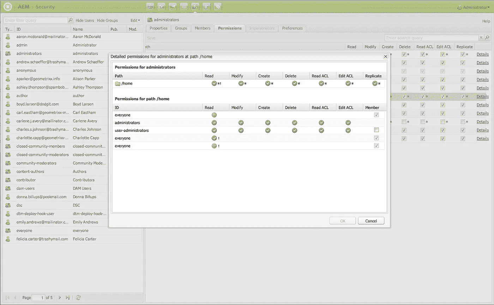
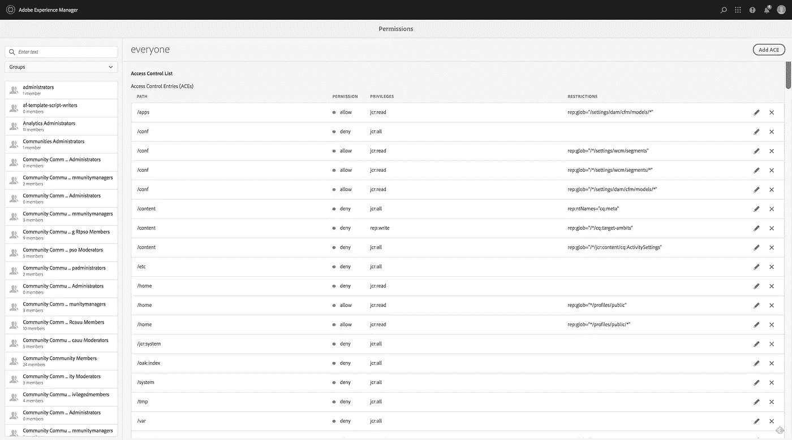
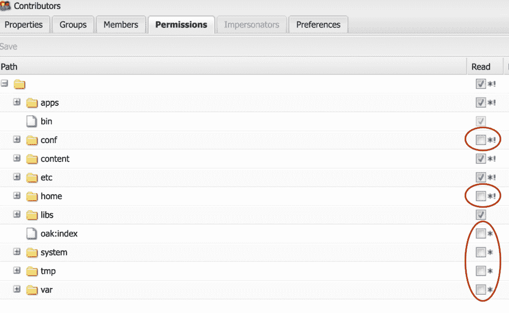
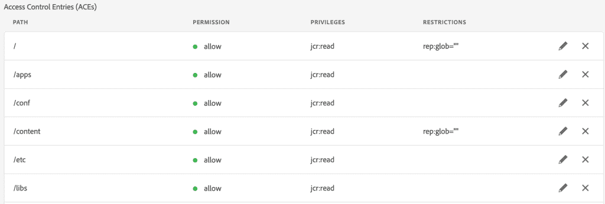
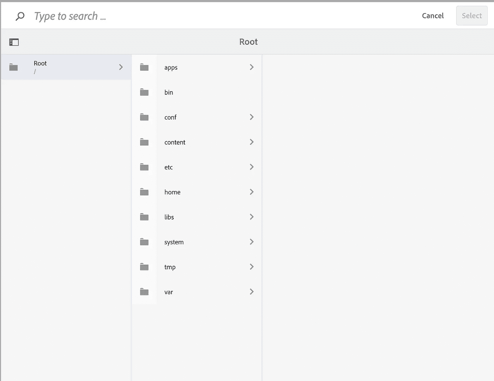
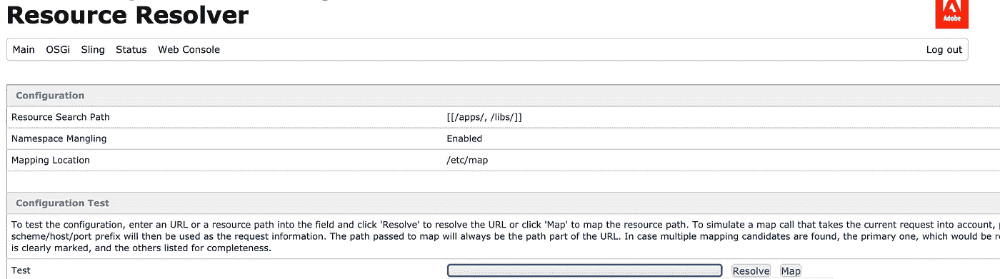

# 我努力配置 AEM 用户权限和访问

> 原文：<https://levelup.gitconnected.com/i-struggled-to-configure-aem-user-permissions-and-access-eb9ba2e2e5f9>

AEM 用户权限配置我犯了错误，所以你不必

图片由格伦·霍德森拍摄

我记得我必须完成的第一个用户权限故事——*设计并实现用户权限矩阵*。简单地说，我的任务是创建用户组、组织用户组、分配权限以及创建用户。这听起来直截了当，直到我开始工作，发现自己花的时间比我预期的要多得多。

# 配置用户权限的两种不同界面

有经典 UI 视图和触摸 UI 视图。后者是 2019 年末才推出的。

经典 UI 权限视图

触摸 UI 权限视图

我最初选择在经典 UI 上工作，因为我不必进入三个独立的页面，不像触摸 UI 视图:

对于经典 UI，你只需进入
*localhost:4502/user admin*

对于触摸用户界面，你必须进入
*localhost:4502/security/users . html
localhost:4502/security/groups . html
localhost:4502/security/permissions . html*

我成功创建了用户组和用户，万岁！然而，事实证明，许可是一团乱麻。原因是…

# 经典用户界面上看似无害的取消选中

授予经典用户界面权限

你可能会想，如果贡献者不需要访问路径 *conf/templates* 下的模板，你只需要取消选中那个框。实际上，这样做是为了创建一个明确的拒绝。

你可能会问，明确否认有什么错。

# 将用户分配给多个角色时，将会继承显式拒绝

如果该特定用户是拒绝了*配置/模板*的贡献者组的一部分，同时也是选中了*配置/模板*的模板编辑者组的一部分，则由于该明确拒绝，他/她将无法访问*配置/模板*。

那么，怎样做才是正确的呢？

# 使用触摸界面上的主体权限视图，记住这条违反直觉的规则

如果你不希望某个路径被允许，就不要显式地允许它——例如，如果我从来没有为贡献者显式地允许*/conf/templates*, AEM 会认为它不被允许，并在没有显式拒绝的情况下实现“拒绝”效果。

这样，如果该特定用户是拥有 *conf/templates* 隐式拒绝的贡献者组的一部分，并且也是拥有 *conf/templates* 允许的模板编辑者组的一部分，则该用户将能够在他/她被分配到的用户组中获得最高级别的权限，如预期的那样。

# 在某些情况下，您可能需要明确拒绝。不要忘记明确的允许

有些情况下，您可能需要对某些超级组*(等等)应用一些限制。披萨公司非管理员超级用户组)*其中有很多用户组。你需要确保替代用户群*(等等。披萨公司 Admin 超级用户组)*有明确的允许覆盖目的。

此后，如果用户既是非管理子组的一部分，又是管理子组的一部分，则该用户将不会受到显式拒绝的影响，因为显式允许，并且能够在他/她被分配到的用户组中获得最高级别的权限，如预期的那样。

# 您还需要绝对路径(或绝对路径的子字符串)来允许/阻止该路径，但仍有无法找到的 URL

ACL 及其路径定义的详细示例

配置用户权限时的文件导航器

有一些页面类似于*localhost:4502/communities/sites*，但是你会从文件导航器中意识到路径并不存在。这意味着它是一个虚构的 URL，而不是一个实际的路径。

要找到它的实际路径，请转到*localhost:4502/system/console/JCR resolver*，然后复制并粘贴虚路径——您将能够找到实际路径。对于社区来说，它们位于路径*localhost:4502/libs/social/XXX 下。*

JCR 解析器视图

如您所见，您从 JCR 解析器获得的这个新路径确实存在于文件导航器中。然后我们可以继续我们的允许/拒绝。

# 每次我处理用户权限时，我简直就像做了一场噩梦

随时对配置进行编码。至少我不用去*“为什么要这么设计”。*

关于 AEM 用户权限和访问的对话很少，这也是我决定写这篇文章的最重要的原因之一。

> 对于正在阅读这篇文章的你，我希望有了这篇分享，你不必再为 AEM 用户权限和访问而苦苦挣扎或做任何噩梦。安静点。✌🏼