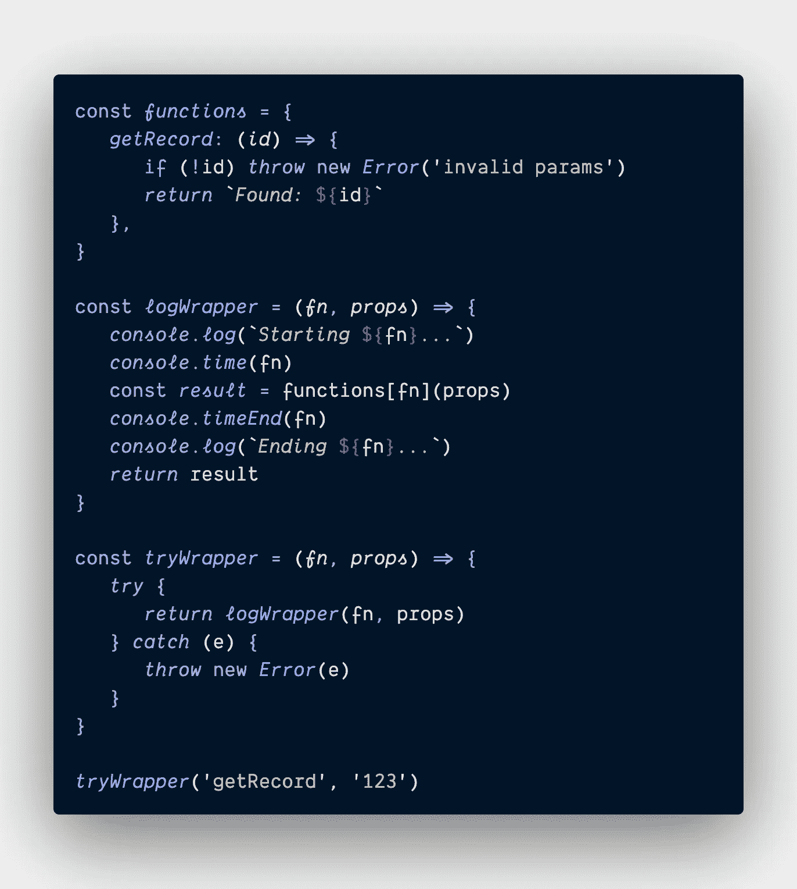

# 通过使用包装器停止跨函数重复代码。

> 原文：<https://levelup.gitconnected.com/i-taught-myself-how-to-implement-dry-in-a-dream-1f70507102e2>

卡罗琳·克里斯汀在 [Unsplash](https://unsplash.com?utm_source=medium&utm_medium=referral) 上拍摄的照片

对我来说，梦见编码并不罕见。我经常醒来，对前一天还在纠结的事情有了新的想法。今天早上我从一个类似的梦里醒来；然而，它所引发的顿悟比平常要大得多。

# 在顿悟之前

随着时间的推移，我已经开始用自己的标准方式编写函数。典型的函数如下所示:

这个例子只是给你一个结构的概念。现在，当我创建额外的函数如`getRecords`、`addRecord`、`updateRecord`、`deleteRecord`等时，我清洗并重复这个过程。

仅仅使用我的基本例子，**我最终在这些函数中重复了超过 90%的代码**。每个函数都有一个`try/catch`块。每个函数都有多个`console`调用。我知道这并不理想。就是不知道怎么改进。

更糟糕的是，我倾向于改变我的标准。这可能像把`catch (error)`改成`catch (e)`一样愚蠢。然后我的强迫症发作了，接下来的事情你知道，**我花了一个小时到处检查并做这个改变。**

# 顿悟之后

我总是在学习新的概念，最近开始投入大量精力去理解最佳实践，比如一般的坚实原则和设计模式。我认为通过这些概念的例子是点燃我顿悟的火花。

让我们开始吧…

首先，我想到了这样一个事实，你可以将一个函数作为另一个函数的参数来传递。所以我想看看能不能标准化我的`try/catch`块方法。

现在，任何时候我想在我的标准`try/catch`块中“包装”一个函数，我只需将该函数传递给我的`tryWrapper`函数。这种方法的主要优点是:

*   我的**不再在每个功能中重复** `**try/catch**` **代码**
*   我可以在任何时候改变`tryWrapper`并且**这种改变会在任何使用**的地方反映出来

接下来，我需要添加记录消息的标准。这里唯一棘手的是，我希望在日志消息中显示主函数的名称。为此，我创建了一个包含我所有“主要功能”的对象。然后，我以类似于我的`tryWrapper`的方式创建了一个`logWrapper`。

# 结论

哇！这给这句话带来了一个全新的含义，“我在睡觉的时候也能做到！”

这正是我所梦想的！这种方法有很多好处:

*   减少代码量
*   减少开发时间
*   简化故障排除
*   提供一个可扩展的框架(例如，我可以添加一个`tryAsyncWrapper()`)
*   实现几个坚实的原则

感谢您的宝贵时间！我总是感谢任何反馈！

# 分级编码

感谢您成为我们社区的一员！在你离开之前:

*   👏为故事鼓掌，跟着作者走👉
*   📰查看[升级编码](https://levelup.gitconnected.com/)中的更多内容
*   🔔关注我们: [Twitter](https://twitter.com/gitconnected) | [LinkedIn](https://www.linkedin.com/company/gitconnected)
*   🚀👉 [**软件工程师的顶级工作**](https://jobs.levelup.dev/)