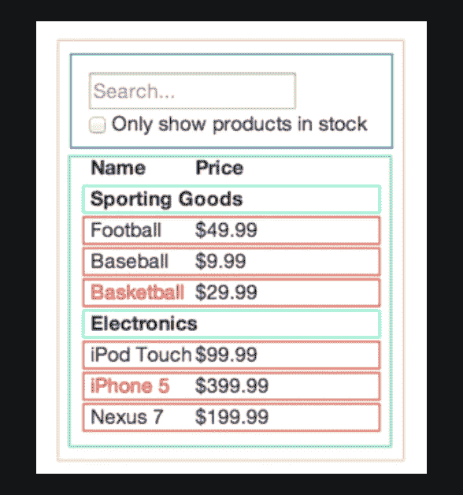

# 我在 2021 年试过 React。以下是我的想法

> 原文：<https://levelup.gitconnected.com/i-tried-react-in-2021-here-are-my-thoughts-51256e6f595d>

以下是我从 React 中学到的 5 个要点。

*此处文章:*[*https://flattered with flutter . com/I-tryed-react-in-2021-here-are-my-thoughts/*](https://flatteredwithflutter.com/i-tried-react-in-2021-here-are-my-thoughts/)

*YouTube 频道:*[*https://youtube.com/aseemwangoo*](https://youtube.com/aseemwangoo)


尝试在 2021 年做出反应

**免责声明**:

1.  这篇文章基于我对 React 的体验，我无意伤害任何人的意图。
2.  我试着反应了两天，因此我不是专家，不想误导读者。

> 放松并享受…:)

**这里有 5 件值得分享的事。**

## 什么是反应？

React 是一个声明式的、高效的、灵活的 JavaScript 库，用于构建用户界面。它允许你用称为“组件”的小而孤立的代码片段组成复杂的 ui。


反应外卖

## 1.小学习曲线

我真的很惊讶 React 的入门如此简单。

```
npx create-react-app my-app
cd my-app
npm start
```

*   在执行了上述命令之后，我能够看到一个示例 React 应用程序正在运行。
*   我担心在幕后会有 n 个文件，协调在一起并包含不同的包，**但是**
*   我错了。当我开始探索这些文件夹和它们各自的文件时，这对我来说很有意义。

React 从最少/最基本的配置开始，可以随着功能的发展而改变。

## 2.瞬间热重装

这确实符合标准。我启动了本地服务器，并开始对现有的代码库做一些小的改动(比如更改标题等)

*   以前我一存东西，几乎瞬间就反映出来了。
*   在控制台中，它会提示我为 React 安装[扩展](https://chrome.google.com/webstore/detail/react-developer-tools/fmkadmapgofadopljbjfkapdkoienihi?hl=en)。

> 另外，我发现在添加了一个新的包之后，我需要重启我的服务器。

## 3.基于组件的方法

就拿下面的 UI 来说吧。如果我开始编写这个程序，我会考虑把它分解成组件，是的， **React 鼓励这个**。

> 注意:我使用了功能组件。


基于组件的方法

这些组件可能看起来像这样



基于组件的方法

下一个问题是你如何知道什么应该是一个组件？答案在于[单一责任原则](https://en.wikipedia.org/wiki/Single_responsibility_principle)，即一个组件理想情况下应该只做一件事。

如果它开始增长，它应该被分解成更小的子组件。

> 一个组件看起来像什么

```
function Welcome(props) {
  return <h1>Hello, {props.name}</h1>;
}
```

一旦定义了一个组件，我们就可以在任何地方使用它，使它可以重用。

## 4.JS 和道具

React 类似于香草 JavaScript，这可能是它受欢迎的原因之一。

```
const element = <h1>Hello, world!</h1>;
```

*   好了，这不是 HTML，也不是 Javascript。其 **JSX (JavaScript XML)**
*   编译后，JSX 表达式成为常规的 JavaScript 函数调用，并计算为 JavaScript 对象。
*   React 在 HTML 属性名上使用 camelCase 属性命名约定。

例如，在 JSX，`class`变成了`[className](https://developer.mozilla.org/en-US/docs/Web/API/Element/className)`

## 小道具

*   现在，在我的组件内部，我开始考虑如何包含特定于组件的属性。

> 输入**道具**

*   Props 是 properties 的缩写，其工作方式类似于 HTML 属性。
*   将数据从一个组件传递到其他组件的方式，与在函数中传递参数的方式相同。

```
<Button onClick={btnOnClick} text="Fetch" />
```

这里，`onClick`和`text`是按钮组件的属性。

*   我还想对这些属性进行类型检查。

> 输入**属性类型**

React 有一些内置的类型检查功能。您可以将`propTypes`属性分配给特定于组件的属性

```
Button.propTypes = {
    text: PropTypes.string,
    onClick: PropTypes.func.isRequired,
}
```

> 注:这个 [**插件**](https://marketplace.visualstudio.com/items?itemName=dsznajder.es7-react-js-snippets) 帮了我大忙。

## 5.开发经验

这是决定继续愉快地或有力地使用一项技术的重要因素之一。

*   我喜欢 React 的体验。它很有趣，也很容易使用。

> 这也许是它成为当今流行框架的原因之一。

## *其他提及

**挂钩(使用状态)**

钩子是一个特殊的函数，可以让你“钩入”React 特性。

> `useState`是一个钩子，允许你给函数组件添加反应状态。

**什么时候用钩子？:**如果你写了一个函数组件，并且意识到你需要给它添加一些状态，你可以使用一个钩子

```
import React, { useState } from 'react';

function Example() {
  const [count, setCount] = useState(0);

  return (
    <div>
      <p>You clicked {count} times</p>
      <button onClick={() => setCount(count + 1)}>
        Click me
      </button>
    </div>
  );
}
```

# 最后的想法

我意识到每种技术都有一些共同点——比如循环、函数。它们的区别仅在于它们的语法和结构，以及技术允许你编写逻辑的方式。

其他文章:

[](/fade-in-out-text-in-react-fa8fc7a2a0b1) [## React 中的淡入淡出文本

### 如何在 react 中淡入淡出文本

levelup.gitconnected.com](/fade-in-out-text-in-react-fa8fc7a2a0b1) [](/show-push-notifications-in-react-449949e98e01) [## 在 React 中显示推送通知

### 在 React 中显示推送通知

在 Reactlevelup.gitconnected.com 显示推送通知](/show-push-notifications-in-react-449949e98e01) [](/deploy-react-and-aws-amplify-1db36c625d73) [## 部署 React 和 AWS Amplify

### 部署 React 和 AWS Amplify

部署 React 和 AWS Amplifylevelup.gitconnected.com](/deploy-react-and-aws-amplify-1db36c625d73) 