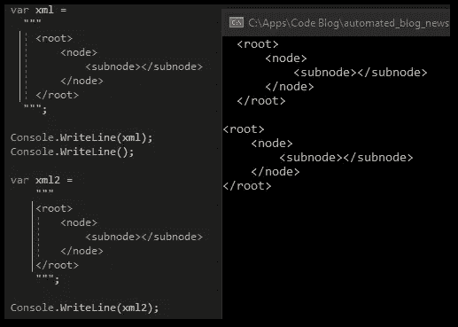
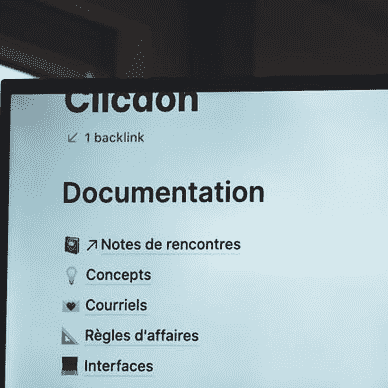
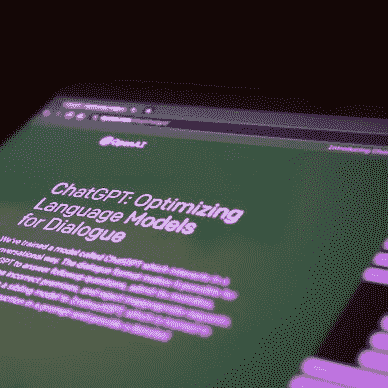
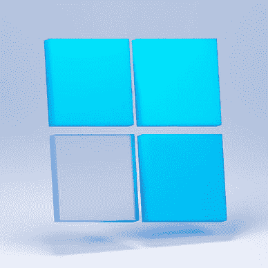

# 我尝试了新的 C# 11 特性——以下是我有用的心得

> 原文：<https://levelup.gitconnected.com/i-tried-the-new-c-11-features-here-are-my-useful-takeaways-78c19abeaf72>

## 。NET 7 | C# 11

## 。NET Conf 2022 结束，微软发布。NET 7 和 C# 11 一起使用。以下是新功能和我对它们的看法。


图片来自[像素](https://www.pexels.com/de-de/foto/hande-laptop-buro-tippen-7988086/)

C# 11 终于来了！

微软发布了一篇[的博客文章](https://devblogs.microsoft.com/dotnet/welcome-to-csharp-11/)以及一段[的视频](https://www.youtube.com/watch?v=H18CfoinPZg)。NET Conf 2022 关于发布。我会展示新的东西，并加入我的意见。

## UTF-8 字符串文字

默认情况下，C#字符串是 UTF-16。所以要得到一个 UTF 8 弦，前面的方法是

```
System.Text.Encoding.UTF8.GetBytes("I am a string!"); // returns byte[]
```

现在，您可以执行以下操作

```
"I am a string!"u8; // returns ReadOnlySpan<byte>
```

这对于一些开发人员来说可能会变得非常方便，因为编写起来更快更容易。我喜欢它，虽然我很少使用它。参见[文档](https://learn.microsoft.com/en-us/dotnet/csharp/language-reference/builtin-types/reference-types#utf-8-string-literals)了解所有细节。🙃

## 原始字符串文字

首先，我们有绳子。然后，我们得到了[字符串文字](https://learn.microsoft.com/en-us/dotnet/csharp/language-reference/builtin-types/reference-types#string-literals)。现在，我们有了[原始字符串文字](https://learn.microsoft.com/en-us/dotnet/csharp/language-reference/builtin-types/reference-types#string-literals)。最新添加的内容没有转义字符，所以所有内容都按原样打印。请参见下面的代码示例:

```
var @string = "I say \\\"Hello\\\" ";          // prints I say \"Hello\"
var stringLiteral = @"I say \""Hello\"" ";     // prints I say \"Hello\"
var rawStringLiteral = """I say \"Hello\" """; // prints I say \"Hello\"
```

原始字符串以 3 个双引号开始，以 3 个双引号结束。如果你想在字符串中使用 3 个双引号，只需使用 4 作为后缀和前缀(总是多一个💪).

您还可以将它用于多行字符串和缩进。请参见下面的示例:



C#11 中带缩进的多行原始字符串。

这个其实挺牛逼的！我总是在 JSON 文件字符串中挣扎着转义，但是现在没有了。😊

```
🔔 Get a short summary of my Medium content on the 1st of each month to your inbox. Save time and pick what you like to read! 

Click [HERE](http://medium-newsletter.quickcoder.org/) to subscribe for free!
```

## 抽象静态成员

接口可以有用关键字`abstract`表示的`static`成员([文档](https://learn.microsoft.com/en-us/dotnet/csharp/whats-new/tutorials/static-virtual-interface-members#static-abstract-interface-methods))。这迫使实现类提供具有匹配签名的静态方法。然而，您不能像非静态抽象接口方法那样定义方法体。

```
public interface IMyInterface
{
    public static abstract void ImplementMe();
}

public class MyClass : IMyInterface
{
    public static void ImplementMe()
    {
        return;
    }
}
```

这也很酷，我很乐意用它来强制类的静态构造函数来实例化新对象。🔥

## 列表模式

[列表模式](https://learn.microsoft.com/en-us/dotnet/csharp/language-reference/operators/patterns#list-patterns)是 C#中模式匹配家族的最新成员。结合切片模式`..`，你可以做一些疯狂的事情，如[文档](https://learn.microsoft.com/en-us/dotnet/csharp/language-reference/operators/patterns#list-patterns)中的例子所示:

```
Console.WriteLine(new[] { 1, 2, 3, 4, 5 } is [> 0, > 0, ..]);   // True
Console.WriteLine(new[] { 1, 1 } is [_, _, ..]);                // True
Console.WriteLine(new[] { 0, 1, 2, 3, 4 } is [> 0, > 0, ..]);   // False
Console.WriteLine(new[] { 1 } is [1, 2, ..]);                   // False
Console.WriteLine(new[] { 1, 2, 3, 4 } is [.., > 0, > 0]);      // True
Console.WriteLine(new[] { 2, 4 } is [.., > 0, 2, 4]);           // False
Console.WriteLine(new[] { 2, 4 } is [.., 2, 4]);                // True
Console.WriteLine(new[] { 1, 2, 3, 4 } is [>= 0, .., 2 or 4]);  // True
Console.WriteLine(new[] { 1, 0, 0, 1 } is [1, 0, .., 0, 1]);    // True
Console.WriteLine(new[] { 1, 0, 1 } is [1, 0, .., 0, 1]);       // False
```

我不太确定这将有什么用例。正如您所看到的，代码完全不可读，也不会通过代码审查。也许我只是还没有看到好处，但目前来说，我不打算使用这个功能。如果你知道一些用例，分享一下！🤔

## 必需的成员

作为一名 Flutter/Dart 开发人员，我已经熟悉了一个`required`关键字的概念。编译器可以通过构造函数或对象初始化器( [docs](https://learn.microsoft.com/en-us/dotnet/csharp/language-reference/keywords/required) )强制属性赋值。


在 C#11 中使用 required 关键字而没有正确初始化时出现编译器警告

在我看来非常有用。它确保重要的属性总是包含值。但这并不能保证物有所值，也有可能在每个属性上使用`required`,这将绕过该功能的要点。🤗

## 结论

这就是我对 C#11 简短而甜蜜的概述。你的外卖有哪些？

[***通过我的推荐链接加入成千上万的媒体会员，每月只需 5 美元就可以阅读你想阅读的文章！***](https://medium.com/@xeladu/membership)

[](https://medium.com/@xeladu/membership) [## 通过我的推荐链接加入 Medium-xela du

### 只需点击一下，就可以通过会员资格访问数千篇文章！您的会员资格只需 5 美元一张…

medium.com](https://medium.com/@xeladu/membership) 

点击 [**此处**](http://medium-newsletter.quickcoder.org/) 每月获取一次我的所有中型文章的摘要🔔浏览[我的 Gumroad 商店](https://xeladu.gumroad.com/)寻找有趣的编程素材🏬


xeladu

## 所有人的洞察力。NET 开发人员

[View list](https://xeladu.medium.com/list/insights-for-all-net-developers-8642045c4443?source=post_page-----78c19abeaf72--------------------------------)8 stories

xeladu

## 来自软件开发人员生活的感悟

[View list](https://xeladu.medium.com/list/insights-from-the-life-of-a-software-developer-e1959ecf59e6?source=post_page-----78c19abeaf72--------------------------------)8 stories

# 分级编码

感谢您成为我们社区的一员！在你离开之前:

*   👏为故事鼓掌，跟着作者走👉
*   📰更多内容请查看[升级编码刊物](https://levelup.gitconnected.com/?utm_source=pub&utm_medium=post)
*   🔔关注我们:[推特](https://twitter.com/gitconnected) | [LinkedIn](https://www.linkedin.com/company/gitconnected) | [时事通讯](https://newsletter.levelup.dev)

🚀👉 [**加入升级人才集体，找到一份神奇的工作**](https://jobs.levelup.dev/talent/welcome?referral=true)