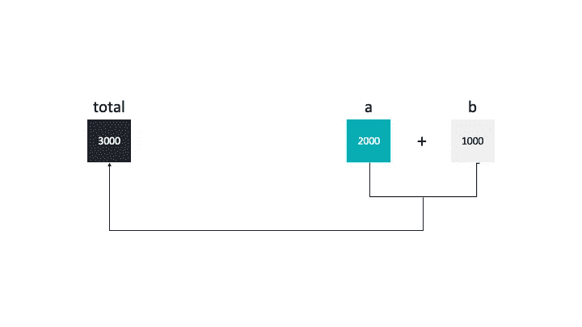

# 我试图用各种编程语言计算两位数的和

> 原文：<https://levelup.gitconnected.com/i-tried-to-calculate-the-sum-of-two-digits-using-various-programming-languages-520e1e889c66>

## 哪种编程语言总体上最快？



总计= a + b

今天，我要用不同的编程语言，用相同的算法来编写计算两位数之和的程序，这就是我要做的。

*   *如何设计一个算法来解决这个需求？*
*   *哪种编程语言最快？*

# 设计一个算法并实现它

要求:“*要求用户输入两位数，然后显示在屏幕上”。*

设计如何计算两位数的和非常简单。

```
BEGINNUMBER s1, s2, sumOUTPUT("Input number1:")INPUT s1OUTPUT("Input number2:")INPUT s2sum=s1+s2OUTPUT sumEND
```

## 计算机编程语言

```
from time import process_time

# the sum of digits
def sum_of_digits(first_digit, second_digit): 
    return first_digit + second_digit

if __name__ == '__main__':

    # get the inputs
    a, b = map(int, input().split()) 

    # get the start time
    start = process_time()

    # main program
    total = sum_of_digits(a, b)

    # get the execution time
    elapsed_time = process_time() - start

    # print the results
    print(total)
    print("Time measured: %.20f seconds." % (elapsed_time))
```

我们从命令行保存并执行`sum_of_digits.py`脚本，如下所示。

```
$python3 sum_of_digits.py 
1000 2000
3000
Time measured: **0.00000800000000000106** seconds.
```

用 Python 计算两位数之和用了**0.000000800000000106**秒。

## C++

```
#include <iostream>
#include <chrono>

using namespace std::chrono;

int sum_of_digits(int first, int second) { 
    return first + second;
}

int main() { 

    // get the inputs
    int a = 0; int b = 0;
    std::cin >> a;
    std::cin >> b;

    // get the start time
    auto start = high_resolution_clock::now();

    // main program 
    int total = sum_of_digits(a, b); 

    // get theexecutionn time
    auto elapsed = duration_cast<std::chrono::nanoseconds>(high_resolution_clock::now() - start);

    // # print the results
    printf("%.d", total);
    printf("\nTime measured: %.20f seconds.\n", elapsed.count() * 1e-9);

    return 0;
}
```

将它保存到`sum_of_digits.cpp`文件并编译它，运行生成的可执行文件并在同一行输入两个数字，如下所示。

```
$ ./sum_of_digits 
1000 2000
3000
Time measured: **0.00000014000000000000** seconds.
```

用 C++计算两位数之和用了**0.00000001400000000000**秒。

## Java 语言(一种计算机语言，尤用于创建网站)

```
import java.util.Scanner;

class SumOfDigits {
    static int sum_of_digits(int first_digit, int second_digit) {
        return first_digit + second_digit; 
    }

    public static void main(String[] args) { 
        // get the inputs
        Scanner s = new Scanner(System.in); 

        int a = s.nextInt();
        int b = s.nextInt();

        // get the start time
        long start = System.nanoTime();

        //  main program
        int total = sum_of_digits(a, b);

        // get the excution time
        long timeElapsed = System.nanoTime() - start; 

        // print the results
        System.out.println(total);
        System.out.format("Time measured: %.20f seconds.\n",(timeElapsed * 1e-9));

    } 
}
```

将这个文件保存到`SumOfDigits.java`文件并编译它，运行产生的可执行文件并在同一行输入两个数字，如下所示。

```
1000 2000
3000
Time measured: **0.00000578500000000000** seconds.
```

用 Java 计算两位数之和花了**0.00000057850000000000**秒。

# 哪种编程语言最快？

我们对结果做了如下比较。

*   c++:**0.000000140000000000❤️**
*   python:**0.0000080000000000106😍**
*   Java: **0.0000057850 亿😘**

👉C 编程语言是最快的。比 5.7 倍 Python 和 4 倍 Java 都快。

对不对？请留下您的评论，以便进一步讨论。

# 分级编码

感谢您成为我们社区的一员！在你离开之前:

*   👏为故事鼓掌，跟着作者走👉
*   📰查看更多内容请参见[升级编码刊物](https://levelup.gitconnected.com/?utm_source=pub&utm_medium=post)
*   🔔关注我们:[Twitter](https://twitter.com/gitconnected)|[LinkedIn](https://www.linkedin.com/company/gitconnected)|[时事通讯](https://newsletter.levelup.dev)

🚀👉 [**加入升级人才集体，找到一份惊艳的工作**](https://jobs.levelup.dev/talent/welcome?referral=true)