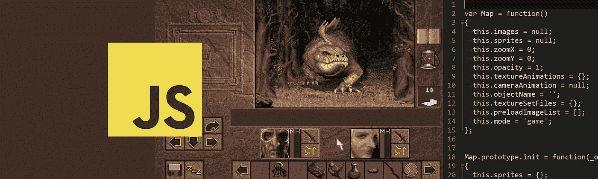
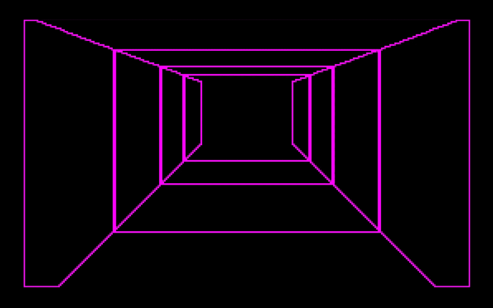
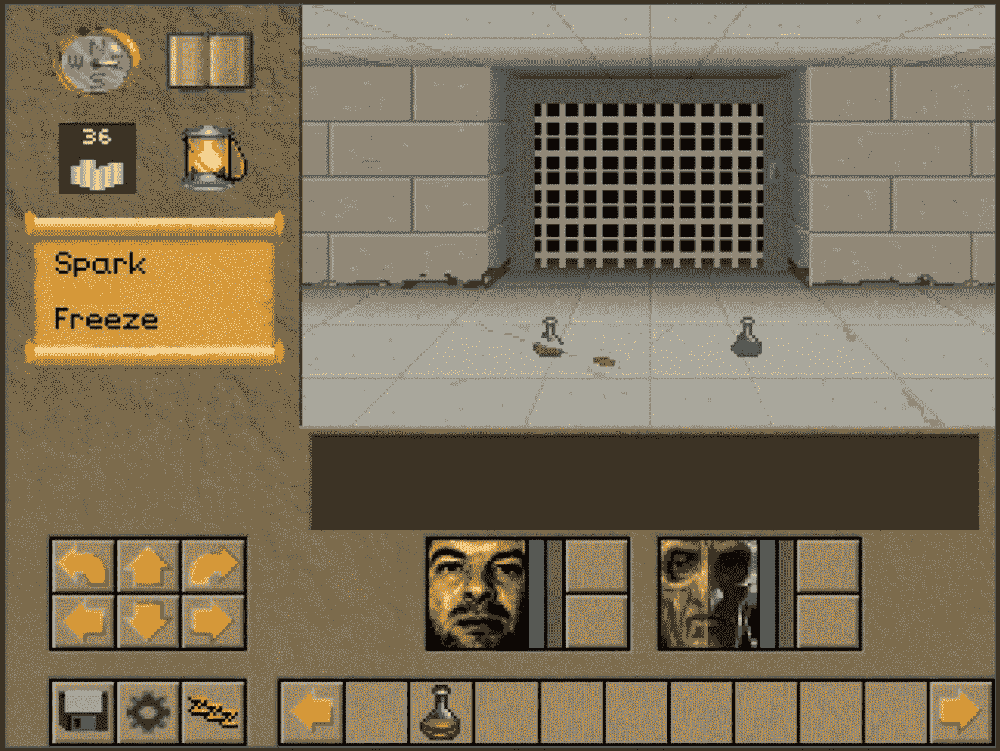
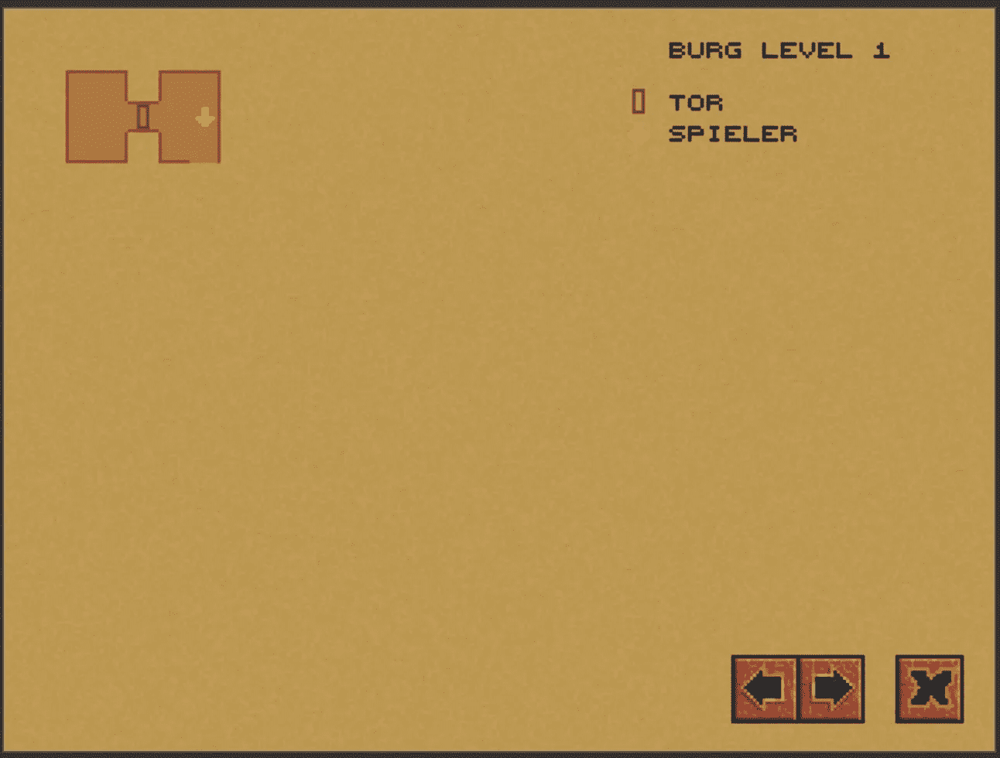
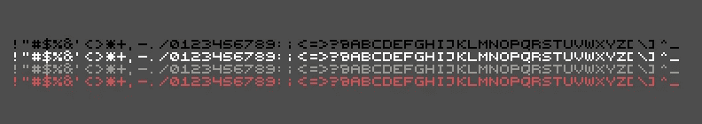
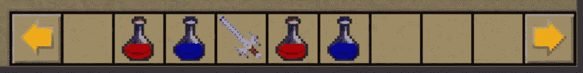
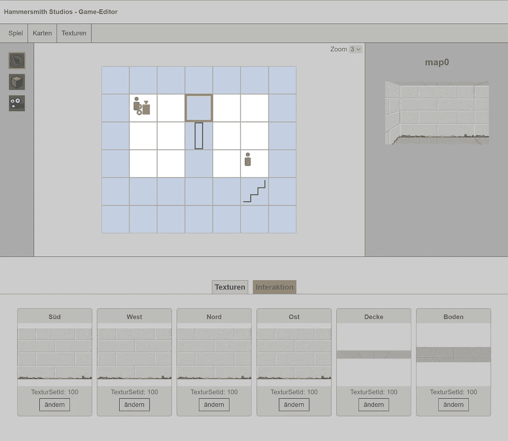
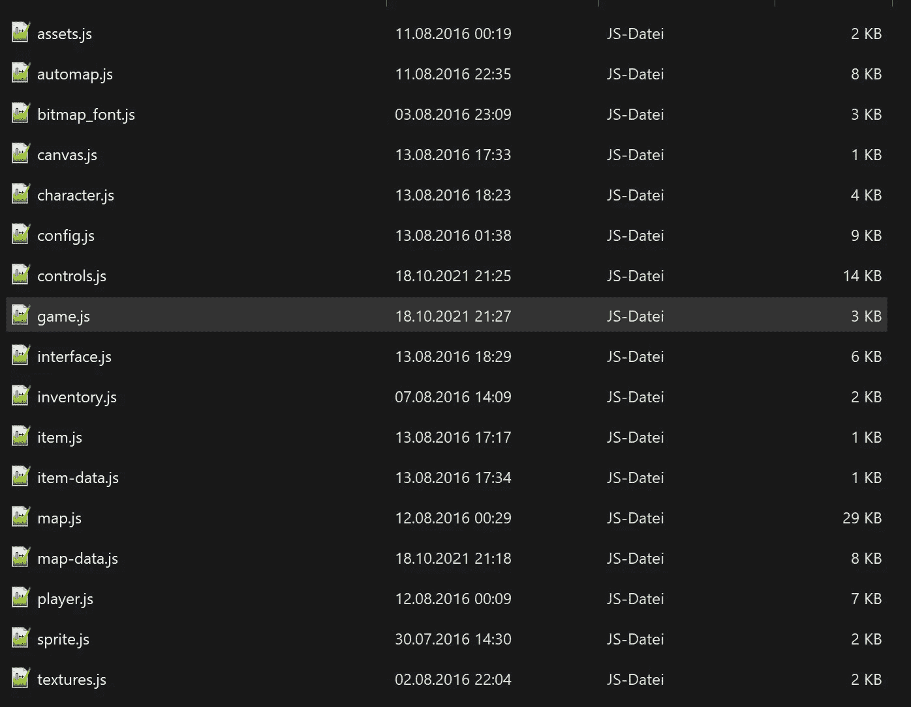
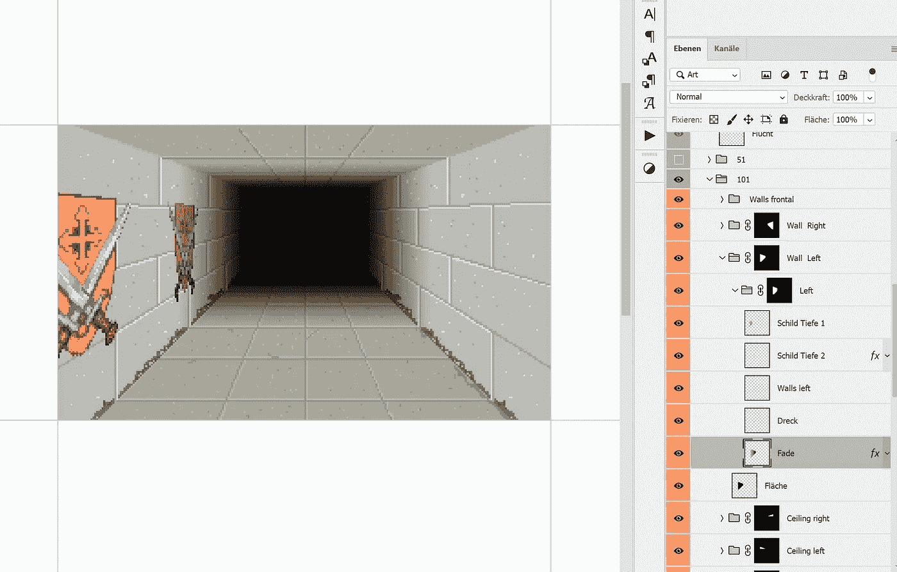

# 我试图用 JavaScript 编写 1993 年 RPG 游戏《知识之地》的引擎

> 原文：<https://levelup.gitconnected.com/i-tried-to-code-the-engine-of-1993-rpg-game-lands-of-lore-in-javascript-c78368d1e2f0>

## 这篇文章展示了我用 Vanilla JS 编写 Lore 引擎的方法和想法。

[韦斯特伍德工作室](https://en.wikipedia.org/wiki/Westwood_Studios)制作的《知识之地:混乱王座是我最喜欢的游戏之一([这里是我最喜欢的 10 款游戏](https://medium.com/@stephan.romhart/my-top-10-pc-games-f9075cfc6c30))。我已经玩过无数次了。

2016 年，我已经决定，以我当时的编程技能，我会尝试用 Javascript 为游戏重新编程引擎。

> 在本文的结尾，您会找到一个到 Github 的链接，在那里可以下载所有的项目文件。

## 这是一个展示引擎运行的短片

# 技术演示

在下面的链接中，你可以自己测试我的游戏引擎的技术演示。注意:该引擎目前只能在桌面上用鼠标和键盘进行正确控制。

[👉Javascript 中的绝杀游戏引擎(stephan-romhart.de)](https://www.stephan-romhart.de/medium.com/land-of-lore-javascript-engine)

请随意阅读我的代码。😀

# 技术背景

该引擎在 HTML canvas 元素中运行，并且是基于图块的。每个图块都有如下属性

*   实心:0 / 1
*   已探索:0 / 1
*   项目:[[]，[]，[]]
*   纹理[100，100，100，100，100，100]

固体定义了一个瓷砖是否可行走，探索了瓷砖是否已经显示在自动地图上。理论上，每个方块可以有四个无限堆叠物品的位置。我在纹理中定义了天花板、地板和墙壁部分。

要渲染视图，您需要一个查看方向。然后，循环遍历您面前深度为 4 的所有图块，并将纹理图形写入画布缓存，以输出组合的图像。

呈现视图的图形元素。

# 跑步动画及其他

为了弄清楚韦斯特伍德在 1993 年是如何在瓷砖格子中奔跑的，我一帧一帧地观看了《让我们来玩知识之地》的镜头。

结果是，当玩家在两个瓷砖之间移动时，视图从中心开始缩放，直到缩放比例与下一个瓷砖的同一视线中的视图相对应。然后玩家位置被放置在新的牌上。

当向左转或向右转时，视图被拉长，模拟一种运动模糊。

我在动作动画上坐了整整一周，直到它们变圆。*我知道，对于世界上所有的年轻玩家来说，这些动画都是生涩的。*😂

运行引擎截图。

此外，我设计了一个撞击动画，当你撞到墙上或者关上的门时。当你撞到什么东西时，你失去了一点生命。

# 自动地图

在《知识之地》中，有一张自动地图，显示了到目前为止已经探索过的地方以及你仍然可以去的地方，可以通过非棕色的外墙辨认出来。我用了大约一天的时间编写了地图渲染器。

编码自动地图的屏幕截图。

对于地图，我仍然需要一个位图字体渲染器类，它可以自动将地图名称和地图的重要元素(玩家位置、门、宝箱等)写入图例。

位图字体文件

# 库存和项目

清单是一个无限滚动的功能区，您可以用鼠标填充它。可以将项目拖放到清单中，或者从清单中删除。

我没有成功地整合治疗药剂和角色之间的互动。

库存截图。

# 互动

除了项目之外，引擎中还集成了另外两个交互:

*   开门和关门。
*   通过楼梯传送到其他地图

这两个都是引擎的重要元素，我花了几周时间研究这两个特性，直到它们工作得相当好。

例如，当通过楼梯切换地图时，我在视口中编写了淡出和淡入动画，以使连接感觉不那么刺耳。

# 游戏编辑器

在 jQuery 的帮助下(是的，这在 2016 年完全没问题)，我随后为自己构建了一个可以改变地图、纹理、交互和相机位置的关卡编辑器。

对于一次扑救，我的精神耐力已经不够了。😅

创建地图数据的游戏编辑器截图。

# 文件

总的来说，没有纹理，声音和级别数据的引擎没有达到 100kb 的项目大小。封装在单个文件中，最终有 17 个 javascript 文件。

所有使用的 javascript 文件

# Photoshop 中的纹理创建

我在 Photoshop 中创建了所有的纹理。为半真半假的环境画几幅艺术品需要相当大的努力。为了更快地获得成功，我只是直接从传说之地中获取了一些视觉元素。
我用 Photoshop 做了所有的图形。

# 为什么我停止了在引擎上的开发？

在发动机上工作了大约五个月之后，我简直精疲力竭了。我已经开始将 NPC 和敌人集成到引擎中，但我不想在碰撞检测、初级人工智能或战斗系统方面取得成功，所以我停止了这个项目的开发。

总之，这个项目对我来说很有教育意义，也很有趣。也许我会重新振作起来，继续制造引擎。

如果你觉得这样的文章有趣，请告诉我。我很想听听你对我如何建造知识引擎的想法。😊

# Github 链接

[Stephan-rom hart/Lands-of-Lore-Engine-in-Javascript:我试图用普通的 Javascript 编写 1993 年的 Westwood Studios 游戏《知识之地:混乱王座》的引擎。](https://github.com/stephan-romhart/Lands-of-Lore-Engine-in-Javascript)(github.com)

**感谢阅读。** 期待您的反馈。😍

请评论、书签或关注我，支持我的频道。

如果你心中有一个特定的主题，你会希望我写下来，让我在推特上知道:[https://www.twitter.com/@stephan_romhart](https://www.twitter.com/@stephan_romhart)