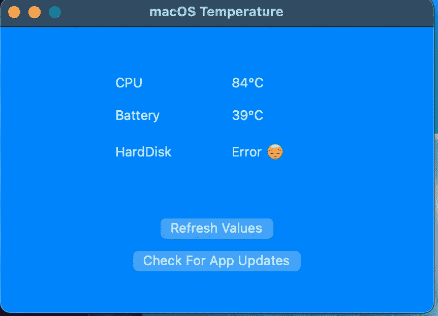

# 在现有 macOS 应用程序上编译通用二进制文件

> 原文：<https://levelup.gitconnected.com/i-upgraded-my-app-to-universal-binary-cd969719c33e>

照片由[达珊·帕特尔](https://unsplash.com/@darshanp9?utm_source=medium&utm_medium=referral)在 [Unsplash](https://unsplash.com?utm_source=medium&utm_medium=referral) 上拍摄

我的一个兼职项目涉及一个显示 MacBook 上 CPU 温度的应用程序。在我制作它的时候，还没有一个应用程序或功能可以在 Mac 的菜单栏上显示 CPU 的温度。这是关于处理器压力的非常有用的信息。所以，我决定自己开发。因此，我开始用 swift 语言工作，学到了许多有趣的东西。

菜单栏中显示的 CPU 温度。

这是对此的简单看法。它显示 CPU，电池和硬盘(如果有的话)的温度。不多不少，我知道这很重要。但是它解决了我的问题(需求)。

自从 [2007](https://github.com/fvalle1/macOS-temperature/releases/tag/v1.0.2) 以来，我几乎忘记了这个项目。我想要一个应用程序显示一个数字，仅此而已，它的工作，这对我来说是确定的。反正我一直在我的 MacBook 上连续使用。我认为，这种工具应该就是这样工作的，它们只需要**工作。**

# 通用应用程序

随着最近发布的[Apple Silicon](https://www.apple.com/mac/m1/)MAC 和 macOS [Big Sur](https://www.apple.com/macos/big-sur/) 11.0，我对这项新技术感到兴奋，我想对它们进行更多的研究。于是决定做一个 [**通用 app**](https://developer.apple.com/documentation/xcode/building_a_universal_macos_binary) **。通过这种方式，这个小工具可以在 Intel 和 AppleSilicon Macs 上运行，无需仿真。换句话说，它不需要 [Rosetta2](https://support.apple.com/en-us/HT211861) 翻译，这应该非常快，但这不是运行应用程序的本地方式。**

我的应用程序现在是通用的，如系统监视器所示。

## 新图标

我还更新了图标，使其更像 Bigsur。我喜欢大苏尔的新设计，我的图标需要刷新

在[https://openclipart.org/detail/85069/pixzain-thermometer](https://openclipart.org/detail/85069/pixzain-thermometer)由公共领域图像制作的图标

# 下载应用程序

你好奇吗？你需要监控你新买的 Mac 电脑的温度吗？

前往[https://github.com/fvalle1/macOS-temperature/](https://github.com/fvalle1/macOS-temperature/)和[下载 app](https://sourceforge.net/projects/macos-temperature/files/latest/download)