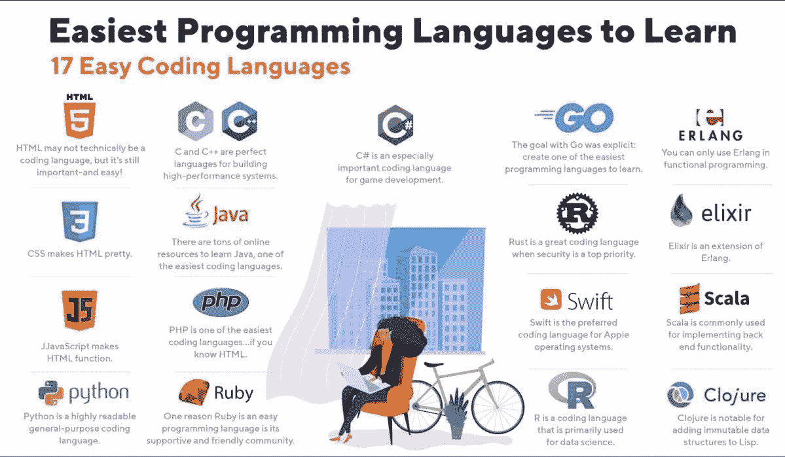
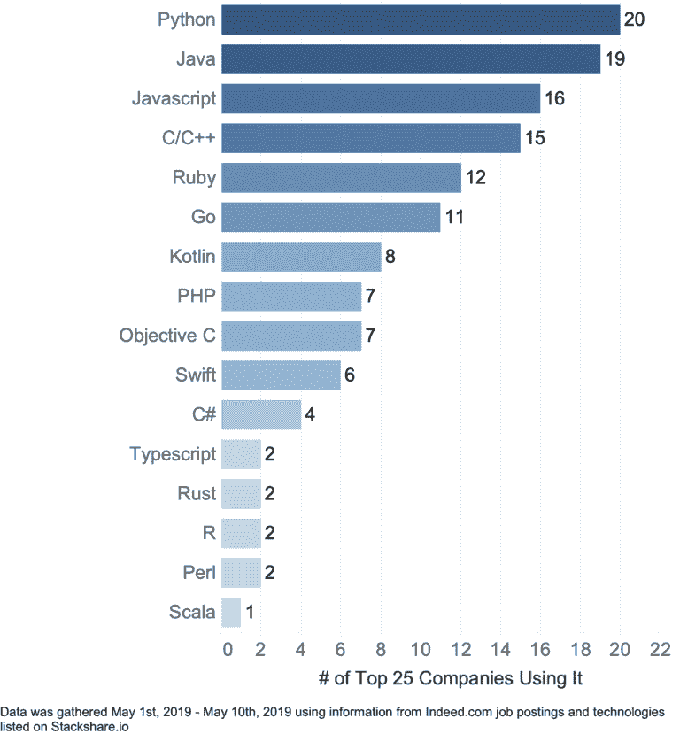
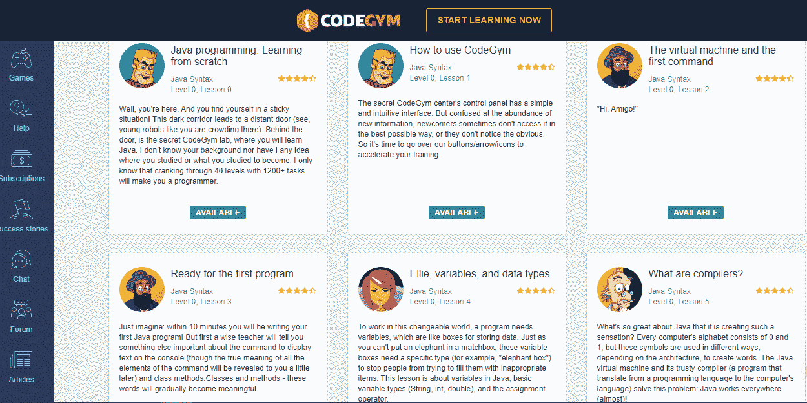
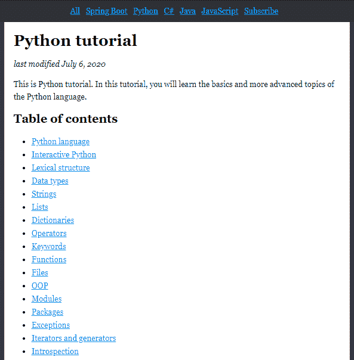
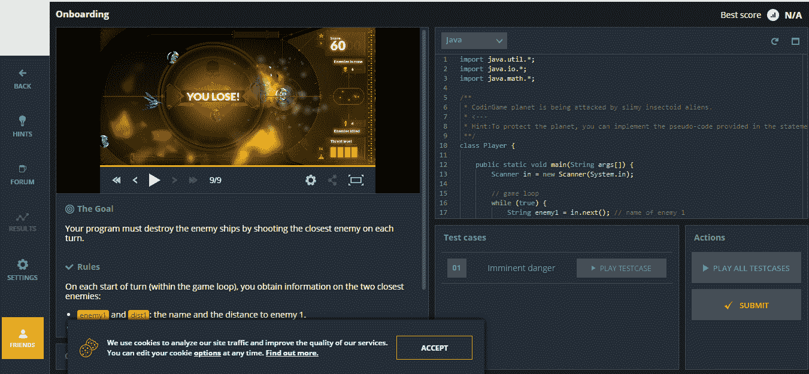

# 我想学编程，但不知道从哪里开始

> 原文：<https://levelup.gitconnected.com/i-want-to-learn-programming-but-i-dont-know-where-to-start-a8f82c333146>

克里斯里德在 [Unsplash](https://unsplash.com?utm_source=medium&utm_medium=referral) 上的照片

应该怎么学，从哪里学编程？

软件开发是一个富有挑战性和利润丰厚的职业选择。我们的日常用品——灯泡、电视、汽车、银行、购物——都是由智能代码驱动的。

如果你想学习编程，但不知道从哪里开始，你来对了博客。我已经编译了一个分步指南，它将帮助你开始你的软件开发之旅，消除你的恐惧。

# 如何选择一门编程语言？

你可能已经注意到，现在有许多流行的编程语言。很容易受到诱惑，试图一口气学会所有的东西。然而，这只会导致沮丧和失望。

我强烈建议选择一种语言(当然，只是在第一步，以后你应该致力于获得几种语言的知识)并坚持下去，而不是一起在太多的船上航行。以下是选择语言之前需要考虑的一些事情:

**难度**——你之前的编程语言经验(如果有的话)是成功的重要决定因素。如果你完全是编程新手，Java 和 C#将是一个很好的起点。但是我强烈推荐 Java 给那些愿意投入更多时间和寻找更多回报的人。它的应用范围很广，报酬很高，并且有一个庞大的开发人员社区可以寻求支持，这使得它值得付出额外的努力。

这里有一个信息图，突出了最容易学习的编程语言:

这张照片很好地总结了这一切。Java 正好处于中间位置，因为它提供了努力和回报的完美平衡。还有许多其他选择可以探索——从常青树 HTML 到新兴的数据科学/人工智能最爱(R，Python)。

受欢迎程度——这是选择语言时要考虑的另一个重要因素。花数百个小时去学习一些没有太多用途的东西是没有回报的。根据 TIOBE 2020 年 7 月指数[，排名前五的流行语言是:](https://www.tiobe.com/tiobe-index/)

*   C
*   Java 语言(一种计算机语言，尤用于创建网站)
*   计算机编程语言
*   C++
*   C#

Java 和 C 在受欢迎程度方面一直在竞争，正如来自 [Infoworld](https://www.infoworld.com/article/3452037/c-challenges-java-in-language-popularity-survey.html) 的许多文章所报道的那样。请记住，这只是一个指标，你的选择不应该仅仅由一种语言的受欢迎程度来决定。

此外，JavaScript 在许多评级中领先，这并不奇怪。JavaScript 是前端开发的主要语言，也经常用于编写各种场合的简短脚本。所以几乎所有的开发人员都至少在基础水平上了解这种语言。

**资源可用性** —自学编程，你会反复参考可用的资源来消除你的疑虑。选择一种已经存在多年的语言意味着有大量的教育和参考资料来帮助你沿着学习曲线前进。无论你是想获得扎实的理论知识，还是想直接开始编程，你只需要找到适合你风格的课程。此外，还有活跃的在线论坛，在那里发布和回答问题——很有可能你的下一个问题已经有人回答了！

**长期前景** —职业发展可能是你决定学习编程的一个重要因素。顶级公司使用的技术通常是一个方便的参考，因为你知道热门技能。

这张信息图显示，前 25 家公司中有超过 15 家使用 Python、Java、Javascript 和 C/C++。虽然 C 已经存在了几十年，并且仍然被广泛使用，但是 Python、Javascript 和 Java 都是同龄人，只是稍微年轻一些。Java 很快流行起来，而 Python 却花了一些时间。

**编程语言的范围**

编程不一样。这个词用于创建功能丰富的网站或网络应用程序。此外，在 web 编程的情况下，有一个前端(功能界面的创建，浏览器可以读取、显示或启动的一切)和一个后端(在服务器上运行的一切)。编程也是移动应用程序和桌面程序的创建。对于这些领域中的每一个，都有一个工作工具库，包括编程语言。

科学编程、视频游戏、大数据、交易、金融——不同的行业也可以使用不同的语言。

有些语言更适合编写小脚本，有些则适合大型企业应用程序。

下面我将给出一个最常用的地方和事物的简短列表:

*   企业级服务器端应用——大部分是 Java，可能是 C #，有时是 C ++
*   科学编程— Python、Java、C#、R
*   大数据— Java、Python、R
*   机器学习— Python，R
*   “大型”视频游戏——大多是 C ++(使用不同的引擎，尤其是虚幻的)，C #(使用 Unity 引擎)
*   移动应用(包括视频游戏)——Java、Kotlin、Swift
*   操作系统、驱动程序、高性能桌面应用程序— C、C++
*   前端(在 web 浏览器中创建交互效果)— JavaScript、Typescript

其实大部分语言都是比较通用的。假设 Java 可以应用于以上任何一个领域。在特定地区使用特定语言有两个主要原因:

1.  语言的架构特征。C 和 C ++它们比同样的 Java 或 C #更低级，它们更接近硬件，工作速度更快。因此，在需要高性能的地方，使用这些语言。而如果安全性更重要，那么用 Java 来构建要比用 C 和 C ++容易得多。
2.  工具的历史和可用性。假设 Java 和 C #在架构和语法上非常相似。但是 Java 进入企业的时间更早，所以在企业中有很多支持 Java 的应用程序已经很多年了。

如果你已经对未来工作的一个领域有任何计划，仔细看看相应的语言。比如你立志做前端开发者，JavaScript 就是你的选择。然而，对于所有其他情况，我给你的建议是——选择一种通用和流行的语言，对于初学者来说相对容易。它可以是 Java、Python 或 C。学习完基础知识后，你可以加深对所选语言的了解，或者切换到另一种语言，如 C ++。

# 第一步:选择要学习的最佳编程语言

现在你已经知道了指导你决策的重要参数，是时候迈出这一步了。根据上面列出的标准，我向初学者推荐以下编程语言:

# Java 语言(一种计算机语言，尤用于创建网站)

它提供了最佳的回报努力比。这是初学者友好的。它是学习面向对象编程的理想选择，面向对象编程是复杂应用程序的基础。它是一种开源语言。Java 最重要的优势之一是 JVM (Java Virtual Machine)，这是一种使计算机能够运行 Java 应用程序的虚拟机。这意味着你只需写一次代码，它就可以在任何平台上工作，从服务器到手机(当然，有一些保留)。

各种规模的组织都使用 Java，这是一个有利可图的职业选择。Java 程序员有一个动态的就业市场，在这里，高质量的程序员总是受欢迎的。

Java 用于大型企业级服务器端应用。它也广泛用于 Android 编程。银行、金融、保险、电子商务、旅游、交通、社交网络等技术驱动型行业。所有人都部署 Java 代码来构建引人入胜的用户体验。Java 驱动的 web 应用程序在大数据技术、软件工具和嵌入式领域非常流行。

# c 语言

这是开始编程之旅的另一个坚实的语言。c 可以被称为“中级”语言。这意味着与高级 Java 或 Python 不同，它更接近于硬件。因此，它可以帮助您更深入地理解计算基础。它有更少的标准库，这意味着您将从头开始编写大量代码，这对初学者进入编程状态是有好处的。

在现实世界的应用中，c 语言是最古老的通用语言之一。几十年来，它一直是创建驱动程序、操作系统和脚本的语言。Linux、Unix、Windows——它们都是用 c 编写的。考虑到它在物联网(IoT)和数据库中的应用，它仍然是未来的安全赌注。

# 计算机编程语言

Python 长期以来一直处于编程世界的边缘。由于数据科学应用的突然激增，它在过去几年已经成为主流。Python 的独特之处在于快速构建原型。它有许多辅助工具，如 NumPy、SciPy 等。简单易学，但有能力在数据科学和科学计算领域构建复杂的系统。

Python 在网上有一个很大的资源库，开发人员社区每天都在增长，为这个巨大的资源库增加了更多的知识。因为它有内置的测试框架，所以它是进行跨平台测试的首选。

Python 在数据科学、机器学习和人工智能等未来技术方面有很大的需求。它可以用于开发 web 应用程序或软件。

# 第二步。创建学习计划

学习编程语言应该被视为一次旅程，而不是目的地。你不可能在几周内掌握一门编程语言的所有方面。你的期望要现实。列出你想在课程结束时达到的目标，选择与你的目标、学习速度和学习模式相一致的课程。

不同的语言有不同的学习方法，你必须系统地遵循，着眼于更大的图景。把你的总体目标分解成每天的目标，并把它包含在你的时间表中。

# 第三步:选择学习资源

现在你知道你想做什么，下一步就是研究和筛选你的资源。它们有不同的类型。

**面向实践的在线课程**

有一些在线资源提供实践教程。这些课程采用实用的教学方法，让你养成尽早编码的习惯。最好的学习方法是通过实践。

这里有一些内容丰富的网站，你可以参考，通过理论和实践的完美结合来掌握编程概念。

[**Codegym**](https://codegym.cc/)

Codegym 是学习 Java 的在线课程和门户网站。它很实用，将 80:20 原则应用于教学，其 80%的内容侧重于实践。在涵盖了基础知识之后，课程逐渐转向复杂的概念，如多线程、集合等。有趣的是，你有超过 1200 个编码任务要完成，以磨练你的技能，并为下一个级别获得信心。

[**ZetCode**](http://zetcode.com/)

它提供了大量的编程语言可供选择。该网站列出了丰富的学习资源，并根据课程进行了分类。你可以学习编程、数据库、图形用户界面等等。

[**编码名称**](https://www.codingame.com/)

Codingame 为学习编程增加了一个非常需要的有趣元素，否则它会变得单调和令人沮丧。为了生存，你必须用你的编程技能击落敌人。它不仅使编程变得有趣，你还可以在玩游戏的时候练习编程。

# 基于理论的基础课程

扎实的理论基础对于程序员来说至关重要，尤其是初级水平。无论你是在设计应用程序还是准备面试，扎实的理论知识都会给你一个良好的开端。[**uda city**](https://www.udacity.com/)**是一个非常好的网站，在这里你可以找到一些掌握编程理论方面的课程。**

# **官方编程语言文档**

**这是你能得到的最全面的资源。它可能不是最容易阅读的，但是没有什么比它的官方文档更能解释一种语言了。对于 java 程序员来说，[官方 Java 文档](https://docs.oracle.com/en/java/)仍然是 Java 编程的圣经，不管他们的经验水平如何。**

# **第四步。在在线论坛中与用户互动**

**来自世界各地的程序员聚集在特殊的平台上讨论想法，解决彼此的问题并分享他们的经验。这样你就不用重新发明轮子，因为很有可能其他人已经面对并解决了你即将遇到的问题。**

**像 Java、Python 或 C 这样的常青树语言拥有活跃的社区，这要归功于大量拥有数十年经验的用户。他们是一个很好的地方，可以从彼此的错误中学习，加快你的学习进程。**

**[**Stackoverflow**](https://stackoverflow.com/) ， [**GitHub**](https://github.com/) ，[**Reddit**](https://www.reddit.com/)(r/web Dev，r/AskProgramming 或 r/LearnProgramming)和**Slack****(Hashtag Developers，European Dev Explorer 和 Slash Rocket)是一些拥有一些管理最好的开发人员社区的流行平台。****

# ****所有后续步骤。继续前进！****

****如果你问我关于学习编程的一个建议，这将是它。如果编程很简单，每个人都会去做。学习任何新事物都需要时间和耐心。你需要真诚地努力，朝着你计划的最终结果前进。在前进的道路上会有打嗝，需要大步前进。****

****即使是经验丰富的程序员也会写出糟糕的代码，但是他们会不断地改进它，直到它出彩为止。从你的错误中学习(但最好从别人的错误中学习),尽量不要重复它们——还有很多新的错误等着你去犯呢！****

# ****结论****

****学习编程语言需要时间、耐心、努力和坚持。你选择的资源在很大程度上决定了你最终要写的程序员的质量。多亏了在线学习革命，许多著名的大学和程序员已经将他们的材料发布到网上。你所需要做的就是找到合适的，并发掘你内在的巨大潜力。****