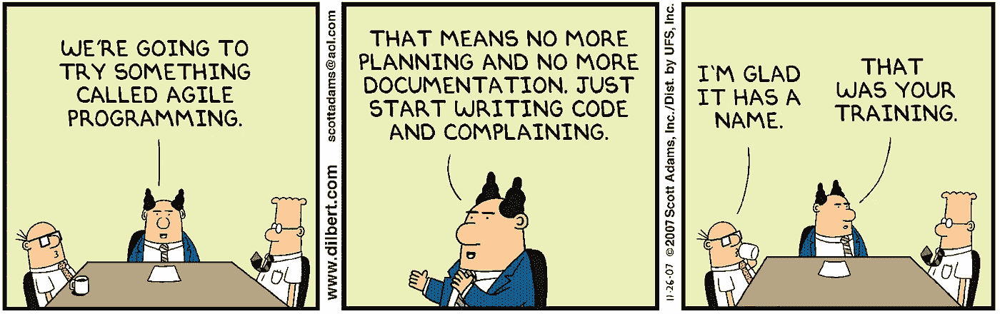
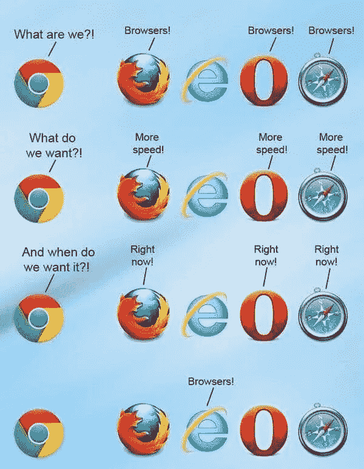
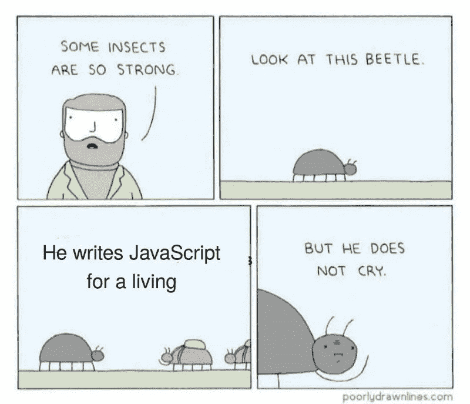
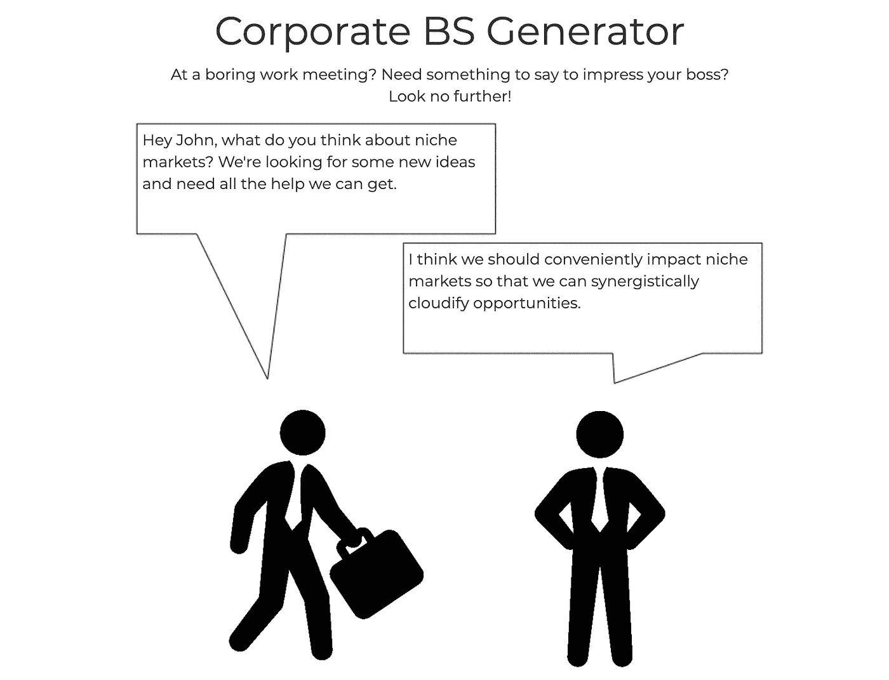

# 我希望我从未学过编码

> 原文：<https://levelup.gitconnected.com/i-wish-i-never-learned-to-code-d431769a399d>

蒂姆·高在 [Unsplash](https://unsplash.com?utm_source=medium&utm_medium=referral) 上拍摄的照片

我以写代码为生。你可能会说我是一名专业的软件工程师，但实际上软件工程不仅仅是一种职业——它是一种生活方式。帽衫、乒乓球、吃不完的零食和汽水……这些都是真的。然而，尽管这个领域很有价值，我还是要坦白:有时候我真希望我从来没有学过编码。

# 怪癖

自从我开始学习编码，浏览网页就变得不一样了。我再也不能简单地接受我在使用其他网站时遇到的错误。每当奇怪的事情发生时，好奇心就会占据我的上风，我不得不打开浏览器的开发工具并开始调试。

试图提交表单时出现的神秘错误信息？您会发现我正在钻研 JavaScript 控制台，寻找错误消息，研究源代码，观察网络请求的来去。UI 看起来有点过时，还是页面布局真的很好看？不管怎样，我都会调整浏览器窗口的大小，看看它对屏幕大小的反应有多好。漫画桑作为你的选择字体？我可能再也不会相信你或你的公司了。

请不要使用漫画

# 职业生活

如果你认为这些浏览习惯不好，那就等着听我和其他软件工程师的对话吧。总的来说，工程师往往相当固执己见。迂腐是我们的天性。你使用[空格或者制表符](https://www.youtube.com/watch?v=SsoOG6ZeyUI)来缩进你的代码吗？你更喜欢 Vim 还是 Emacs？Chrome 还是 Firefox？

在更明智的圈子里，这些对话最终会导致有人问“这真的重要吗？”。自行车脱落是一个真实的现象，需要小心控制。

xkcd —真正的程序员

随着越来越多的公司采用敏捷方法，我们必须不时地权衡使用瀑布、Scrum 或看板开发生命周期之间的比较取舍。我们都喜欢抨击瀑布，认为它是过时的、低效的公司过去使用的人工制品。然而，Scrum 与看板之战仍在继续。

“你说你是 Scrum 的信徒？我敢打赌，你喜欢你的人工时间盒，它导致匆忙的代码被轻率地发送，以便在 sprint 结束之前满足一个假想的截止日期。”

呆伯特——斯科特·亚当斯

说到敏捷，故事点到底是什么？时间的度量？努力？复杂？风险？以上全部？你和我可能会花上几个小时来讨论每个定义的优点，却无法达成共识。

在某种程度上，这可能会导致更多的骑车族，但能够相互理解并有效沟通是至关重要的，这包括对我们一天中使用的术语有共同的理解。

前端开发打开了一个全新的话题世界，最引人注目的是:“我们什么时候会最终放弃对 Internet Explorer 的支持？”我不得不在讨厌 Internet Explorer 和想要放弃它之间游走，同时理解为那些坚持使用它的客户提供支持的必要性。(那些可怜不幸的灵魂……)

Internet Explorer 迷因

# 持续学习

持续学习是软件工程的一个重要部分，因为技术环境经常变化。几乎每个月都有数百个新的库和框架发布，JavaScript 倦怠是真实的。

当我告诉外部观察者我花了一天时间配置 [Webpack](https://webpack.js.org/) 、 [Rollup](https://rollupjs.org/guide/en/) 和 [Babel](https://babeljs.io/) 以便使用最新的 ES6+语法时，他们可能会认为我在编造故事。或者说[角度](https://angular.io/)和[角度](https://angularjs.org/)是两个截然不同的东西。或者说 [LitElement](https://lit-element.polymer-project.org/) 、[svelite](https://svelte.dev/)和 [Stencil](https://stenciljs.com/) 看起来像是有前途的 web 组件解决方案。或者[节点](https://deno.land/)可以是新的[节点](https://nodejs.org/)。

当有人问我做什么工作时，我很难不脱口而出首字母缩略词来回答:“我通常使用前端技术，比如 HTML、CSS 和 JS。偶尔我不得不使用 PHP 或 SQL，但我更像是一个普通的/MERN 堆栈开发人员。有时我使用 PaaS 技术，如 Heroku T1，但其他时候我使用 IaaS 提供商，如 T2 AWS T3 或 T4 GCP T5

一部线条糟糕的漫画的开发者衍生迷因

# 个人生活

在我空闲的时候，我会读一些标题很枯燥的书，比如*干净的代码*、*重构*和*领域驱动设计*。当我不读教科书时，我会在网上阅读一些文章，这些文章通常包含一些有问题的建议，或者看一些人的编码教程。关于编程的播客更令人愉快，因为还有什么比在我上班的路上听别人谈论代码更好的呢？在那里我可以花一整天的时间谈论代码。

除了在网上消费内容，软件工程师也花了他们个人生活的很大一部分在网上创造内容。我的个人爱好是构建没人会看到的简单应用和游戏，比如 [Crossy Block](http://tylerhawkins.info:3011/) ，这个 [Flappy Bird 山寨](http://tylerhawkins.info/201R/QrappyBird/#/)，或者这个[企业 BS 生成器](http://tylerhawkins.info:3009/)。这是浪费时间吗？也许吧。但是，当人们看到这些应用时，它是否会给他们带来两分钟的快乐呢？绝对的。

企业 BS 生成器应用程序

# 事实是…

然而，事实是，编码给了我一个创造和发挥创造力的机会。它帮助我将想法带入生活，几乎可以说是无中生有。软件工程让我能够解决有趣和困难的挑战，理想的是在一些小的方面让人们的生活变得更容易。我的职业帮助我拓展和增长智力。我有机会不断地学习，我甚至为此得到报酬！

事实是，我喜欢编码。