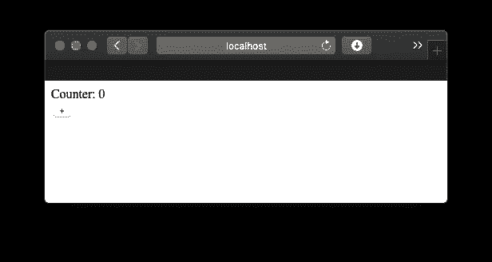

# 我写了一个前端框架，没有任何前端代码

> 原文：<https://levelup.gitconnected.com/i-wrote-a-frontend-framework-without-any-frontend-code-4e93ae321a4>


照片由 [Goran Ivos](https://unsplash.com/@goran_ivos?utm_source=unsplash&utm_medium=referral&utm_content=creditCopyText) 在 [Unsplash](https://unsplash.com/search/photos/frontend?utm_source=unsplash&utm_medium=referral&utm_content=creditCopyText) 上拍摄

我喜欢围棋。我不喜欢 JavaScript。所以我提出了这个问题…

> 如果不使用 JavaScript 或其生态系统，我如何编写一个反应式的单页应用程序呢？

这是我想到的:

```
package mainimport "github.com/elliotchance/pepper"type Counter struct {
    Number int
}func (c *Counter) Render() (string, error) {
    return `
        Counter: {{ .Number }}<br/>
        <button [@click](http://twitter.com/click)="AddOne">+</button>
    `, nil
}func (c *Counter) AddOne() {
    c.Number++
}func main() {
    panic(pepper.StartServer(func() pepper.Component {
        return &Counter{}
    }))
}
```

这些代码封装了整个堆栈。如果您已经安装了 Go，现在就可以试用:

```
go get -u github.com/elliotchance/pepper/examples/ex01_counter
ex01_counter
```

现在在你的浏览器中打开[http://localhost:8080](http://localhost:8080)…或者，看一下这张截图:



好吧，所以它不会赢得任何设计奖项，但点击`+`按钮确实会像预期的那样增加数字。

# 这到底是怎么回事？

`Counter`是一个组件，因为它有一个`Render()`方法。`Render`返回一个将被正确呈现给客户端的`html/template`。它可以引用任何状态，比如`Number`，或者将事件绑定到方法，比如`@click="AddOne"`。

架构非常简单。当浏览器打开页面( [http://localhost:8080](http://localhost:8080) )时，它返回了一个*几乎为空的页面。这个页面包含一个空的`div`和一些通过 websocket 连接的函数。*

页面加载后，websocket 将立即连接。连接后，服务器将呈现组件并发送 HTML，它将被放置在页面上。

所以这只是后端渲染？嗯，是也不是。它有效地呈现了整个组件，并通过 websocket 发送整个 HTML。然而，那只是因为现在这很容易。服务器可以被优化来发送 diff，或者完全避免呈现未改变的组件。

# 我能用它吗？

**花椒还是极具实验性的。**它需要持续连接到服务器(用于 websocket ),所以它不适用于任何必须离线运行的东西，也不适用于互联网不稳定的情况。

我想 pepper 的一些很好的用例是:

1.  显示实时数据。流式指标、图表、日志、仪表板等。
2.  依赖持久连接的应用程序。如聊天客户端、定时互动考试等。
3.  受益于持久状态的应用程序。整个状态可以保存或恢复成 JSON 这样的序列化格式。非常适合有许多问题/步骤的表单或调查。
4.  构建前端应用的原型。无需设置复杂的环境、构建工具和依赖项，就可以轻松启动、运行和迭代更改。

# 还有更复杂的例子吗？

是啊！浏览主存储库页面上的[示例，其中涵盖了表单、嵌套组件，到您阅读本文时可能还会有更多内容。](https://github.com/elliotchance/pepper#examples)