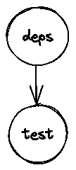
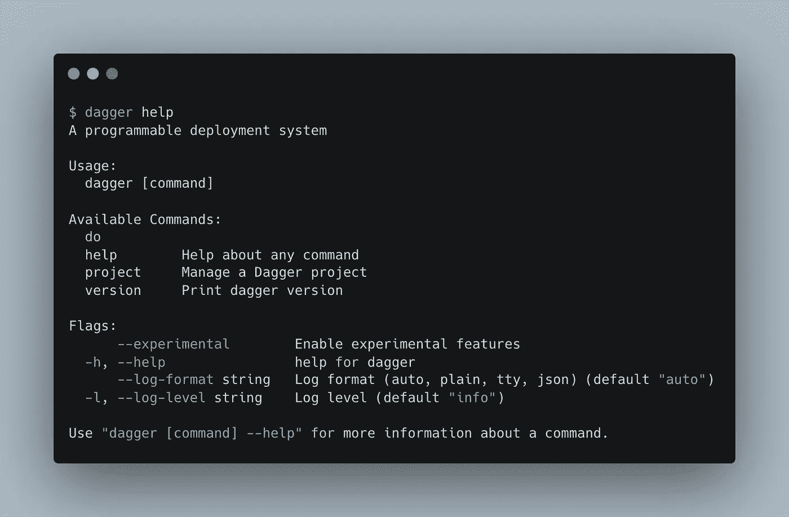

# 我用 dagger 写了我的第一个 CI 管道

> 原文：<https://levelup.gitconnected.com/i-wrote-my-first-ci-pipeline-with-dagger-d78f391e1f5e>

## Docker 的创作者发起的项目最近随着他们的公开测试版的宣布达到了一个新的里程碑。现在它是公开的了，我们可以用这个有前途的 CI/CD 工具玩一玩了。


免责声明#1:这篇文章的目的是提供建设性的和客观的批评。我不想低估贡献者的工作。我做不到他们所做的百分之一。我非常尊重他们对这个项目的承诺。

*免责声明#2:我选择用一个例子来说明这篇文章。作为一个匕首新手，我很确定还有提升的空间。但是它是有效的，目的是通过一个例子来介绍这些概念。优化以后再来。*

几周前，由 Docker 创始人创办的 dagger 公司宣布，他们筹集了 2000 万美元来加快产品开发。他们的使命:**简化应用部署体验**。有了这样的标语，他们引起了我的注意！

那么匕首是什么？

Dagger 带来了创建 CI/CD 管道的新方法。它提供了以下好处:

*   **统一开发和 CI 环境**。使用 Dagger，您可以在本地运行您的管道！
*   **减少 CI 锁定**。无论您是使用 GitHub Actions、GitLab CI 还是任何其他 CI 运行程序运行 CI/CD 管道，代码都是相同的。

随着一组可重用包的引入，目标也是有利于开发人员的速度。

如果你还不知道匕首，我会掩护你。我将首先展示一个真实世界的用例。因此，您将为工具的审查做好准备。

在这篇文章的结尾，你将有望对 dagger 有更多的了解，并对这个项目目前的状况有所了解。

# 在简单用例上测试 Dagger

当我测试新工具时，我喜欢把手弄脏。我的用例很简单:**用 GitHub Actions** 在 Rust 项目上运行测试。

一旦建立了环境，所有项目的流程几乎都是一样的:

1.  定义你的行动，并将它们添加到你的计划中。行动是管道的组成部分。
2.  确保可以通过 CLI 发现您的操作。
3.  在本地执行您的操作。
4.  部署到您的远程 CI 运行程序。

在我的例子中，没有任何针对 rust 的包，无论是内置的还是来自社区的。因此，我不得不使用 docker 包来建立一个可重现的环境并运行我的测试套件。

为了配置动作，dagger 利用了一种叫做 **CUE** 的语言。我的配置如下所示:

我现在可以运行我的操作了。

```
dagger do test
```

所有测试都通过了。我现在可以部署到 GitHub Actions。dagger 的团队友好地创建了一个我们可以重用的 GitHub 动作，这使得过渡非常平稳。

我的配置文件很简单。

就是这样！我有一个管道，只要我一推出新的变更，它就执行我的测试。

现在它起作用了，是时候后退一步，对 dagger 进行批判性的审视了。

# 我真正喜欢的

## CUE，一种超级配置语言

我喜欢匕首的第一点: **CUE** ！这是一个奇妙的发现。我以前不懂这种语言，但我立刻就爱上了它。这是团队做出的一个伟大的设计选择。


提示官方标志

CUE 是一种**配置语言**。将其视为 YAML 和 JSON 的替代品。它实际上是 JSON 的超集。

以下内置特性尤其引起了我的兴趣:

*   **包管理**:你可以通过一个包系统轻松地重用样板代码
*   **类型检查**
*   **模式实施**:您可以定义一个模式，并根据它验证您的数据。你的数据甚至可以是 YAML 文件或 JSON 文件！
*   **一个内置的开发工具链**:你可以下载`cue`二进制文件，它将允许你验证你的模式和格式化你的文件

关于 CUE 还有很多要说的，但我需要抑制我的热情，因为它不是今天的话题。😇

## DAG 自动生成和缓存

我发现 dagger 动作之间的依赖管理做得很好。它构建了一个**有向无环图(DAG)** 而不需要您明确定义 DAG 运行动作的顺序。

在我的例子中，当我运行`dagger do test`时，它也会因为`input: deps.output`参数而运行`deps`动作。dagger 检测到一个依赖项，并将按照正确的顺序执行动作。



表示我的管道步骤的 DAG

乍一看，您可能认为 CUE 文件与 Makefile 非常相似。但是隐式任务依赖管理是两者之间的一个关键区别。

另一个区别是缓存系统。匕首将藏物存放在一个缓存中。因此，如果代码中只有很小的变化，就不需要运行整个管道。

## 来自宇宙的可重复使用的包

dagger 提供了一组有限的核心动作。但是您可以依赖一组包含更多操作的包。这套包叫宇宙。

因此，您可以混合使用核心动作和外部包中的动作来创建自己的动作。

虽然这个数字目前还很有限，但是一旦社区做出贡献，它将会扩大规模。

# 是什么让我保持怀疑

你和 dagger 合作得越多，你就越能看到它的潜力。然而，dagger 仍然是一个新生的项目，因此，还有许多工作要做。

## 开发者体验还不完美

作为一个匕首新手，我先看了官方文档。老实说，入职并不顺利。一些代码片段不起作用。内容组织得不是很好。例如，文档在用户指南旁边包含投稿指南。此外，来自宇宙的包根本没有文档，所以你需要去找代码(幸运的是它是开源的😅)获取您需要的信息。

维护人员意识到了这个问题，因为有一个技术作家的职位空缺。社区还写了几期 GitHub。

**文件很难**。这是一份全职工作。随着事物的快速变化，保持信息的更新是一个巨大的挑战。因此，祝贺团队尽了最大努力！我希望我有时间帮助他们改进入职流程。

除了缺少文档之外，我还在开发人员界面**上花了点功夫，尤其是 CLI 和使用 CUE 定义动作的标准。术语有时令人困惑。项目和计划之间的区别并不清楚。配置文件的某些部分是反直觉的，比如客户端部分。**

CLI 设计可以改进。以下是运行 help 命令时得到的结果。



匕首帮助命令输出

有像`do`这样的动词和像`project`这样的名词。但是当你运行`dagger project`时，子命令是动词。我不知道这些选择背后的原因，但我梦想有一个更好的界面。

我花了一些时间浏览 GitHub 上的公开问题，我发现他们对界面想了很多。我们仍处于项目的开始阶段，这是进行结构性变革的最佳时机。

## 许多 CI 运行程序和语言还不被支持

当然，这是项目的开始，他们必须优先考虑工作。他们公开做这件事，所以我并不感到惊讶。但对于我的日常工作，我需要更多的包，以避免重新发明轮子。好消息是我可以在 GitHub 上为下一个 CI 运行者和下一个要开发的包投票！📨

此外，由于它是开源的，我可以做出贡献！

# 结论

测试 dagger 在我的任务清单上已经太久了。我真的玩得很开心！

该产品处于**公开测试阶段**，所以我对剩余的工作量并不感到惊讶。我**现在不会在生产中使用 dagger**，但是我一定会在几个月内检查看看它的发展。

作为一名为咨询公司工作的开发人员，我看到了真正的好处。事实上，我们经常在没有相同 CI/CD 堆栈的项目之间切换。因此，在现有 CI 运行程序之上创建一个抽象层的承诺很有意思。我们可以定义我们自己的行动，并独立于 CI 运行人员在我们的项目中利用它们。

最后，这个项目向**展示了构建成功的开源软件**有多么困难。这是一个技术挑战，也是一个人的挑战。每个人都对项目的发展方向有自己的看法(包括我自己)，维护人员必须做出决定。我祝他们一切顺利！