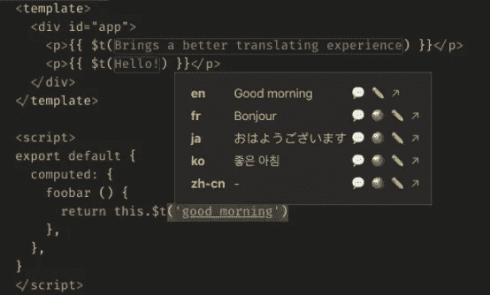

# i18n 毫无困难地使用这个 VS 代码扩展

> 原文：<https://levelup.gitconnected.com/i18n-without-pain-using-this-vs-code-extension-a6eb10e53772>


纳蕾塔·马丁在 [Unsplash](https://unsplash.com?utm_source=medium&utm_medium=referral) 上的照片

如果你是一名网络开发者，你很有可能正在国际化你的应用或网站。如果你没有，原因是以下两个之一:要么你不需要，要么你注意到**有多痛苦而放弃了。**

无论你使用什么框架或语言，你总是**在文件**之间来回穿梭，寻找翻译，并找出哪个键是哪个键。对于 JSON i18n 文件，你甚至不能复制你创建的整个键来粘贴到其他地方，**简直一团糟**。

# 国际联盟

开箱即用，i18n Ally 兼容[很多流行的框架](https://github.com/antfu/i18n-ally/wiki/Supported-Frameworks)。如果您正在使用其中的一个，那么为您配置**将会非常简单，因为大部分工作将会由扩展的初始化例程自动完成。**

如果你按照我下面给你的步骤去做，这个扩展也是与每个框架和定制代码兼容的。

## 它的作用

这个扩展做了很多工作，但这里有两个最基本和最有价值的特性:

*   翻译的在线可视化
*   在线创建和编辑翻译**而不打开任何 i18n 文件**

你可以在 GitHub 上浏览其他(难以置信的)特性[。](https://github.com/antfu/i18n-ally)



Vue 文件中翻译的内联可视化和编辑示例(来自 i18n Ally GitHub 页面)。

你可以在上面的图片中看到，在第 3 行和第 4 行,**翻译键被所选语言的翻译替换为**。除非您的光标在这一行代码上，否则它们就会显示出来，就像第 12 行的情况一样。悬停时，会出现一个简洁的翻译列表**和一个铅笔图标**来编辑它们。如果您键入一个不存在的密钥，您将能够**创建它而无需打开任何翻译文件**。

## 如何设置它

我第一次发现这个扩展时，它并不适合我和我们正在使用的定制框架，所以我只是把它放在一边几个月，然后进行手动国际化。

我为此对自己很生气，因为实际上配置非常容易。

首先，当您[安装扩展](https://marketplace.visualstudio.com/items?itemName=antfu.i18n-ally)时，它会将键“i18n-ally.localesPaths”添加到“. vscode/settings.json”中的项目配置文件中。这是一个路径数组，扩展将在其中查找翻译文件。**删除它们并粘贴你的 i18n 文件夹路径**。我的看起来是这样的(使用 JHipster 的 Angular 项目):

```
"i18n-ally.localesPaths": [
    "src/main/webapp/i18n"
]
```

**然后检查你的输出标签**，并**选择 i18n Ally** 看看是否有任何错误，但在快速加载后，你应该开始让扩展在你所有的文件中运行。

## 添加不支持的框架和自定义代码支持

如果除了受支持的框架之外还需要其他东西，不要跳过这一步，因为这也相当容易，而且让扩展只在一半的代码中工作并没有真正的帮助。

在我的例子中，有两个问题:我们将 JHipster 与 Angular 一起使用，它附带了一个基于 Angular 默认翻译系统的**自定义翻译系统**，我创建了以 i18n 键作为参数的**组件**。

这两种情况都可以通过创建一个基本的定制框架支持文件来解决。这个文件本质上是一个转义正则表达式列表，用来匹配你想要的每一个定制代码。

创建一个新文件`. vs code/i18n-ally-custom-framework . yml`。从文档中，下面是要复制和粘贴的示例配置(包括有用的注释，您应该保留在那里以供以后使用):

```
# An array of strings which contain Language Ids defined by VS Code
# You can check avaliable language ids here: https://code.visualstudio.com/docs/languages/overview#_language-id
languageIds:
  - javascript
  - typescript
  - javascriptreact
  - typescriptreact

# An array of RegExes to find the key usage. **The key should be captured in the first match group**.
# You should unescape RegEx strings in order to fit in the YAML file
# To help with this, you can use https://www.freeformatter.com/json-escape.html
usageMatchRegex:
  # The following example shows how to detect `t("your.i18n.keys")`
  # the `{key}` will be placed by a proper keypath matching regex,
  # you can ignore it and use your own matching rules as well
  - "[^\\w\\d]t\\(['\"`]({key})['\"`]"

# An array of strings containing refactor templates.
# The "$1" will be replaced by the keypath specified.
# Optional: uncomment the following two lines to use

# refactorTemplates:
#  - i18n.get("$1")

# If set to true, only enables this custom framework (will disable all built-in frameworks)
monopoly: true
```

根据你想要达到的目标，你必须做出一些改变:

*   ` monopoly '定义该文件是唯一使用的配置，还是将与支持的框架配置一起使用。假设您想要 Angular 和您的自定义代码，您将需要“monopoly: false”。
*   “languageIds”是您想要检测翻译的语言。语言 id 可以在这里找到[。](https://code.visualstudio.com/docs/languages/identifiers#_known-language-identifiers)
*   “usageMatchRegex”是转义正则表达式，其中“{key}”是指要检测的 i18n 键。

例如，我想使用 Angular 默认配置，并在 HTML 文件中添加对“jhiTranslate”、“labelI18nKey”和“placeholderI18nKey”属性的支持。这是生成的配置文件:

```
languageIds:
- htmlusageMatchRegex:
- "(?:translate|jhiTranslate|labelI18nKey|placeholderI18nKey)=['\"`]({key})['\"`]"monopoly: false
```

您的配置文件应该在保存时被 i18n Ally 检测到。再次，**检查您的输出选项卡**，然后**选择 i18n Ally** 查看是否一切正常。

## 在你离开之前

这篇文章的大部分内容是我让你通过 [**扩展的文档**](https://github.com/antfu/i18n-ally/wiki) 。如果您想做进一步的配置或发现其他功能，请查看它。这是有据可查的，易于阅读。

我希望这对你和对我一样都是一个游戏规则的改变者。国际化愉快！