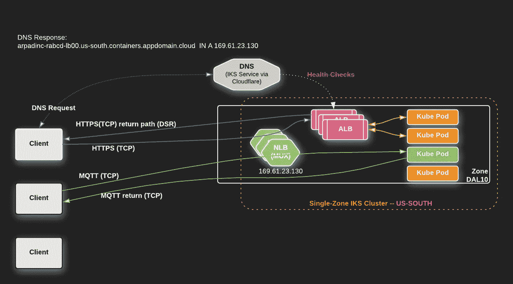
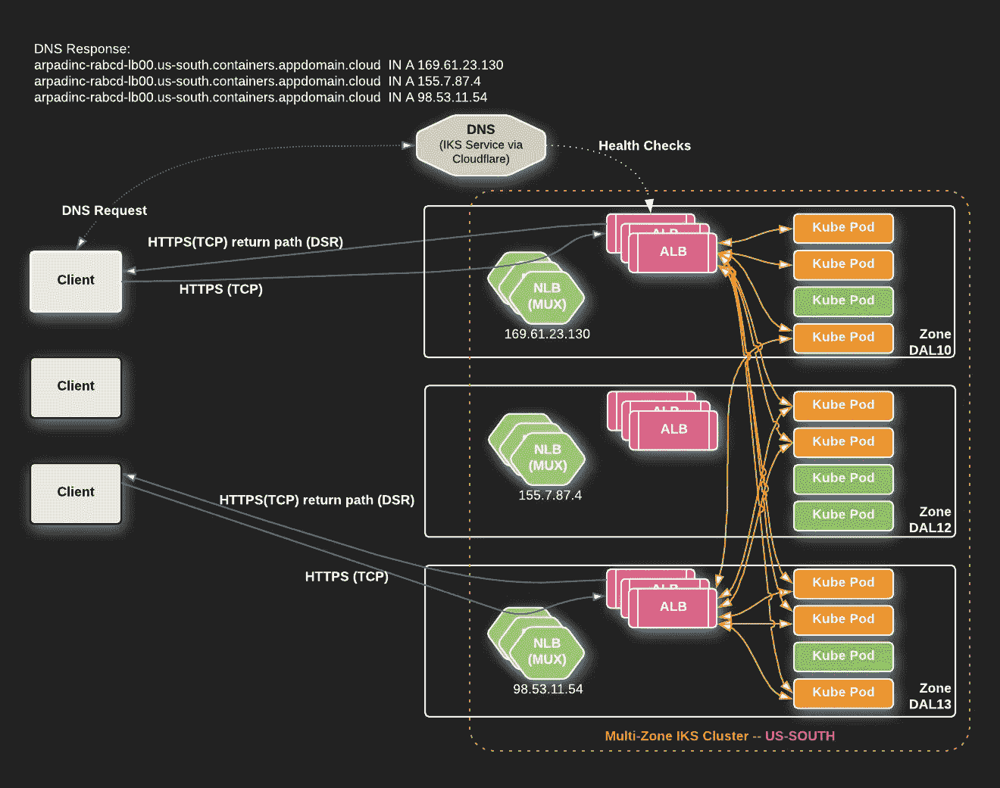

# IBM Cloud Kubernetes 服务；最大化吞吐量和可用性的部署模式

> 原文：<https://levelup.gitconnected.com/ibm-cloud-kubernetes-service-deployment-patterns-for-maximizing-throughput-and-availability-88a23a99437f>

我应该如何使用负载平衡器服务和 ALB 在集群中部署我的应用程序？什么时候应该使用负载平衡器，什么时候应该使用 ALB？
如何有效利用我的能力？

随着即将在[IBM Cloud Kubernetes Service](https://www.ibm.com/cloud/container-service)上发布的 Kubernetes 1.12 版本，我们将发布新的 IKS 负载平衡器 2.0 公测版，以便客户进行测试。本文讨论了这个负载平衡器服务的功能以及围绕它的一些部署模式，并提供了一些示例。

*你也可以在 IBM 博客上阅读* [*原文。*](https://www.ibm.com/blogs/bluemix/2018/10/ibm-cloud-kubernetes-service-deployment-patterns-for-maximizing-throughput-and-availability/)

# 效率和可用性

在 IBM，您可以从效率和可用性两方面最大限度地利用您在 IKS 集群中的投资，这对我们来说非常重要。根据应用程序的需求，有多种方法可以部署 IKS 集群和其中的应用程序。在本文中，我们将介绍一些部署模式，并包含一些示例，以便您可以选择最接近您需求的模式，并进一步完善它们。

# 负载平衡类型

在我们进入部署模式之前，让我们快速浏览一些不同的负载平衡类型，因为我将在后面提到这些概念。如果您熟悉 DNS RR、ALB、NLB 和 DSR 概念，可以跳过这一步。

## 基于 DNS 的负载平衡(循环)

DNS 循环法是在 IP 地址各不相同的服务器之间分配流量的最简单方法之一。通过为同一个主机名注册多个 A(或 AAAA)记录，DNS 解析器将返回所有记录—通常是每个查询的置换列表。客户端通常连接到列表中的第一个。

这种技术有很多限制和缺点，我不会在本文中讨论。它完全依赖于客户端实现的事实既是优点也是缺点。*(注意:有一些 DNS 提供商实现了一些功能来减少一些缺点，这是值得研究的。)*

## 应用负载平衡(ALB)

ALB 概念通常是一种类似代理的操作，其中客户端连接到后端服务，并且必须通过反向代理，反向代理了解协议、应用程序并能够基于内容做出明智的决策。对于微服务之间的通信，我们一般使用 HTTP 因此，中的 HTTP 反向代理可以方便地根据 HTTP 位置、头、cookies、参数等做出决策。

客户端打开到 ALB 的 TCP 连接，ALB 打开到后端的另一个 TCP 连接，并根据负载平衡策略、调度程序和设置，在可用后端之间路由请求。请注意，DNS 响应中只有一个 IP 地址 ALB 处理来自客户端的所有传入请求。

## 网络负载平衡(NLB)

NLB 概念通常用于第 4 层(OSI 层)的水平扩展。这通常意味着 TCP 和 UDP 应用程序可以存在于多个服务器(物理或虚拟)上，并且仍然共享同一个 IP 地址。NLB 通常不会终止 TCP 连接它只是作为一个“转发器”的数据包，而坐在中间。

通过 NLB，我们还可以启用直接服务器返回(DSR)概念，这意味着 NLB 不在数据包的返回路径中。后端服务器看到客户端的原始源 IP 地址和端口，并直接响应，而不经过 NLB。实际上是后端服务器终止 TCP 连接，并将 NLB (MUX)的源 IP 直接返回给客户端。对一些人来说，这听起来像是巫术，但从根本上来说，这很简单。下图解释了这个概念(跟随来自客户端的数据包):

NLB (MUX)将数据包封装成 IPIP 隧道数据包，并将原始数据包发送到后端服务器。后端服务器将其解封装，并以公共 IP 作为源直接响应客户端 IP(在我的例子中是 169.61.23.130)。

这使我们能够在无法在报头中传递的协议(如 HTTP can)上保留原始客户端 IP，并在相同的 IP 地址后进行水平扩展。典型的例子是二进制协议，如 MQTT、RTMP、MySQL、PostgreSQL 等，但并不仅限于此。

# IKS 集群部署模式

部署 IKS 集群有多种方式，没有灵丹妙药。你必须了解以下因素:

*   您正在运行的应用程序的要求(包括规模)；
*   SLA 目标；
*   预算。

所有这些都会影响你最终选择的模式。

**Zone** =一个大都市区域中的故障域，如数据中心(例如，德克萨斯州达拉斯:DAL10)。
**区域** =同一大都市区内多个区域的组合。例如，德克萨斯州达拉斯:美国南部可视为 DAL10、DAL12 和 DAL3 的组合，它们分别是独立的数据中心/故障域。

## 单区集群

最简单的模式是在一个区域内的单个区域中部署 IKS 集群。[部署单区域集群模式的分步示例](https://medium.com/@ArpadKun/iks-deployment-patterns-1-single-zone-cluster-app-exposed-via-loadbalancer-nlb-and-alb-6370560307e4)。

有一个 A 记录与我的 ALB 的主机名称相关联，它是通过负载平衡器服务(NLB)公开的。在单区域群集设置中，默认情况下，IKS 不会为 ALBs 配置运行状况检查。

在这个视图中，您可以看到一个通过 IKS ALB 公开的 HTTP(S)应用程序和一个二进制协议(MQTT)应用程序，后者也通过负载均衡器服务直接公开。请注意 DSR 操作 ALB 和 MQTT 应用程序都直接返回给客户端。

## 多区域群集—仅限 ALB

在此模式中，可以观察多区域 IKS 群集和 ALB 的默认行为。在我的示例中，我运行在美国南部的三个区域(DAL10、DAL12 和 DAL13)。[逐步示例部署多区域，ALB 仅使用模式](https://medium.com/@ArpadKun/iks-deployment-patterns-2-multi-zone-cluster-app-exposed-via-alb-ingress-controller-415908418abd)。

有三个 A 记录与我的 ALB 的主机名称相关联，它是通过一个负载均衡器服务公开的(因此，流量是通过 NLB 流动的)。每个区域都为 ALBs 配置了**运行状况检查**。如果出现区域故障，ALB 的 IP 地址将在大约 60 秒内从 DNS 响应中自动删除。

请注意 ALB 的 DSR 行为。

默认情况下，在 ALBs 之后，后端 pod 将被同等对待，无论它们是在本地区域还是在远程区域运行。通过这种方式，该区域的计算能力被合并。

如果发生区域故障，有两个位置的一些请求将丢失:

1.  通过运行状况检查，本地 ALBs 将在约 60 秒内从 DNS 中删除。其他(仍在运行的)区域中的其余 ALBs 将尝试连接到已配置的终结点。连接到关闭的 IP 的客户端将经历 TCP 超时，并重新连接到列表中的后续 IP(特定于客户端实现)。
2.  一旦故障区域中的工作节点变为“未就绪”，将在 40 秒内从仍在运行的 ALB 配置中删除终结点。在这 40 秒内，健康区域中的 ALBs 仍将尝试向失败区域的端点发送请求，但一旦它们遇到失败(例如端点没有响应，这将导致 502 响应)，它将在 10 秒内阻止向同一端点发送另一个请求。根据您在失败区域中有多少个端点，以及您正在运行多少个 ALB pods，会有不同数量的请求失败。根据经验，可以使用以下计算方法:[失败区域中的终结点数量]*[ALB pod 的数量] * 4。

## 多区域集群——NLB

通过 NLB 公开应用程序有两种主要方式:

*   将 NLB 向其发送请求的应用程序的目标终结点保留在同一区域内。
*   通过允许 NLBs 将流量分配给区域内的所有区域，合计整个区域的容量。

让我们仔细看看每一个。

**保持区域内的本地流量—** [部署多区域、仅本地端点模式的分步示例](https://medium.com/@ArpadKun/iks-deployment-patterns-3-multi-zone-cluster-app-exposed-via-loadbalancer-using-in-zone-34bd2c43db79)。有三个 A 记录与每个区域中的每个负载平衡器服务相关联。NLB 的传入流量仅发送到区域内的本地端点，返回流量通过 IKS 工作节点的本地默认网关离开。这不是默认行为。为了实现这一点，您必须使用节点选择器和注释来准备您的应用程序部署。

**聚集区域(所有区域)的容量** 有三个 A 记录与每个区域中的每个负载平衡器服务相关联。到 NLB 的传入流量通过群集中的所有服务端点发送，无论这些端点是位于同一区域还是该区域内的另一个区域。[部署聚合区域容量模式的逐步示例](https://medium.com/@ArpadKun/iks-deployment-patterns-4-multi-zone-cluster-app-exposed-via-loadbalancer-aggregating-whole-ffc8613e0787)。

**重要提示:**不幸的是，这需要手动操作。你必须[在门户](https://control.bluemix.net/support/unifiedConsole/tickets/add) ( *技术>基础设施>公网提问)*上开一张票，并在请求中添加以下内容:

> “请将网络设置为允许与我的帐户相关联的公共 VLANs 上的容量聚合。{如果您列出您的公共 VLANs 就更好了。}这个请求的参考票是:[https://control.softlayer.com/support/tickets/63859145](https://control.softlayer.com/support/tickets/63859145)”

如果在您的帐户下创建了新的 VLAN，您必须重复此操作(就像在以前没有 VLAN 的不同地区订购新的 IKS 集群)。我们完全理解这是一个次优的用户体验，并努力尽快改善它。

这对于聚合返回路径上的可用传出带宽(每个工作节点)来说非常强大。此外，这也是一个很好的技术来聚合整个地区的计算能力。例如，如果您运行一些 CPU 密集型任务，导致单个工作节点非常繁忙，并且您希望横向扩展到同一 IP 地址后面的多个工作节点。比如运行复杂的 Lua 代码，或者通过重新渲染剪辑来颠倒简短的猫视频。

## 在一个区域部署多个单区域

如果您希望每个区域运行一个 IKS 集群，从而在一个区域中运行多个集群，这也是一个完全有效的部署模式。

在此模式中，您可以看到有两个分区(DAL10 和 DAL12)，每个分区都有一个单分区 IKS 群集。使用此设置，您将失去 IKS 提供的自动运行状况检查和跨区域 DNS 故障转移等功能。此外，ALB 主机名将会不同，并且由 IKS 自动生成的 SSL 证书不会跨集群分发，它们将成为自己的小型容错域。

然而，通过 IaaS 仪表板上的 CIS(云互联网服务),您可以构建自己的运行状况检查，并使用 GLB 功能来配置与 IKS 多区域集群自动提供的行为非常相似的行为。CIS 由 Cloudflare 提供支持，支持权威 DNS 服务器、全球和本地负载平衡、web 应用防火墙(WAF)、DDoS 保护、缓存和页面规则等服务。您可以[通过此链接](https://console.bluemix.net/catalog/services/internet-services)订购配置项。有关 CIS 的更多[文档，请参见本页](https://console.bluemix.net/docs/infrastructure/cis/getting-started.html#getting-started-with-ibm-cloud-internet-services-cis-)。

# 全球视野— GLB 已启用

将应用程序部署到全球多个 IKS 集群后，您可以使用 CIS 来实现全局负载平衡，并实现以下目标:

在本例中，理论上的网站`[www.arpadkun.com](http://www.arpadkun.com)`被 CNAME 到 ALB 的主机名，它已经为所有三个区域启用了运行状况检查。

通过 GLB，可以设置将来自欧洲的最终用户发送到当地的 EU-德 IKS 集群，而来自北美的最终用户将被定向到美国南部地区的 IKS 集群。当您使用仅 DNS 模式(将您的终端用户直接发送到 IKS 群集)或使用代理模式(通过 Cloudflare 代理流量)时，这适用于两种使用情形。

# 摘要

随着您对工作负载的了解越来越多，您可以根据需要调整甚至切换模式。不同的应用需要不同的模式；请让我们帮助你的模式！

# 联系我们

如果您有任何问题，请通过 Slack 加入我们的团队，在这里注册[，并在我们的公共 IBM Cloud Kubernetes 服务 Slack 上的#general channel](https://bxcs-slack-invite.mybluemix.net/) 中加入讨论。

更多有用的文章:
-[IKS 入口/ALB 备忘单](https://medium.com/@ArpadKun/ibm-cloud-kubernetes-service-ingress-alb-cheat-sheet-1-basics-4fbc1c86b886)上的有用命令。
- [IKS ALB/Ingress 控制器超时，Websocket 连接掉线](https://medium.com/@ArpadKun/iks-alb-ingress-controller-timeouts-dropped-websocket-connections-ibm-iks-cheat-sheet-3-f82da6a8aeec)
- [如何隔离、维护和调试 ALB/Ingress 控制器](https://medium.com/@ArpadKun/how-can-i-isolate-do-maintenance-and-debug-an-alb-ingress-controller-ibm-iks-cheat-sheet-2-29dab86b9c7d)