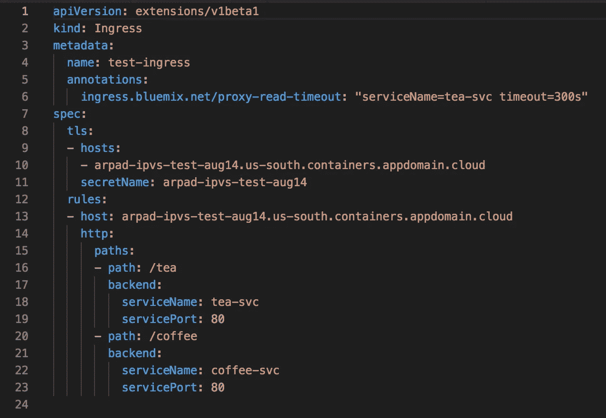

# IBM Cloud Kubernetes 服务入口/ALB 备忘单#1 基础知识

> 原文：<https://levelup.gitconnected.com/ibm-cloud-kubernetes-service-ingress-alb-cheat-sheet-1-basics-4fbc1c86b886>

你正在寻找一个易于使用和管理的 Kubernetes 服务吗？[注册](https://console.bluemix.net/registration/premium?)并[立即启动您的 Kubernetes 集群](https://console.bluemix.net/registration/premium?)。启动并运行后，您将在此处看到您的集群，您已被引导完成安装`ibmcloud` CLI 和`kubectl` CLI 的步骤。

让我们深入到 IKS 入口控制器或 ALB 的细节。*(不好意思，中号最大片段宽度很窄):(*

# 获取入口主机名

让我们假设我的集群名是`arpad-ipvs-test-aug14`。

```
$ ibmcloud ks cluster-get arpad-ipvs-test-aug14 |grep Ingress
```


# 查询 ALBs

我有一个多区域设置，在多个区域中有多个 ALB，这对于查看哪个 ALB 正在监听**哪个 IP** 地址上的**非常方便:**

```
$ ibmcloud ks albs --cluster arpad-ipvs-test-aug14
```


注意:您也可以有第三个区域，所有命令都适用，您将只有第三个 ALB 和第三个 IP。

# 检查 IKS ALB 日志

获取集群中 ALB pods 的 id:

```
$ kubectl get pods -n kube-system |grep alb
```

选择您想要检查日志的 ALB，并:

```
$ kubectl logs <ingress_pod_ID> nginx-ingress -n kube-system
```

# DNS 里有什么？

如果我有一个[多区域](https://console.bluemix.net/docs/containers/cs_regions.html#multizone)设置，我在多个区域中有多个 ALB 注册在同一个主机名下:

```
$ host arpad-ipvs-test-aug14.us-south.containers.appdomain.cloud
```


我还可以检查我的 Kubernetes Ingress 资源是如何配置的，以查看那里是否有任何问题:

```
$ kubectl get ingress -o wide
```


请注意那里的 IP 地址。更多详细信息，请参见 IKS 帮助文件。

# 获取按运行节点排序的 pod(在`kube-system`名称空间中)

```
$ kubectl get pods --namespace kube-system \
--sort-by=.spec.nodeName \
-o jsonpath='{range .items[*]}{.spec.nodeName}{"\t"}{.metadata.name}{"\n"}{end}'
```


仅获取 ALB pods:

```
$ kubectl get pods --namespace kube-system \
--sort-by=.spec.nodeName \
-o jsonpath='{range .items[*]}{.spec.nodeName}{"\t"}{.metadata.name}{"\n"}{end}' |grep alb
```


# 处理`edge`节点

你可以在这里找到关于如何创建边节点的文档。

获取边缘节点:

```
$ kubectl get nodes -L publicVLAN,privateVLAN,dedicated
```

带`ibmcloud ks`(要求你有一个`edge`工人池):

```
$ ibmcloud ks workers <YOUR CLUSTER NAME> --worker-pool=edge \
--json | jq '.[] | {edgenode: .privateIP}'
```

查找 ALB 的节点选择器:

```
$ kubectl get pods --namespace kube-system \
--sort-by=.spec.nodeName \
-o jsonpath='{range .items[*]}{.spec.nodeSelector}{"\t"}{.metadata.name}{"\n"}{end}' | grep alb
```


# 如何测试运行状况检查是否成功？

注意:此健康检查支持仅适用于具有最新域的入口子域的集群:**containers . appdomain . cloud**。

如果您的集群仍在使用 containers.mybluemix.net 的*，您可以订购一个新的集群以获得最新的子域，或者将您现有的单个 AZ 集群转换为 MZR(多区域区域)集群，在这种情况下，除了现有的 containers.mybluemix.net，您还将获得包含 containers.appdomain.cloud 域的子域。[公文在此](https://console.bluemix.net/docs/containers/cs_troubleshoot_debug_ingress.html#ping)。*

```
*$ curl -X GET [http://169.46.52.222/](http://169.46.52.222/) -H \
"Host: albhealth.arpad-ipvs-test-aug14.us-south.containers.appdomain.cloud"*
```

**

*注意:我使用的是 HTTP 和“albhealth…”主持人来做检查。该主机在 IKS ALB 中配置为响应“正常”。*

*我可以对后续 IP 运行相同的命令:*

```
*$ curl -X GET [http://169.62.196.238/](http://169.46.52.222/) -H \
"Host: albhealth.arpad-ipvs-test-aug14.us-south.containers.appdomain.cloud"*
```

**

# *如何检查 ingress 资源是否已经成功应用到 ALB？*

*假设我想将下面的入口 yaml 应用到我的集群。*

**

*将 yaml ( `kubectl apply -f <yaml name>`)应用到集群以创建入口资源。在应用了 yaml 并创建了入口资源之后，有一种简单的方法可以验证资源是否被 albs 成功处理，注释格式中是否有任何错误。这可以通过检查入口资源上的事件来完成。*

```
*$ kubectl describe ing test-ingress*
```

**

# *检查错误*

*[处理](https://console.bluemix.net/docs/containers/cs_troubleshoot_debug_ingress.html#errors)资源和注释时的任何错误也会显示在事件中。例如，如果我用错误的注释格式应用这个入口资源 yaml:*

**

*描述入口将显示错误:*

```
*$ kubectl describe ing test-ingress*
```

**

# *测试客户工作负载(我想公开我的应用程序)*

*如果我想对一台 HTTPS 主机运行测试，比如我在所选 ALB 上的应用程序工作负载，我必须向`curl`指定要解析到的主机名，以便它在 TLS 握手期间将正确的主机作为 SNI 报头发布(以获取正确的证书):*

```
*curl -X GET --resolve my-app.arpad-ipvs-test-aug14.us-south.containers.appdomain.cloud:443:169.46.52.222 \
[https://my-app.arpad-ipvs-test-aug14.us-south.containers.appdomain.cloud/](https://my-app.arpad-ipvs-test-aug14.us-south.containers.appdomain.cloud/)*
```

**

*这是今天，将跟进一些额外的命令和欺骗。:)*

*干杯！:)*

*更多有用文章:
- [IKS ALB/Ingress 控制器超时，Websocket 连接掉线](https://medium.com/@ArpadKun/iks-alb-ingress-controller-timeouts-dropped-websocket-connections-ibm-iks-cheat-sheet-3-f82da6a8aeec)
- [如何隔离、维护和调试 ALB/Ingress 控制器](https://medium.com/@ArpadKun/how-can-i-isolate-do-maintenance-and-debug-an-alb-ingress-controller-ibm-iks-cheat-sheet-2-29dab86b9c7d)*