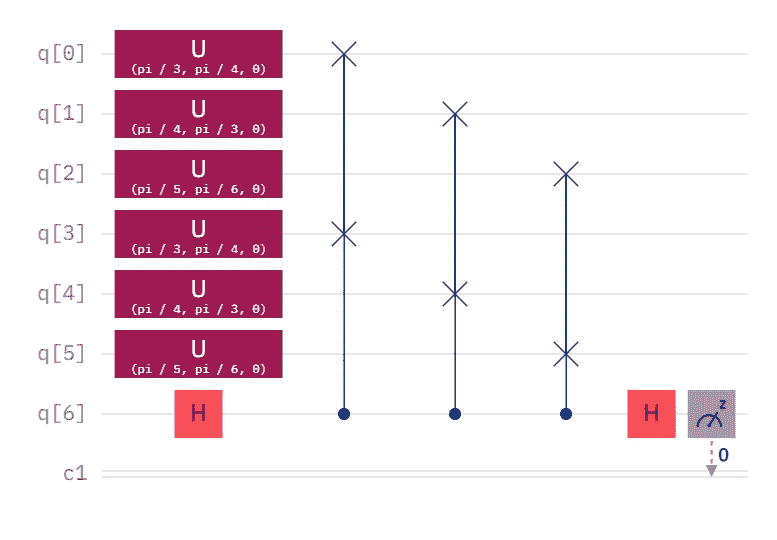
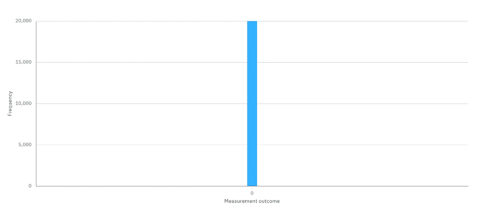
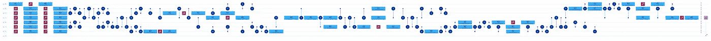
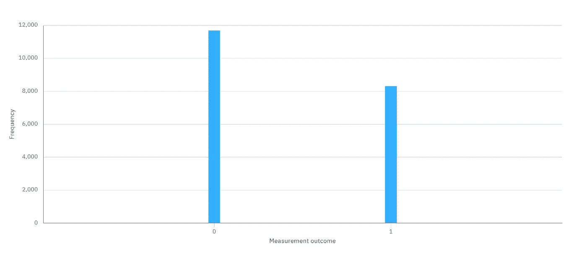
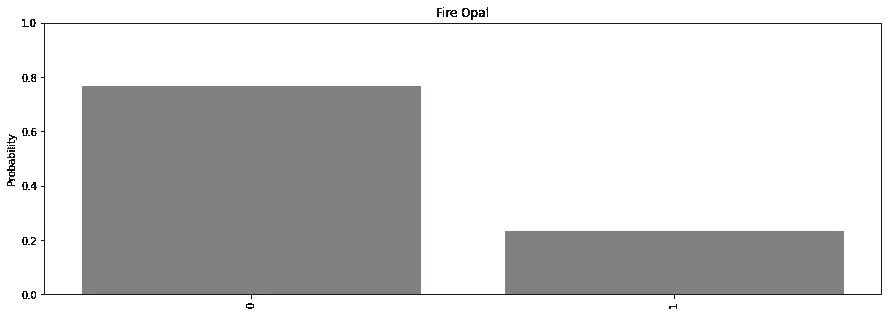
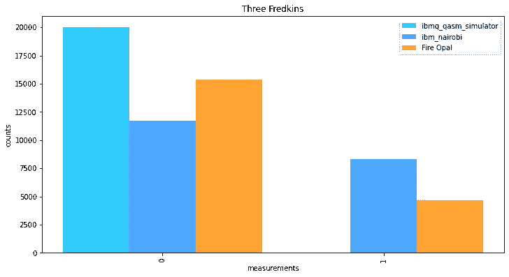

# ibm_nairobi 对 Fire Opal

> 原文：<https://levelup.gitconnected.com/ibm-nairobi-vs-fire-opal-965f95800c6d>

[https://pix abay . com/photos/achieve-woman-girl-jumping-running-1822503/](https://pixabay.com/photos/achieve-woman-girl-jumping-running-1822503/)

# 火蛋白石似乎在挑战中茁壮成长。

在我最近的一篇文章《 [ibmq_belem vs. Fire Opal](https://bsiegelwax.medium.com/ibmq-belem-vs-fire-opal-84683f8f91f2) 》中，我在 5 量子位、16 [量子体积(QV)](https://medium.com/@bsiegelwax/quantum-volume-in-action-27e1d0daca45) 的 ibmq_belem 上测试了一个非常嘈杂的电路，包括没有和有 [Q-CTRL](https://q-ctrl.com/) 的 [Fire Opal](https://q-ctrl.com/fire-opal) 。噪声的来源主要是两个受控交换(又名 Fredkin)门，每个门[转换成大量的单量子位和多量子位操作，因此增加了相当多的电路深度。火蛋白石将正确结果从 72%提高到 81%，但这是火蛋白石的极限吗？那是它能做的最好的吗？](https://medium.com/gitconnected/what-is-transpilation-4d12d51e2aa4)

蒸发前的电路

## 原电路

这个电路在概念上类似于 ibmq_belem 电路，只是我们现在比较的是两个相同的 3 量子比特量子态，而不是两个相同的 2 量子比特量子态。这意味着我们需要第三个弗雷德金门，它比上次增加了更多的门，更深，甚至更多的噪声。

使用 ibmq_qasm_simulator 的结果

## 模拟器

值得信赖的模拟器仍然毫不费力地显示出正确的结果。用[交换测试](https://medium.com/gitconnected/comparing-quantum-states-c6445e1e46fd)以 100%的概率测量 0，意味着我们有两个相同的 n 量子比特量子态，这是真的。

蒸发后的相同电路

## 传输电路

正如我们所料，这次的[赛道比上一次更深、更吵、更乱。](/what-is-transpilation-4d12d51e2aa4)

ibm 内罗毕的结果

## 不带火蛋白石

来自 ibm_nairobi 的计数是 11，691 个零和 8，309 个一，零比率为 58.455%。用[交换测试](https://medium.com/gitconnected/comparing-quantum-states-c6445e1e46fd)测量零有 50%的概率意味着量子态是极性相反的，所以这太可怕了。而且值得注意的是，不出所料，这次的结果比上一次更差。

使用火蛋白石的结果

## 用火蛋白石

火蛋白石的计数为 15，346 个零和 4，654 个一，零比率为 76.73%。虽然这与应有的 100%相差甚远，但我不禁注意到，与不使用 Fire Opal 相比，大约有 18%的提升(或 31%，取决于您如何计算)。上一次的提振只有 9%(或 12.5%，用同样的交替计算)。

再次并排比较(这样你就不用向上滚动了)

## 结论

只要我们在 T1 限制内，火蛋白石在压力下似乎表现得更好。但是，这只是两个实验。如果火猫眼石如此喜欢压力，让我们看看下次我们能向它扔什么…

# 火蛋白石系列:

*   [ibmq_belem vs. Fire Opal](https://bsiegelwax.medium.com/ibmq-belem-vs-fire-opal-84683f8f91f2)
*   [回顾:Q-CTRL 火猫眼石](https://bsiegelwax.medium.com/review-q-ctrl-fire-opal-6bcc187ae1bd)
*   [量子切片面包](https://bsiegelwax.medium.com/quantum-sliced-bread-bd3dd048f)
*   [我从火蛋白石中学到了什么…](https://bsiegelwax.medium.com/what-i-learned-from-fire-opal-50608282972b)
*   [Q-CTRL 的火猫眼石很牛逼](/fire-opal-is-awesome-c642347ec89d)