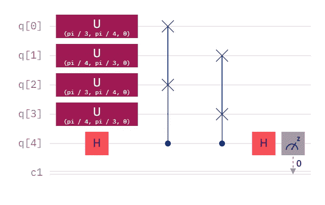
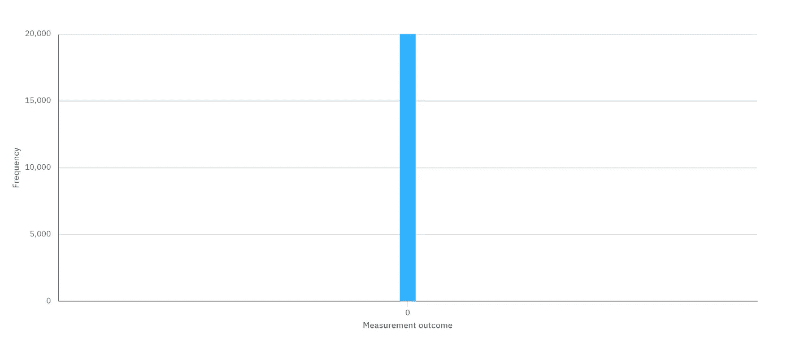
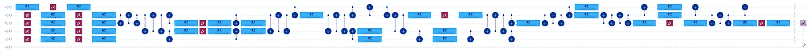
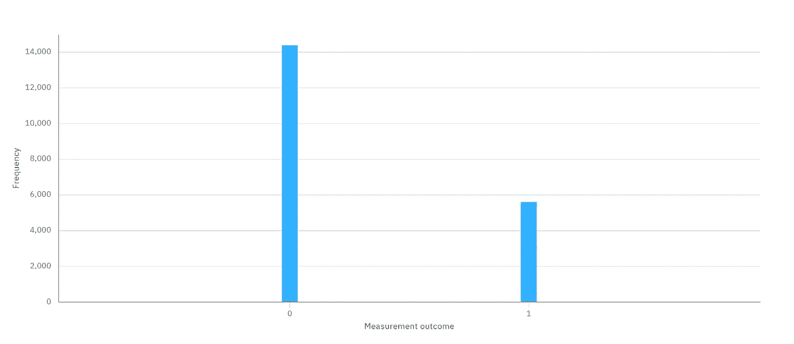
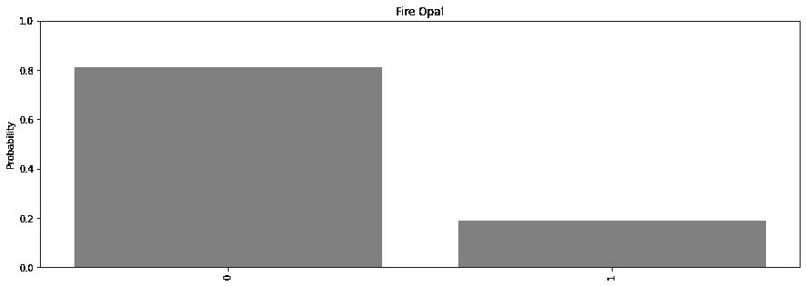

# ibmq_belem vs. Fire Opal

> 原文：<https://levelup.gitconnected.com/ibmq-belem-vs-fire-opal-84683f8f91f2>

[https://pix abay . com/photos/industrial-security-logistics-1636380/](https://pixabay.com/photos/industrial-security-logistic-1636380/)

# "清除量子位 0、1、2、3 和 4 . "

本文是展示我发给 Q-CTRL 的 Fire Opal 预测试版电路的系列文章中的第一篇。为了看看火蛋白石到底能做什么，我发了一些当时我的作曲中最嘈杂的电路。火蛋白石真的能从这些噪音中提取有用的结果吗？让我们自己看看，好吗？

蒸发前的电路

## 原电路

原始电路包括两个相同的 2 量子位量子态。因为状态是相同的，所以接下来的[交换测试](https://medium.com/gitconnected/comparing-quantum-states-c6445e1e46fd)应该以 100%的概率测得 0。

使用 ibmq_qasm_simulator 的结果

## 模拟器

在模拟器上，这正是所发生的。以 100%的概率测量 0，意味着我们有相同的 n 个量子比特的量子态。

蒸发后的相同电路

## 传输电路

但是，现在看看这个烂摊子。Hadamard、U 和受控交换(又名 Fredkin)门实际上并不存在。它们需要首先被[传送](https://medium.com/gitconnected/what-is-transpilation-4d12d51e2aa4)到几个可以在实际硬件上执行的基本门中。正如你所看到的，Fredkin gates 为量子电路增加了相当大的深度，也增加了太多喜欢出错的量子电路。这就是为什么我把这个电路发送到 Q-CTRL；真是一团糟。

使用 ibmq_belem 的结果

## 不带火蛋白石

来自 ibmq_belem 的测量值是 14，387 个零和 5，613 个一，即零比率为 71.935%。这太糟糕了。最坏的结果是 50%，这表明量子态是极性相反的。因此，ibmq_belem 结果表明，量子状态不相似多于相似，即使它们是相同的。

使用火蛋白石的结果

## 用火蛋白石

来自 ibmq_belem 的测量值是 16，239 个零和 3，761 个一，即零比率为 81.195%。虽然这还远远不是一个完美的结果，但它至少表明量子态更相似而不是不相似。

## 结论

ibmq_belem 的[量子体积(QV)](https://medium.com/@bsiegelwax/quantum-volume-in-action-27e1d0daca45) 只有 16，我扔给它一个非常嘈杂的电路。尽管我恶作剧，但是，火蛋白石仍然能够提取一个明显更好的结果。想象一下，当你没有故意发送噪声时，火蛋白石会对你的电路产生什么影响。

# 火蛋白石系列:

*   [回顾:Q-CTRL 火蛋白石](https://bsiegelwax.medium.com/review-q-ctrl-fire-opal-6bcc187ae1bd)
*   [量子切片面包](https://bsiegelwax.medium.com/quantum-sliced-bread-bd3dd048f)
*   [我从火蛋白石中学到了什么…](https://bsiegelwax.medium.com/what-i-learned-from-fire-opal-50608282972b)
*   [Q-CTRL 的火猫眼石很牛逼](/fire-opal-is-awesome-c642347ec89d)