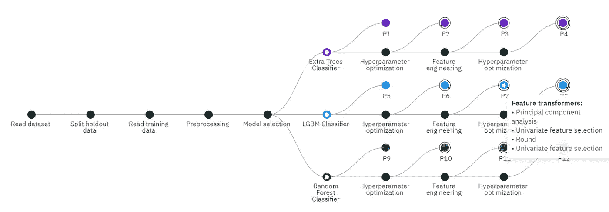
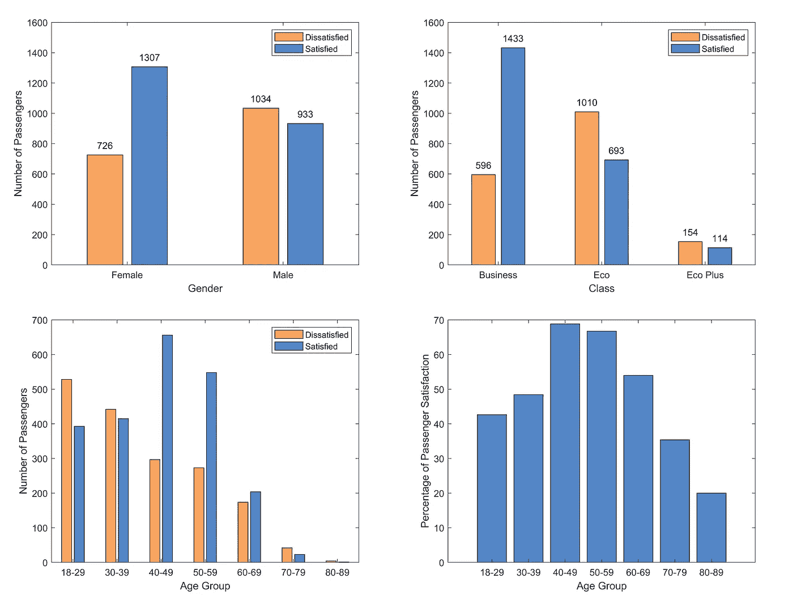
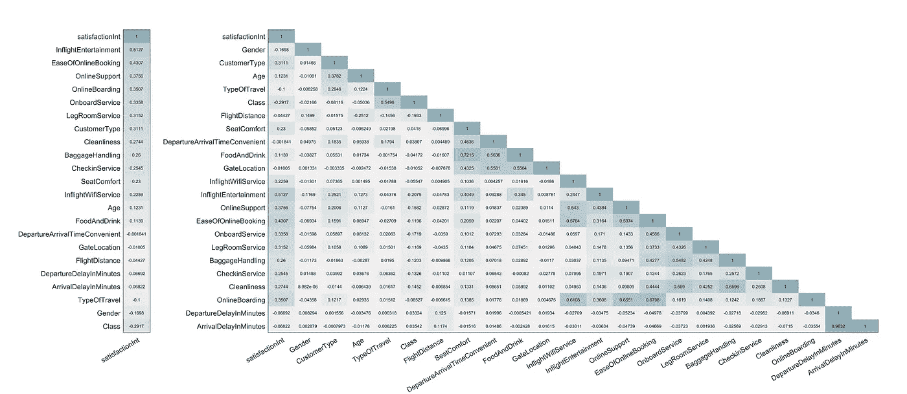
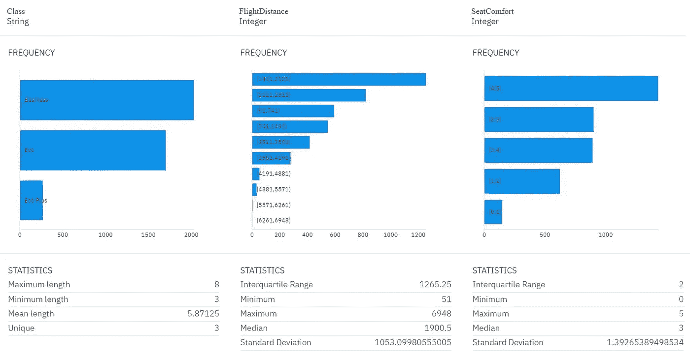
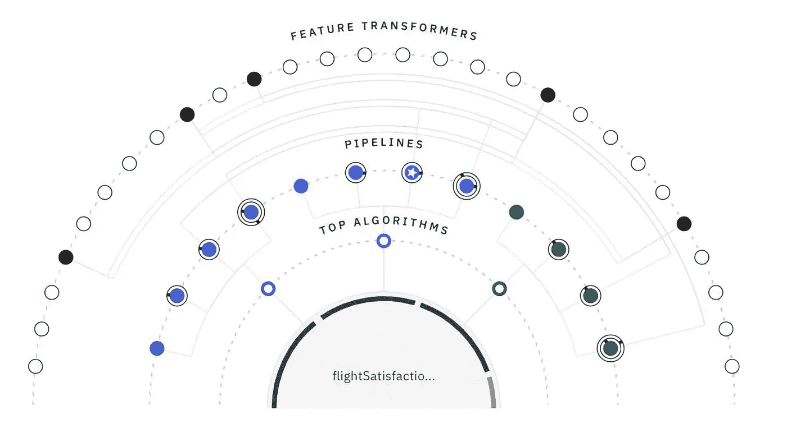
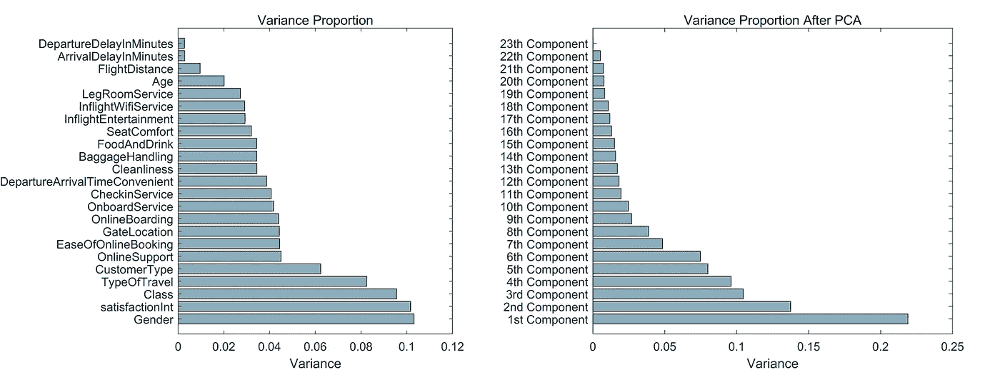
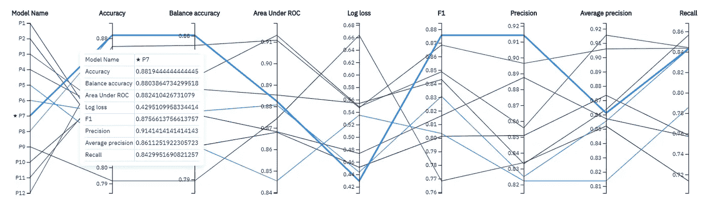
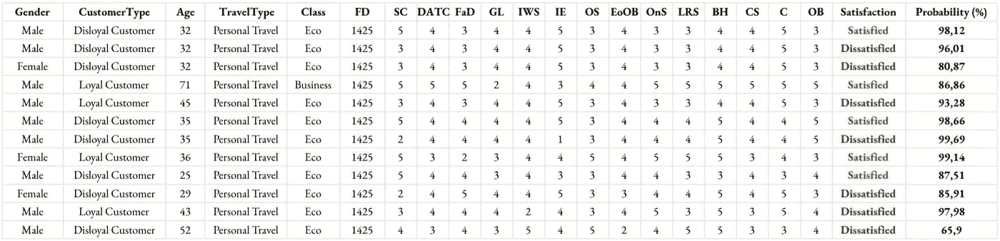
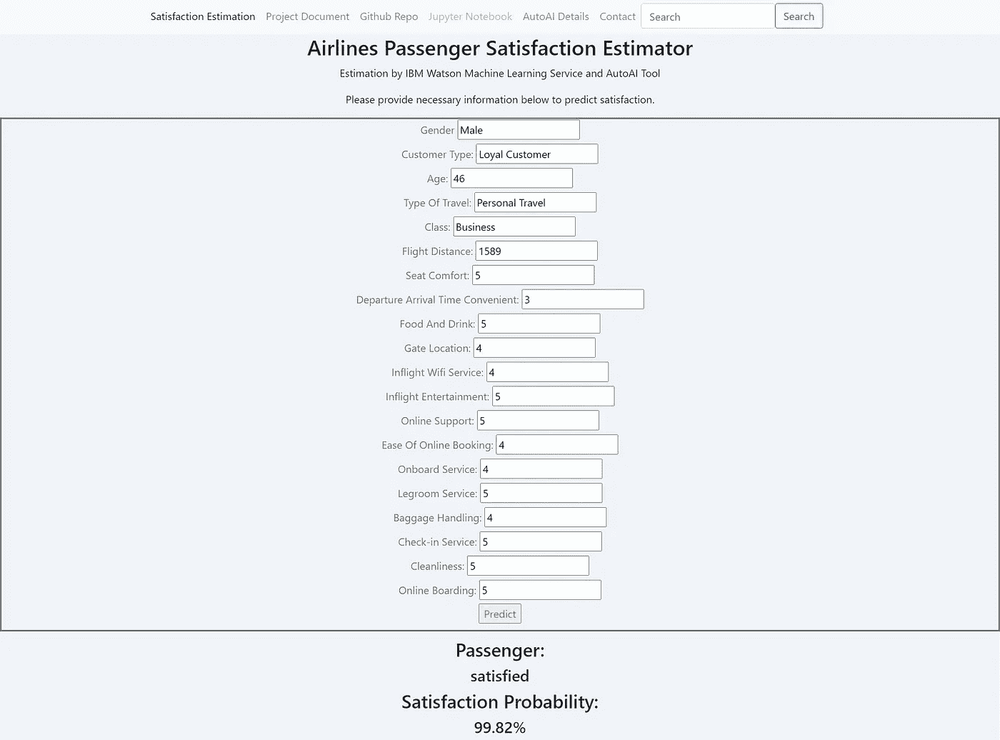

# IBM 的 AutoAI 工具和人工智能的未来

> 原文：<https://levelup.gitconnected.com/ibms-autoai-tool-and-the-future-of-artificial-intelligence-88b3f8b39b4e>

## 人工智能

## 利用 AutoAI 的强大功能和 IBM Watson Studio 的强大功能，通过智能、数据驱动的自动化创建和部署强大的人工智能模型，无需编写任何代码


弗兰基·查马基在 [Unsplash](https://unsplash.com?utm_source=medium&utm_medium=referral) 上拍摄的照片

人工智能已经成为一个热门话题很多年了，而且可能会持续很多年，因为它有很大的潜力，有很多希望。实现、工作流、概念以及它们的算法复杂性每天都在呈指数增长。然而，它吸引了更多的人要求将人工智能集成和部署到他们的业务和未来工作中，通常没有理解潜在的限制和挑战。

人工智能的突出局限性是，它总是需要数据科学方面的专业技术技能以及特定领域知识和洞察力的基础。由于这个原因，目前在当今的工业和商业中，专家数据科学家严重短缺。

## 自动化人工智能

按照 [Gartner](https://www.gartner.com/en/documents/3956825/how-augmented-machine-learning-is-democratizing-data-sci) 的说法:

> ***到 2025 年，
> 50%的数据科学家活动将由人工智能自动化，
> 缓解严重的人才短缺。***

自动化人工智能基本上是通过去除人工指导来自动化人工智能生命周期管理的过程。它使开发的人工智能模型更加值得信赖和强大，同时使公民数据科学家可以访问和使用它，提高生产力，加速学术研究，并为工业和商业领域的人工智能开发提供支持。在过去的十年中，出现了各种各样的旨在将 ML 过程自动化到各个阶段的最先进的工具和算法。考虑到积累的大量数据和相对少量的专家数据科学家，并且知道自动化的 ML 框架已经在几个 ML 任务中胜过人类数据科学家，特别是对于真实世界的数据，可以说 ML 在工业中的未来是通过人工智能的自动化实现的。

## **IBM 的 AutoAI**

IBM 屡获殊荣的 AutoAI 工具以数据驱动的方式自动化了预测性机器学习过程的生命周期管理，包括核心过程和附加程序，而在传统的 ML 中，需要一名人类专家在循环中监督模型训练、超参数优化和特征工程的每个单独步骤。

AutoAI 原型的工作流程可以分为几个主要步骤:数据准备、模型选择、超参数优化、特征工程。



自动显示工具-进度图

没有必要在这里用视觉和视频填充，因为互联网上有很多 AutoAI 工具的教程内容。其中一些将作为链接添加到最后的**有用网站**部分。

以下是基本的逐步使用指南:

## AutoAI 工具分步指南

*   [**在 IBM Cloud**](https://cloud.ibm.com/registration) **上创建一个免费账户，如果你还没有的话。你将需要两个服务和一个存储对象:Watson Studio、Watson 机器学习和一个云对象存储。**

1.  **创建 IBM Watson Studio 服务。**选择一个地区和一个定价方案。lite 计划是一个免费选项，每月提供 50 CUH(容量单位小时)。然而，其他计划也是合理的。
2.  **在 IBM Watson Studio 中创建新的空项目。**输入项目的名称和描述。创建一个对象存储(创建后可能需要刷新页面)并在右侧选择它。
3.  **上传数据集**。单击“添加到项目”按钮，并选择“数据”资产类型来上传您自己的数据集。浏览或删除要上传的文件。
4.  **将 AutoAI 实验添加到项目中。**再次点击添加到项目按钮并选择 AutoAI 实验。这里，需要关联 Watson 机器学习服务实例。点击“关联机器学习服务实例”,并按照步骤进行关联。
5.  **添加数据源到 AutoAI 实验。**只需点击“从项目中选择”按钮，然后选择您的数据集。
6.  **配置实验。**选择预测列。该工具会自动推荐预测类型和优化指标。但是，您可以在**实验设置**选项卡上进行配置。如果您已经知道某个算法的性能更好或更差，那么可以选择要测试的算法。您可以确定要使用的算法的最大数量。该工具将为每个算法提供 4 个管道，按三倍交叉验证分数排序。您可以按照所需的比率将数据分为定型部分和维持部分，默认值为 90/10。完成配置步骤后，您可以保存设置并运行实验。
7.  **等待结果。**等待所有管线生成。同时可以观察进度和检查生成的管道。
8.  **保存结果。**管道按指标分数降序排列。您可以**保存一个模型**或**为任何管道生成一个笔记本**。
9.  **部署模型。**在模型中，只需点击 Deployments 选项卡，选择 **Add Deployment** 并定义部署细节。一旦模型被部署为 web 服务，您就可以用您的数据来测试它。

# **对我们数据集的一些见解**

我们将使用 Kaggle 上的[航空公司客户满意度数据集的缩减采样版本作为我们的数据集，使用反馈特征和描述乘客和航班的一些其他信息来预测乘客的满意度。我们还将尝试检测具有高重要性的特征，以便我们可以提供有用的、有见地的信息和建议。](https://www.kaggle.com/sjleshrac/airlines-customer-satisfaction)

我们进行了编码，消除了一些观察值，并进行下采样，以便能够快速处理所有增强，并在更短的时间内训练估计器。在我们的案例中，目标/响应变量是**满意度**特征。

快速浏览一下数据集，我们可以得出以下结论:

*   满意度随着课程从商业到生态而下降，
*   男性乘客更倾向于对他们的航班不满意，
*   年轻和年长的乘客更容易不满意。



乘客满意度统计

为了能够理解特征对之间的潜在关系，我们试图获得皮尔逊相关系数矩阵。



特征的皮尔逊相关系数矩阵

可以直观地预期，最强的相关性出现在**出发和到达延迟**的特征对之间。另一个很强的相关性是在**座位舒适度**和**食物和饮料**服务之间，这是可以理解的。也可以这么说，对网上订票**的便捷性印象深刻的乘客可能会对**在线支持**和**在线登机**给予更高的评价。**

请注意，**类**特征与反馈特征具有负的弱相关性。我们用序数编码器对**类**特征进行编码，使得**业务**具有较低的序数；而 **Eco** 的序号更高。这就解释了为什么不同的反馈和总体满意度与**类别**特征呈负相关。

# 数据准备

虽然 AutoAI 工具可以自动处理大部分必要的数据准备任务，但也可以通过 IBM Data Refinery 访问、清理、组织和可视化您的数据，IBM Data Refinery 是一个数据准备客户端，也是 Watson Data Platform 集成环境的一部分。它提供了可访问性、对脚本的支持以及一个强大的环境来轻松组织您的数据。在**资产**选项卡中，只需点击您的数据资产并选择**细化**。



数据提炼-特征统计

在这里，您可以获得配置文件，检查各种功能的汇总统计数据，获得丰富的见解，并使用 30 多种可视化方法可视化数据。您可以将图表保存为图像，将详细信息保存为 JSON。

## AutoAI 处理常见数据准备任务的方法

如前所述，AutoAI 以**数据驱动**的方式自动化了大部分数据准备任务，消除了对大量数据探索的需求。其中一些任务是处理丢失的数据、删除不必要或不相关的信息、编码、缩放、标准化等。

## 缺失数据

自动分析的方法依赖于缺失数据点的特征。如果缺少的值在响应/目标变量中,“自动转换”工具的默认行为是完全删除该行。

但是，如果缺失值在其他要素中，而不是在预测变量中，AutoAI 将根据缺失数据点的数据类型为其指定新值。该工具估算:

*   如果变量是分类的，
*   如果变量是数字，则为中值。

这些行为是默认的，但是**可以通过生成的笔记本**进行更改。例如，中值插补可以调整为平均值插补，这将为缺失的数据点分配平均值。然而，如果特征集中存在大量异常值，均值插补可能会产生一些关于准确性的问题，因为一些统计测量值(在这种情况下为均值)可能容易出现异常值。

这是分类和数字插补的代码，显示在笔记本上。**因为笔记本是自动生成的，所以不需要编写** **。**

```
from autoai_libs.transformers.exportable import NumImputer
from autoai_libs.transformers.exportable import CatImputercat_imputer = CatImputer(
    strategy="most_frequent",
    missing_values=float("nan"),
    sklearn_version_family="23",
num_imputer = NumImputer(
    strategy="median",
    missing_values=float("nan"))
```

## **不必要的功能**

如果特征没有为模型提供有用或相关的信息，AutoAI 的默认行为是自动放弃它。例如，对于所有观测值都有一个常量值的特征，或者对于所有观测值(时间变量除外)都有唯一值的另一个特征，对于估计器来说并不真正有用。因此，AutoAI 工具会丢弃它们。

## 编码

在开始学习过程之前，AutoAI 工具将分类变量编码为有序整数。换句话说，它将分类值表示为数字值以进行处理。该操作会为数据集中的每个分类要素生成一个列向量，而自动分析工具会使用这些向量。

一键编码(one-of-Key)是序数编码的替代方法，它将分类特征编码为一个一键数字数组。为每个类别创建一个二进制列，并最终构建一个稀疏矩阵或密集阵列来表示分类特征。

```
from autoai_libs.transformers.exportable import CatEncoder
cat_encoder = CatEncoder(
    encoding="ordinal", # "onehot", "onehot-dense", "ordinal"
    categories="auto",
    dtype=np.float64,
    handle_unknown="error",
    sklearn_version_family="23")
```

## 缩放比例

对于数字要素，AutoAI 默认情况下不会缩放数据，因为根据要素本身和算法，可能不需要缩放。然而，用户可以通过笔记本改变这一点。

```
from autoai_libs.transformers.exportable import CatEncoder
opt_standard_scaler = OptStandardScaler(
    num_scaler_copy=None,
    num_scaler_with_mean=None,
    num_scaler_with_std=None,
    use_scaler_flag=False)
```

# 型号选择

一旦原型制作开始，AutoAI tool 会尝试选择和使用对特性和集合可能最好的估计器。但是，真的有可能知道哪种模型在所选指标方面会产生最佳性能吗？

有许多因素会直接影响模型的选择。这些因素包括估计值的预期最终精度、数据类型、要素和观测值的数量、训练数据所需的时间以及预测结果所需的时间。人们可以使用整套设备尝试所有模型，并对输出测量值进行排序。但是就所有资源而言，这将是极其昂贵的。

AutoAI 有一个更好的模型选择方法。数据集的相对较小的子集可用于为所有模型提供信息。一旦训练好模型，AutoAI 工具就会评估估计器的预测精度。在这些评估过程之后，更多的数据被分配给看起来表现良好的模型。回归线斜率最大的模型预计会比其竞争对手表现更好，并被分配更多数据。

所以，这很类似于**多兵种土匪策略**用 K 兵种进行资源分配。k 是要测试的算法的数量，这导致对未知分布的精确度的测量。AutoAI 工具使用使用上限(涂抹)模型选择方法的[数据分配，并通过分配小的子集/批次逐步尝试探索所选模型的准确性测量，并通过将更多数据分配给性能更好的模型来尝试利用。](https://arxiv.org/abs/1601.00024)

**可用的分类算法:**

决策树分类器、额外树分类器、梯度提升树分类器、LGBM 分类器、逻辑回归、随机森林分类器、XGB 分类器

**可用的回归算法:** 决策树回归、额外树回归、梯度推进回归、LGBM 回归、岭回归、XGB 回归



自动工具-管道关系图

## 管道和管道增强

管道数量取决于两个参数:

*   **num_fold:** 用于训练管道的数据集子集的数量，
*   **最大数量涂抹集合:**所选算法的最大数量。

AutoAI 工具试图通过优化超参数和执行特征变换来提高模型精度和效率。这就是默认情况下每个算法产生 4 个管道的原因:

*   具有默认 sklearn 参数的流水线，
*   具有优化的超参数的流水线，
*   一种具有优化特征工程的流水线，
*   为新功能优化超参数的流水线。

这些增强肯定会对模型性能产生积极的影响。

# AutoAI 的超参数优化方法

一般来说，超参数优化(HPO)需要技术技能和经验。然而，AutoAI 有一个自动化的方法，能够确定学习的最佳设置和超参数设置。

知道没有解析形式可以描述输入超参数设置和输出模型性能之间的关系，明智的做法是将函数视为**黑盒**，将优化视为**黑盒优化**。黑盒优化方法，也称为无导数优化，与基于梯度的算法有很大不同，当这些基于梯度的方法以某种方式失败时，可以用来搜索全局最优。

AutoAI 使用 [**RBFOpt 算法**](https://link.springer.com/article/10.1007/s12532-018-0144-7) ，该算法被设计为通过拟合径向基函数来解决这种问题，以获得模拟黑盒行为的代理模型，并最终改进对超参数设置的发现，该超参数设置更有效地产生期望的性能。

虽然自动超参数优化方法通常对过度拟合敏感，但 AutoAI 工具的方法似乎工作良好。以下是我们优化的一些超参数，也在笔记本中有所体现:

```
xgb_classifier = XGBClassifier(
    gamma=0.9051845172617085,
    learning_rate=0.05762372736194192,
    max_depth=6,
    min_child_weight=2,
    random_state=33,
    reg_alpha=0.9938530102900923,
    silent=True,
    subsample=0.98390741475658,
    verbosity=0,
    tree_method="hist")
```

# AutoAI 的特征工程方法

特征工程是通过转换从现有数据中获得新特征的过程。它是高度迭代的，相当耗时，并且总是需要专业领域知识和广泛的数据探索。AutoAI tool 使用一种**数据驱动的**方法，通过对数据实施转换和转换组合来获得对模型性能有很大贡献的最佳特征。

在自动机器学习中有两种主要的特征工程方法。一种是**扩展-缩减方法**，其中通过应用一组变换将集合扩展为具有更多数量的特征，另一种是**进化中心方法**，其中算法迭代地产生新的特征，以避免同时生成的算法复杂性。

AutoAI 工具使用一种以进化为中心的方法， [**认知算法**](https://researcher.watson.ibm.com/researcher/view_group.php?id=7500) 来提供最好的特征集。它使用强化学习来搜索能够最大化模型性能和准确性的新特征。在 Cognito 算法中，原始集(根)和新集由节点表示。每个新节点都是通过变换获得的，并产生一个精度度量。转换的组合可以被认为是从根开始的一个分支，因为它是一个层次化的操作。

AutoAI 中的转换大多是数学函数或统计运算。它们可以是:

*   一元无状态(TA1)、
*   基于一元状态(TB1)，
*   二进制无状态(TA2)，
*   基于二进制状态(TB2)，
*   数据级转换(TAM)。

其中一些变换是对数、平方根、乘积、双曲正切、特征聚集、隔离森林、主成分分析和**等等**。

让我们快速浏览一下主成分分析(PCA)的一个例子。PCA 基本上是一种降维方法，其中坐标系被重新排列以用较少数量的特征覆盖更多的变化，同时最小化重新排列的投影误差。在机器学习方面，它有助于降低估计器的复杂性，消除冗余维度。



PCA 前后数据集的方差比例

下面是笔记本主成分分析自动生成的代码:

```
tam = TAM(
    tans_class=PCA(),
    name="pca",
    col_names=[
        "Gender",
        "CustomerType",
        ...
        "OnlineBoarding"],
    col_dtypes=[
        np.dtype("float32"),
        np.dtype("float32"),
        ...
        np.dtype("float32")])
```

请记住，转换类型直接影响小说列的数量；因此，数据集的大小。

# 下一步是什么？

> **AutoAI 自动完成上述所有流程。**

启动实验后，在实验结束前，你不需要做任何事情。我们已经训练了估算者，成功地完成了 AutoAI 实验，现在呢？

**检查管线**

单击实验摘要中的任何管道。您可以检查模型评估方法、混淆矩阵、精确召回曲线、模型细节、新颖特征和特征重要性。也可以比较不同的管道。



AutoAI 工具-管道比较

**拿笔记本**

只需选择**另存为笔记本**即可通过编程方式与管道进行交互。笔记本应该在项目的**资产**选项卡中。你可以检查，调整，下载和分享它。**谨防 API 密匙。**

**部署和测试端点**

将管道保存为模型，并单击**提升到部署空间**按钮。如果您没有部署空间，只需点击**创建一个**，指定名称和描述，选择您的存储和机器学习服务并创建它。部署类型可以是**在线**实时运行模型，**批处理**用于批处理或作为实时流预测。

回到您的仪表板，并转到**部署**选项卡。选择并输入您最近部署的型号。你可以看到 Java、Javascript、Python、cURL 和 Scala 的 API 参考、端点和代码片段。您可以使用 API 以编程方式测试模型，或者通过逐个输入值或提供 JSON 对象以交互方式测试模型。

**构建一个网络应用**

可以构建一个与 Watson 机器学习服务相关的 web 应用程序来为用户提供可访问性，以便他们可以使用您的估计器来计算自己的输入变量。简单地使用 **Flask** web 框架和 **Bootstrap** 作为用户界面来开发一个 web app。您将需要:

*   **API 键**
    转到[cloud.ibm.com](http://cloud.ibm.com)，点击**管理**，然后点击**访问(IAM)。**找到左边的 **API 键**标签，点击。在这里，您可以为您的应用程序创建一个新的 API 密钥。
*   **IAM 令牌**
    如果您是 Windows 用户，在 PowerShell 上执行以下命令应该会返回您的 IAM 访问令牌。

```
PS C:/> remove-item alias:curl
PS C:/> pip3 install curl
curl -X POST '[https://iam.cloud.ibm.com/oidc/token'](https://iam.cloud.ibm.com/oidc/token') -H 'Content-Type: application/x-www-form-urlencoded' -d 'grant_type=urn:ibm:params:oauth:grant-type:apikey&apikey=<YOUR_API_KEY>'
```

记得在**高级系统设置\环境变量\路径变量**中包含你的 Python 目录、脚本目录和库\bin 目录。否则，PowerShell 可能会抛出关于 **pip3** 的错误。

*   **到端点的直接链接**
    您可以在您部署的模型中的 **API 引用**选项卡中找到到端点的直接链接。

您可以查看**代码片段**部分来研究连接是如何建立的。

# 测试我们的模型

在我们的案例中，**管道 4** 拥有 HPO-1、FE 和 HPO-2 的所有三项增强功能，其表现优于其他管道。我们的顶级算法是 **XGBoost 分类器**，精度为 **0.927** ，训练时间仅为 **~4 分钟**。

为了测试它，我们假设创建不同的观察，代表同一航班中的几个乘客。

*   让我们考虑一个 32 岁的男性乘客。虽然他对食物和饮料服务以及在线支持有问题和抱怨，但他对自己的座位感到非常舒适，并享受机上娱乐选项。我们的人工智能模型告诉我们，这位乘客对他的航班满意的概率为 98.12%。
*   乘客有一个密友，就在他旁边。但不幸的是，他的座位有一面坏了，他认为这很令人不安。我们的人工智能模型告诉我们，这位乘客可能会对**96.01%**的概率**不满意**。



测试我们的模型

在我们的案例中，最重要的特征是:

*   **用 **0.495** 拧紧轴承**
*   **座椅舒适性**通过 **0.084**
*   **easeofoonline booking**通过 **0.059**
*   **通过 **0.05** 在线预订**
*   **客户通过 **0.04** 输入**
*   **用 **0.035** 检查运行中的**
*   **类**由 **0.03** 组成

因此，我们知道，当乘客的座位坏了时，提供更干净的环境或更好的在线服务不会真正有助于满足乘客。唯一能让他满意的是机上娱乐的特色。

尽管乘客喜欢所有其他的东西，并提供最高评级作为反馈，但座位舒适度和机上娱乐都可能引起不满。

因此，航空公司应该改善他们的娱乐服务、座位舒适度、在线预订和值机服务，以提高客户满意度。

# 构建 Web 应用程序

我们使用 Flask 开发了一个简单的 web 应用程序，允许用户输入自己的变量来使用 Watson 机器学习服务测试估计器。



乘客满意度预测的 Web 应用

在更广泛的情况下，可以从各种来源收集数据，例如航班延误和距离的计算机、乘客个人信息(性别、年龄等)的客户数据库。)和飞行后立即进行的电子调查。

# 结论

考虑到现实世界的问题和在行业中部署人工智能的需求，数据量和高技能数据科学家的数量有限，很明显**自动化人工智能**是传统机器学习的未来。IBM AutoAI 是对未来的巨大贡献，是数据科学家和公民数据科学家工具箱中的必备工具。我们从一开始就一直在谈论 AutoAI 及其功能。让我们回顾一下。IBM 的 AutoAI 工具能够:

*   自动化机器学习工作流程，机器学习的核心流程和附加程序，如数据角力、模型选择、超参数优化和特征工程，
*   使用不同的算法快速建立各种模型的原型，以比较性能指标，并使用设计良好的动态信息图表来表示它们，
*   让来自商业和工业的公民数据科学家和人工智能爱好者能够支持人工智能部署，
*   帮助公民数据科学家和分析师专注于领域相关问题，而不是重复、耗时的技术任务，这些任务通常占用项目的大部分时间。
*   以自动化数据驱动的方式产生用于预测真实世界数据的最佳可能的人工智能管道，
*   提供关于功能重要性的深刻信息，以回答现实世界中的问题。

## 有用的网站和来源

*   [在 IBM Cloud](https://cloud.ibm.com/registration) 上创建免费账户
    这里是注册的链接
*   [使用 autoai-lib for Python(Beta)](https://dataplatform.cloud.ibm.com/docs/content/wsj/analyze-data/autoai-lib-python.html)
    autoai-lib 库文档，在这里可以找到笔记本中体现的功能及其使用方法
*   [AutoAI 实现细节](https://www.ibm.com/support/producthub/icpdata/docs/content/SSQNUZ_latest/wsj/analyze-data/autoai-details.html)
    关于 AutoAI 特性的实现细节
*   Horea Porutiu 在 Youtube 上的三部分教程系列
    这一系列对学习特别有用，信息丰富
*   [使用 AutoAI](https://github.com/IBM/predict-insurance-charges-with-autoai)
    创建一个应用程序来预测您的保险费，AutoAI 是一个非常有用的 Github 存储库，在 Horea Porutiu 的视频系列中使用
*   [在 IBM Watson Studio 中自动构建模型](https://developer.ibm.com/technologies/data-science/tutorials/watson-studio-auto-ai/)
    这是另一个有大量视觉效果的培训，可以帮助你导航
*   [IBM Watson Studio 的机器学习快速原型制作](https://www.coursera.org/learn/ibm-rapid-prototyping-watson-studio-autoai)
    这里是 IBM 在 Coursera 上提供的一个完美的课程，供进一步学习