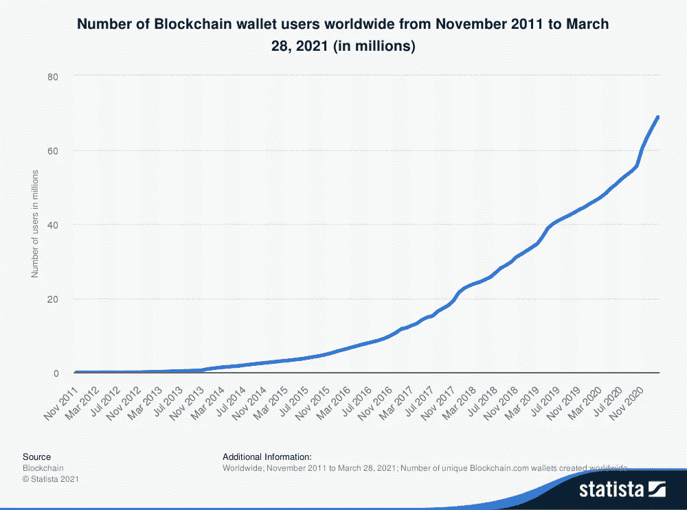

# 我希望比特币的价格大幅下降

> 原文：<https://levelup.gitconnected.com/id-love-for-the-price-of-bitcoin-to-drop-radically-9d99f7c6bf88>

## 但以下是我没有看到这种情况发生的七个原因

来源: [Pixabay](https://www.pexels.com/photo/ball-black-bubble-colorful-35016/)

我参加比特币派对迟到了。自从来到这里，我就决心享受剩下的美好时光。

我全神贯注地听那些不合时宜地提前到达的人。当其他人在我之后到达时，我已经享受了越来越多的兴奋，直到它达到了目前的手在空中的美好时光的高潮。

我在比特币自助餐厅如饥似渴地用餐，收集我能找到的每一点美味信息。我投资了我能负担得起的东西，同时对至少尝到了好东西而心存感激。

此时，我瘫在角落里，彩带随意地挂在我的脖子上，一顶派对帽摇摇欲坠地戴在我的头上——我的手臂保护性地缠绕着比特币酒杯，尽情地喝着。

这场派对仍在继续，尽管有些人呼吁它结束，但我认为这不会很快发生，甚至永远不会。

在这一点上，我将放弃聚会的比喻——写起来很累，可能读起来也很累。

当我第一次投资时，单个比特币的价格是 23，000 美元。在我持有这一小笔资金的第一周，它就涨到了 30，000 美元以上——我感觉自己像个投资天才，一边庆祝自己 30%的回报一边昂首阔步。

自那以后，价格不断攀升，达到 60，000 美元以上，目前徘徊在 50，000 美元关口。

每个价格都是象征性的，而且很大程度上是随意的。每一个新高都促使比特币制造者预测它会更高。与此同时，怀疑论者警告说，它即将崩溃的可能性现在更大了。

当我读到投资者和金融机构对比特币价格将达到 10 万美元、30 万美元甚至 100 万美元的猜测时，我嗤之以鼻，但也觉得可信。

私下里，我希望价格在牛市继续之前大幅下跌——主要是因为我想进一步投资，用我的钱获得更多比特币。不过，我怀疑这是否会发生。

不，我认为比特币派对注定会继续下去。

这可能只是我的确认偏见——想要确保我聪明、理智，不会因为相信比特币而受到丝毫欺骗。但这也是因为这些证据对我来说非常有说服力。

安妮·斯普拉特在 Unsplash 上的照片

# 金融机构也开始接受比特币

比特币最初的很大一部分用途是分散全球金融机构的权力，消除政府和传统金融机构对我们都在使用的货币体系的限制性控制。该行业的趋势表明，虽然比特币曾经是首席执行官们可以一笑置之的东西，但情况已经发生了变化。

无论这主要是因为这项技术已经证明了自己，还是因为银行和投资经理不得不屈服于希望将加密货币加入其投资组合的富裕客户的愿望，效果都是一样的。这巩固了比特币作为未来金融格局持久组成部分的地位。

## 1 —银行开始提供加密服务

2021 年 2 月，美国最古老的银行机构 [BNY 梅隆](https://www.wsj.com/articles/bitcoin-to-come-to-america-s-oldest-bank-bny-mellon-11613044810)宣布将代表其资产管理客户持有、转移和发行比特币。与此同时，加密货币合规公司 Elliptic 证实，许多其他银行正在寻求监管批准，准备提供[数字资产服务](https://www.telegraph.co.uk/technology/2021/02/17/banks-seek-advice-bitcoin-compliance-digital-coin-hits-record/)。

之前宣称对比特币和加密持怀疑态度的银行已经公开改变了立场，这表明或许比特币最终值得它们认真对待。JP 摩根就是一个很好的例子——该银行曾声称比特币是“一个骗局”，最近预测比特币的长期估值可能达到 146，000 美元[。](https://www.cnbc.com/2021/01/05/jpmorgan-bitcoin-price-could-rise-to-146k-as-it-competes-with-gold.html)

## 2-金融科技公司正在与区块链科技整合

继特斯拉将接受比特币支付新电动汽车的消息后， [PayPal 宣布](https://www.cnbc.com/2021/01/05/jpmorgan-bitcoin-price-could-rise-to-146k-as-it-competes-with-gold.html)他们将在未来几个月为全球 2900 万商家推出接受比特币支付的设施。

这一消息是在 Visa 宣布他们将试行使用以太坊区块链上的 stablecoins 进行交易结算的技术后不久发布的。这些举措正在创造一个交集，传统金融机构开始参与并融入区块链科技世界。[万事达卡也屈服了](https://www.mastercard.com/news/perspectives/2021/why-mastercard-is-bringing-crypto-onto-our-network/)，并引入技术允许一系列加密货币在其网络上交易。

这种结合在以前是不可想象的，但是趋势似乎正在改变。

## 投资基金的推出是为了迎合需求

今年 2 月，首只北美比特币基金成立。目的投资公司(Purpose Investment)的比特币基金在多伦多证券交易所上市，首日就募集了[4.218 亿美元的管理资产。](https://www.coindesk.com/canadas-first-bitcoin-etf-hits-421-8m-aum-in-two-days)

自那以后，富达投资公司、天桥资本、VanEck、WisdomTree 和摩根士丹利已经推出或正在申请推出比特币交易所交易基金。据报道，前比特币怀疑论者高盛(Goldman Sachs)也即将向他们的财富客户提供加密资产。

这些举措表明，以前一直持观望态度的公司现在看到了加密资产提供的优势，或者只是屈服于客户要求创造这种产品的压力。

来源:[推特](https://twitter.com/nlw/status/1377244959439478788?s=20)

# 比特币正在吸引投资者的兴趣

比特币似乎有可能持续下去的部分原因是越来越多的人参与其中。其中很大一部分是自我传播——投资的人越多，价格就越高，并吸引其他人也这样做。

## 4——机构正在将比特币添加到它们的资产负债表中

在首席执行官迈克尔·塞勒(Michael Saylor)的领导下，MicroStrategy [开始了一场运动](https://www.microstrategy.com/en/investor-relations/press/microstrategy-acquires-additional-19452-bitcoins-for-1-026-billion_02-24-2021),将公司的大部分资金投资于比特币。今年 2 月，[特斯拉购买了 15 亿美元的比特币](https://www.cnbc.com/2021/02/08/tesla-buys-1point5-billion-in-bitcoin.html)，由于价格上涨，特斯拉立即从持有的比特币中获利约 5 亿美元。 [Square too](https://decrypt.co/47061/public-companies-biggest-bitcoin-portfolios) 在其资产负债表上持有比特币。

关于下一个会是哪家公司——苹果——的猜测在网上很流行。甲骨文？知名大公司对比特币的投资越多，就越有助于巩固其作为一种注定会享有长期未来的资产的地位。

## 越来越多的个人投资者寻求参与其中

有助于评估持有比特币股份的个人投资者数量的一个指标是网络上存在的加密钱包地址的数量。

如下图所示，独特钱包的数量急剧增长，最近增长速度更快——现有超过 7000 万个钱包，尽管其中一些是所谓的“鲸鱼”,个人持有大量 BTC，但其中许多是私人投资者，他们持有的比特币只有很小一部分。

来源: [Statista](https://www.statista.com/statistics/647374/worldwide-blockchain-wallet-users/)

另一个衡量标准是最近主要加密货币交易所的比特币相对稀缺。2021 年 2 月的一份[报告显示](https://beincrypto.com/bitcoin-supply-in-exchange-wallets-reaches-2-5-year-low/)交易所中可获得的硬币数量处于 2.5 年来的最低点，这可以从下面的图片中清楚地看到:

来源:[推特](https://twitter.com/glassnode/status/1356372116850028545?s=20)

供求当然是王道，在需求充足的情况下，随着新卖家决定清算部分或全部库存，价格将继续上涨。

然而，这些例子表明，那些寻求出售的人的市场正在萎缩——比特币制造者似乎越来越倾向于购买和持有；考虑到今年价格的攀升，这并不奇怪。当价格继续攀升时，你为什么现在要卖出呢？

比特币的供应是有限的，是一种公认的投资资产(尽管政府似乎不得不将其贴上“投机”的标签)。待售硬币的供应正在减少，这表明需求在继续增长，最终可能会超过供应。无论如何，就比特币的未来价格而言，这都是一个积极的信号。

## 6-政府正在参与比特币和区块链

我之前分享了我对世界各地政府中有多少关键人物似乎对加密货币非常无知的看法。迈阿密市长弗朗西斯·苏亚雷斯却不是这样。

苏亚雷斯显然是比特币的信徒，除了试行用比特币支付城市雇员和市民使用比特币支付服务的计划外，他还分享了一项计划，最终将使用[比特币投资](https://www.forbes.com/sites/rogerhuang/2021/02/01/miamis-mayor-leads-the-charge-to-bring-bitcoin-to-americas-largest-cities/?sh=12138855c6c9)城市国库。

来源:[推特](https://twitter.com/FrancisSuarez/status/1377192570376355840?s=20)

怀俄明州和肯塔基州等州的政治领导人也将自己定位为支持比特币，并寻求将数字资产公司吸引到他们的州，这表明尽管美国联邦政府持怀疑态度，但他们不愿意被落在后面。

在我看来，越来越多的地方和国家政府可能会被鼓励效仿，这也将稳定比特币的价格和在我们未来世界的地位。

# 比特币还有很长的路要走

## 7-黄金等价物的市值仍然相对较低

当价格达到 53000 美元时，比特币的市值首次超过 1 万亿美元。

想想黄金(通常是比特币最常被引用的投资资产)的市值超过 10.5 万亿美元。没有真正的理由认为投资于黄金的钱应该决定最终有多少存储在比特币中。目前以黄金形式存在的资金也不一定会转移到比特币上。

但黄金的这种估值表明，作为一种投资资产和价值储存手段，比特币还有很大的潜力可挖。

有些人会指出黄金还有其他用途——比如珠宝和电子产品。但比特币也是如此，它是未来去中心化金融体系不可或缺的一部分。

许多怀疑者关注它作为传统交易方式(如 Visa 和 Mastercard)的替代物是无效的，但尽管如此，比特币仍有可能在未来用于交易处理。例如，它可以用于机构之间的大额交易，而不是消费者和商家之间的交易。

前面提到的比特币和其他加密货币以及区块链技术的出现，很好地说明了许多大型金融科技公司从中看到了潜力。

# 总结

在比特币派对上，我无疑迟到了。但正如对我最近一篇文章的评论所指出的，我仍然处于事物发展的相对早期。

有许多理由表明价格暴跌是应该的，许多人悲观地警告说，比特币是一个早就应该破裂的泡沫。但出于这篇文章中陈述的所有原因，我认为这种情况不会发生:

1——银行开始提供加密服务
2——金融科技公司正在与区块链科技整合
3——投资基金正在推出以满足需求
4——机构正在将比特币加入其资产负债表
5——越来越多的个人投资者正在寻求参与其中
6——政府正在参与比特币和区块链
7——比特币的市值仍然相对较低

考虑到这些因素，错过最初几年的比特币派对，我并不觉得太糟糕——我相信仍然会有很多乐趣。

如果你喜欢阅读这样的故事，并且愿意支持 Medium 上的作者，考虑注册成为 Medium 会员。一个月 5 美元，给你无限的故事。如果你注册使用我的链接，我会赚一小笔佣金。

 [## 阅读托比·黑兹伍德(以及媒体上成千上万的其他作家)的每一个故事

### 作为一个媒体会员，你的会员费的一部分会给你阅读的作家，你可以完全接触到每一个故事…

tobyhazlewood.medium.com](https://tobyhazlewood.medium.com/membership) 

注意:*本文仅供参考。不应将其视为财务或法律建议。在做任何重大财务决定之前，先咨询财务专家。*

# 如果你喜欢这篇文章，我希望你能加入我的邮件列表。