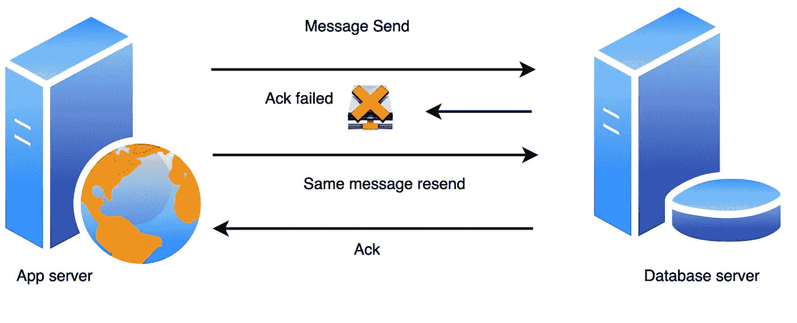

# 设计幂等 API

> 原文：<https://levelup.gitconnected.com/idempotency-in-api-design-bc4ea812a881>

网络故障！超时、中断和路由问题随时都会发生。它向我们提出了挑战，要求我们设计在处理故障和确保一致性方面健壮的 API 和客户机。

我们可以将我们的 API 和系统设计成*等幂*，这意味着它们可以被调用任意次，同时保证副作用只发生一次。让我们更深入地了解为什么引入幂等性是必要的，它是如何工作的，以及如何实现它。


[吕山德元](https://unsplash.com/@lysanderyuen?utm_source=medium&utm_medium=referral)在 [Unsplash](https://unsplash.com?utm_source=medium&utm_medium=referral) 上拍照

# 为什么幂等性在后端应用中至关重要？

考虑像 Instagram 这样的社交网站的设计，用户可以在那里与所有关注者分享帖子。让我们假设我们在两台不同的机器上托管应用服务器和数据库服务器，以获得更好的性能和可伸缩性。此外，我们使用 PostgreSQL 来存储数据。帖子和创建帖子将具有以下模型:

```
CREATE TABLE public.posts *(* id int(11)PRIMARY KEY,
   user_id int(11) REFERENCES users,
   image_id int(11) REFERENCES images NULL,
   content character varying*(*2048*)* COLLATE pg_catalog."default",
   create_timestamp timestamp with time zone NOT NULL DEFAULT CURRENT_TIMESTAMP
*)*;
```

## 失败和重试次数

如果我们将数据库放在与应用服务器不同的服务器上，有时会因为网络问题而导致发布失败。可能存在以下问题:

*   当应用服务器尝试连接到数据库服务器时，初始连接可能会失败。
*   当应用服务器正在完成操作时，调用可能会中途失败，从而使工作处于不稳定状态。
*   调用可能会成功，但是在数据库服务器能够告诉应用程序服务器之前，连接就中断了。



重试

我们可以用重试逻辑来解决这个问题，但是很难怀疑网络故障的真正原因。因此，这可能会导致这样一种情况，即已经在数据库中输入了帖子，但是它无法向应用服务器发送 ACK。在这里，应用服务器不知不觉地不断重试和创建重复的帖子。这最终会导致商业损失。还有许多其他关键系统，如支付、购物网站，其中幂等系统非常重要。

## 解决办法

对此的解决方案是重试，但使操作幂等。如果一个操作是等幂的，那么应用服务器可以重复进行相同的调用，同时产生相同的结果。

在我们的设计中，我们可以使用通用的唯一标识符。我们的应用服务器会给每个帖子一个自己的 UUID。我们可以改变我们的模型，使其具有唯一的键约束。

```
 CREATE TABLE public.posts (
   id uuid PRIMARY KEY,
   user_id uuid REFERENCES users,
   image_id uuid REFERENCES images NULL,
   content character varying(2048) COLLATE pg_catalog."default",
   create_timestamp timestamp with time zone NOT NULL DEFAULT CURRENT_TIMESTAMP
);INSERT INTO posts (id, user_id, image_id, content)
VALUES ("DC2FB40E-058F-4208-B9A3-EB1790C532C8", "20C5ADC5-D1A5-4A1F-800F-1AADD1E4E954", "3CC32CAE-B6AC-4C53-97EC-25EB49F2E7F3", "Hello-world") RETURNING id ON CONFLICT DO NOTHING;
```

当我们的应用服务器想要创建一个 post 时，它将生成 UUID，并重试 Insert 语句，直到从数据库服务器获得成功的响应。我们需要更改我们的系统来处理违反约束的情况，并返回现有的帖子。因此，总会恰好创建一个帖子。

# HTTP 中的幂等性

HTTP 的一个重要方面是一些方法是幂等的概念。以 GET 为例，无论你调用多少次 GET 方法，结果都是一样的。另一方面， **POST 不应该是一个幂等方法**，多次调用它可能会导致不正确的更新。

安全的方法不会改变服务器中资源的表示，例如 GET 方法不应该改变你正在访问的页面的内容。它们是只读方法，而 PUT 方法将更新页面，但本质上是幂等的。为了幂等，只考虑服务器的实际后端状态，每个请求返回的状态码可能不同:第一次调用一个`[DELETE](https://developer.mozilla.org/en-US/docs/Web/HTTP/Methods/DELETE)`可能会返回一个`[200](https://developer.mozilla.org/en-US/docs/Web/HTTP/Status/200)`，而后续调用可能会返回一个`[404](https://developer.mozilla.org/en-US/docs/Web/HTTP/Status/404)`。

```
DELETE /idX/delete HTTP/1.1   -> Returns 200 if idX exists
DELETE /idX/delete HTTP/1.1   -> Returns 404 as it just got deleted
DELETE /idX/delete HTTP/1.1   -> Returns 404
```

*   GET 既安全又幂等。
*   HEAD 也是既安全又幂等的。
*   OPTIONS 也是安全的和幂等的。
*   PUT 不是安全的，而是幂等的。
*   删除不安全但是幂等的。
*   POST 既不安全也不幂等。
*   PATCH 也既不安全也不幂等。

HTTP 规范将某些方法定义为幂等的，但是实际实现它取决于服务器。例如，发送带有 UUID 的 request-id 标头，服务器使用该标头对 PUT 请求进行重复数据消除。如果您正在服务一个 GET 请求，我们不应该改变服务器端数据。

设计等幂系统对于构建弹性微服务架构非常重要。这有助于解决由于网络固有的损耗而导致的许多问题。通过利用 Kafka 等幂等队列，它可以确保在长时间停机的情况下可以重试您的操作。这有助于您设计不会丢失数据的系统，任何丢失的数据都可以通过重放消息队列来调整。如果所有的操作都是幂等的，那么不管消息被处理多少次，都会产生相同的状态。