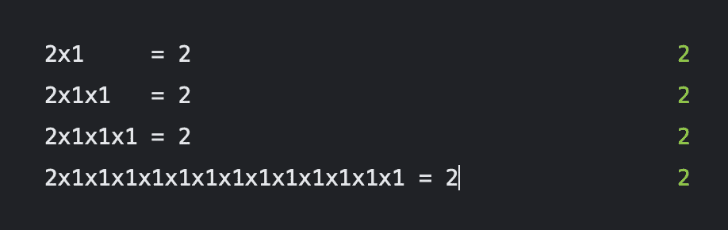

# 幂等运算

> 原文：<https://levelup.gitconnected.com/idempotent-operations-b1d4b9b76417>



网络通信的主要任务是在两端保持相同的状态。
但是也有一些问题:
【消息】一方的“消息”可能会在交流过程中丢失
【答案】另一方的“答案”可能会在交流过程中丢失

例如，来自客户端的请求可能由于网络延迟或后端重启而丢失，或者请求可能已经被发送到失效的后端，等等。

另一个例子是当服务器向客户端发送响应时发生的代理链问题。客户端的互联网连接可能很差，例如使用 GPRS 或 EDGE，或者在漫游时使用慢速互联网连接。

问题的另一个来源可能是后端异常。例如，如果您的后端使用 MySQL，并且您得到一个“锁等待超时”错误，那么业务逻辑没有被执行。

那么，您如何确定客户机和服务器的状态是相等的呢？答案很简单，您应该重试来自客户端的所有请求，直到获得正常的非 5xx 响应状态。

但这可能会产生不良后果。如果我们重试客户端请求，服务器上的一个操作可能会被处理多次。例如，可能会请求支付两次或更多次，或者每次重试都会将来自计费回拨的存款多次添加到用户的余额中。要解决这些问题，你应该使用幂等运算。这在很多情况下都很有用，尤其是在处理分布式系统时，消息可能会丢失，或者会乱序传递。一个真实的例子:

> 我:拜托，注册请求加 Trx
> 同事:干嘛？
> 我:如果有东西丢失了，客户会得到一个“EMAIL_USED”错误
> 同事:没问题，这很正常
> 同事:所有网站都是这样的

# **定义**

**幂等运算**是可以应用**多次**而不改变结果的运算。

例如，乘以一就是这样一种运算，因为无论它被应用多少次，结果总是一样的。

```
package main

import "fmt"

func main() {
	fmt.Println(5 * 1)
	fmt.Println(5 * 1 * 1 * 1 * 1)
}
```

每个幂等请求应该有一个唯一的 *trx* —操作 id。这个我们以后再说。

# 何时使用等幂

*   客户端-服务器通信
*   eventbus 消息处理
*   外部 API 执行
*   来自外部 API 的回调

简而言之，在任何情况下，你都需要确保对方收到了你的信息并处理了它。

让我们看看客户机-服务器通信。在客户机-服务器设置的上下文中，幂等运算尤其重要。这是因为当客户端向服务器发出请求时，并不总是保证请求会到达服务器、服务器会处理它或者客户端会得到响应。如果客户机多次发出相同的请求，服务器能够处理它而不改变结果是很重要的。

例如，考虑这样一种情况，客户机向服务器请求创建一个新用户。如果服务器没有收到请求，或者请求在传输过程中丢失，客户端可以重新发送请求。在这种情况下，有两个关键点:

1.  重要的是，客户应该重试请求，直到他们得到非 5xx 响应
2.  服务器能够幂等地处理请求是很重要的，因此用户的创建只发生一次

```
package server

type Request struct {
	Trx Trx    // unique for each request
	// some data
}

func (s *Server) processRequest(clientRequest *Request) (*Response, error) {
	s.cacheLock.RLock()
	resp, exists := s.requestCache[clientRequest.Trx]
	s.cacheLock.RUnLock()
	if exists {
		return resp, nil
	}

	resp, err := s.doSomething(clientRequest) // idempotent
	if err != nil {
		return nil, err
	}

	s.cacheLock.Lock()
	s.requestCache[clientRequest.Trx] = resp
	s.cacheLock.UnLock()

	return resp, nil
}

func (s *Server) doSomething(clientRequest *Request) (*Response, error) {
	// ...
}
```

在上面的代码中，幂等性用于确保 doSomething 对于每个 trx 值只被调用一次。

请注意，上面的代码并不能确保同一请求的 doSomething 不会被多次执行。为了实现这一点，必须使用字母锁定或队列式处理。

# TRX id 生成

**随机数。**这是生成 trx IDs 的最差方式，因为冲突概率太高。

**UUID。**唯一 trx 生成的最佳算法是 UUID。它简单、快速，具有几乎所有语言的实现能力，并且冲突的概率非常低。此外，您可以通过指定 UUIDs 的上下文来显著降低冲突概率。例如，每个用户或每个站点。UUID v4 碰撞的概率仍然是 1000 亿分之一，即使你生成 10 亿个 UUID。

**哈希函数为 trx。**你可以使用 body hash 来使用 body 作为 trx，但是请注意这可能会导致一些问题。例如，如果您有一个来自支付系统的回拨，那么您可能会在不同的时间收到具有相同数据的多个呼叫。问题不大，但是实施之前要想好。

降低冲突概率的良好做法是使用 trx ids 的到期时间。

# 常见的错误

幂等实现中的一个常见错误是返回类似已经处理过的响应，而不是原始响应。不是等幂！例如，在通过电子邮件进行的用户注册中，您需要处理注册请求:

```
func (s *Server) processRegistration(clientRequest *RegRequest) (*Response, error) {
	if s.isEmailUsed(clientRequest.Email) {
		return nil, emailUsedResponse(clientRequest)
	}
	// ...
}
```

但是如果请求被客户机丢弃并重新提交，用户将会收到“email used”消息，结果将会是客户机和服务器状态不一致。您经常可以在各种计费 API 中看到这种不良行为，其中外部服务器返回类似于已经处理的错误的内容，因此我们需要实现自定义逻辑，这使得流程更加复杂和难以理解。正确的做法是在任何处理之前，尽快使用`Trx`。

```
package server

type RegRequest struct {
	Trx          Trx
	Email     string
}

func (s *Server) processRegistration(clientRequest *RegRequest) (*Response, error) {
	s.cacheLock.RLock()
	resp, exists := s.requestCache[clientRequest.Trx]
	s.cacheLock.RUnLock()
	if exists {
		return resp, nil
	}
	if s.isEmailUsed(clientRequest.Email) {
		return nil, emailUsedResponse(clientRequest)
	}
	// ...
}
```

因此，如果客户端用相同的 trx 发送注册请求，它应该总是得到相同的响应。如 5 * 1 * 1 * 1。

# 数据库事务和幂等性

乍一看，使用事务和关系数据库实现幂等性似乎是一个好的实践，但是“重复键异常”破坏了主要的幂等性原则！

如果您并行多次发送一个请求，并检查“是否存在具有此事务处理的行”,您可能会得到多个“不，此行不存在”的响应，这取决于您的数据库、事务隔离级别等，因此您将需要共享锁，例如来自 Redis 的锁。

有时很难支持和理解，所以你应该经常问自己:“我可以只使用一个简单的应用程序和内存中的 trx 保护器来实现幂等吗，或者我真的应该使用像共享锁这样的东西吗？”

# 再多一点

我们关于后端开发的书稿:[https://github.com/octopus-foundation/backend-cookbook](https://github.com/octopus-foundation/backend-cookbook)

谢了。亚历山大·巴楚耶夫&德米特里·萨姆索诺夫