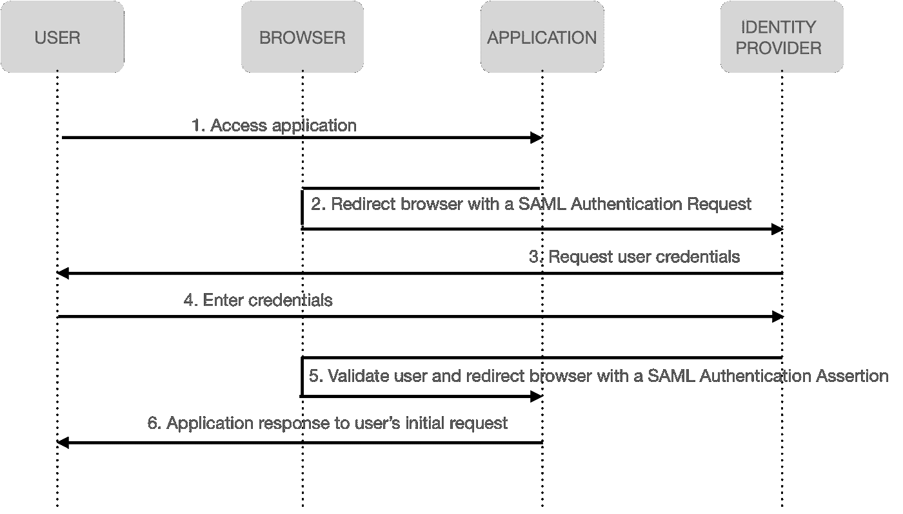

# 身份管理:OAuth 和 OIDC 简化版

> 原文：<https://levelup.gitconnected.com/identity-management-oauth-and-oidc-simplified-4056ef04a146>


有多少次我们看到这个屏幕，害怕想出另一个强密码，或者懒惰地使用我们现有的密码？

谢天谢地，现在的应用程序已经让我们可以轻松跳过这可怕的一步，允许我们使用社交媒体登录。我们可以使用现有的帐户登录，只需点击一下就可以访问新的应用程序及其功能。不再需要创建和记忆新密码！


应用程序安全之旅已经走过了漫长的道路。每一次迭代都提出了解决方案，反过来又提出了新的问题，这些问题是在满足不断增长的互联网需求的同时，创建安全的应用程序和出色的用户体验所必须解决的。

应用安全和身份管理是每个软件设计和架构的关键。对于工程师和消费者来说，了解身份管理对于保护他们的数字身份和资产变得非常重要。


在本文中，我们将介绍几种方法，并探索身份管理发展的幕后之旅。我们还将讨论一些需要改进的方法。

在深入了解身份管理的概念之前，先快速回顾一下本文中使用的术语

> **身份**:与个人或实体相关联的属性，在给定的上下文中唯一地描述他们
> 
> **认证**:确定个人或实体是否是他们所说的那个人的过程
> 
> **授权**:决定一个人或一个实体获得资源或能力的许可的过程

## **1。筒仓身份:每个应用程序都有其认证和授权机制**

在这种情况下，每个应用程序都有存储用户身份的数据库。每次用户登录时，应用程序都会根据其数据库进行验证，并相应地向用户授予资源访问权限。

虽然这仍然广泛用于面向消费者的应用程序，但对于必须复制多个员工身份的存储和维护的大型组织来说，跨每个应用程序的身份验证和授权机制可能相当麻烦。

***缺点*** :

*   消费者/员工必须记住跨站点/应用程序的多个凭据。
*   组织必须管理每个应用程序的身份管理复制。


## 2.**集中式身份存储库:存储用户身份的目录服务**

***要解决的问题:*** *用户不得不跨企业应用记住多个用户名和密码。*

随着业务功能的增长，许多组织转向目录服务来集中用户身份。

当用户登录时，每个应用程序都引用目录服务来存储和验证用户凭证。

集中用户信息减少了每个应用程序的身份管理开销。然而，用户仍然必须在每个应用程序上输入他们的凭证。

***劣势*** :

*   密码管理的单点控制也意味着一个应用程序的漏洞会危及其他应用程序。
*   集中式存储库或使用单一密码不适合消费者。


## 3.单点登录:位于目录服务之上的一层，为已经通过身份验证的用户维护会话

***要解决的问题:*** *虽然目录服务集中了凭证，但用户仍然必须在整个组织的多个应用程序中输入其凭证。*

当用户尝试登录应用程序时，应用程序会将用户重定向到 SSO 服务器，对用户进行身份验证。SSO 服务器利用目录服务对用户进行身份验证。

此外，它还在顶层提供了一个维护用户会话的层。因此，如果用户试图登录另一个应用程序，SSO 服务器将检测用户的现有会话。然后，SSO 服务器会将用户重定向回具有成功状态的应用程序，而不需要用户再次输入他们的凭据。

***缺点*** :

*   如果 SSO 服务器关闭，所有连接的应用程序访问都会暂停。
*   由于它对 cookies 的依赖，它不能很好地扩展到其他领域的外部 SaaS 应用程序。

## 4.安全声明标记语言(SAML) 2.0:跨域的单点登录和联合身份

***要解决的问题:*** *跨域单点登录。*

SAML 被设计为基于 XML 的框架，允许跨域合作伙伴之间交换安全信息。它将用户身份验证委托给一个称为身份提供者的实体。身份提供者对用户进行身份验证，并向应用程序返回一个包含已通过身份验证的用户和身份验证事件信息的声明。如果用户访问将身份验证委托给同一身份提供者的第二个应用程序，用户将能够访问第二个应用程序，而不会被提示再次输入凭据。

SAML 还提供了一种联合身份机制，在这种机制中，应用程序和身份提供者可以使用共享的用户标识符来交换有关用户的信息。联合身份可以跨系统使用相同的标识符，也可以使用映射到每个系统中用户使用的标识符的内部标识符。由于身份联合提供了一种将应用程序中使用的身份与身份提供者处的身份关联起来的方法，因此密码策略和多因素身份认证都可以在一个地方实施。



SAML 单点登录

***劣势*** :

*   无法解决面向消费者的应用和用例。
*   不解决 API 授权。

## 5.OAuth 2.0

***要解决的问题:*** *授权应用程序代表用户调用 API。*

OAuth 2.0 解决了一个重要的 API 授权用例。它允许用户授权客户端应用程序，代表用户向 API 发送请求，以检索存储在资源服务器上的数据。

授权服务器获得用户对应用程序访问其资源的同意，并将令牌传递给应用程序，使应用程序能够代表用户调用资源服务器。


OAuth 2.0 授权码授权+ PKCE

> **用于代码交换的证明密钥(PKCE，发音为 pixie)** 是一种防止恶意拦截的机制，并且请求授权代码的应用是试图获得访问令牌的同一应用。虽然它最初是为移动应用程序设计的，但它防止恶意 CSRF 和注入攻击的能力使它对所有 OAuth 实现都很有用。


> 为了使用 PKCE，应用程序创建一个高熵加密随机字符串，称为代码验证器，并使用下面两种转换之一计算一个派生值，称为代码质询

普通
code _ challenge = code _ verifier

s256
code _ challenge = base 64 URL-ENCODE(sha 256(ASCII(code _ verifier)))

> 当应用程序发送授权请求时，它包括代码质询和代码质询方法。授权服务器将授权码与密码质询和方法相关联，以便稍后验证。
> 
> 当应用程序向令牌端点发送授权代码以获取访问令牌时，它包括代码验证器。授权服务器使用代码质询方法计算代码验证器值，并验证结果是否与随授权请求一起发送的代码质询相匹配。这防止了授权服务器从拦截应用程序窃取另一个应用程序的授权码。

```
Sample API authorization request with PKCE
GET /authorize?
 response_type=code
 & client_id=<client_id>
 & state=<state>
 & scope=<scope>
 & redirect_uri=<callback uri>
 & resource=<API identifier>
 & code_challenge=<PKCE code_challenge>
 & code_challenge_method=S256 HTTP/1.1
 Host: authorizationserver.com

Authorization server response to the application's callback: redirect_uri 
HTTP/1.1 302 Found
Location: https://clientapplication.com/callback?
code=<authorization code>
& state=<state>

Application request to the authorization server's token endpoint to obtain the access token.
POST /token HTTP/1.1
Host: authorizationserver.com
Content-Type: application/x-www-form-urlencoded
grant_type=authorization_code
& code=<authorization_code>
& client_id=<client id>
& code_verifier=<code verifier>
& redirect_uri=<callback URI>

Token endpoint response 
HTTP/1.1 200 OK
Content-Type: application/json;charset=UTF-8
Cache-Control: no-store
Pragma: no-cache
 {
 "access_token": "<access_token_for_API>",
 "token_type": "Bearer",
 "expires_in": <token expiration>,
 "refresh_token": "<refresh_token>"
 }
```

***缺点*** :

*   OAuth 2.0 不是作为认证服务设计的，因此不能安全地用于此目的。

## 6.OpenID 连接(OIDC)

***要解决的问题:*** *用户认证以及 API 授权。*

OIDC 被设计为 OAuth 2.0 协议之上的一层，以标准格式向应用程序提供关于已验证用户身份的信息。这为用户认证和 API 授权提供了解决方案。

OIDC 被 Google、PayPal、Yahoo 等社交媒体/服务提供商广泛用于创建我们在本文前面看到的社交媒体登录集成。但是它的采用和使用并不局限于面向消费者的集成和用例。

OIDC 为以下人群提供福利

*   用户通过利用一个帐户登录到多个站点，而无需向他们提供凭据，
*   可以将身份验证和密码管理委托给 OIDC 提供商的应用程序开发人员，
*   以及继续吸引用户使用其平台的身份提供商。

OIDC 提供了 SAML 2.0 中吸引人的 web 单点登录优势，当与 OAuth 2.0 结合使用时，它提供了一个具有现代应用程序所需的身份验证和 API 授权功能的解决方案。

OIDC 授权代码流与 OAuth 2.0 有相似之处。授权码授予


OIDC 授权代码流+ PKCE

> ID 令牌是一种安全令牌，OpenID 提供者使用它向应用程序传达关于身份验证事件和已验证用户的声明。ID 标记以 JSON Web 标记格式编码，由一个头、一个有效负载和一个签名(编码成 base 64 URL 安全字符串)组成。
> 
> ID 令牌的标头部分包含有关对象类型(JWT)和特定签名算法(HS256 —带 SHA256 的 HMAC 或 RS256 —带 SHA256 的 RSA 签名)的信息。有效负载部分包含关于用户和身份验证事件的声明。签名部分包含一个数字签名。

```
Authentication request to the OpenID Provider's authorization endpoint
GET /authorize?
response_type=code
& client_id=<client_id>
& state=<state_value>
& nonce=<nonce_value>
& scope=<scope>
& redirect_uri=<callback_url>
& code_challenge=<code_challenge>
& code_challenge_method=<code_challenge_method> HTTP/1.1
Host: authorizationserver.com

OpenID Provider response to the callback URI. It also returns the exact state value that was passed in the authentication request
HTTP/1.1 302 Found
Location: https://clientapplication.com/callback?
code=<authorization_code>
& state=<state_value>

Application token request to the OpenID Provider's token endpoint
POST /token HTTP/1.1
Host: authorizationserver.com
Content-Type: application/x-www-form-urlencoded
Authorization: Basic <encoded client credentials>
 grant_type=authorization_code
& code=<authorization_code>
& redirect_uri=<redirect_uri>
& code_verifier=<code_verifier>

Requested tokens in JSON format returned by the OpenID Provider 
HTTP/ 1.1 200 OK
Content-Type: application/json;charset=UTF-8
 Cache-Control: no-store
 Pragma: no-cache
{
 "id_token" : <id_token>,
 "access_token" : <access_token value>,
 "refresh_token" : <refresh_token value>,
 "token_type": "Bearer",
 "expires_in" : <token lifetime>
}
```


希望这篇幕后的预览对您理解保护用户身份和创建无缝用户体验背后的复杂性有所帮助。对于开发人员来说，我希望这篇文章可以帮助您评估适合您的下一个应用程序的身份解决方案。

我很想听听你们的意见，以及你们是如何在应用程序中实现身份管理的。

如有任何问题，请随时联系我，您也可以通过下面的参考链接了解更多关于不同 OAuth 赠款类型和 OIDC 流程的信息。

***参考文献*** :

 [## RFC 7522:OAuth 2.0 客户端身份验证的安全声明标记语言(SAML) 2.0 配置文件…

### 提议的标准互联网工程任务组(IETF) B. Campbell 征求意见稿:7522 Ping 身份类别…

www.rfc-editor.org](https://www.rfc-editor.org/rfc/rfc7522) [](https://oauth.net/2/) [## OAuth 2.0 - OAuth

### OAuth 2.0 是授权的行业标准协议。OAuth 2.0 侧重于客户端开发人员的简单性，而…

oauth.net](https://oauth.net/2/)  [## OpenID 连接| OpenID

### OpenID Connect 1.0 是 OAuth 2.0 协议之上的一个简单的身份层。它允许客户验证…

openid.net](https://openid.net/connect/) [](https://learning.oreilly.com/library/view/solving-identity-management/9781484250952/) [## 解决现代应用程序中的身份管理:揭开 OAuth 2.0、OpenID Connect 和…

### 了解如何设计和使用身份管理来保护您的应用程序及其管理的数据。在…的时候

learning.oreilly.com](https://learning.oreilly.com/library/view/solving-identity-management/9781484250952/)