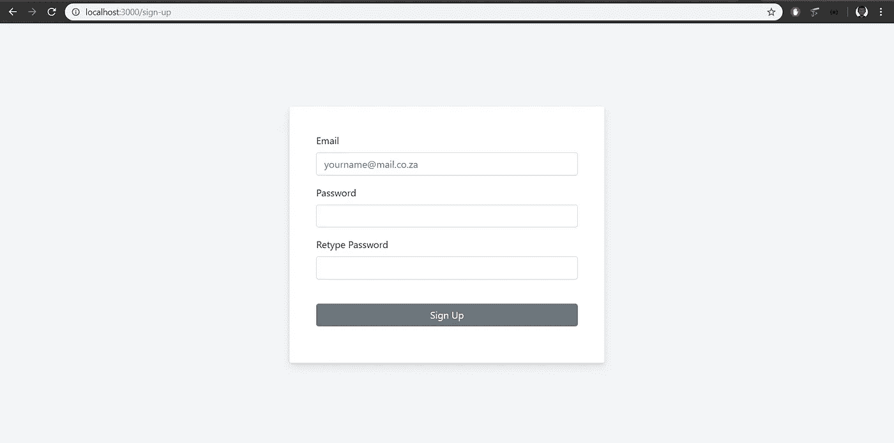

# 在 React 中使用 AWS Cognito 进行身份管理

> 原文：<https://levelup.gitconnected.com/identity-management-with-aws-cognito-in-react-dc166bd799dc>


既然身份管理在现代应用程序中已经变得必不可少，那么指导用户如何构建某种用户身份验证的编程教程就不足为奇了。根据我的经验，选择为该功能构建您自己的定制解决方案是很常见的，因为它最适合您的用例。

然而，在某些情况下，身份管理会变得非常复杂。开发人员不仅要考虑谁能访问应用程序，还要考虑他们能访问什么、用户角色，并可能考虑高级安全措施，如[多因素身份验证(MFA)](https://searchsecurity.techtarget.com/definition/multifactor-authentication-MFA) 。有些情况下，对您(和/或您的团队)来说，更明智的选择可能是利用为您处理这些问题的服务。

这些类型的服务被称为认证即服务(AaaS)，我将在 React 应用程序中使用 [AWS Cognito](https://aws.amazon.com/cognito/) 来演示它。我还将更进一步，设置一些路由保护，使演示更容易转换成现实世界的用例。

这篇文章的范围不包括如何在 Cognito 中创建一个用户池，但是你可以跟随这个[视频](https://www.youtube.com/watch?v=0Wsov5vePjo)和这个 [AWS 教程](https://docs.aws.amazon.com/cognito/latest/developerguide/tutorial-create-user-pool.html)来学习如何做。此外，我不会讨论团队在使用 AAA 之前应该考虑的事情，但是如果您正在寻找这方面的深刻见解，您可以查看 [**如何为您的公司选择最佳的身份认证服务提供商**](https://www.freecodecamp.org/news/evaluating-authentication-as-a-service-providers-6903895a8450/) 。

如果你喜欢这篇文章，请在这里给我买杯咖啡[☕️😃。](https://www.buymeacoffee.com/lukemwila)

# 反应应用程序设置

在这个练习中，我将使用 [create-react-app](https://github.com/facebook/create-react-app) 和 [TypeScript](https://www.npmjs.com/package/typescript) 。如果你不确定如何让 TypeScript 与脸书的样板文件一起工作，你可以快速查看我的另一篇文章[这里](https://itnext.io/create-stripe-subscription-payments-using-react-aws-lambda-pt-2-building-our-react-frontend-28a6a167f7b9)，并通过处理这个初始设置步骤和删除我们将不需要的样板文件代码的部分来工作。

出于样式化的目的，我将使用 [styled-components](https://www.styled-components.com/) 和 [reactstrap](https://reactstrap.github.io/) ， [validator](https://www.npmjs.com/package/validator) 进行输入验证， [uuid](https://www.npmjs.com/package/uuid) 生成唯一 id， [moment](https://www.npmjs.com/package/moment) 创建用户时间戳，[Amazon-Cognito-Identity-js](https://www.npmjs.com/package/amazon-cognito-identity-js)(Amazon Cognito Identity SDK for JavaScript)向我们的应用程序添加注册和登录功能，以及 [jwt-decode](https://www.npmjs.com/package/jwt-decode)

您可以使用以下命令安装每个类型定义包及其各自的类型定义包:

```
npm i --save bootstrap reactstrap styled-components validator uuid amazon-cognito-identity-js jwt-decodenpm i --save-dev @types/reactstrap @types/styled-components @types/validator @types/uuid @types/jwt-decode
```

在我们的 **src** 文件夹中，您可以设置以下文件夹结构:

```
├── components
├── containers
├── contexts
├── custom-types
├── navigation
└── utils
```

在这一点上，我们应该有一个基本的 React 应用程序和我们需要的必要的依赖关系。所以让我们做最后的冲刺，开始工作吧。

小悟空在做伸展运动

# 演示组件

首先，让我们在组件目录中创建一个**布局**文件夹。我们的可重用包装器样式的组件将存在于这里，特别是在 **index.tsx** 文件中。

```
import * as React from "react";
import styled from "styled-components";export const FullWidthContainer = styled.div`
  width: 100%;
  text-align: ${(props: { align?: string }) =>
    props.align ? `${props.align}` : "auto"};
`;export const AuthPageWrapper = styled.div`
  display: flex;
  flex: 1;
  background: rgb(244, 245, 247);
  align-items: center;
  justify-content: center;
  height: 100vh;
  background-size: cover;
  background-position: 50% 50%;
  z-index: -1;
  padding: 0;
  margin: 0;
  flex-direction: column;
  &:before {
    position: fixed;
    display: none;
    top: 0;
    left: 0;
    right: 0;
    bottom: 0;
    background: rgba(0,0,0,0);
    content: "";
    z-index: 0;
  }
`;export const SignUpWrapper = styled.div`
  width: 520px;
  height: auto;
  background: rgb(255, 255, 255);
  padding: 2.75rem;
  border-radius: 3px;
  box-shadow: 0 7px 14px 0 rgba(59, 65, 94, 0.1),
    0 3px 6px 0 rgba(0, 0, 0, 0.07);
`;export const SignUpContainer = styled.div`
  width: 100%;
  & input {
    background: rgba(0,0,0,0) !important;
  }
  & .input-group {
    background: rgba(214, 219, 230, 0.36) !important;
    border-radius: 0.25rem;
  }
  & a {
    color: ${Colors.lightBlue};
    text-decoration: none;
  }
`;
```

组件的名称应该让你知道它们的用途。我们将在注册和登录页面上使用 **SignUpContainer** 和 **SignUpWrapper** 组件来包装我们的表单。

接下来，我们希望有一个组件来处理注册和登录过程中的错误消息的显示。在我们的**组件**文件夹中，您可以创建另一个名为**错误消息**的文件夹，并添加以下组件:

```
import * as React from "react";
import styled from "styled-components";type ErrorMessageProps = {
  errorMessage: Error | string;
};const ErrorMessage = styled.p`
  text-align: center;
  margin-top: 10px;
  color: rgba(200, 0, 0, 0.8);
`;const ErrorMessageContainer: React.FC<ErrorMessageProps> = ({
  errorMessage,
}) => {
  return <ErrorMessage>{errorMessage}</ErrorMessage>;
};export default ErrorMessageContainer;
```

最后，在表示方面，我们将在注册工作流中使用一个模型，所以让我们开始准备吧。

为此，我们将使用 [React Portals](https://reactjs.org/docs/portals.html) 并将模态放在一个 div 中，该 div 是 id 为 **#root** 的 div 的兄弟组件。因此，在我们的**index.html**文件中(在公共目录中)，您可以添加第二个 id 为 **#modal** 的 div 元素。

```
<!DOCTYPE html>
<html lang="en"><head>
  <meta charset="utf-8" />
  <link rel="shortcut icon" href="%PUBLIC_URL%/favicon.ico" />
  <meta name="viewport" content="width=device-width, initial-scale=1" />
  <meta name="theme-color" content="#000000" />
  <!--
      manifest.json provides metadata used when your web app is installed on a
      user's mobile device or desktop. See [https://developers.google.com/web/fundamentals/web-app-manifest/](https://developers.google.com/web/fundamentals/web-app-manifest/)
    -->
  <link rel="manifest" href="%PUBLIC_URL%/manifest.json" />
  <!--
      Notice the use of %PUBLIC_URL% in the tags above.
      It will be replaced with the URL of the `public` folder during the build.
      Only files inside the `public` folder can be referenced from the HTML.Unlike "/favicon.ico" or "favicon.ico", "%PUBLIC_URL%/favicon.ico" will
      work correctly both with client-side routing and a non-root public URL.
      Learn how to configure a non-root public URL by running `npm run build`.
    -->
  <title>AWS Cognito Identity Management in React</title>
</head><body>
  <noscript>You need to enable JavaScript to run this app.</noscript>
  <div id="root"></div>
  **<div id="modal"></div>**
  <!--
      This HTML file is a template.
      If you open it directly in the browser, you will see an empty page.You can add webfonts, meta tags, or analytics to this file.
      The build step will place the bundled scripts into the <body> tag.To begin the development, run `npm start` or `yarn start`.
      To create a production bundle, use `npm run build` or `yarn build`.
    -->
</body></html>
```

接下来，让我们继续创建将呈现到 DOM 的模态组件。在**组件**文件夹中，您可以创建一个**模态**文件夹并添加以下组件:

```
import * as React from "react";
import * as ReactDOM from "react-dom";
import { Modal, ModalHeader, ModalBody } from "reactstrap";type Props = {
  title: string;
  modalDisplay: any;
  modal: boolean;
  toggleModal: () => void;
};const GlobalModalContainer: React.FC<Props> = ({
  title,
  toggleModal,
  modal,
  largeModal,
  mediumModal,
  modalDisplay,
}) => {
  return (
    <div>
      <Modal
        isOpen={modal}
        toggle={toggleModal}
      >
        <ModalHeader toggle={toggleModal}>{title}</ModalHeader>
        <ModalBody>{modalDisplay}</ModalBody>
      </Modal>
    </div>
  );
};function GlobalModal(props: Props) {
  return ReactDOM.createPortal(
    <GlobalModalContainer {...props} />,
    (document.getElementById("modal") as HTMLElement) ||
      document.createElement("div") // for testing purposes
  );
}export default GlobalModal;
```

这就结束了本演示的演示部分。我希望你没有流汗，我们正准备进入有趣的部分。

# 应用状态管理

为了管理应用程序的全局状态，我们将使用[上下文 API](https://reactjs.org/docs/context.html) 和[本地存储](https://developer.mozilla.org/en-US/docs/Web/API/Window/localStorage)。让我们添加一些我们需要的其他实用程序。首先，您可以将一个 **index.ts** 文件添加到 **custom-types** 文件夹中，并包含以下定义已验证用户属性的类型:

```
/** User auth */
export type UserAuth = {
  userId: string | number;
  idToken: string;
  timestamp?: string | number;
  authenticated: boolean;
};
```

在 **utils** 文件夹中，添加一个 **consts.ts** 文件，包含以下默认用户认证对象:

```
/** Default user auth object */
export const DEFAULT_USER_AUTH = Object.freeze({
  userId: 0,
  idToken: "",
  authenticated: false,
});
```

当我们仍然在 **utils** 文件夹中时，您可以继续创建一个 **local-storage.ts 文件**，它将包含 localStorage 值的键。

```
export const USER_AUTH_KEY = "UserAuth";
```

我们需要一个助手函数来检查 JWT 令牌是否有效，如果无效，那么用户的身份验证状态应该更新为未通过身份验证。在 utils 文件夹中创建一个 **helpers.ts** 文件，并添加以下 helper 函数:

```
import * as jwtDecode from "jwt-decode";
import * as CustomTypes from "../custom-types";/** Check if a token has expired
 * [@param](http://twitter.com/param) userAuth - user auth object
 */
export const checkIfTokenIsValid = (
  userAuth: CustomTypes.UserAuth,
  setUnauthStatus: () => void
): boolean => {
  if (!userAuth || !userAuth.idToken) {
    window.localStorage.setItem(
      USER_AUTH_KEY,
      JSON.stringify(DEFAULT_USER_AUTH)
    );
    setUnauthStatus();return false;
  }try {
    // [@ts](http://twitter.com/ts)-ignore
    const decodedJwt: any = jwtDecode(userAuth.idToken);
    if (decodedJwt.exp >= Date.now() / 1000) {
      return true;
    } else {
      window.localStorage.setItem(
        USER_AUTH_KEY,
        JSON.stringify(DEFAULT_USER_AUTH)
      );
      setUnauthStatus();return false;
    }
  } catch (e) {
    return false;
  }
};
```

接下来，我们需要一些逻辑来管理当有人成功登录时设置用户身份验证状态，以及当他们退出时重置它。为此，我们将使用自定义挂钩。您可以继续将一个**自定义钩子**文件夹添加到**实用程序**文件夹中，并且在自定义钩子中，您可以使用以下内容创建 **AuthHandler.tsx** :

```
import * as React from "react";/** Custom types */
import { UserAuth } from "../../custom-types";
/** Utils */
import { USER_AUTH_KEY } from "../local-storage";
import { DEFAULT_USER_AUTH } from "../consts";const useAuthHandler = (initialState: UserAuth) => {
  const [auth, setAuth] = React.useState(initialState);const setAuthStatus = (userAuth: UserAuth) => {
    window.localStorage.setItem(
      USER_AUTH_KEY,
      JSON.stringify(userAuth)
    );
    setAuth(userAuth);
  };const setUnauthStatus = () => {
    window.localStorage.clear();
    setAuth(DEFAULT_USER_AUTH);
  };return {
    auth,
    setAuthStatus,
    setUnauthStatus,
  };
};export default useAuthHandler;
```

您可以在**自定义钩子**文件夹中添加另一个自定义钩子，名为 **ErrorHandler.tsx** ，它将包含在我们的应用程序中使用它的组件中设置错误状态的逻辑。

```
import * as React from "react";const useErrorHandler = (initialState: string | null) => {
  const [error, setError] = React.useState(initialState);
  const showError = (errorMessage: string | null) => {
    setError(errorMessage);
    window.setTimeout(() => {
      setError(null);
    }, 3000);
  };
  return { error, showError };
};export default useErrorHandler;
```

在创建上下文之前，我们将在 **utils** 文件夹中创建一个名为 **auth.ts** 的文件，该文件将包含所有基于核心认证的逻辑。现在，我们将添加一个从 localStorage 获取用户 auth 对象的函数:

```
import { USER_AUTH_KEY } from "./local-storage";
import {
  DEFAULT_USER_AUTH
} from "./consts";/** Return user auth object from local storage value */
export const getStoredUserAuth = (): CustomTypes.UserAuth => {
  const auth = window.localStorage.getItem(USER_AUTH_KEY);
  if (auth) {
    return JSON.parse(auth);
  }return DEFAULT_USER_AUTH;
};
```

最后，我们将添加一个上下文，它将包含并提供与用户注册和身份验证过程相关的全局状态值，以及更新这些状态值的函数。

在 **contexts** 文件夹内，可以添加 **AuthContext.tsx** 。

```
import * as React from "react";/** Custom types */
import { UserAuth } from "../custom-types";
/** Custom Hooks */
import useAuthHandler from "../utils/custom-hooks/AuthHandler";
/** Utils */
import { DEFAULT_USER_AUTH } from "../utils/consts";
import { getStoredUserAuth } from "../utils/auth";interface IAuthContextInterface {
  confirmationCodeModal: boolean;
  openConfirmationCodeModal: React.Dispatch<React.SetStateAction<boolean>>;
  auth: UserAuth;
  username: string;
  userId: string;
  userTimestamp: number;
  userAccountVerified: boolean;
  setTimestamp: React.Dispatch<React.SetStateAction<number>>;
  setUserAccountVerified: React.Dispatch<React.SetStateAction<boolean>>;
  setUsername: React.Dispatch<React.SetStateAction<string>>;
  setUserId: React.Dispatch<React.SetStateAction<string>>;
  setAuthStatus: (userAuth: UserAuth) => void;
  setUnauthStatus: () => void;
}export const authContext = React.createContext<IAuthContextInterface>({
  confirmationCodeModal: false,
  auth: DEFAULT_USER_AUTH,
  userTimestamp: 0,
  userId: "",
  username: "",
  userAccountVerified: false,
  setTimestamp: () => {},
  setUserAccountVerified: () => {},
  setUsername: () => {},
  setUserId: () => {},
  setAuthStatus: () => {},
  setUnauthStatus: () => {},
  openConfirmationCodeModal: () => {},
});const { Provider } = authContext;const AuthProvider: React.FC<{ children: React.ReactNode }> = ({
  children,
}) => {
  const [userTimestamp, setTimestamp] = React.useState(0);
  const [userId, setUserId] = React.useState("");
  const [username, setUsername] = React.useState("");
  const [confirmationCodeModal, openConfirmationCodeModal] = React.useState(
    false
  );
  const [userAccountVerified, setUserAccountVerified] = React.useState(false);
  const { auth, setAuthStatus, setUnauthStatus } = useAuthHandler(
    getStoredUserAuth()
  );return (
    <Provider
      value={{
        confirmationCodeModal,
        openConfirmationCodeModal,
        auth,
        setAuthStatus,
        setUnauthStatus,
        username,
        userAccountVerified,
        setUserAccountVerified,
        setUsername,
        userId,
        setUserId,
        userTimestamp,
        setTimestamp,
      }}
    >
      {children}
    </Provider>
  );
};export default AuthProvider;
```

您可能已经注意到了`confirmationCodeModal`状态值和更新它的函数`openConfirmationCodeModal`，并想知道这些是做什么用的？嗯，我们一个用户签名，他们必须验证他们在注册时使用的电子邮件按照规范。因此，AWS Cogntio 将发送一个验证码到用户注册电子邮件，我们将有一个模式打开，用户可以输入这个验证码。

好吧，如果你走到这一步，就不能回头了。是时候用那些处理核心逻辑的主干函数填充我们的 **auth.ts** 文件了。

# 使用 Amazon Cognito SDK 进行身份验证

我们将把注意力转向这整个部分的 **auth.ts** 文件。让我们首先导入一些我们需要的包，以及一些实用程序。

```
import * as React from "react";
import {
  AuthenticationDetails,
  CognitoUserPool,
  CognitoUserAttribute,
  CognitoUser,
  CognitoUserSession,
} from "amazon-cognito-identity-js";
import moment from "moment";
/** Utils */
import * as CustomTypes from "../custom-types";
import { USER_AUTH_KEY } from "./local-storage";
import {
  DEFAULT_USER_AUTH
} from "./consts";
```

接下来，我们希望为将要与之交互的 Cognito 用户池配置相关的客户端。添加以下常量:

```
const POOL_DATA = {
  UserPoolId:
    process.env.REACT_APP_COGNITO_USER_POOL_ID,
  ClientId:
    process.env.REACT_APP_COGNITO_CLIENT_ID
};
```

让我们创建在这个文件中使用的环境变量。在您的根目录中(在 **src** 文件夹之外)，您可以创建一个 **.env.development** 文件，为 Cognito 用户池 ID 和用户池的客户端 ID 添加以下环境变量及其各自的值。请注意，我下面添加的两个值是假的，您应该使用创建用户池时生成的值。

```
REACT_APP_COGNITO_USER_POOL_ID=us-east-2_zYqt5kWrM
REACT_APP_COGNITO_CLIENT_ID=66d7sgafglt19fp23o7a9bnlfk
```

您可以返回到 **auth.ts** 文件，用这些用户池配置细节创建一个用户池对象，如下所示:

```
const userPool = new CognitoUserPool(POOL_DATA);
```

让我们添加一个处理用户注册到 Cognito 池的函数。

```
/** Sign up a user to AWS Cognito user pool */
export const signUp = (
  email: string,
  password: string,
  setError: (error: string | null) => void,
  setLoading: React.Dispatch<React.SetStateAction<boolean>>,
  setUsername: React.Dispatch<React.SetStateAction<string>>,
  setUserId: React.Dispatch<React.SetStateAction<string>>,
  setTimestamp: React.Dispatch<React.SetStateAction<number>>,
  openConfirmationCodeModal: React.Dispatch<React.SetStateAction<boolean>>
) => {
  setLoading(true);
  const userTimestamp = moment().unix();
  const stringUserTimestamp = userTimestamp.toString();const user: CustomTypes.CognitoUser = {
    email,
    password,
  };const attributesToBeAdded = [
    {
      Name: "email",
      Value: user.email,
    },
    {
      Name: "custom:timestamp",
      Value: stringUserTimestamp,
    },
  ];const attrList: Array<CognitoUserAttribute> = attributesToBeAdded.map(
    attr => {
      return new CognitoUserAttribute(attr);
    }
  );userPool.signUp(user.email, user.password, attrList, [], (err, result) => {
    if (err) {
      setLoading(false);
      setError(err.message);
      return;
    }
    setLoading(false);
    if (result && result.user) {
      setUsername(user.email);
      setUserId(result.userSub);
      setTimestamp(+stringUserTimestamp);
      openConfirmationCodeModal(true);
    }
  });
  return;
};
```

您看到的传递给这个注册函数的参数，就像这个文件中的其他帮助器一样，是从 React 容器传递来的函数，用于更新这些功能组件的状态值。

如前所述，用户的注册电子邮件需要通过输入他们从 AWS 收到的代码进行验证。下面的函数将处理这个问题:

```
/** Confirm user with code received via email */
export const confirmUser = (
  userId: string,
  userTimestamp: number,
  username: string,
  code: string,
  setError: (errorMessage: string | null) => void,
  setLoading: React.Dispatch<React.SetStateAction<boolean>>,
  setUserAccountVerified: React.Dispatch<React.SetStateAction<boolean>>
) => {
  setLoading(true);const userData = {
    Username: username,
    Pool: userPool,
  };const cognitoUser = new CognitoUser(userData);
  cognitoUser.confirmRegistration(code, true, (err, result) => {
    if (err) {
      setLoading(false);
      setError(err.message);
    }if (result === "SUCCESS") {
      setLoading(false);
      setUserAccountVerified(true);
    }else{
      setLoading(false);
      setError("There was a problem confirming the user");
    }
  });
};
```

最后，我们将添加我们的登录功能:

```
/** Sign in and authenticate a user */
export const signIn = (
  email: string,
  password: string,
  history: History | any,
  setError: (error: string | null) => void,
  setLoading: React.Dispatch<React.SetStateAction<boolean>>,
  setUsername: React.Dispatch<React.SetStateAction<string>>,
  setTimestamp: React.Dispatch<React.SetStateAction<number>>,
  setAuthStatus: (userAuth: CustomTypes.UserAuth) => void
) => {
  setLoading(true);const authData = {
    Username: email,
    Password: password,
  };const authDetails = new AuthenticationDetails(authData);
  const userData = {
    Username: email,
    Pool: userPool,
  };const cognitoUser = new CognitoUser(userData);cognitoUser.authenticateUser(authDetails, {
    onSuccess(result: CognitoUserSession | any) {
      setLoading(false);
      setUsername(email);
      setTimestamp(+result.idToken.payload["custom:timestamp"] || 0);
      setAuthStatus({
        userId: result.idToken.payload.sub,
        idToken: result.idToken.jwtToken,
        timestamp: +result.idToken.payload["custom:timestamp"] || 0,
        authenticated: true,
      });
      history.push("/home");  // or whatever route you want a signed in user to be redirected to
    },
    onFailure(err) {
      setLoading(false);
      setError(err.message);
    },
  });return;
};
```

所以当完成时，我们的 **auth.ts** 文件应该类似于下面的代码块。你也可以在这里看到这个文件的公开要点[。](https://gist.github.com/LukeMwila/791c374c56e7ddcb8a8e0a69fa1fcc05)

```
import * as React from "react";
import {
  AuthenticationDetails,
  CognitoUserPool,
  CognitoUserAttribute,
  CognitoUser,
  CognitoUserSession,
} from "amazon-cognito-identity-js";
import moment from "moment";
/** Utils */
import * as CustomTypes from "../custom-types";
import { USER_AUTH_KEY } from "./local-storage";
import {
  DEFAULT_USER_AUTH
} from "./consts";const POOL_DATA = {
  UserPoolId:
    process.env.REACT_APP_COGNITO_USER_POOL_ID,
  ClientId:
    process.env.REACT_APP_COGNITO_CLIENT_ID
};const userPool = new CognitoUserPool(POOL_DATA);/** Sign up a user to AWS Cognito user pool */
export const signUp = (
  email: string,
  password: string,
  setError: (error: string | null) => void,
  setLoading: React.Dispatch<React.SetStateAction<boolean>>,
  setUsername: React.Dispatch<React.SetStateAction<string>>,
  setUserId: React.Dispatch<React.SetStateAction<string>>,
  setTimestamp: React.Dispatch<React.SetStateAction<number>>,
  openConfirmationCodeModal: React.Dispatch<React.SetStateAction<boolean>>
) => {
  setLoading(true);
  const userTimestamp = moment().unix();
  const stringUserTimestamp = userTimestamp.toString();const user: CustomTypes.CognitoUser = {
    email,
    password,
  };const attributesToBeAdded = [
    {
      Name: "email",
      Value: user.email,
    },
    {
      Name: "custom:timestamp",
      Value: stringUserTimestamp,
    },
  ];const attrList: Array<CognitoUserAttribute> = attributesToBeAdded.map(
    attr => {
      return new CognitoUserAttribute(attr);
    }
  );userPool.signUp(user.email, user.password, attrList, [], (err, result) => {
    if (err) {
      setLoading(false);
      setError(err.message);
      return;
    }
    setLoading(false);
    if (result && result.user) {
      setUsername(user.email);
      setUserId(result.userSub);
      setTimestamp(+stringUserTimestamp);
      openConfirmationCodeModal(true);
    }
  });
  return;
};/** Confirm user with code received via email */
export const confirmUser = (
  userId: string,
  userTimestamp: number,
  username: string,
  code: string,
  setError: (errorMessage: string | null) => void,
  setLoading: React.Dispatch<React.SetStateAction<boolean>>,
  setUserAccountVerified: React.Dispatch<React.SetStateAction<boolean>>
) => {
  setLoading(true);const userData = {
    Username: username,
    Pool: userPool,
  };const cognitoUser = new CognitoUser(userData);
  cognitoUser.confirmRegistration(code, true, (err, result) => {
    if (err) {
      setLoading(false);
      setError(err.message);
    }if (result === "SUCCESS") {
      setLoading(false);
      setUserAccountVerified(true);
    }else{
      setLoading(false);
      setError("There was a problem confirming the user");
    }
  });
};/** Sign in and authenticate a user */
export const signIn = (
  email: string,
  password: string,
  history: History | any,
  setError: (error: string | null) => void,
  setLoading: React.Dispatch<React.SetStateAction<boolean>>,
  setUsername: React.Dispatch<React.SetStateAction<string>>,
  setTimestamp: React.Dispatch<React.SetStateAction<number>>,
  setAuthStatus: (userAuth: CustomTypes.UserAuth) => void
) => {
  setLoading(true);const authData = {
    Username: email,
    Password: password,
  };const authDetails = new AuthenticationDetails(authData);
  const userData = {
    Username: email,
    Pool: userPool,
  };const cognitoUser = new CognitoUser(userData);cognitoUser.authenticateUser(authDetails, {
    onSuccess(result: CognitoUserSession | any) {
      setLoading(false);
      setUsername(email);
      setTimestamp(+result.idToken.payload["custom:timestamp"] || 0);
      setAuthStatus({
        userId: result.idToken.payload.sub,
        idToken: result.idToken.jwtToken,
        timestamp: +result.idToken.payload["custom:timestamp"] || 0,
        authenticated: true,
      });
      history.push("/home");  // or whatever route you want a signed in user to be redirected to
    },
    onFailure(err) {
      setLoading(false);
      setError(err.message);
    },
  });return;
};/** Return user auth object from local storage value */
export const getStoredUserAuth = (): CustomTypes.UserAuth => {
  const auth = window.localStorage.getItem(USER_AUTH_KEY);
  if (auth) {
    return JSON.parse(auth);
  }return DEFAULT_USER_AUTH;
};
```

抓紧了，我们现在在最后冲刺。

# 创建我们的注册和登录组件

让我们从在**容器**文件夹中创建注册功能组件开始。

注册组件将具有以下文件夹结构:

```
├── helpers.ts
├── ConfirmationCodeForm.tsx
├── index.tsx
└── SignUpForm.tsx
```

首先， **index.tsx** 将是注册的根组件:

```
import * as React from "react";/** Containers */
import SignUpForm from "./SignUpForm";
/** Context consumer */
import { authContext } from "../../contexts/AuthContext";
/** Presentation/UI */
import { AuthPageWrapper, SignUpWrapper } from "../../components/Layouts";
import GlobalModalContainer from "../../components/Modal";
import ConfirmationCodeForm from "./ConfirmationCodeForm";const SignUp: React.FC<{}> = () => {
  const { confirmationCodeModal, openConfirmationCodeModal } = React.useContext(
    authContext
  );return (
    <AuthPageWrapper>
      <SignUpWrapper>
        <GlobalModalContainer
          toggleModal={() => openConfirmationCodeModal(false)}
          title="Please Check Your Email"
          modalDisplay={<ConfirmationCodeForm />}
          modal={confirmationCodeModal}
        />
        <SignUpForm />
      </SignUpWrapper>
    </AuthPageWrapper>
  );
};export default SignUp;
```

接下来，让我们创建一个带有验证函数的 helpers.ts 文件。

```
import * as validator from "validator";/** Handle form validation for the signup form
 * [@param](http://twitter.com/param) email - user's email
 * [@param](http://twitter.com/param) password - user's chsoen password
 * [@param](http://twitter.com/param) passwordRetype - user's retyped password
 */
export const validateForm = (
  email: string,
  password: string,
  passwordRetype: string,
  setError: (error: string | null) => void
): boolean => {
  // Check for invalid email
  if (!validator.isEmail(email)) {
    setError("Please enter a valid email address.");
    return false;
  }// check if passwords match
  if (password !== passwordRetype) {
    setError("The passwords you entered don't match.");
    return false;
  }return true;
};
```

现在让我们添加两个组件，它们将呈现我们的注册表单和带有输入确认码字段的表单。

**SignUpForm.tsx**

```
import * as React from "react";
import { Button, Form, FormGroup, Label, Input } from "reactstrap";/** Context consumer */
import { authContext } from "../../contexts/AuthContext";
/** Presentation/UI */
import { SignUpContainer } from "../../components/Layouts";
import ErrorMessage from "../../components/ErrorMessage";
/** Custom Hooks */
import useErrorHandler from "../../utils/custom-hooks/ErrorHandler";
/** Utils */
import * as auth from "../../utils/auth";
import { validateForm } from "./helpers";const SignUpForm: React.FC<{}> = () => {
  const [email, setEmail] = React.useState("");
  const [password, setPassword] = React.useState("");
  const [passwordRetype, setPasswordRetype] = React.useState("");
  const [loading, setLoading] = React.useState(false);
  const { error, showError } = useErrorHandler(null);
  const {
    openConfirmationCodeModal,
    setUsername,
    setUserId,
    setTimestamp,
  } = React.useContext(authContext);return (
    <SignUpContainer>
      <Form
        onSubmit={e => {
          e.preventDefault();
          if (validateForm(email, password, passwordRetype, showError)) {
            auth.signUp(
              email,
              password,
              showError,
              setLoading,
              setUsername,
              setUserId,
              setTimestamp,
              openConfirmationCodeModal
            );
          }
        }}
      >
        <FormGroup>
          <Label for="email">Email</Label>
          <Input
            type="email"
            name="email"
            value={email}
            id="email"
            placeholder="[yourname@entelect.co.za](mailto:yourname@entelect.co.za)"
            onChange={e => setEmail(e.target.value)}
          />
        </FormGroup>
        <FormGroup>
          <Label for="password">Password</Label>
          <Input
            type="password"
            name="password"
            value={password}
            id="password"
            onChange={e => setPassword(e.target.value)}
          />
        </FormGroup>
        <FormGroup>
          <Label for="passwordRetype">Retype Password</Label>
          <Input
            type="password"
            name="passwordRetype"
            value={passwordRetype}
            id="passwordRetype"
            onChange={e => setPasswordRetype(e.target.value)}
          />
        </FormGroup>
        <br />
        <FormGroup>
          <Button type="submit" block={true}>
            {loading ? "Loading..." : "Sign Up"}
          </Button>
        </FormGroup>
        {error && <ErrorMessage errorMessage={error} />}
      </Form>
    </SignUpContainer>
  );
};export default SignUpForm;
```

**confirmationcodeform . tsx**

```
import * as React from "react";
import { Button, Form, Label, FormGroup, Input } from "reactstrap";/** Context consumer */
import { authContext } from "../../contexts/AuthContext";
/** Presentation/UI */
import { FullWidthContainer } from "../../components/Layouts";
import ErrorMessage from "../../components/ErrorMessage";
/** Custom Hooks */
import useErrorHandler from "../../utils/custom-hooks/ErrorHandler";
/** Utils */
import * as auth from "../../utils/auth";const ConfirmationCodeForm: React.FC<{}> = () => {
  const [loading, setLoading] = React.useState(false);
  const [confirmationCode, setConfirmationCode] = React.useState("");
  const { error, showError } = useErrorHandler(null);
  const {
    username,
    userId,
    userTimestamp,
    userAccountVerified,
    setUserAccountVerified,
  } = React.useContext(authContext);const displayFormOrMessage = (
    userAccountVerified: boolean
  ): React.ReactNode => {
    if (userAccountVerified) {
      return <div>Your account has been verified.</div>;
    }return (
      <Form
        onSubmit={e => {
          e.preventDefault();
          if (confirmationCode) {
            auth.confirmUser(
              userId,
              userTimestamp,
              username,
              confirmationCode,
              showError,
              setLoading,
              setUserAccountVerified
            );
          } else {
            showError("Cannot have an empty field.");
          }
        }}
      >
        <FormGroup>
          <Label for="confirmationCode">Enter Confirmation Code</Label>
          <Input
            type="text"
            name="confirmationCode"
            id="confirmationCode"
            placeholder="Confirmation code"
            onChange={e => setConfirmationCode(e.target.value)}
          />
        </FormGroup>
        <FormGroup>
          <Button type="submit" block={true}>
            {loading ? "Loading..." : "Confirm"}
          </Button>
        </FormGroup>
        {error && <ErrorMessage errorMessage={error} />}
      </Form>
    );
  };return (
    <FullWidthContainer>
      {displayFormOrMessage(userAccountVerified)}
    </FullWidthContainer>
  );
};export default ConfirmationCodeForm;
```

登录组件将具有以下文件夹结构:

```
├── helpers.ts
├── index.tsx
└── SignInForm.tsx
```

我们可以将以下内容添加到我们的根 **index.tsx** 文件中:

```
import * as React from "react";
import { Redirect } from "react-router";/** Context consumer */
import { authContext } from "../../contexts/AuthContext";
/** Presentation/UI */
import { AuthPageWrapper, SignUpWrapper } from "../../components/Layouts";
import SignInForm from "./SignInForm";const SignIn: React.FC<{}> = () => {
  const { auth } = React.useContext(authContext);if (auth.authenticated) {
    return <Redirect to="/home" />;
  }return (
    <AuthPageWrapper>
      <SignUpWrapper>
        <SignInForm />
      </SignUpWrapper>
    </AuthPageWrapper>
  );
};export default SignIn;
```

然后，我们将添加助手函数，用于验证登录表单:

```
import * as validator from "validator";/** Handle form validation for the signup form
 * [@param](http://twitter.com/param) email - user's email
 * [@param](http://twitter.com/param) password - user's chsoen password
 */
export const validateForm = (
  email: string,
  password: string,
  setError: (error: string | null) => void
): boolean => {
  // Check for invalid email
  if (!validator.isEmail(email)) {
    setError("Please enter a valid email address.");
    return false;
  }// check if password field is empty
  if (!password) {
    setError("Please enter a valid password.");
    return false;
  }return true;
};
```

# 应用程序导航和路线守卫

如果您忘记了，我们之前创建了一个**导航**文件夹，现在我们将用以下文件填充它:

```
├── AppNavigation.tsx
└── Routes.tsx
```

**Routes.tsx** 文件将包含一组路线以及当路线激活时要渲染的相关组件。 **AppNavigation.tsx** 将包含管理路线的逻辑。我们的 **AppNavigation.tsx** 组件也将有一个路由守卫来检查当用户试图访问私人页面时，他们的 JWT 是否有效。

**Routes.tsx**

```
import Home from "../containers/Home"; // Create a basic component that an authenticated user can be redirected to
import SignUp from "../containers/SignUp";
import SignIn from "../containers/SignIn";const routes = [
  {
    title: "Home",
    path: "/home",
    component: Home,
    exact: true,
    private: true,
  },
  {
    title: "Sign Up",
    path: "/sign-up",
    component: SignUp,
    exact: true,
    private: false,
  },
  {
    title: "Sign In",
    path: "/sign-in",
    component: SignIn,
    exact: true,
    private: false,
  },
];export default routes;
```

**AppNavigation.tsx**

```
import * as React from "react";
import { Redirect } from "react-router";
import { BrowserRouter as Router, Switch, Route } from "react-router-dom";/** Context consumer */
import { authContext } from "../contexts/AuthContext";/** Routes */
import Routes from "./Routes";/** Sidebar nav */
import SideBar from "../components/Sidebar";/** Utils */
import { checkIfTokenIsValid } from "../utils/helpers";
import { USER_AUTH_KEY } from "../utils/local-storage";const AuthRoute = (props: any) => {
  const { setUnauthStatus } = React.useContext(authContext);
  const Comp = props.component;return props.private &&
    !checkIfTokenIsValid(
      JSON.parse(window.localStorage.getItem(USER_AUTH_KEY) || ""),
      setUnauthStatus
    ) ? (
    <Redirect to="/sign-in" />
  ) : props.private &&
    checkIfTokenIsValid(
      JSON.parse(window.localStorage.getItem(USER_AUTH_KEY) || ""),
      setUnauthStatus
    ) ? (
    <Route render={data => <Comp {...data} {...props} />} />
  ) : (
    <Route render={data => <Comp {...data} {...props} />} />
  );
};const AppNavigation = () => (
  <Router>
    <React.Fragment>
      <Switch>
        {Routes.map((route, i) => {
          return <AuthRoute key={i} {...route} />;
        })}
      </Switch>
    </React.Fragment>
  </Router>
);export default AppNavigation;
```

最后，让我们将应用程序的根组件包装在 **AuthContext** provider 中，并注入 **AppNavigation** 组件。

**App.tsx**

```
import * as React from "react";
/** Contexts */
import AuthContextProvider from "./contexts/AuthContext";import AppNavigation from "./navigation/AppNavigation";function App() {
  return (
    <AuthContextProvider>
      <AppNavigation />
    </AuthContextProvider>
  );
}export default App;
```

之后，运行`npm start`并进行试驾😃。



app 截图