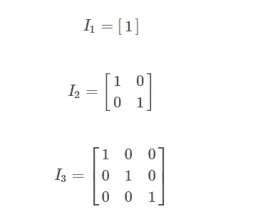
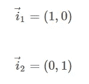
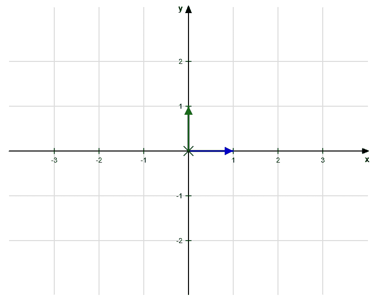
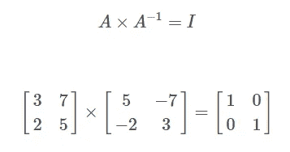

# 单位矩阵解释(用 Python 举例)-线性代数

> 原文：<https://levelup.gitconnected.com/identity-matrix-explained-with-examples-in-python-linear-algebra-35e90da72859>

## 在本文中，我们将讨论创建单位矩阵的步骤和直觉，并展示使用 Python 的例子


**目录**

*   介绍
*   单位矩阵解释
*   单位矩阵属性
*   Python 中的单位矩阵
*   结论

# 介绍

在[线性代数](https://pyshark.com/category/linear-algebra/)的大量矩阵表达式中经常会出现单位矩阵( **I** )。

此时，你应该熟悉[矩阵代表什么](https://pyshark.com/matrix-multiplication-explained-using-python/#what-does-a-matrix-represent)，因为这将有助于理解单位矩阵背后的含义。

为了继续学习本教程，我们需要以下 Python 库:numpy。

如果您没有安装它们，请打开“命令提示符”(在 Windows 上)并使用以下代码安装它们:

```
pip install numpy
```

# 单位矩阵解释

我们已经知道[什么是矩阵](https://pyshark.com/matrix-multiplication-explained-using-python/#what-does-a-matrix-represent)，但是到底什么是单位矩阵，它是如何被使用的？

单位矩阵 **I_n** 是一个阶为 **n** 的方阵，在主对角线上填充 1，在其他地方填充 0。

这里有几个例子:



作者图片

对于更大的维度也是如此。

从图形上看， **I_2** 矩阵简单地表示基本向量:



作者图片



作者图片

# 单位矩阵属性

以下是单位矩阵的一些有用属性:

*   一个单位矩阵总是一个方阵(行数和列数相同)，比如:2×2，3×3 等等。
*   任何矩阵[乘以单位矩阵](https://pyshark.com/matrix-multiplication-explained-using-python/)的结果就是矩阵本身(如果定义了乘法)


作者图片

*   矩阵乘以其逆矩阵的结果是单位矩阵



作者图片

# Python 中的单位矩阵

为了用 Python 创建一个单位矩阵，我们将使用 numpy 库。第一步是导入它:

Numpy 有很多有用的函数，对于这个操作，我们将使用 [identity()](https://numpy.org/doc/stable/reference/generated/numpy.identity.html) 函数创建一个正方形数组，在主对角线上填充 1，在其他地方填充 0。

现在让我们创建一个 2×2 单位矩阵:

您应该得到:

```
[[1\. 0.]
 [0\. 1.]]
```

现在你知道了如何创建一个单位矩阵，并且可以通过 Python 中的[计算矩阵求逆](https://pyshark.com/calculate-inverse-of-a-matrix-using-python/)和[乘以矩阵](https://pyshark.com/matrix-multiplication-explained-using-python/)来进一步探索矩阵运算。

# 结论

在本文中，我们讨论了创建单位矩阵的步骤和直觉，并展示了一个使用 Python 的完整示例。

如果你有任何问题或对一些编辑有建议，请随时在下面留下评论，并查看更多我的[线性代数](https://pyshark.com/category/linear-algebra/)文章。

*原载于 2022 年 1 月 13 日 https://pyshark.com**[*。*](https://pyshark.com/create-identity-matrix-using-python/)*