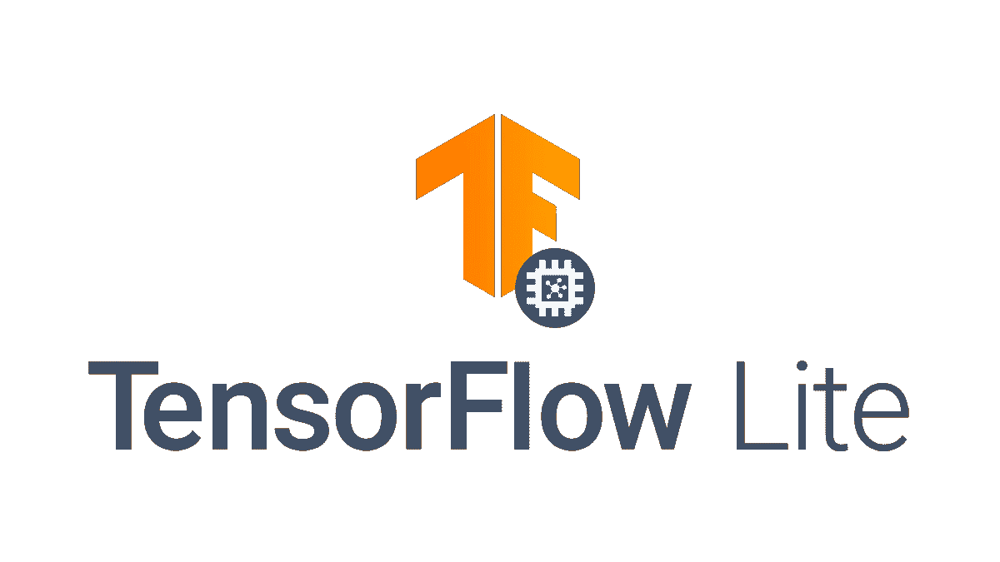

# Android 上的惯用 TensorFlow—开始使用 tensor flow 支持库

> 原文：<https://levelup.gitconnected.com/idiomatic-tensorflow-on-android-get-started-with-the-tensorflow-support-library-c12fe96bc029>

# 在 Android 上处理数据不方便！

如果您以前在 Android 上使用过 TensorFlow Lite，那么您可能必须处理预处理数据的繁琐任务，在静态类型语言中使用`Float`数组，或者在数据适合模型消费之前调整大小、转换、规范化和执行任何其他标准任务。

嗯，不会再有了！ [TFLite 支持库](https://github.com/tensorflow/tensorflow/tree/master/tensorflow/lite/experimental/support/java) nightly 现已可用，在这篇文章中，我们将回顾它的用法并围绕`tflite`模型构建一个包装器。

> **注意:**这篇文章的配套资源库[在这里](https://github.com/ATechnoHazard/object-detection-yolo)可以找到。跟随，或者直接跳到源头！

非常感谢 [Tanmay Thakur](https://medium.com/u/46b642aa7f12?source=post_page-----c12fe96bc029--------------------------------) 和 [Ubaid Usmani](https://medium.com/u/d1a8d99d1836?source=post_page-----c12fe96bc029--------------------------------) 对 python 实现的帮助。没有他们的帮助，这是不可能的。

# 这篇文章的范围

这篇文章仅限于围绕`tflite`模型加载和创建一个包装类；但是，您可以在上面链接的存储库中看到一个功能完整的项目。代码被自由地注释并且非常简单。

如果您还有任何疑问，请随时联系我并发表评论。我很乐意帮助你。

# 设置项目

我们将在 Android 设备上部署流行的 YOLOv3 对象检测模型的 [TFLite 版本](https://github.com/ATechnoHazard/yolo-tflite)。事不宜迟，让我们开始吧。

使用 Android Studio 创建一个新项目，随意命名，然后等待初始的`gradle`同步完成。接下来，我们将安装依赖项。

## 添加依赖关系

将以下依赖项添加到您的应用程序级`build.gradle`。

让我们看看它们是什么，以及我们为什么需要它们。

1.  **快速许可**:这是一个很棒的库，可以快速简单地授予许可。
2.  **Tensorflow Lite** :这是核心的 TFLite 库。
3.  **Tensorflow Lite 支持**:这是我们将用来简化数据相关任务的支持库。
4.  这是一个库，提供了一个简单的 API 来访问相机。

## 配置 gradle 项目

在我们为代码做好准备之前，我们的项目还需要一些配置。在应用级`build.gradle`文件中，在`android`块下添加以下选项。

我们需要添加这个的原因是因为我们将在我们的资产中运输模型，这在默认情况下会压缩它。这是一个问题，因为解释器不能加载压缩模型。

> **注意:**完成初始配置后，再次运行`gradle`同步以获取所有依赖项。

# 进入代码

先做最重要的事情；我们需要一个模型来加载。我用的那个可以在这里找到[。将模型放入`app/src/main/assets`内。这将使我们能够在运行时加载它。](https://raw.githubusercontent.com/ATechnoHazard/yolo-tflite/master/models/detect.tflite)

检测到的物体的标签可以在[这里](https://raw.githubusercontent.com/ATechnoHazard/object-detection-yolo/master/app/src/main/assets/labelmap.txt)找到。将它们放在与模型相同的目录中。

> **警告:**如果你打算使用自己定制的车型，一句忠告；输入和输出形状可能与此项目中使用的形状不匹配。

## 创建包装类

我们将把我们的模型及其相关方法包装在一个名为`YOLO`的类中。初始代码如下。

让我们把这个类分解成它的核心功能和行为。

1.  首先，创建后，该类通过支持库提供的`FileUtil`类从 app `assets`加载模型。
2.  接下来，我们有一个班级成员。`interpreter`是不言自明的，它是一个 TFLite 解释器的实例。
3.  最后，我们有一些静态变量。这些只是模型的文件名和我们的`assets`里面的标签。

继续，让我们添加一个方便的方法来从`assets`加载我们的标签。

在这里，我们声明了一个方法，该方法加载标签文件并将成员变量延迟初始化为返回值。

让我们言归正传。我们现在要定义一个方法，它接收一个位图，将其传递到模型中，并返回检测到的对象类。

哇，那是一堵代码墙！我们来过一遍，分解一下。

我们已经声明了一些新的惰性初始化变量；一个`ImageProcessor`和一个`TensorImage`。这些是由支持库公开的类，使得加载图像和处理图像更加简单。

如此处所示，我们可以将一个`bitmap`直接加载到`TensorImage`中，然后将其传递给`ImageProcessor`进行进一步处理。

`ImageProcessor`有几个可用的操作，但是我们在这里使用的是将我们的输入图像调整到 300 * 300。这是因为我们的模型的输入大小需要 300 * 300 的图像。

处理完图像后，我们创建几个`TensorBuffers`。这些是张量的表示，我们可以很容易地操作和访问。这些`TensorBuffers`的形状由模型决定。查看模型摘要，找出合适的形状。

我们将`TensorImage`加载到输入`TensorBuffer`中，然后将输入和输出缓冲区传递给解释器。

> **注:**yolo v3 型号有多个输出。这就是我们必须使用多个输出缓冲器的原因。

运行推理后，解释器设置输出缓冲区的内部`FloatArrays`。现在，我们只对包含预测类的那个感兴趣。使用方便的 kotlin `map`函数，我们将标签映射到模型输出的数值类并返回它们。

这个类现在可以被我们的应用程序用来在一个`bitmap`上运行推理。多方便啊！

# 结论

就是这样！与不使用支持库的项目相比；我们将编写更多的代码来调整图像的大小，将位图转换成`float`数组，手动分配浮点数组来存储输出，等等。

TensorFlow 支持库因此简化了开发人员的工作；尽管是夜间播放，但以我的经验来看，它相当稳定。

要了解更多信息，请查看支持库`readme` [此处](https://github.com/tensorflow/tensorflow/blob/master/tensorflow/lite/experimental/support/java/README.md)。到目前为止，还没有任何正式的文档，但是`readme`包含了开发者快速入门所需的所有信息。

注意安全，玩得开心！

 [## 编写面试问题

### 一个完整的平台，在这里我会教你找到下一份工作所需的一切，以及…

技术开发](https://skilled.dev)