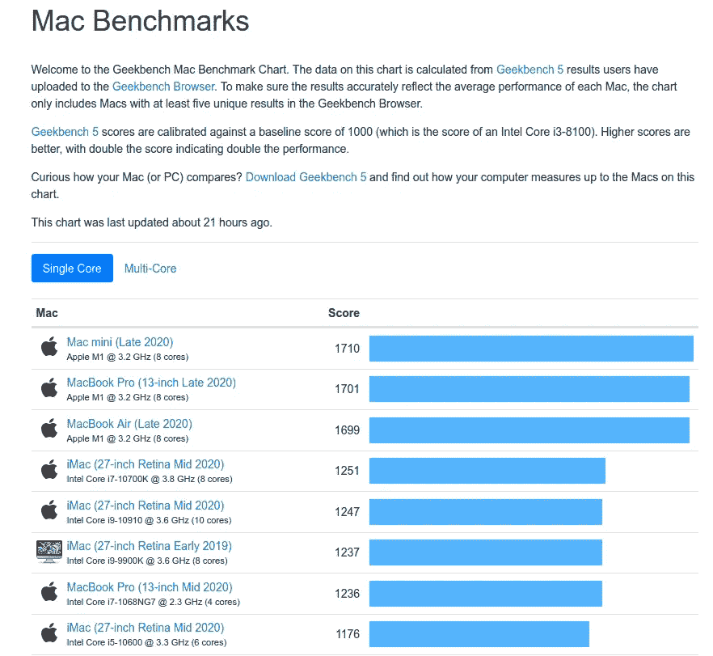
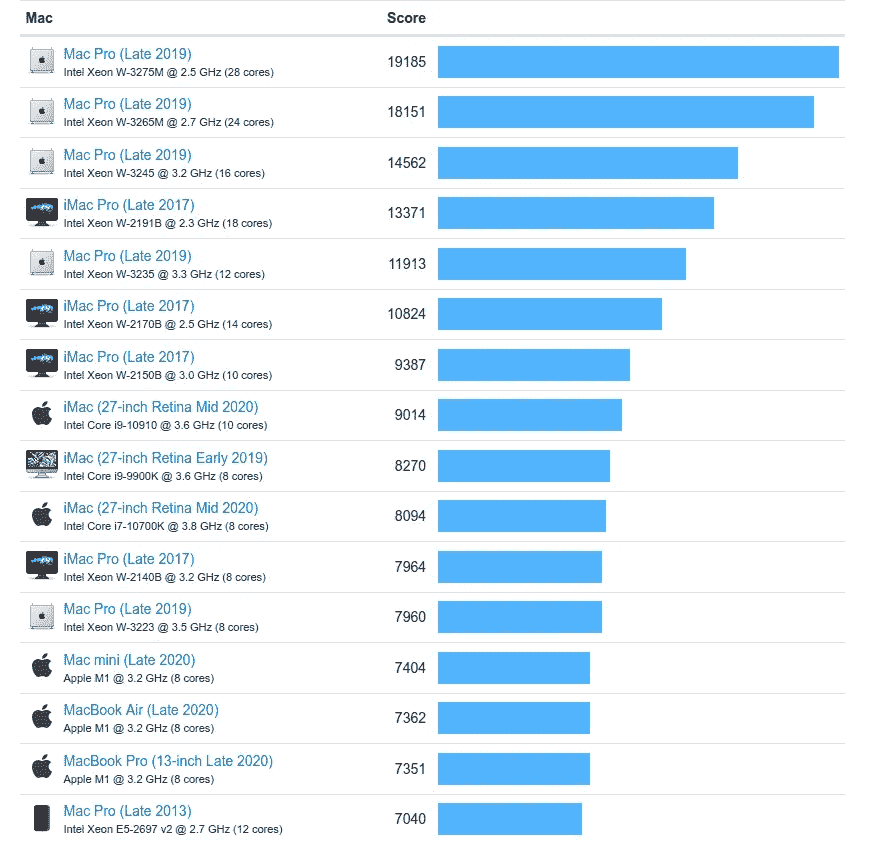
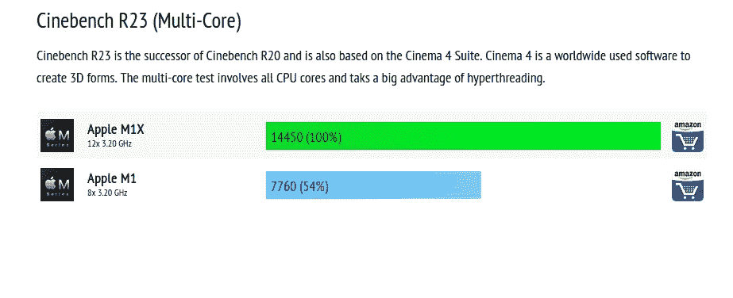
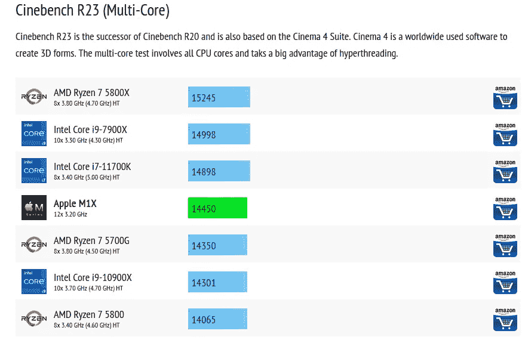
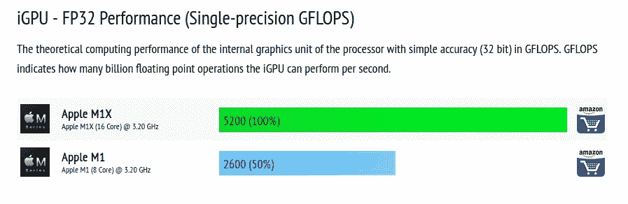

# 如果所有这些关于 M1 MacBook 的传言都是真的，那么其他笔记本电脑就惨了。

> 原文：<https://levelup.gitconnected.com/if-all-these-m1-macbook-rumors-are-true-then-other-laptops-are-in-for-hell-71a02eee9958>

## 一个 M1x 芯片出现在一个基准测试网站上，其多核性能是当前 M1 的两倍。

M1 的插图。信用: [**苹果**](https://www.apple.com/mac/m1/)

苹果芯片正在改变我们对 ARM CPU 性能的看法，直到去年我甚至不知道 ARM 可以比 x86 芯片表现得更好。

苹果公司在其 13 英寸笔记本电脑上使用的 [**M1 芯片**](https://www.apple.com/mac/m1/) 是库比蒂诺公司最伟大的创新之一。据 [**Geekbench 5**](https://browser.geekbench.com/mac-benchmarks) 报道，搭载 M1 芯片的苹果 Mac mini 在单核测试中以 1710 分的成绩击败了所有其他 Mac 电脑，而接下来的非 M1 mac 电脑是 2020 年的 iMac，搭载英特尔酷睿 i7–10700k，得分为 1251 分，即使是 Macbook air 也超过了这款高端机器。

单核基准测试。鸣谢: [**Geekbench。**](https://browser.geekbench.com/mac-benchmarks)

在 [**多核性能指标评测**](https://browser.geekbench.com/mac-benchmarks) 中，它的多核得分为 7，404，表现令人难以置信地好，尽管它没有在多核测试中夺冠，这是因为你不能指望 8 核 CPU 的表现优于得分为 19，185 的 28 核英特尔至强 CPU。虽然笔记本电脑的性能不应该总是基于基准，但它向我们展示了 M1 有多好。

多核基准测试。信用: [**极客工作台**](https://browser.geekbench.com/mac-benchmarks) 。

## M1x 的传言。

根据一个流行的基准测试网站 [**CpuMonkey**](https://www.cpu-monkey.com/en/cpu-apple_m1x-1898) 报道，有一款 M1x 正在生产中，将用于即将推出的 [**14 和 16 英寸 Macbook pros**](https://www.macrumors.com/guide/14-inch-macbook-pro/) 。根据这次泄露，M1x 有一个 12 核 CPU 和一个 16 核 GPU。

## 性能会提升多少？

我们先考虑 CPU。

从泄露的信息来看，苹果将使用四个高效核心和八个高性能核心。因此，苹果通常会将高性能 CPU 内核的数量增加一倍。我们必须清楚地注意到，传闻中的 M1x 和当前的 M1 采用相同的核心架构，所以我们很可能不会看到基本核心的任何世代改进。但是核心数量翻倍使得 M1x 在多核性能上领先据 CPU monkey 和热门 [**YouTuber，MaxTech**](https://youtu.be/VoVZzstoIJ0) **。**作为参考，M1 的多核分数为 7760 分，而 [**M1x 的多核分数为 14450 分。**](https://www.cpu-monkey.com/en/compare_cpu-apple_m1x-1898-vs-apple_m1-1804)

根据 CPU monkey 的说法，一个 M1x 对一个 M1 芯片。信用:[**CPU-猴子。**](https://www.cpu-monkey.com/en/compare_cpu-apple_m1x-1898-vs-apple_m1-1804)

拥有这种多核能力就如同使用英特尔的高端台式机 CPU，即酷睿 i7–11700k。而且让我们不要忘记，传闻中的 M1x 是一种笔记本电脑芯片，而不是台式机的变种。

根据 CPU-Monkey 的 M1x 的多核性能。信用:[**CPU-猴子。**](https://www.cpu-monkey.com/en/cpu-apple_m1x-1898)

GPU 端呢？

根据泄露的消息，GPU 部门也是一样，因为苹果将把 GPU 核心增加一倍。性能会提升 50%。作为参考， [**M1 在 iGPU-FP232 性能测试中得了 2600**](https://www.cpu-monkey.com/en/compare_cpu-apple_m1x-1898-vs-apple_m1-1804) 分，但是 M1x 得了双倍 [**分，得了 5200 分。**](https://www.cpu-monkey.com/en/cpu_benchmark-igpu_fp32_single_precision_gflops-11)

M1x 的 GPU 性能。信用:[**CPU-猴子。**](https://www.cpu-monkey.com/en/compare_cpu-apple_m1x-1898-vs-apple_m1-1804)

## 总结一下。

虽然这些都是谣言。但如果这被证明是真的，我们将会看到笔记本电脑芯片具有高端台式机的单核性能。以及高端台式机的多核性能。我不是苹果的粉丝，但我想听听你对今天还有哪一款笔记本电脑有这样的期待。这将是真正的野兽。

照片由 [**学妹特谢拉**](https://www.pexels.com/@junior-teixeira-1064069?utm_content=attributionCopyText&utm_medium=referral&utm_source=pexels) 发自 [**Pexels**](https://www.pexels.com/photo/semi-opened-laptop-computer-turned-on-on-table-2047905/?utm_content=attributionCopyText&utm_medium=referral&utm_source=pexels)

苹果正在将创新推向极限，其他笔记本品牌也应该开始将我们的想象力推向极限。竞争是好的，它有助于人类社会做出最好的东西。很快，我们将拥有性能甚至超过目前高端台式机的笔记本电脑。

如果你喜欢这篇文章，你可以给我 50 次掌声👏👏👏，如果你对技术和软件开发感兴趣，也可以关注我的 [***媒体***](https://konaduakwasiakuoko.medium.com/) 和社交媒体。您可以关注我的[***Twitter***](https://twitter.com/akuoko_konadu)因为我们将讨论编码和一般的技术世界，所以我的 DM 一直是开放的。加入我的[***YouTube***](https://www.youtube.com/channel/UCYKFy3oPn2b6gbjAzmgNgJg)让我们一起做一些编码。祝你有愉快的一天。下一次快乐编码。

如果你希望有人为你写科技文章，我很乐意为你写一篇**低至 5 美元的******。****

**我的头条新闻。**

** [## 苹果，你怎么这么久才来。传闻重新设计的 14 英寸和 16 英寸 MacBook Pro，2021 年。

### 自 2016 年以来，MacBook Pro 没有重大的重新设计，这是五年前的事情。苹果你准备好听…

levelup.gitconnected.com](/apple-what-took-you-so-long-rumors-of-redesigned-14-inch-and-16-inch-macbook-pros-2021-59b8e89ff53f)  [## 命令行，有那么强大吗？

### 黑客用命令行，命令行有什么特别的。

konaduakwasiakuoko.medium.com](https://konaduakwasiakuoko.medium.com/command-line-is-it-that-much-powerful-e846fb3ad7e8)  [## 开源和 Linux 进入太空，推动了人类想象力的极限。

### 你可以获得在火星直升机上运行的软件框架，并将其用于你的项目。开源是多么的…

levelup.gitconnected.com](/open-source-and-linux-makes-it-to-space-pushing-the-limits-of-human-imagination-a05e032aa884)  [## 程序员们，不要待在自己的舒适区里。

### 呆在我们的舒适区非常有趣，但后果是什么，我们如何才能阻止这种情况。

levelup.gitconnected.com](/programmers-dont-stay-in-your-comfort-zone-1b10e465b8cb)  [## 编写更好代码的 3 个最佳技巧。

### 写出漂亮的、更好的、可读的代码是一门艺术。

konaduakwasiakuoko.medium.com](https://konaduakwasiakuoko.medium.com/3-best-tips-for-writing-better-code-bda2bef4ec3d)  [## 如何在 Unity 中创建相机抖动效果

### 为了创造一个引人注目的故事，使用了不同的机制，其中之一是相机抖动效果，用于描绘…

konaduakwasiakuoko.medium.com](https://konaduakwasiakuoko.medium.com/how-to-create-a-camera-shake-effect-in-unity-e676e974a8f1) 

# 分级编码

感谢您成为我们社区的一员！ [**订阅我们的 YouTube 频道**](https://www.youtube.com/channel/UC3v9kBR_ab4UHXXdknz8Fbg?sub_confirmation=1) 或者加入 [**Skilled.dev 编码面试课程**](https://skilled.dev/) 。

 [## 编写面试问题+获得开发工作

### 掌握编码面试的过程

技术开发](https://skilled.dev)**