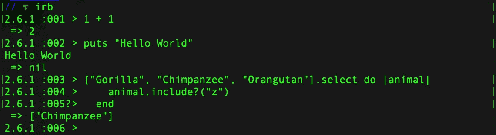
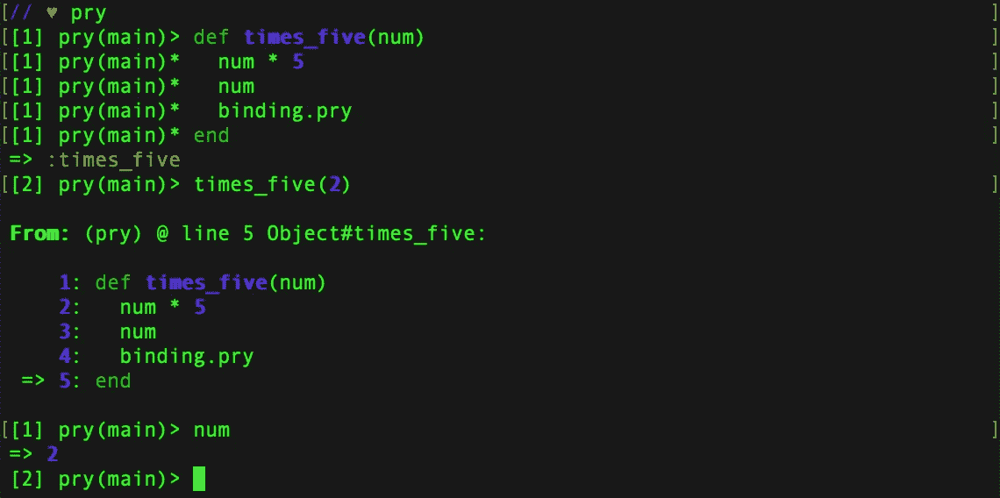
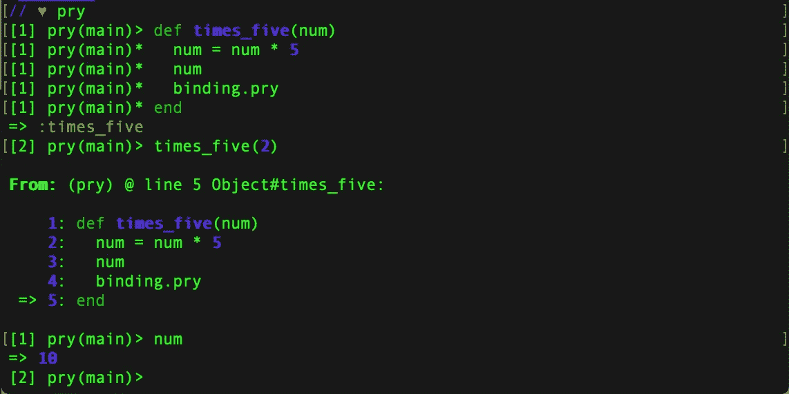

# 如果第一次你没有成功，撬，再撬

> 原文：<https://levelup.gitconnected.com/if-at-first-you-dont-succeed-pry-pry-again-8719c09bde2f>

学习新东西不容易。在学习一门新的编程语言时，磕磕碰碰是很自然的，在这种情况下，就是 Ruby。程序员整天与破碎的代码打交道，当某样东西终于工作时，他们会欢欣鼓舞。作为一个初学者，这是一个难以下咽的药丸，因为我们习惯了相反的情况。

这篇文章是写给所有开始学习 Ruby 的 00b 们的。

好消息！Ruby 是一种很好的语言。创造者松本幸宏设计了这种语言，使它更以人为中心，而不是面向机器。因为计算机是为人类而存在的，而不是人类为计算机而存在的。Ruby 被科技界的几个大公司使用——GitHub、Shopify、Airbnb。

无论如何，回到正题，准备好让 Pry 成为你最好的朋友——特别是 **binding.pry** 。

撬的是鲁比·REPL(*阅读、评价、打印、循环)。*其中一个你可能已经很熟悉了，那就是 IRB(交互式 Ruby)。如果没有，看看下面的图片，看看 IRB 在使用。

在命令行中键入 irb

Pry 比 IRB 灵活得多。如果您还没有安装 Pry 库，请在命令行中输入:gem install pry

一旦安装完毕，你就可以使用这个奇妙的 binding.pry 了。不要忘记在你的代码*的顶部加上:*require‘pry’*。当调试你的代码并找出哪里出错时，binding.pry 会有很大的帮助。*

下面是一个使用 binding.pry 的基本示例:

当我们使用 binding.pry 时，我们可以看到 **num** 返回 2，但它不应该返回 10 吗？

我们的方法*乘以 5*应该接收一个数，乘以 5 并返回结果。然而，它返回的是我们传入的数字，而不是相乘。在这种情况下，数字 2。这可能会令人沮丧，因为它看起来如此简单，公式就在那里！num * 5！！

在 binding.pry 中，我们可以测试/调试我们的代码，看看什么有效。让我们试着把 num 存储为一个变量，然后返回它，也许这样行得通？

**管用！YAAAAAASSSSSSS！！！**

因此，看起来我们所要做的就是将 num 存储为变量，它将返回我们所期望的结果，2*5 = 10！！

这是 binding.pry 的一个非常基本的用法，但我希望您能看到，随着代码变得越来越复杂，它对调试代码有多么有用。尤其是当你开始遍历散列和嵌套散列时。

编码有时会令人沮丧，主要是当你的代码没有达到你的预期时。但是永远记住……如果第一次你没有成功，那就撬，再撬。