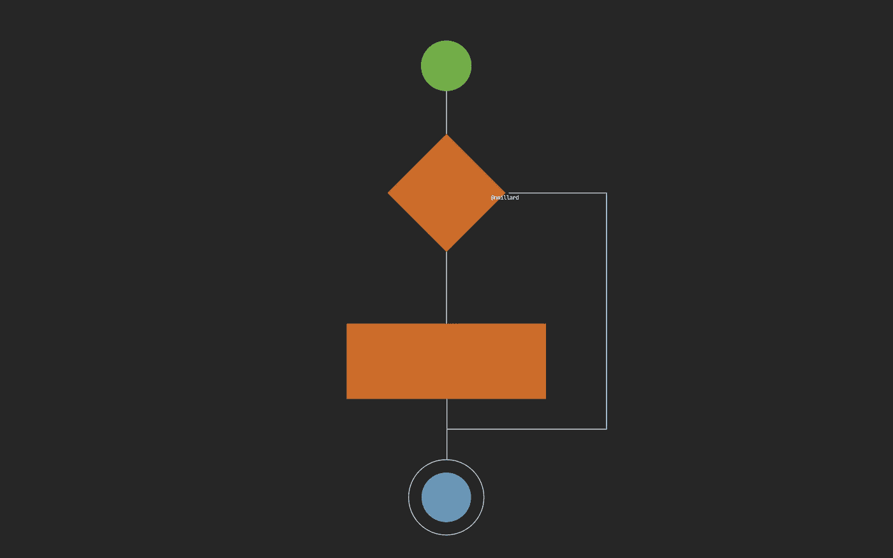
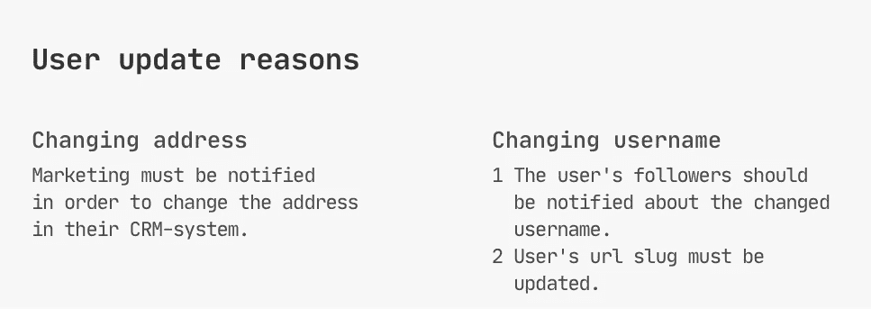
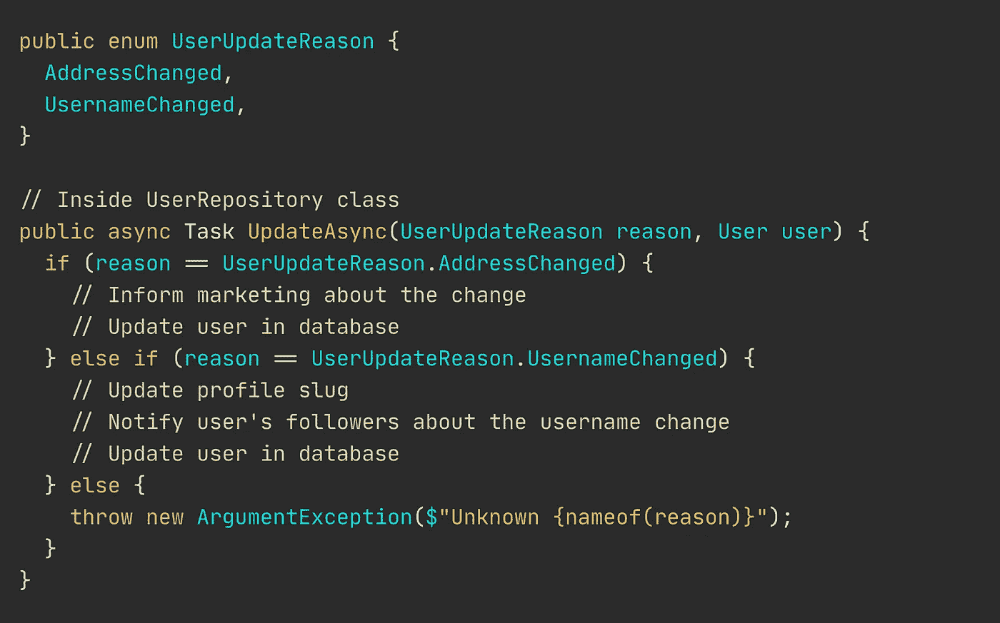
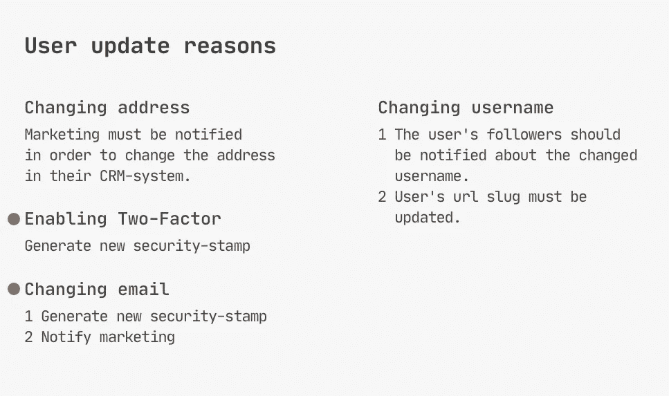
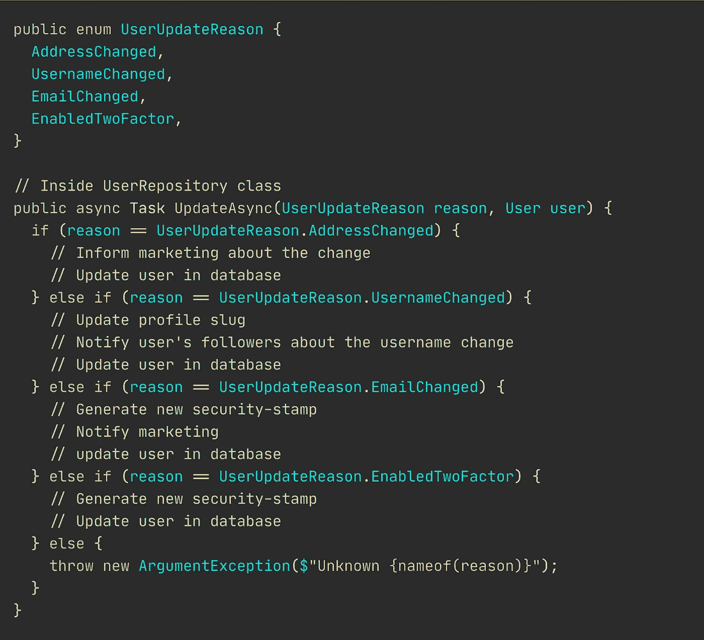
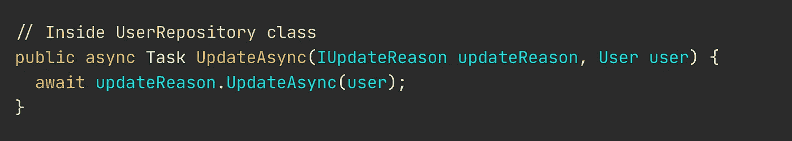
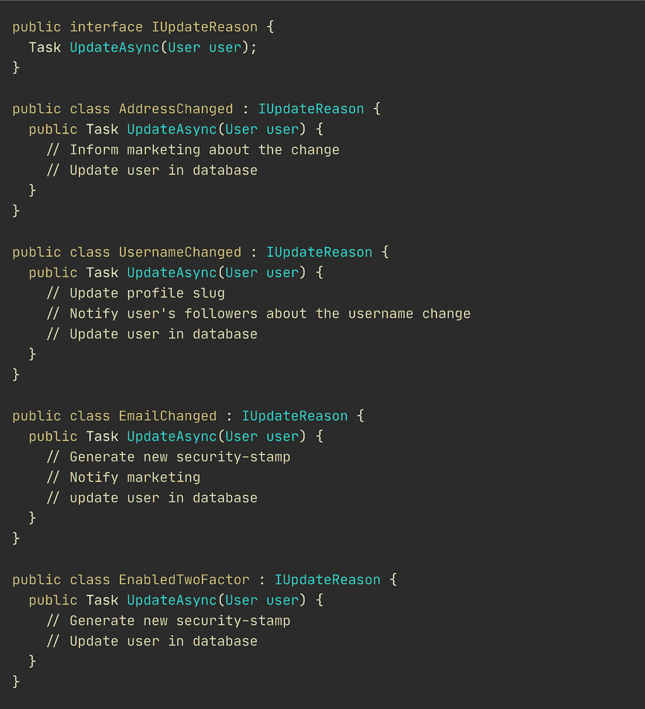

# If-Else 是穷人的多态

> 原文：<https://levelup.gitconnected.com/if-else-is-a-poor-mans-polymorphism-ab0b333b7265>

## 更好的软件设计

## 通过用对象替换 if-then-else 和 switch，将 6 行变成 92 行的艺术——变得更好。



鸣谢:作者

当然，`if-else`和`switch`有助于精简简单的代码。但是你的软件不应该包含尽可能少的行，牺牲可读性、可维护性或灵活性。

我看到枚举或其他离散值上发生了很多分支。当被告知不要使用`if-then-else`时，一些开发者甚至变得愤怒。

但是，你认为在你的`if-then-else`语句中使用枚举的后果是什么？

离散值上的分支使得你的软件很难改变。每一个新特性都要求你追踪分支发生的地方，并相应地修改你现有的代码。

*快速补充:如果你是视觉学习者，你可以跟随* [*这段新视频，它解释了消除 if-else 和 switch cases*](https://youtu.be/ufeZazqrHjM) *的不同方法。*

这绝对不是我们想要开发伟大软件的方式。这也许是让你的代码工作的完美的第一步。但是，当你进展到[让你的代码变得更好的时候](https://medium.com/@nmillard/the-principles-of-software-development-7415e7c5a156)，`switch`和`if-then-else`肯定早就消失了。

> 使用 if-else 和 switch 进行分支的传统方法已经过时。它不是实心的。不灵活。
> 
> 太可怕了。

传统的方法肯定没有面向对象的东西。但是，它正在蓬勃发展。这是有道理的，因为学生们被打得认为这是正确的，甚至是最佳实践。

当然，代码正在运行，但你知道你可以做得更好。目标应该是通过创建新的类来实现新的需求。

## 让我想象一下这个问题。

假设由于某种原因，您必须实现一种更新用户的方法。为了简单起见，一个用户只有两个理由在你的系统中被更新。



最初的一组需求

您在下面的代码片段中实现了这两种简单的情况。

请花点时间阅读这段设计糟糕的代码。毫无疑问，许多高级开发人员对此做着噩梦，甚至可能被认为是 PTSD 的触发因素。

是的，我在野外见过这样疯狂的代码。这是一个难以置信的天真的实现，它假设用户再也没有更多的理由去改变。



无用的 if-else 指令的可怕代码示例

关于这段代码，唯一值得一提的是它试图实现一种半 CQS 式的设计模式。

如果你倾向于说“这应该是一个开关！”你应该花一点时间来思考软件开发中什么是重要的。`Switch`超过`if-else`完全不相干。

## 你会受到新需求的冲击。一直都是。

新的需求随之而来。谁能想到呢？你那么确定什么都不会发生。

说你现在的需求是这样的。



额外要求

问题是，您真的打算通过添加额外的枚举值和添加两个额外的`else-if`来实现这两个更新用户的新理由吗？

如果你决定走上错误的道路，看起来会是这样。这段代码读起来不太好。



复杂、令人头痛的分支

这种实现本质上是穷人的多态。

除了必须不断添加额外的分支(这本身就是一种有问题的做法)之外，每当您必须调试或执行 bug 修复时，您都会被完全不相关的代码包围。

还有一个问题。这个方法签名对我们撒谎，因为它不仅仅是更新一个用户。它还根据更新原因选择执行哪个算法，甚至知道每个实现。到目前为止，每个人都很清楚这个方法有无数的责任。

我敢肯定这个例子固化了`if-else`和`switch`的一切可怕之处。

让我们来看看如何避免这种讨厌的方法。

## 重构多态执行非常容易。

您将把杂乱的基于分支的代码重构为内聚的、简单的类，这些类与实际需求保持一致。

在有人对使用类感到恐惧之前，让我先澄清一件事。实例化新类的成本通常可以忽略不计。不要试图优化你的代码，在它成为一个被证实的瓶颈之前。

好吧，我们继续。

我前面提到我们可以做得更好。我所说的更好，是指编写 1)可读，2)可维护，3)灵活的代码。

通过用多态执行代替传统的分支，在类和它管理的需求之间有一个清晰的关系。简单、高度内聚、职责明确的类易于维护。检测和纠正缺陷变得轻而易举。

最重要的是，您的软件可以轻松地容纳新的特性，而不必修改现有的类。

## 让重构开始吧

你会看到没有一个`if-then-else`或`switch`我们能走多远。

`UpdateAsync(Reason, User)`现在已经变得这么简单了。



简化的 UpdateAsync 方法实现

请注意，您现在采用的是接口参数，而不是枚举。现在，该方法将了解如何执行更新的责任委托给了一个专门化的对象。

具体实现看起来是这样的。我将关于构造函数参数和方法实现的细节留给您去想象。



UpdateReason 接口及其具体实现

每个类都完全符合它所管理的需求。与可怕的过时方法相比，调试、修复错误和测试现在要容易得多。

在这种情况下，任何新的需求都会产生一个专门的类。

我们可以很容易地在这里停下来，到此为止。您重构了讨厌的分支，并用多态性替换了它。您的代码现在是面向对象的，非常容易维护。干得好。

## 但是，还有最后一个问题。

你的`UpdateAsync(Reason, User)`现在有些多余了。

为了解决这个问题，我们不再进行重构。我们正着手重新设计系统的各个部分。

在这种情况下，创建命令对象和命令处理程序是有意义的。这将简化调用代码，因为它只需发送一个像`UpdateUserAddress`这样的命令，就会调用相应的处理程序的动作。

我有一篇文章发表在 2020 年 6 月的 [JetBrains 上。NET 简讯](https://blog.jetbrains.com/dotnet/2020/06/05/net-annotated-monthly-june-2020/)正是关于这一点。下面是链接。

[](https://medium.com/swlh/dynamic-command-dispatching-in-c-d3abe21b3d1b) [## C#中的动态命令调度

### 如何动态分派命令并调用相应的处理程序操作。

medium.com](https://medium.com/swlh/dynamic-command-dispatching-in-c-d3abe21b3d1b) 

[更新:这是一篇较新的文章，我在其中描述了命令和处理程序方法。](/replacing-if-else-with-commands-and-handlers-527e0abe2147)

# 你的主要外卖。

总之，在发现更合适的多态方法之前，传统的分支通常是学生的工具。

`if-then-else`和`switch`使得你的代码更难阅读、维护和调整。

下一次，当您使用传统的多路分支实现一个特性时，花点时间分析一下如何利用多态性和现代方法。

```
**Resources for the curious**
-------------------------[Making Your C# More Object-Oriented](https://app.pluralsight.com/library/courses/e9690e73-567d-4b35-91c0-4aae3e3be06e/table-of-contents) by Zoran Horvat[Creating Highly Configurable Code in Three Simple Steps](https://medium.com/swlh/creating-configurable-classes-that-are-easy-to-use-69d78d6881a2) by the Author
```


**Nicklas Millard** 是一名软件开发工程师，供职于一家发展最快的银行，负责构建任务关键型金融服务基础设施。

此前，他是 Big4 的高级技术顾问，为商业客户和政府机构开发软件。

> [新的 YouTube 频道(@Nicklas Millard)](https://www.youtube.com/channel/UCaUy83EAkVdXsZjF3xGSvMw)
> 
> *连接上* [*LinkedIn*](https://www.linkedin.com/in/nicklasmillard/)

# 分级编码

感谢您成为我们社区的一员！ [**订阅我们的 YouTube 频道**](https://www.youtube.com/channel/UC3v9kBR_ab4UHXXdknz8Fbg?sub_confirmation=1) 或者加入 [**Skilled.dev 编码面试课程**](https://skilled.dev/) 。

[](https://skilled.dev) [## 编写面试问题

### 掌握编码面试的过程

技术开发](https://skilled.dev)