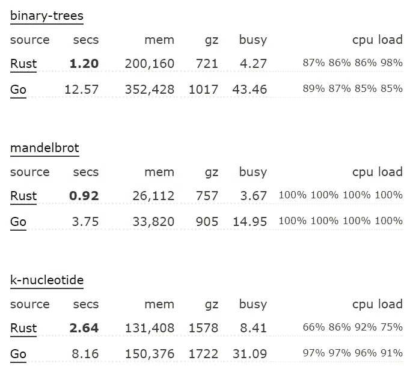
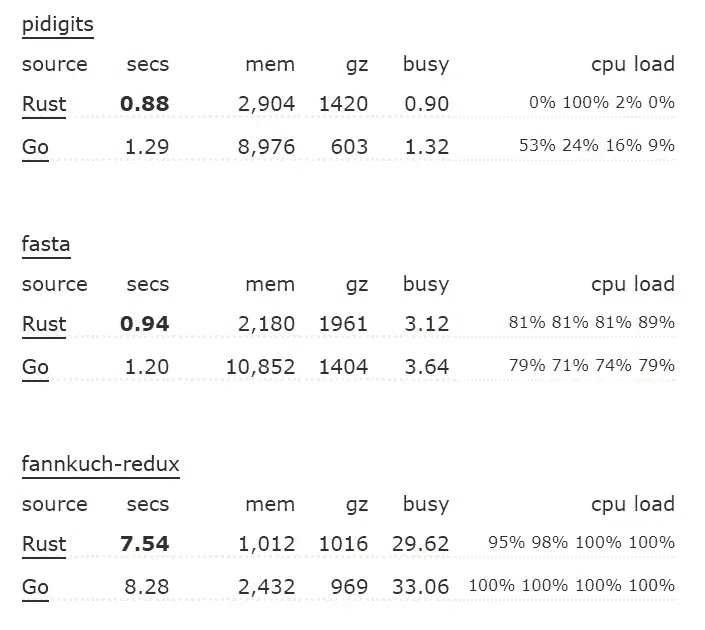
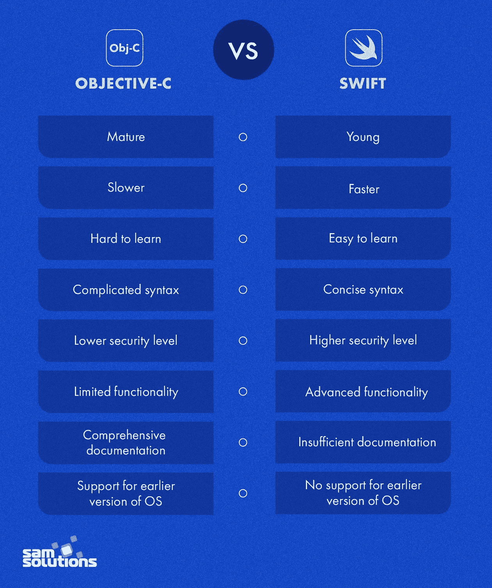
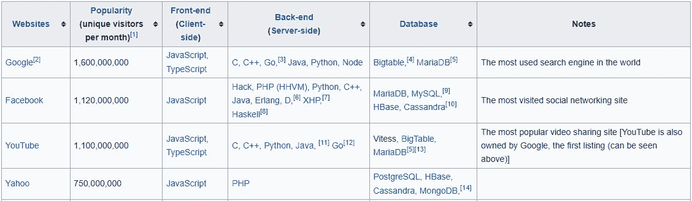
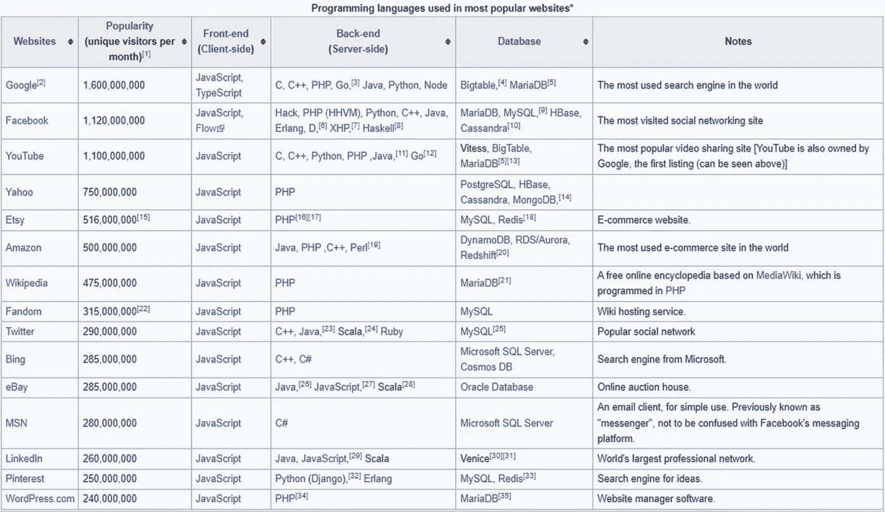
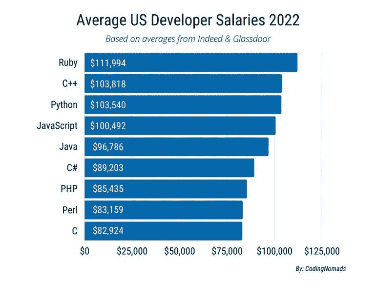

# 如果我这辈子只能学习 6 种编程语言，我会学习这些

> 原文：<https://levelup.gitconnected.com/if-i-could-only-learn-6-programming-languages-in-my-life-id-learn-these-22e05072dcf3>

## 要学的东西太多了，让我们把它缩减到六个吧

在 [Unsplash](https://unsplash.com/s/photos/programmer?utm_source=unsplash&utm_medium=referral&utm_content=creditCopyText) 上拍摄的 [ThisisEngineering RAEng](https://unsplash.com/es/@thisisengineering?utm_source=unsplash&utm_medium=referral&utm_content=creditCopyText)

如果让你选择一生只学习六种编程语言，你会选择哪一种？

学习任何语言都没有坏处。如果你有世界上所有的时间，你可以学尽可能多的语言。

时间是一种稀缺资源，而世界变化很快。学习和理解多种语言需要奉献和牺牲。

如果你把范围缩小到只有六个，你会有什么？以下是我的选择。

# 1.锈

根据维基百科，*“Rust 是一种多范式、通用编程语言，旨在提高性能和安全性，尤其是安全的并发性。它在语法上类似于 C++，但可以通过使用借用检查器来验证引用，从而保证内存安全。”*

Rust 无疑是 C/C++的更好版本。它的出现解决了 C++的缺点。它是为性能和安全而设计的。

即使没有什么，也没有什么值得讨厌的。在 2021 年栈溢出调查中，它被列为最受欢迎的编程语言。

将来，它可能会取代 C/C++。铁锈甚至比围棋更好。我知道他们不太相似。但在两者共有的方面，Rust 更胜一筹。

两种语言都可以在后端使用。下面是它们在性能上的比较。

[来源](https://benchmarksgame-team.pages.debian.net/benchmarksgame/fastest/rust-go.html)

Rust 的性能更好。下面是它们在内存管理方面的比较。

[来源](https://benchmarksgame-team.pages.debian.net/benchmarksgame/fastest/rust-go.html)

围棋有它的优点，比如对初学者友好。但当涉及到速度和内存管理等核心问题时，Rust 更好。

据[下网](https://thenextweb.com/news/move-over-python-rust-highest-paid-programming-language-2021)报道，Rust 是收入最高的编程语言。这是根据技术培训机构 O'Reilly 发表的研究。

# 2.迅速发生的

移动设备的普及程度达到了历史最高水平。它没有停止，更多的人继续采用智能设备。

普通人花在手机上的时间比任何其他设备都多。

目前，有一个从网络到移动应用的大规模转移。后者提供了更好的用户体验，并且更具交互性。也更贴近用户。

苹果宣布 Swift 是创建 IOS 应用程序的首选语言。他们计划在包括智能手表在内的所有设备上使用这种语言。

Objective-C 正在慢慢被诋毁，失去人气。它的替代品？斯威夫特。

[来源](https://www.sam-solutions.com/blog/objective-c-vs-swift-whats-the-difference/)

学习 swift 让你有能力征服 IOS 和所有其他首选 swift 的苹果产品。这样的能力是显而易见的。

苹果开发人员是收入最高的。找到一个真正优秀的苹果开发者不像其他语言那么容易。[需求是存在的，竞争是低的](/5-programming-languages-with-the-least-competition-yet-command-the-highest-salaries-852ee2f1bd79)。

# 3.科特林

Android 是世界上使用最多的操作系统。android 的核心是 Kotlin。谷歌正在慢慢抛弃 Java，推广 Kotlin。

2019 年，谷歌宣布 Kotlin 为创建 Android 应用程序的首选语言。

这样的声明意味着谷歌在未来有庞大的计划。语言只能成长。它将成为未来所有 android 应用程序的通用语言。

学习 Kotlin 让你有能力进入世界上最常用的操作系统。

如果你计划征服智能设备，有了 Swift 和 Kotlin，你将无所不能。Kotlin 开发人员的薪酬也很高，找到一个真正优秀的开发人员并不容易。

# 4.计算机编程语言

如果我重新开始，这可能是我学习的第一门语言。我从 C++开始，然后是 HTML 和 CSS。

从 Python 开始会让我的学习曲线更平滑，对编程的工作原理有更好的理解。

Google 算法是用 Python 搭建的。这是他们商业模式背后的语言。这使他们上升到统治地位。

在谷歌之前，雅虎是排名第一的搜索引擎。它的后端由 PHP 驱动。现在也是。下图。

[来源](https://en.wikipedia.org/wiki/Programming_languages_used_in_most_popular_websites)

谷歌带来了 Python，改变了一切。

Instagram 是世界上访问量排名第四的网站,它的后台是一个 Python 框架 Django。

各大 AI 库也是 Python 驱动的。张量流和 PyTorch。

作为开发人员，Python 给了你巨大的力量。它的用途和能力是巨大的。AI 和机器学习是你想征服世界和危险善的必学。

# 5.java 描述语言

前端之王，也可能成为后端之王。大多数网站，如果不是全部，都使用 JavaScript。

它已经成为 web 开发的主宰。下面是一个截图，显示了流行的网站在前端使用什么。

[来源](https://en.wikipedia.org/wiki/Programming_languages_used_in_most_popular_websites)

有了 JavaScript，你不需要任何东西就能征服网络。Javascript 的一个可能的竞争对手是 Dart with flutter。

后者仍处于婴儿阶段。它很有前途，但还不能在浏览器上运行。[Fuchsia](/keeping-up-with-fuchsia-googles-new-operating-system-4926150be848)等未来操作系统将原生运行 Dart。我们将到达那里。目前，我们还没有到那一步。

JavaScript 的强大之处在于它的框架。在前端，我们有 React 和 Vue。在后端，我们有一个包含 Express 和其他框架的节点运行时。

Typescript 还不错，但是它的框架 Angular 和 Nest 不如 React 和 Express 流行。后者有更好的文档和更大的社区。

学习 JavaScript 能让你在网上随心所欲地创作。你还可以通过 React Native 深入 Android 和 IOS 系统。虽然这不是我们所推荐的，但是您最好使用本机替代方案。

# 6.红宝石

这是初创企业最喜欢的语言。原因很清楚。Ruby 提供了其他语言所没有的。

它提供速度。我指的不是代码执行的速度，而是开发的速度。使用 Ruby，团队可以走得更快，完成更多。

作为一名开发人员，您需要快速的技能或工具箱。速度永远不可小觑。它可能意味着生或死。

你不想处于想跑却跑不动的境地。你有没有在梦里被人追却跑不动的经历？

太可怕了，你不会希望这种事发生在现实生活中。鲁比将避免这样的痛苦，你将能够随时运行。

Ruby 开发人员也是收入最高的。下图。

[来源](https://codingnomads.co/blog/the-best-programming-languages-to-learn/)

根据 CodingNomads 的数据，Ruby 的平均工资是所有开发者中最高的。这是根据 Indeed 和 Glassdoor 的平均数据得出的。

# 最后

学习本文中的语言会让你变得不可阻挡和危险。

你可以实现任何你想要的。无论是前端、后端、AI、机器学习、IOS 应用、Android 应用、IoT、web 3.0 等。

这些语言都不会减少，也不会在未来被抛弃。都是比较现代的，以后只会越来越好。

那些是我的选择，你的选择是什么？是的，没有 Java、PHP、Go、C++、TypeScript 或其他语言。使用上述语言，你可以存档任何东西。