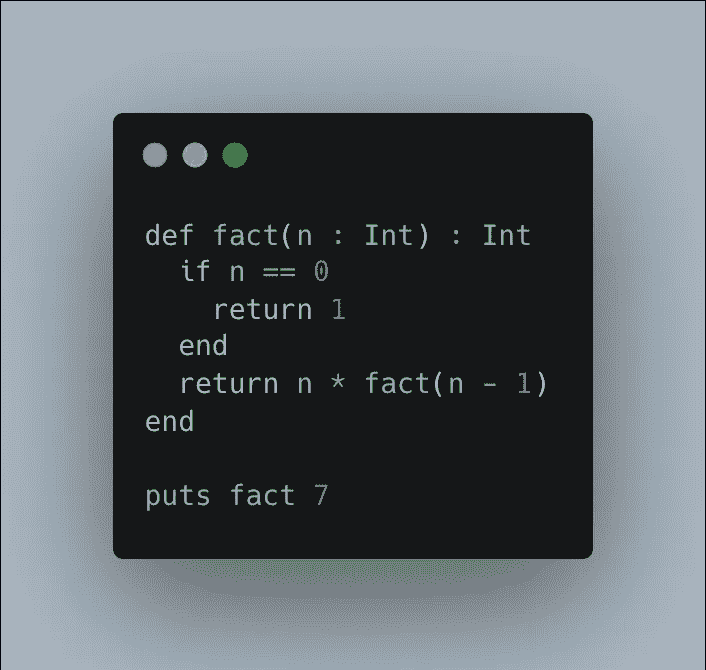
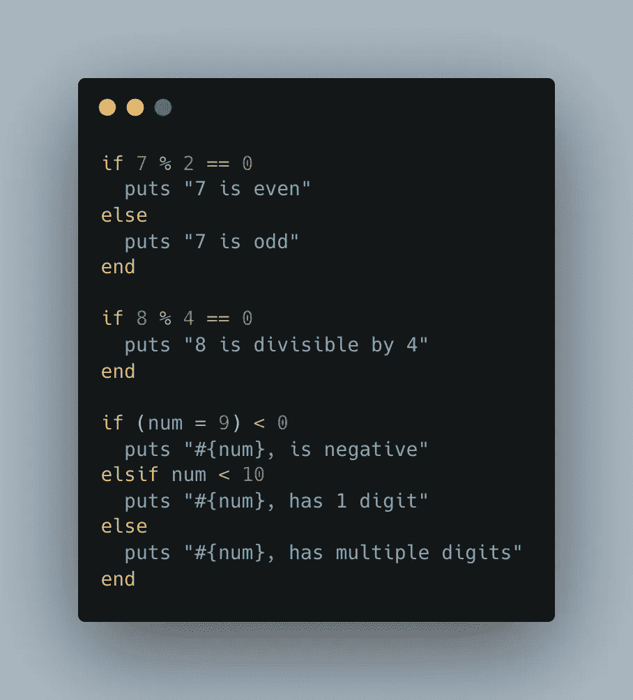

# 如果 Python 对你来说太慢，Crystal 可能是你的救星吗？

> 原文：<https://levelup.gitconnected.com/if-python-is-too-slow-for-you-might-crystal-be-your-savior-b679ae594ffa>

## 据它的创造者称，它读起来像 Ruby，运行起来像 C——或者更快

  L 学习一门新的编程语言能以你从未想过的方式打开你的思维。就像学习一门新的人类语言，如西班牙语或普通话，你学会用不同的单词和结构来思考。

你接触到说话者的文化和社区，了解他们如何看待这个世界。退一步说，这很充实。

编程语言的巧妙之处在于，你学习的第一门语言总是最难的。一旦你理解了 if 子句和 for 循环这样的基本结构，你会看到它们在你可能学习的许多新语言中出现。

而且，与人类语言不同，新的编程语言学习起来要快得多。它们更有逻辑性，用词更少——或者，我应该说，是命令。

由此可见，大多数程序员和数据科学家掌握不止一种编程语言。

他们可能有一个主要的或最喜欢的。但是我知道的大多数程序员每周至少使用五种语言，如果你把脚本语言也算在内的话。

大多数程序员偶尔也会尝试学习一门新语言。

这是工作带来的。编码意味着保持好奇。

# 水晶的案例

正如它的广告所说，Crystal 是一种像 C 一样快速，像 Ruby 一样流畅的语言。

关于它的光滑的部分是真实的。它是编译型和静态类型的，各有利弊。然而，最重要的是，它的风格与 Ruby 非常相似。

就我个人而言，我从未用 Ruby 写过更大的项目。但是作为一个相当有经验的 Python 开发者，Crystal code 看起来还是很清晰的！

下面是一个计算阶乘的递归循环示例:

晶体中的阶乘计算。图片由作者提供，代码取自 [Crystal by Example](https://github.com/askn/crystal-by-example)

对于不习惯 Ruby 的人来说，这个命令听起来有点奇怪。基本上是其他语言的`print`的恶趣味版本。`puts`和`print`之间有一些微妙的区别，但我们不会在这里深究。

除此之外，这个例子看起来很 pythonic 化，对吧？

if 从句也是如此:

Crystal 中的 If 子句。图片由作者提供，代码取自 [Crystal by Example](https://github.com/askn/crystal-by-example)

除了非 Ruby 母语者不习惯的有趣表达，这也是非常可读的。

一般来说，即使在处理更大更复杂的问题时，Crystal 的[语法也是清晰的](https://medium.com/@DuroSoft/why-crystal-is-the-most-promising-programming-language-of-2018-aad669d8344f)。

## 静态打字

Crystal 是静态类型的，但是你可能已经注意到在上面的例子中没有太多的类型标识符。这是因为 Crystal 只要求你指定一个变量的类型，如果它不明确的话。

当然，这种实践有助于程序员提高工作效率。

## 宏指令

静态类型语言往往对宏很挑剔。然而，克里斯托对他们很有一套。

如[这个例子](https://github.com/sam0x17/mongo_orm/blob/master/src/mongo_orm/fields.cr)所示，你可以在编译时使用一个 Crystal 宏，通过静态推理，根据另一段相同代码的内容来改变一段代码。尝试用 C++来做这件事，你要么失败，要么需要 500 多行代码。

你不是吗，天才？如果我错了，请告诉我…

这确实伴随着一些警告，因为正如有人所说，权力越大，责任越大。静态类型通常会减少一些危险，但是像 Crystal 所允许的那些功能强大的东西多少会破坏这种保护。

## 无零错误

说到安全，Crystal 在其他地方确实有额外的安全措施。Nil 是 Crystal 编译器的一个独立类型。因此，如果你试图访问一个结果为 nil 的方法或容器，编译器会警告你。这可能会导致编译失败，但至少您可以在运行潜在的大型代码之前修复错误。

## 不再有依赖地狱

如果你曾经用 Python 处理过一个大问题，你可能知道[依赖地狱](https://medium.com/geekculture/want-to-start-a-large-project-keep-away-from-python-af840b6d21c2)是什么样子。

一个 Python 模块可能依赖于另外几个模块，一旦导入了所有需要的模块，您就会意识到不同的模块版本是不兼容的，现在您必须弄清楚使用哪个版本来使所有的模块都匹配在一起，当您的项目达到一定的规模时，所有这一切可能需要几个小时才能完成。

在 Crystal 中，依赖管理是一种魅力。在 Crystal 中，这些模块被称为*碎片*，它们通过静态链接被编译成二进制可执行文件。我可以详细说明这一点，但是让我们长话短说:这样依赖关系管理就容易多了。

# 最大的缺点是:水晶很小

Crystal [在 2017 年有一个时刻](https://www.infoworld.com/article/3212970/java-and-c-hit-all-time-lows-in-tiobe-language-popularity-index.html)，在短短一个月内，它在 TIOBE 指数上从第 60 位跃升至第 32 位。这种迅速崛起的原因很难理解，但很可能 Crystal 的创造者在当时做了大量的市场营销，并引起了 Ruby 程序员的好奇。

然而，克里斯托的成名并没有持续很久。在写这篇文章的时候，Crystal 还远没有达到 T2 TIOBE 指数 T3 的前 50 名。

因为它早期的受欢迎程度，一些人曾希望它能像《铁锈》一样与《T4》有相似的受欢迎程度。

然而，这并没有成为现实。

程序员已经表达了对样本项目或代码库的失望。此外，文档似乎有点不完整。这使得新程序员们趋之若鹜。

正因为如此，Crystal 社区非常小，如果你遇到问题，你必须等一会儿才能得到帮助。只是在 StackOverflow，GitHub 之类的上没有那么多答案。

# 另一个缺点是:Crystal 没有承诺的那么快

Crystal 的创造者希望这种语言能像 c 一样快。

这可能是个别情况下的情况。然而，在标准基准测试中，Crystal 执行的时间[是 C 执行时间](https://github.com/the-benchmarker/web-frameworks)的两倍。

编程语言(或科技公司，就此而言)有夸大的使命陈述并不罕见。而且，平心而论，C 的一半速度还是相当快的。

然而，Crystal 的交付远远低于其最初的承诺。这太明显了，我不能责怪普通开发人员感到失望。

# 著名的遗言:Crystal 只适合有经验的程序员

我喜欢探索新的编程语言，但我更喜欢有大型支持社区的文档良好的语言。很多程序员都有类似的感觉。

Crystal 尝试过主流的吸引力，但总的来说，它在过去几年中失败了。

这并不意味着 Crystal 没有一些有趣的用例。对于使用区块链技术的人来说，这可能是一个有趣的选择。你可以用水晶创造一种相当强大的加密货币。

也就是说，除非对 Crystal 的文档、营销和一般社区支持没有改善，否则它对普通区块链开发者来说也不是一个好的选择。

想玩 Crystal 这样的语言，最好带点经验。因为当你面临问题时，可能没有人会帮助你。

*感谢* [*瑞奇*](https://versalytics.medium.com) *启发了这个故事！*

*成为* [*中等会员*](https://arijoury.medium.com/membership) *对我的内容拥有完全访问权限。*

# 分级编码

感谢您成为我们社区的一员！在你离开之前:

*   👏为故事鼓掌，跟着作者走👉
*   📰查看[升级编码出版物](https://levelup.gitconnected.com/?utm_source=pub&utm_medium=post)中的更多内容
*   🔔关注我们:[Twitter](https://twitter.com/gitconnected)|[LinkedIn](https://www.linkedin.com/company/gitconnected)|[时事通讯](https://newsletter.levelup.dev)

🚀👉 [**加入升级人才集体，找到一份惊艳的工作**](https://jobs.levelup.dev/talent/welcome?referral=true)