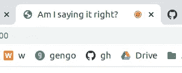

# 如果网络应用可以说话——网络语音 API 简介

> 原文：<https://levelup.gitconnected.com/if-web-apps-could-talk-intro-to-the-web-speech-api-c9f7e0e83aff>

由[杰森·罗斯韦尔](https://unsplash.com/@jasonrosewell?utm_source=medium&utm_medium=referral)在 [Unsplash](https://unsplash.com?utm_source=medium&utm_medium=referral) 上拍摄的照片

*建立一个时髦的发音检查器，使用简单的 JavaScript 来判断你的语言技能*

如果在您的 web 应用程序中添加语音到文本和文本到语音的功能很容易，会怎么样？不要害怕，有一个 API 可以做到这一点。HTML5 的本机 [Web 语音 API](https://developer.mozilla.org/en-US/docs/Web/API/Web_Speech_API) 提供了两个接口来轻松处理语音数据:[语音合成](https://developer.mozilla.org/en-US/docs/Web/API/SpeechSynthesis)用于将文本转换为声音，而[语音识别](https://developer.mozilla.org/en-US/docs/Web/API/SpeechRecognition)用于相反的操作。

尝试一下 Web Speech API，你会发现很多关于使用`SpeechSynthesis`或`SpeechRecognition`的教程，但是这个教程将会让你用一个不超过 HTML/CSS/JavaScript 的应用程序一举两得。你的最终目标是:

你能说出来吗？

在这里尝试一下。用户选择一种语言，输入想要说的短语，然后按“听”来听到它被大声说出来。接下来，他们按“说”来激活麦克风并记录他们的最佳尝试。最后，应用程序向用户显示它听到了什么，并让他们知道他们的话语是否符合他们的目标。

## **免责声明！**

在你开始计划你的百万美元的应用程序，完全运行在声音命令上，就像星际迷航一样，注意警告。

*   **网络语音 API 是实验性的**。虽然原生于 HTML5，但它还不是佳能，规格可能会改变。
*   浏览器兼容性有限。总而言之，90%的用户可以使用语音合成，而只有 68%的用户可以使用语音识别。为了简单起见，我们将为 Chrome 浏览器设计这个应用程序。 *(注:移动端，SpeechRecognition 只兼容安卓版 Chrome 和安卓浏览器。)*

这个是为了好玩！

既然已经解决了，我们就开始吧。

# 入门指南

创建一个名为`am-i-saying-it-right`的空项目目录。在里面，添加一个名为`index.html`的文件，并为您的应用程序结构粘贴以下代码。

index.html

兴趣点:

*   [动画。CSS](https://github.com/daneden/animate.css/) 被导入到<头部>中，以便稍后为我们的麦克风按钮制作动画
*   语言的<选项>标签中的`value`属性保存了网络语音 API 识别的语言代码(参见此处的非官方列表[)。例如，我们稍后将使用它们来告诉引擎“听中文”或“说法语”。](https://github.com/TalAter/annyang/blob/master/docs/FAQ.md#what-languages-are-supported)
*   空的`#result-message` < div >会用来告诉用户他们的发音是好还是烂。
*   `main.js`是用<脚本>标签中的`type="module"`导入的，因此我们可以通过关注点组织我们的脚本，并在`main.js`中将其作为模块导入

接下来，通过创建一个文件`style.css`并粘贴[这段代码](https://github.com/clairefro/am-i-saying-it-right/blob/master/style.css)来引导你的风格。

您的文件树现在应该如下所示:

在 Chrome 浏览器中加载 index.html 应该会得到这个结果:

沉默的美丽。

您会注意到它还没有做任何事情。让我们开始让应用说话吧。

# 让语言存在！

语音合成的基本语法非常简单:

基本语音合成语法

`speechSynthesis`接口只“朗读”[speechsynthesisatinterance](https://developer.mozilla.org/en-US/docs/Web/API/SpeechSynthesisUtterance)s。要让浏览器朗读，首先创建一个`SpeechSynthesisUtterance`并将您想要朗读的字符串赋给它的`text`属性。所说的语言将默认为应用程序的`<html lang="..." >`值，除非使用话语的`.lang`属性指定了语言代码。

基于此，让我们创建一个名为`speakText()`的函数，它用给定的语言朗读给定的字符串。在应用程序的根目录下，创建一个名为`textToSpeech.js`的模块文件，并插入以下代码:

textToSpeech.js

第 3–5 行检查用户的浏览器是否支持`speechSynthesis`，如果不支持，则提示他们使用 Chrome。

剩下的已经很熟悉了——我们创建一个新的`[SpeechSynthesisUtterance](https://developer.mozilla.org/en-US/docs/Web/API/SpeechSynthesisUtterance)`,并用给定的`text`(字符串)和`lang`(也是一个字符串)参数对其进行配置。最后，我们导出模块，在一个名为`main.js`的新文件中使用它。

创建新文件`main.js`。也许你已经意识到项目中的所有文件都在根目录下:

这是放入`main.js`的代码:

主页. js

在顶部，您导入刚刚创建并导出的`speakText()`函数。然后从 DOM 中抓取“听”按钮、文本输入字段和语言选择器。最后，向“Hear it”按钮添加一个点击事件监听器，以触发我们的`speakText()`方法，在点击时大声读出输入文本。

听起来容易说起来难

您很高兴听到您的浏览器说法语，但当您尝试“听”它时，您可能会在控制台中看到这样的错误:

什么？

这是我的错，因为我让你使用 JavaScript ES6 模块，出于安全原因，需要你的代码来满足脚本引用。如果你愿意，你可以在这里阅读。

如果你还没有在`localhost`上发布你的代码进行测试，那么**现在是时候发布你的服务器了**。如果你不确定该怎么做，一个简单的解决方案是按照这些快速说明在你的项目文件夹[中运行 Python 的`SimpleHTTPServer`。一旦你的服务器打开，你就可以从 URL `http://localhost:<PORT NUMBER HERE>/`访问你的应用程序，并听到它对你说法语。以我为例:](https://developer.mozilla.org/en-US/docs/Learn/Common_questions/set_up_a_local_testing_server)

在你喊“虫子”之前确保您的音量已打开。

事实上，它现在可以说你选择的任何语言。继续听日本或德国风味的 omellete au fromage。

# 介绍演讲识别

到目前为止，这款应用已经很有趣了。也许你想今天就到此为止，用它来揭开你橱柜里所有法国葡萄酒名字的神秘面纱，或者让你妈妈知道这些年来她一直把藜麦的发音念错了。

但是我们还没有看到最精彩的部分——评判因素！

`SpeechSynthesis`和`SpeechRecognition`是本教程的重点。我们已经做了肉——下面是土豆的基本语法:

基本语音识别语法

首先，使用 Chrome 的`[webkit](https://developer.mozilla.org/en-US/docs/Web/API/SpeechRecognition#Browser_compatibility)` [前缀创建一个](https://developer.mozilla.org/en-US/docs/Web/API/SpeechRecognition#Browser_compatibility)`[SpeechRecognition](https://developer.mozilla.org/en-US/docs/Web/API/SpeechRecognition)`的实例。在用`.lang`属性配置了识别器的语言后，您告诉它启动麦克风并开始监听语音。

对于识别器来说，有一些事件[可用，但是我们主要感兴趣的是`'result'`，一旦单词或短语被正确识别，它就会触发。该事件的`results`属性返回一个](https://developer.mozilla.org/en-US/docs/Web/API/SpeechRecognition#Events)`[SpeechRecognitionResultList](https://developer.mozilla.org/en-US/docs/Web/API/SpeechRecognitionResult#Examples)`对象，我们可以钻取该对象以获得已识别文本的副本。上面我们在控制台的第 7 行显示了文字记录，如果文字确实被识别的话。如果你对`[SpeechRecognitionResultList](https://developer.mozilla.org/en-US/docs/Web/API/SpeechRecognitionResult#Examples)`物体的样子感到好奇，这里有一个我用英语说“我有两条眉毛”的例子:

“结果”事件返回的 SpeechRecognitionResultList 示例

这里要注意两件事:

1.  **你需要通过网络服务器提供你的代码，以便在 Chrome 中进行识别**。不要担心——我们已经用前面的`localhost`设置好了。
2.  在会话中第一次对`SpeechRecognition`对象调用`.start()`时，用户将被**提示麦克风访问**。你不能回避这个问题。是为了防止在人们不知情的情况下刺探他们的言论。

令人讨厌的必需品。

# 向我们的应用添加语音识别

在 app 的根目录下做一个模块，名为`speechToText.js`。您将创建一个名为`recognizeSpeech()`的函数，它接受一种语言，启动该语言的识别器，并在完成监听后返回一个包含识别器结果的[承诺](https://developer.mozilla.org/en-US/docs/Web/JavaScript/Reference/Global_Objects/Promise)。

请注意，所有这些识别魔法都发生在云中的一个黑盒中，这使得它成为一个异步操作。我们将使用`async`和`await`关键字来告诉 JavaScript，“嘿，这是一个异步调用，在对它做一些事情之前，等待从云中听到包含我们的脚本的已履行承诺的回复！”

speechToText.js

不要忘记导出这个模块，这样我们就可以在`main.js`中使用它。

现在我们需要在用户点击“说出来”按钮时触发我们的`recognizeSpeech()`。切换到`main.js`并导入你刚刚做的`recognizeSpeech`函数，就在你导入的`speakText`的正下方。我们将抓取并添加一个事件监听器到`recognizeButton`，在`speakButton`事件监听器下面(省略):

这是怎么回事？从下拉列表值中获取用户选择的语言后，我们将其传递给`recognizeSpeech()`函数。一旦用户结束讲话，该函数将返回一个包含识别记录的承诺。我们将这个实现的承诺的结果显示为第二个输入框的文本值，这样用户就可以看到他们说了什么。最后，`.catch`将拦截该承诺链中可能出现的任何错误，并将其显示在控制台上。

我们来试试吧！确保你的服务器是开着的，点击“说出来”，允许麦克风，你应该会在你的标签上看到某种图标，表明麦克风正在监听。

试一试:

我小时候看了太多德克斯特的实验室。

你现在已经掌握了多种语言的**语音合成**和**语音识别**！但是有一个问题——当你发错音的时候，怎么能无礼呢？

# 最后润色

**通过显示信息判断用户的发音**

还记得 HTML 中的空 div `#result-message`吗？在这里，我们将向用户显示一条消息，让他们知道他们是否成功地说出了这个单词。创建一个名为`compare.js`的新模块文件，并添加以下代码。

compare.js

这个`compare()`函数比较目标字符串和用户的尝试，然后在 div 中显示成功或失败的消息，并在两秒钟后重置为正常之前将背景颜色更改为绿色或红色。一定要将这个函数`export`、`import`到 main.js 中，然后在异步`recognizeSpeech()`上的`.then`的链中作为附加动作调用它。以下是反映这些新增内容的完整的`.main.js`文件:

main.js(增加了第 3 行，第 29–31 行)

我相信你能想到更时髦的东西。

**激活时激活“说出来”按钮**

当话筒处于活动状态时，让用户更容易看到。我用了[动画。CSS](https://github.com/daneden/animate.css/) 通过添加类名来激活元素。我用[这个辅助函数来切换动画类](https://github.com/clairefro/am-i-saying-it-right/blob/master/animate_button.js)，然后在识别器的‘开始’和‘结束’事件的`speechToText.js` 中调用它。

speechToText.js 中的 inside recognizeSpeech()

现在，当麦克风处于活动状态时，按钮会跳动——相信我。

# 结论

鉴于其有限的浏览器兼容性，使用 Web Speech API 为您的应用程序添加语音可能是一个不错的额外功能。使用 Web Speech API，只需 3-5 行普通的 JavaScript 代码，您就可以让您的浏览器说话或收听。你甚至知道如何用承诺来处理成绩单的结果，让你有能力用声音导航一连串的事件。声乐世界是你的牡蛎，去坚果。但是要理智——你可能不希望用户在火车上大喊他们的密码或社会安全号码。

参见本教程的完整代码[此处](https://github.com/clairefro/am-i-saying-it-right)，试用 app [此处](https://clairefro.github.io/am-i-saying-it-right/)。