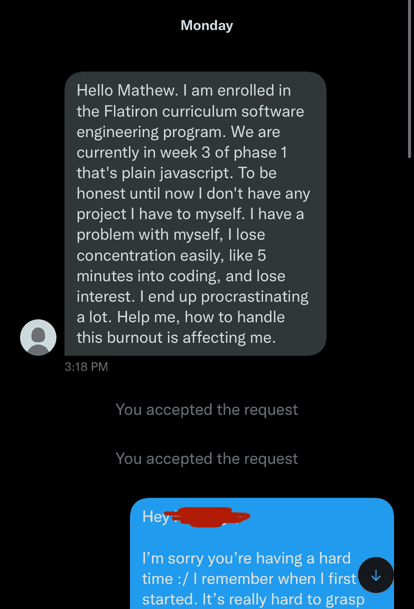
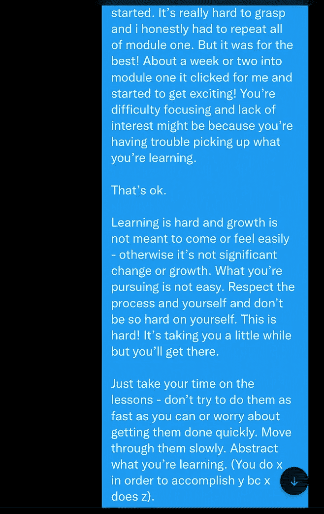
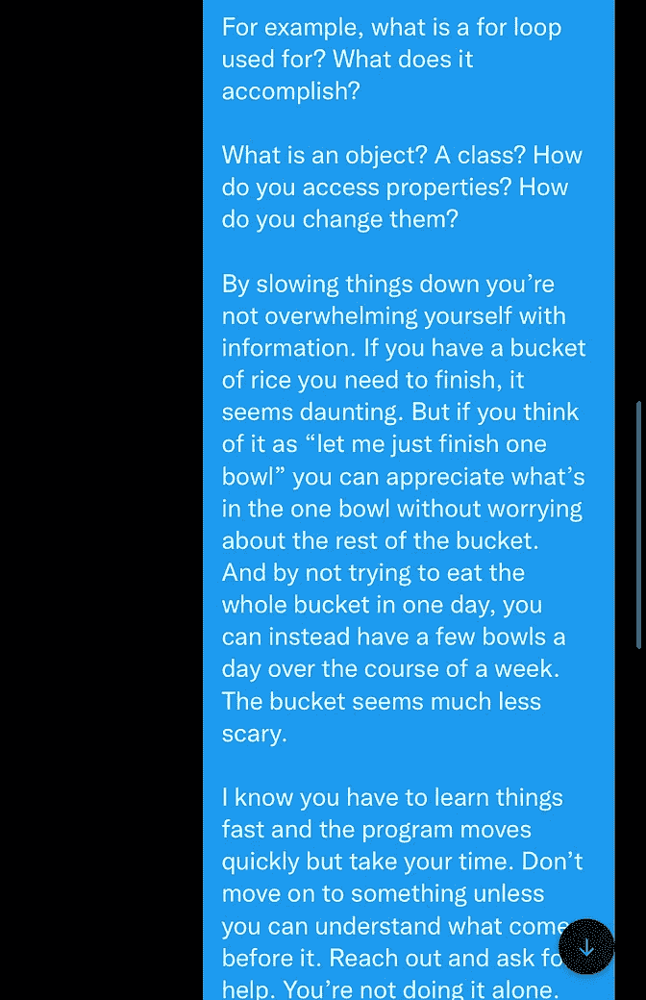
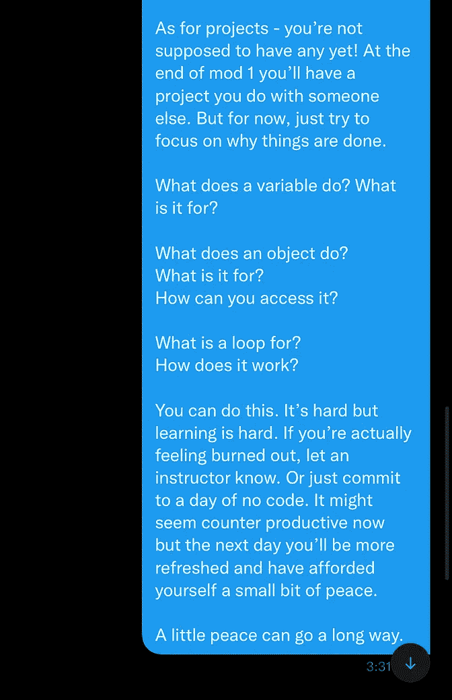
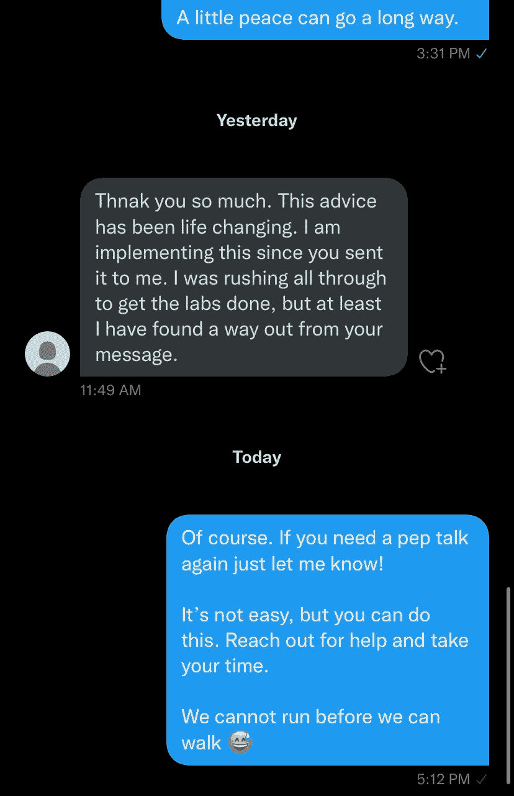

# 如果你在你的编码训练营中苦苦挣扎，请阅读这篇文章

> 原文：<https://levelup.gitconnected.com/if-you-are-struggling-in-your-coding-bootcamp-read-this-2e316439b56f>

## 在你会走之前，你不能跑

我最近收到了一个陌生人发来的 Twitter 消息。我犹豫着要不要跟着他们回去。我不知道会发生什么。

但是现在，我很高兴我做到了。

他们是熨斗学校软件工程项目的学生——这个项目是我在 2017 年参加的，改变了我的生活。他们很难理解他们所学的东西。

下面是他们发的消息截图。

## 我自己的奋斗

这条信息引起了我的共鸣，因为我也感受到了这种恐慌。我*本人*在第一次学习第一单元时就体验到了这种不安全感、怀疑和紧张。

我失败了，马上觉得这不适合我。

失败后，我研究如何把钱拿回来，甚至浏览了电视制作工作。最初促使我想转行的行业，现在又在引诱我回去。

我的家人，尤其是我的堂兄[里科·德桑蒂斯](https://www.linkedin.com/in/ricodesantis/)(他当时也在进行自己的训练营之旅)说服了我坚持下去。为此，我永远心存感激。

> 通过创建一个[中型合作伙伴计划账户](https://matt-croak.medium.com/membership)和[订阅我的电子邮件](https://matt-croak.medium.com/subscribe)，获取我所有的最新内容。:)

## 我的信息

我真的很同情这个人，想说些安慰和鼓励的话。我现在有特权分享一些东西，因为我通过了这个项目，并在过去 4 年多的时间里作为一名软件工程师取得了成功。

我想我会把它写成一篇博客，希望任何在谷歌上搜索如何通过训练营的人都能找到它。下面是我写的(我修正了一些语法问题和布局，使其更具可读性)。

> 嘿[略]，
> 
> 很抱歉你过得不好:/我记得我刚开始的时候。这真的很难理解，老实说，我不得不重复第一单元的所有内容。
> 
> 但这是最好的结果！
> 
> 第一单元开始一两周左右，我突然明白了，开始变得兴奋起来！你难以集中注意力和缺乏兴趣可能是因为你在学习时遇到了困难。
> 
> 没关系。
> 
> 学习是艰难的，成长并不意味着来之不易或感觉容易——否则就不是重大的变化或成长。你所追求的并不容易。尊重过程，尊重自己，不要对自己那么苛刻。这太难了！这需要一点时间，但你会成功的。
> 
> 慢慢来——不要试图尽快完成，也不要担心能否快速完成。慢慢穿过它们。抽象你正在学习的东西(你做 x 是为了完成 y bc x 做 z)。
> 
> 例如，For 循环是用来做什么的？它能完成什么？
> 
> 什么是对象？一节课？如何访问属性？你如何改变它们？
> 
> 通过放慢速度，你不会被信息淹没。
> 
> 如果你有一桶米需要吃完，这似乎令人生畏。
> 
> 但是如果你把它想成“让我先吃完一碗”，你就可以欣赏这一碗里的东西，而不用担心桶里的其他东西。
> 
> 不要试图在一天内吃完整桶，你可以在一周内每天吃几碗。
> 
> 水桶似乎没那么可怕了。
> 
> 我知道你必须快速学习，项目进展也很快，但是要慢慢来。除非你能理解之前发生的事情，否则不要继续前进。伸出手寻求帮助。你不是一个人在做。
> 
> 至于项目——你还不应该有任何项目！在第一单元结束时，你会有一个和别人一起做的项目。但是现在，试着把注意力集中在为什么事情会这样做上。
> 
> 变量是做什么的？这是为了什么？
> 
> 一个对象是做什么的？这是为了什么？你如何访问它？
> 
> 什么是循环？它是如何工作的？
> 
> 你能做到的。
> 
> 很难，但是学习很难。
> 
> 如果你真的感到筋疲力尽，告诉教练。或者只是承诺一天没有代码。现在看起来可能会适得其反，但是第二天你会更加精神焕发，给自己一点平静。
> 
> 一点点平静会有很大帮助。

以下是我最初回应的截图。

这就是为什么我决定将这条信息保存为一篇博客文章，这样任何人都可以找到它，保存它，做他们想做的任何事情，这样他们就可以吸收和欣赏这条信息。

## 摘要

这个 **不会**来得容易。

**不要指望通过死记硬背或临时抱佛脚的方式度过高中或大学时光。**

如果你慢慢来，你会度过这个难关的。

对你正在学习的东西进行抽象和概念化。

**开头**是程序最重要的部分。它为你从中得到多少定下了基调。

决定你成功与否的不是尽快完成多少功课，而是耐心。

第一次我走得太快了，不得不重复。我把所有的课程都复习了一遍，耐心地沉浸其中。

后来有一天，我的新团队中有人问我，他们需要知道什么来应对代码挑战。令我惊讶的是，它一拍即合。我在解释(即理解)曾经让我恐慌的事情。

如果你正在你的训练营，熨斗或者其他地方挣扎，我希望你能找到这条建议并从中获益。

你可以，也一定会成功。

当你通过程序(你会的！)，看看我写的给训练营毕业生提供建议的帖子。它很好地为我服务，希望它也能为你服务！

[***升级您的免费 Medium 会员资格***](https://matt-croak.medium.com/membership) *，就能收到各种出版物上数千名作家的无限量、无广告的故事。这是一个附属链接，你的会员资格的一部分帮助我为我创造的内容获得奖励。*

*您也可以通过电子邮件* [***订阅，每当我发布新内容时，您都会收到通知！***](https://matt-croak.medium.com/subscribe)