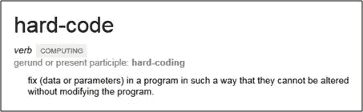

# 如果你是网络抓取者，不要做这些事情

> 原文：<https://levelup.gitconnected.com/if-you-are-web-scraping-dont-do-these-things-2cba2ebe5b29>


来源: [Imgur](https://imgur.com/gallery/bjD7f3p)

Web 抓取是许多程序员最喜欢的消遣。我觉得我参与的 3 个项目中有 2 个最终需要我做网络搜集。也就是说，我见过很多糟糕的网络抓取脚本。更糟糕的是，有人真的对有这些问题的代码收费。

# 1.不要硬编码会话 Cookies



我保证我剩下的照片会更好…来源:【teamscs.com

停下来。只是。停下来。你硬编码的任何东西都有可能悲惨地失败。这里有一个例子，说明这可能是什么样子，而不是你应该做什么。

你的客户有一个网站，他们想刮需要登录。没问题，只要从浏览器登录到那个站点，获取会话 cookie 并在每次代码调用服务器时发送它。Ez pz。您不知道的是该会话的 TTL(生存时间)。如果该会话在一个月后过期怎么办？这意味着一旦你把他们的脚本交给你的客户，在他们的代码消失之前，你最多还有一个月的时间。

```
# This is bad. Don't do this
headers = {
    'Cookie': '_session=23ln4teknl4iowgel'
}for url in url_list:
    response = requests.get(url, headers=headers)
```

那么你应该怎么做呢？编写您的程序登录并使用会话来确保您的 cookies 随每个请求一起发送！

```
s = requests.Session()
s.post("https://fakewebsite.com/login", login_data)for url in url_list:
    response = s.get(url)
```

这只需要一点额外的工作，但它将节省您的时间，从不断更新代码。

# 2.不要做网站


来源:[微软](https://www.microsoft.com/en-us/p/dos-pro/9p5cr9x5fkvq?activetab=pivot:overviewtab)

不是那种类型的 DOS。我是说拒绝服务。如果你不认为你正在这样做，你应该看看这一部分，因为我要让你大吃一惊。写一个 for 循环来访问一个网站是一个 DOS。以这段代码为例:

```
for page in range(1000):
    response = requests.get("https://search.com?page=" + page)
```

这种类型的东西会让你的 IP 被禁止，然后你要么不得不切换到一个旋转代理(潜在的昂贵和耗时)，要么每次你被禁止时获得一个新的公共 IP。根据您的 ISP，这可能是一个问题。

相反，只是添加一些友好的延迟！哇这么简单！(我从[堆栈溢出](https://stackoverflow.com/questions/4054254/how-to-add-random-delays-between-the-queries-sent-to-google-to-avoid-getting-blo)中复制并粘贴了我的解决方案，这没问题)。

```
from random import randint
from time import sleepfor page in range(1000):
    response = requests.get("https://search.com?page=" + page)
    sleep(randint(2,5))
```

这样你可以避免因为太快提出太多要求而被禁止。

# 3.不要复制和粘贴可重用的代码


来源:[媒体](https://medium.com/digital-identity/copy-paste-inc-d9a99f4a4b6a)

我一直看到人们到处复制和粘贴他们的 http 验证代码逻辑。写一次就算了！这里有一个示例要点，您可以将其作为起点。边注要了解更多关于日志的信息，请查看我的文章。

感谢[这样，我们就不会以相同的顺序访问资源。这样，我们就无法通过访问网站的方式被跟踪。如果你一次浏览几个网站，效果会更好。

逃避模式匹配的第二种方法是随机化您的用户代理。用户代理是您的系统向 web 服务器报告的内容。例如，chrome 会将以下内容作为其用户代理发送回来:](https://medium.com/u/17e1717e0029# do something</span></pre><p id=) 

```
Mozilla/5.0 (Windows NT 10.0; WOW64) AppleWebKit/537.36 (KHTML, like Gecko) Chrome/72.0.3626.121 Safari/537.36
```

这里面有几条信息，比如浏览器版本等等。你可以在[developers.whatismybrowser.com](https://developers.whatismybrowser.com/useragents/explore/)上找到用户代理列表。随机化用户代理的例子可以在我的 GitHub 下的 [NewsTicker](https://github.com/dtaivpp/NewsTicker/blob/master/src/util/request_tools.py) 项目中找到。参见 get_random_ua 函数。

避免模式检测的第三种方法是以随机的时间间隔运行您的脚本，使用您想要抓取的 URL 的随机子集。

# 结论

网页抓取不一定很难。你能为自己做的最好的事情是建立好的工具，你可以重复使用，你的网络抓取生活将会更加容易。如果你需要一个网页抓取项目的帮助，请随时在 twitter 上联系我，因为我正在做咨询。