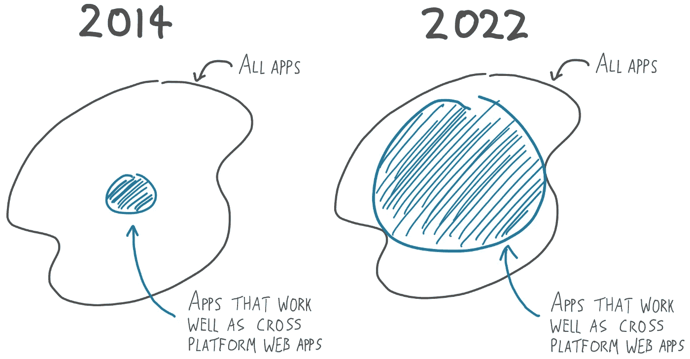
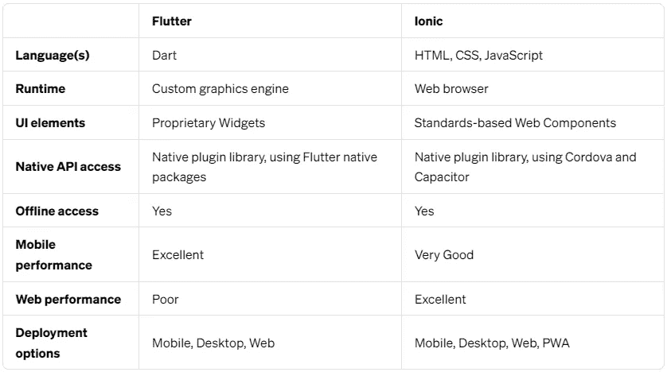
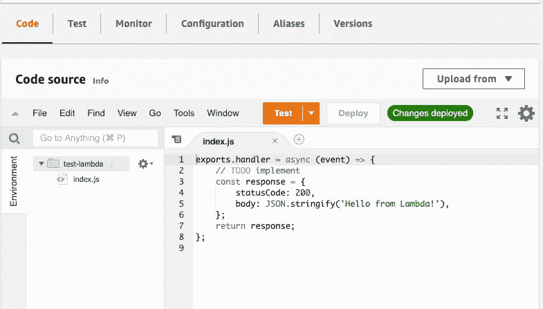

# 如果你只学了几个框架，学这个

> 原文：<https://levelup.gitconnected.com/if-you-only-learn-a-few-frameworks-learn-this-472bb4d7bae8>

## 你需要在好的方面变得强大和危险

照片由 [Pexels](https://www.pexels.com/photo/an-elderly-male-drinking-coffee-and-working-on-his-laptop-at-home-10223587/?utm_content=attributionCopyText&utm_medium=referral&utm_source=pexels) 的[罗恩·拉赫](https://www.pexels.com/@ron-lach?utm_content=attributionCopyText&utm_medium=referral&utm_source=pexels)拍摄

如果你停止学习，你就停止了成长。作为一名程序员，你需要成长，增加你的理解范围。

除非你是一名学生，否则学习不应该被认为是你一天中占据大部分时间的核心部分。

这应该被认为是你在增加知识的同时所做的事情。

在这个数字时代，要学的东西太多，时间却很少。如果你精通几种语言，但只学了几个框架，考虑学习这些。

# TensorFlow(人工智能和机器学习)

人工智能和机器学习被认为是下一次工业革命的重要组成部分。这些技术是优越的，还没有完全了解。它们可能会永远改变我们的生活方式。

如果你是一名程序员，你想把自己放在能够改变世界的强大技术的核心。

当前的亿万富翁和科技巨头也使用了同样的策略。那时候，他们把自己放在公众不完全理解的技术上。

互联网就是一个例子。早先它被视为一种时尚。不管怎样，像杰夫·贝索斯这样的人把他的积蓄都押在这上面了。他希望网上购物是人们将来会采用的东西。

大多数(如果不是全部的话)当前的科技巨头都使用过这种策略。本质上，它领先于大多数人。

学习机器学习和人工智能会增加你的智力，振振有词地改变你的世界观。

当你观察到有可能改变世界的需求或差距时，你的技能组合中会有一个强大的工具可以使用。

## PyTorch(如果你不是一个经验丰富的程序员)

PyTorch 是另一个很好的 AI 和机器学习框架。这两个都是人工智能和机器学习领域的佼佼者，并且都是基于 Python 的。

如果您正在寻找一个拥有大量文档和大型社区的成熟框架，Tensorflow 是一个不错的选择。

本质上，如果你想学习一些东西来创建生产就绪的产品，你更适合 Tensorflow。

另一方面，如果你正在寻找学习 AI 的最简单的方法，并且有一个平滑的学习曲线，你用 PyTorch 会好得多。

后者更 pythonic 化，更易学，不太成熟，更面向对象，推荐给爱好者。它发展迅速，同样强大。它还具有 Tensorflow 没有的技术优势，即

*   速度很快，感觉很本土。
*   大力支持。
*   动态计算图是一大亮点。
*   具有易于使用的 API。
*   由脸书积极开发。
*   在 GPU 上运行—支持 CUDA。

简而言之，如果您正在寻找更具 pythonic 性、实验性和趣味性，并且在需要时仍能完成工作的东西，PyTorch 是一个不错的选择。

学习这两者中的任何一个都会让你与众不同，并让你处于一个强有力的位置。

# Apache Hadoop(大数据处理)

这是一个用于大数据处理、分析和解释的开源框架。

它可以分析大数据，并为您提供无法获得的宝贵信息。

它用于高效地存储和处理从千兆字节到千兆字节大小的大数据集。

Hadoop 不需要一台巨大的计算机来存储和评估数据，而是允许一个计算机集群同时检查巨大的数据集。

不应低估分析大数据的能力。它本身就很强大。

通过分析大数据，你可以偶然发现改变生活的宝贵信息，这些信息可能会隐藏几十年或几个世纪。

数据科学家使用该工具进行数据探索。这有助于他们揭示或理解他们通常无法理解的数据中的复杂性。

如果你想增加你的知识，并振振有词地改变你的世界观，Apache Hadoop 是一个很好的学习框架。你会更加强大，有能力在需要的时候改变世界。

## Apache Spark(用 Spark 补充 Hadoop)

与 Apache Hadoop 类似，Apache Spark 也是一个大数据处理框架。这两者可以说是大数据处理中最大的框架。

阿帕奇 Spark 要年轻很多，不太成熟。好消息是它正在快速增长。

两者之间有一个显著的区别，Hadoop 使用 MapReduce 处理数据，而 Spark 使用弹性分布式数据集。(RDDs)

Hadoop 包含一个分布式文件系统(HDFS)，允许数据存储在多台机器上，但 Apache Spark 不允许。因此，它仅用于计算。

这意味着 Apache Spark 应该在 Apache Hadoop 之上使用。Apache Spark 也可以独立工作，但是没有分布式文件系统。

*另一个关键区别*

加州大学伯克利分校的研究人员指出，Apache Hadoop 在批处理方面非常出色，但在交互处理方面非常欠缺。所以他们创建了 Apache Spark 来解决这个问题。

就交互而言，Spark 程序在内存中的执行速度比 Hadoop 快 100 倍，在磁盘上快 10 倍。

所以学习 Apache Hadoop，用 Apache Spark 做补充。如果你有远大的梦想，想充分利用世界所能提供的一切，探索大数据是一项必备技能。

# Ionic(更好的跨平台应用)

Ionic 是一个从单一代码库构建跨平台应用程序的框架。

它的强大之处在于它可以从基本的 HTML、CSS 和 Javascript 构建跨平台的应用程序。早在 2014 年，跨平台应用还没有那么好，但截至 2022 年，它们已经有了巨大的改进。

[来源](https://javascript.plainenglish.io/i-replaced-my-native-ios-app-with-a-cross-platform-web-app-and-no-one-noticed-1653901ce244)

最近，这个开发者[用一个跨平台的网络应用替换了一个原生的 IOS 应用，而没有人注意到](https://javascript.plainenglish.io/i-replaced-my-native-ios-app-with-a-cross-platform-web-app-and-no-one-noticed-1653901ce244)。

在通知用户这一变化后，他们更喜欢跨平台的 web 应用，而不是原生的 IOS 应用。他甚至最终解决了原生版本中困扰他的一个 bug。我们已经到了那一步。

在跨平台 web 应用中的性能非常好。除非你的应用程序使用的是激进的动画，而 flutter 占了上风，否则在许多应用程序中，ionic 的性能与 Flutter 相同。

下面是两者的对比。

[来源](https://ionic.io/resources/articles/ionic-vs-flutter-comparison-guide)

学习 flutter 需要学习一种新的编程语言，这种语言在 flutter 之外很少使用。

学习 Ionic 将使您能够从基本的 HTML、CSS 和 Javascript 创建具有出色性能的跨平台应用程序。没有必要学习一门新的语言。

你可以用你已经习惯的，React，Vue，Angular，或者典型的 HTML 和 CSS，用香草 Javascript。没关系。

Ionic [自诩](https://ionic.io/resources/articles/ionic-vs-flutter-comparison-guide)使用标准浏览器运行时和原语，使得应用程序比 flutter 更小。

与 Flutter 相比，Ionic 应用的优势还在于对 SEO 更加友好。

综合考虑所有因素，学爱奥尼亚是值得的。您最终可以创建与本地版本一样好的跨平台 web 应用程序。

# 无服务器框架(无服务器知识)

技术正在快速变化，无服务器解决方案正处于最前沿。

我们有灯。现在我们有了米辛、MERN 和梅文。尽管如此，无服务器解决方案已经抢尽风头，并有可能在未来占据主导地位。

有三种主要的无服务器解决方案。

*   AWS Lambda。
*   谷歌云。
*   微软 Azure。

它们非常简单，你所要做的就是用支持的语言定义一个函数，然后提交给你的云提供商，瞧！

您不必管理或处理服务器。下面是 AWS 上一个简单函数的样子。

[来源](https://dev.to/julbrs/sst-the-most-underrated-serverless-framework-you-need-to-discover-25ne)

从直接编码开始，您会发现过程中的无数瓶颈，即

*   开发一个功能。
*   部署该功能。
*   等待部署。如果是 rest API，附加一个 HTTP 触发器。
*   通过邮递员测试
*   发现了一个漏洞
*   获取无服务器提供程序的日志系统的日志跟踪。
*   然后重新开始这个过程。

来回不是一个好的体验，因为代码不能在你的本地机器上运行。这些瓶颈让你意识到需要一个框架，这就是无服务器框架的由来。

它于 2015 年推出，旨在促进无服务器开发。它包括很棒的特性和在本地机器上运行的能力。一些功能包括:

*   它支持各种各样的语言。(由单个平台支持的那些)
*   它适用于三个主要的无服务器提供商，并且工作良好。(Lambda AWS、谷歌云和微软 Azure)
*   它有超过一百万个插件。你可以实现任何你想实现的目标。

学习无服务器框架会让你了解无服务器平台是如何工作的。你将处于一个更舒适和更有能力的位置。

你将领先于大多数人，拥有宝贵的知识，你可以利用这些知识。

## 无服务器堆栈(SST)——如果你的主要目标是非常擅长 Lambda AWS)

这是一个更新的无服务器框架。因为它的新功能有限。无论如何，它对于大多数经典用途来说都是完美的，并且可以实现很多功能。

它的一些缺点包括:

*   支持的语言更少。
*   仅在 AWS 上运行，其余尚不支持。

与无服务器框架类似，SST 也支持本地开发。

尽管它有缺点，但它的优点让你选择它而不是无服务器框架。

该框架依赖于 CDK，这是一个 AWS 工具，旨在“使用熟悉的编程语言定义你的云应用资源”。

实际上，CDK 允许开发者编写代码，这些代码将被转换成云信息模板文件。这是一种更紧凑的方法。

编写 CDK 比编写 CloudFormation 模板文件要好得多。以下是一些优点。

*   将您的代码分成许多文件是很容易的。
*   IDE 可以帮助您编写 CDK，从而有助于您的编码过程。
*   你写得更少(结构会帮助你)

SST 使这个过程变得更容易和更好。如果你想深入研究 AWS Lambda，并且做得非常好，SST 绝对是你要走的路。不支持谷歌云和微软 Azure。

如果你想普遍学习无服务器，与谷歌云或微软 Azure 互动，并有无数的功能可以玩，肯定无服务器框架是你的选择。

# 最后的想法

在本文中，我分享了四个框架和一些有趣的替代方案。学习它们会增加你的知识和理解范围。

你的世界观也可能会改变。最大的好处是，你将获得新鲜的知识，这些知识只是皮毛。或者具有不公平的竞争优势。

以下是共享框架的总结。

i. Tensorflow(如果你相信自己/你是一个经验丰富的程序员)PyTorch(如果你想要一个更简单、有趣、更 pythonic 化的方法/你不是一个那么有经验的程序员。)

二。Apache Hadoop(用 Apache Spark 补充)

三。Ionic(来自基本 HTML、CSS 和 Javascript 的优秀跨平台应用程序)

四。无服务器框架(支持多个无服务器平台)无服务器堆栈(如果你的主要目标是非常擅长 AWS Lambda)

学习上述框架会让你脱颖而出，领先于大多数人。

# 分级编码

感谢您成为我们社区的一员！升级正在改变技术招聘。 [**在最好的公司**找到你最理想的工作](https://jobs.levelup.dev/talent/welcome?referral=true) **。**

 [## 升级—转变技术招聘

### 升级—转变技术招聘🔥使软件工程师能够找到完美的角色…

作业. levelup.dev](https://jobs.levelup.dev/talent/welcome?referral=true)