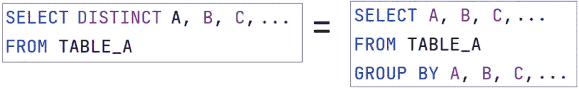
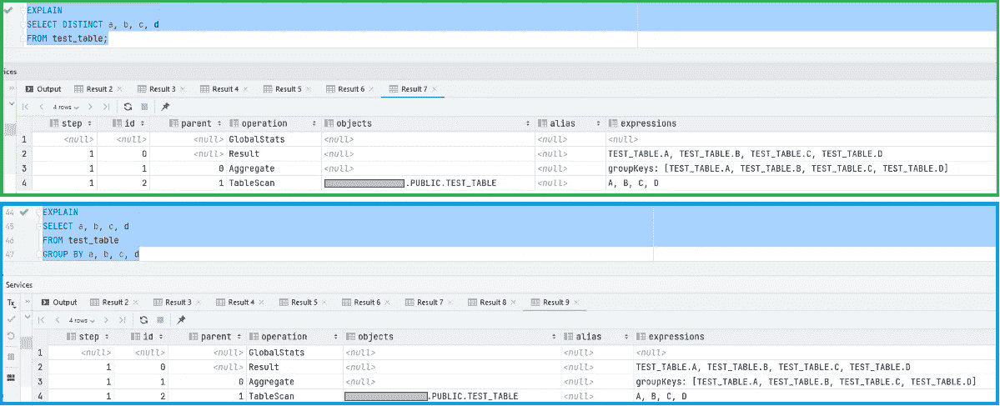
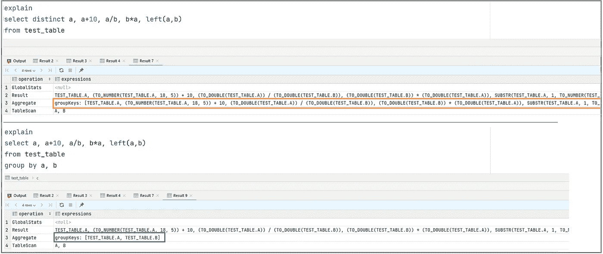
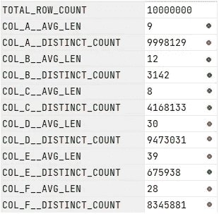
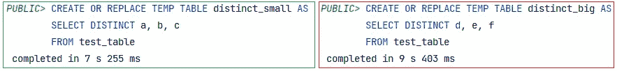
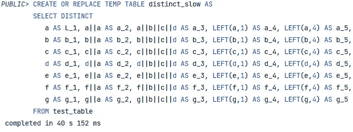
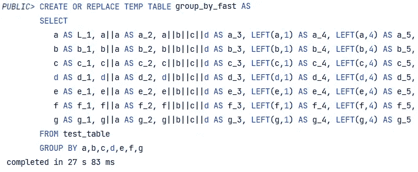

# 如果您真的必须使用 SQL Distinct…

> 原文：<https://levelup.gitconnected.com/if-you-really-must-use-distinct-c1233761baae>

## Distinct 就像 group by (*)，除非它不是！

乔希·弗雷内特在 [Unsplash](https://unsplash.com?utm_source=medium&utm_medium=referral) 上的照片

在所有 SQL 命令中，Distinct 是概念上最容易理解的命令之一:对于给定的一组行，只返回唯一的行。

简单吧？再想想…

虽然在许多存在真正重复的情况下很有用*(像流中的消息)*，但是它经常被误用，因为用户并不总是理解它的所有含义。

在我之前的文章 [*SQL Like a Pro:请停止使用 Distinct*](https://jmarquesdatabeyond.medium.com/sql-like-a-pro-please-stop-using-distinct-31bdb6481256) 中，我展示了 Distinct 是如何经常被误用的。在本文中，我将从一个不同的角度来讨论这个话题:当一个人必须使用 Distinct 时，他应该完全了解和理解它。这篇文章将试图为你提供一个全新的视角，关于什么是独特的关键字，它是如何工作的，是什么使它表现得更好或更差，以及如何优化它。

在培训工程师时，我总是喜欢更深入地挖掘不同的实现，让受训者对其工作原理有一个更全面的理解，并希望减少错误的使用。

> 这篇文章将给你一个新的视角，让你了解 Distinct 是如何工作的，并且自然会引出一些优化技术。

好奇想了解更多？请继续阅读…

# Distinct =分组依据(全部)

我总是喜欢将不同的行为解释为*“按所有列分组”*，即:

Select Distinct = Select … group by …

真的就是这样！以至于数据库执行计划 100%相同，如下所示:

比较执行计划— Distinct 与 Group By (ALL)

但事实真的总是如此吗？你真的总是按照所有的列进行分组吗？

# 当 Distinct 不同于 Group By (col1，col2)时

但是有一点你可能没有考虑到，那就是 Distinct 和 group 有时会有所不同。为什么？

> 因为 group by 可以作为目标，而 Distinct 不能(或者通常不是)。

一个典型的例子是一个列被多次用于不同的计算/转换。让我们看一个例子:

(distinct a，b，a+b)如何不同于(group by a，b)

事实是，数据库无法理解列是否相互依赖*(在某些情况下，它可以，并且可能依赖于查询优化器…但是您真的不想依赖它)*。

实际上，数据库不想关心这个。如果您的查询要求一个 ***不同的年龄，年龄*年龄，*** 数据库将准确地执行该操作。为什么？因为只有你明白，对于同一个**年龄，不可能**年龄*年龄**会不一样；**你知道你可以根据年龄进行聚合，然后在之后乘以**。使用同一个年龄相乘的例子，两种说法的区别是:**

*   ***【坏】*** 对于 10M 行中的每一行，计算 ***calc=age*age*** ，然后在 10M 行中查找不同的 ***age|calc*** 记录
*   ***【好】*** 找出数据集中所有不同的年龄(100 行)，然后只执行计算(100 次)

这种差异确实会影响查询的性能。我们来看看为什么。

# 因为 Distinct 是一个非常昂贵的操作

对大量列运行 Distinct 可能会对性能产生严重影响，这对于分布式数据库来说更糟。为什么？

因为查找数据集中所有唯一的记录意味着将所有记录相互比较，这意味着在能够将记录卸载给用户之前，要遍历整个数据集。保存所有这些“记录”*(或记录的散列)*需要大量的内存，并且将它们相互比较需要大量的计算操作。

当在大量的大列上运行 Distinct 时，由于内存限制*(内存访问负载，可能需要磁盘缓存)*和计算要求，您的查询性能将会下降。

> distinct 的性能由 Distinct 项的数量和总体行大小决定:列越多越宽，查询的性能越差。

让我们看一个例子，使用一个有一千万行的表。首先，当考虑列的平均长度和非重复计数时，让我们看看这个表中的数据模式是什么:

独特的计数和平均长度

为了比较性能，让我们在简单的列集合(*列 a、b、c* )上运行 Distinct，并与较难的列集合(*列 c、d、e* )进行比较:

小/低基数与大/高基数的区别

从执行时间差(7s 对 9s)可以看出，改变平均列长度和不同值的数量确实会影响查询性能，并且影响的方式不同:

*   **平均柱长影响:**
*   >>>所需的磁盘 I/O 操作*(从磁盘提取数据)*
*   >>>需要计算*(列越长，构建用于比较的散列所需的操作就越多)*
*   **不同值影响的数量:**
*   >>>所需的内存量*(在内存中保存所有不同的哈希以便比较)*
*   >>>计算*(需要更多比较)*

***NB:*** *以上分析对于柱状存储数据库是成立的。不过，对于基于行的数据库，分析会略有不同。*

# 使用这些信息来提高查询性能

有了这些知识，你现在就可以用不同的眼光看待你独特的查询，并理解如何优化它们。

> TL；DR；这里最大的提示如下:
> 
> 执行 Distinct 时，如果任何列被多次使用，请考虑按列显式分组，而不是执行完整的 group by。

让我们看看这是什么样子的。使用相同的 1000 万行数据集，我对所有列进行了大量的计算，因此我们可以真正体会到两者之间的差异。让我们从坏的例子开始:

也许是手术太多了？或者会有那么明显吗？

这个查询花了 40 秒。不可怕，但是请记住这是一个小表，列真的没有那么复杂。

但是如果我们用 group by 替换它呢？

那就好多了！

这个新的改进的查询现在用时不到 28 秒，**产生完全相同的输出**。通过做这个小小的改变，我们已经告诉数据库，所有这些计算都可以在聚合之后进行，并且分组不需要这些计算。因此，查询在 67%的时间内运行。**这就是我所说的结果！**

# 结论

在代码审查期间，Distinct 关键字总是让我多看两眼。人们很容易误解其使用的复杂性，即使从性能的角度来看，通常也有很多收获。这就是为什么我觉得第二篇文章如此重要，因为 Distinct 是非常有用和必要的，但如果您希望产生高质量和高性能的 SQL，也必须很好地应用它。

> 即使您已经了解了它的所有内容，我希望这篇文章至少让您对 Distinct 的实际工作方式有了额外的了解，并让您对它有了更好的理解。

也许下次你遇到这个独特的关键词时，你会以不同的方式看待它。

谢谢你看我的文章！
而现在，为了几个*(不要脸)*支持我”的词。

您是否在考虑订阅 Medium？
也许你会考虑[通过使用我的推荐链接](https://jmarquesdatabeyond.medium.com/membership)来支持我的写作。注意:使用我的链接会给我一点佣金，不会给你额外的费用。