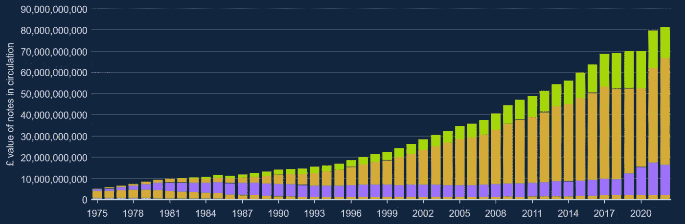

# 如果你因为环境因素而拒绝投资比特币——你完全没有抓住要点。

> 原文：<https://levelup.gitconnected.com/if-you-refuse-to-invest-in-bitcoin-due-to-environmental-factors-youre-completely-missing-the-aecf992036b1>

思想开放将有助于你做出明智的决定。

史蒂文·拉斯里在 [Unsplash](https://unsplash.com/s/photos/explanation?utm_source=unsplash&utm_medium=referral&utm_content=creditCopyText) 上拍摄的照片

[货币超市](https://www.moneysupermarket.com/gas-and-electricity/features/crypto-energy-consumption/#_this_map_shows_which_countries_consume_more_or_less_electricity_than_bitcoin_)进行了一项研究，他们发现单笔比特币交易平均使用**1173 千瓦时(kWh)。**

为了上下文。

350 千瓦时足以为一个典型的英国家庭供电三个多月，价格大约为 125 英镑(141 美元)。

**877 千瓦时**相当于美国普通家庭六周的用电量(美国能源信息署)。

无论你是否认为比特币是一种有价值的资产，这些都是巨大的数字，凸显了能源的过度使用。

# 比特币让我们的金融体系变得更好了吗？

最大化主义者认为，比特币是第一个创造的区块链技术，它让我们破碎的金融系统变得无限美好。

其他人认为这是一个消耗能源的庞氏骗局。

我相信比特币不一定比我们现在的货币体系更好。尽管如此，它确实提供了一个包容性的价值储存库，允许来自第三国的人参与经济繁荣。

以下是比特币的优势。

*   比特币是稀缺的，有固定的供应量(2100 万比特币)。
*   它非常耐用，几乎坚不可摧，由世界各地的计算机提供支持。
*   你不能创造假比特币。
*   因为它是一种数字资产，所以与黄金不同，它具有很高的便携性。
*   它不需要中间人，消除了失败点和人类腐败。
*   你可以在世界上任何时间、任何地方，以几分之一便士的价格进行大额交易。
*   唯一阻止比特币运行的情况是互联网瘫痪。

# **印钞**

美联储银行(美联储)是世界上最有影响力的经济机构。他们负责管理美元的供应，其他 11 个国家也使用美元。

在管理供应时，美联储工作人员不会坐在印钞机旁边。印钞确实存在，但只需点击一个按钮，它就会以数字方式记入商业银行的借方和贷方。

实际的货币创造发生在银行将这些新余额贷给更广泛的经济之后。

沃伦巴菲特(Warren Buffett)对投资银行的建议是一种合理的方法。他认为，银行是国家基础设施的一部分，所以如果经济下滑，银行周围会有政府的护城河。

在英国，英格兰银行已经印制了比 2016 年多一倍的钞票。

*   2016 =**1520 万**
*   2021 =**3360 万**

来源— [英格兰银行](https://www.bankofengland.co.uk/statistics/banknote)

法定货币为我们提供了很好的服务，但人们通常会问，当我们拥有的一切运转良好时，为什么我们应该使用比特币，并忍受其过多的能源消耗。

还有一个思路是，如果我们把比特币作为数字黄金，它作为一种公用事业的机会很小。

比特币价格的预期上涨让人们不愿像放弃法定货币一样放弃这种资产。

虽然我认为比特币不太可能被用作货币，但它的一些特性让它比法币更有优势。

*   法定货币没有限制，也不能准确知道供应量，所以它不稀缺。任何时候都可以创建更多。
*   因为政府和银行控制着法令并且是中央集权的，这就容易滋生腐败。通常在发展中国家或第三世界国家。
*   纸张可能会被损坏、毁坏和伪造(BOE 报告有 4 万张钞票被伪造)。
*   菲亚特的结算系统很慢，尤其是国际支付和工作时间以外。
*   使用法定货币将贫穷国家的人排除在外，因为收取的费用使其不适合使用。

# 如果你只关注比特币的环境因素，你可能会忽略这一点。

比特币正在蚕食黄金市场份额。

[高盛](https://www.bloomberg.com/news/articles/2022-01-04/goldman-says-bitcoin-100-000-a-possibility-by-taking-on-gold?leadSource=uverify%20wall)最近预测，随着我们继续在日常生活中采用数字资产，比特币是未来十年最有可能取代黄金的资产类别。

截至发稿时，比特币的市值为 3160 亿美元，而黄金的投资总额为 2.6 万亿美元。

这使得比特币在“价值储存”市场中占 12.5%的份额，而黄金已经存在了 2700 年。

这是一个惊人的采用率。

根据高盛的一份报告，比特币正在快速蚕食黄金的市场份额，到 2030 年，比特币将拥有 10 亿用户。

根据比特币矿业委员会的说法，比特币使用的能源消耗是黄金的一半，并且正在被比特币夺走市场份额。

来源— [比特币矿业委员会](https://bitcoinminingcouncil.com/wp-content/uploads/2022/07/2022.07.19-BMC-Presentation-Q2-22-Presentation.pdf)

# 以下是我的想法

比特币的能量使用率很高。

如果比特币继续沿着它的轨迹发展，它最终将成为一种全球价值储存手段。

如果或当这种情况发生时，比特币应该与黄金等能源密集型技术的其他工业用途相比较。

一些国家可能会禁止比特币挖矿行为，而另一些国家则将其视为经济繁荣的机会。

无论发生什么，它都不会改变，所以你最好做些研究，做出自己明智的投资决定。

> *如果你想在 Web3 上阅读更多我的观点，考虑成为会员吧。你的会员费直接支持你读的作家。如果你用我的链接* [*注册，我会赚一小笔佣金。点击这里*](https://medium.com/@jayden_levitt/membership) *。*

*本文仅供参考；不应将其视为财务、税务或法律建议。在做出任何重大财务决定之前，请咨询财务专家。*