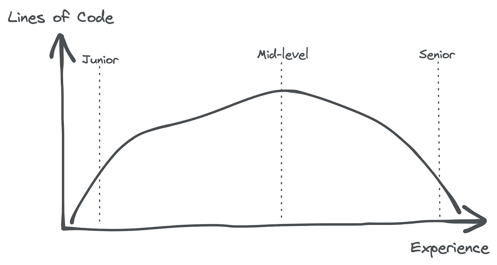
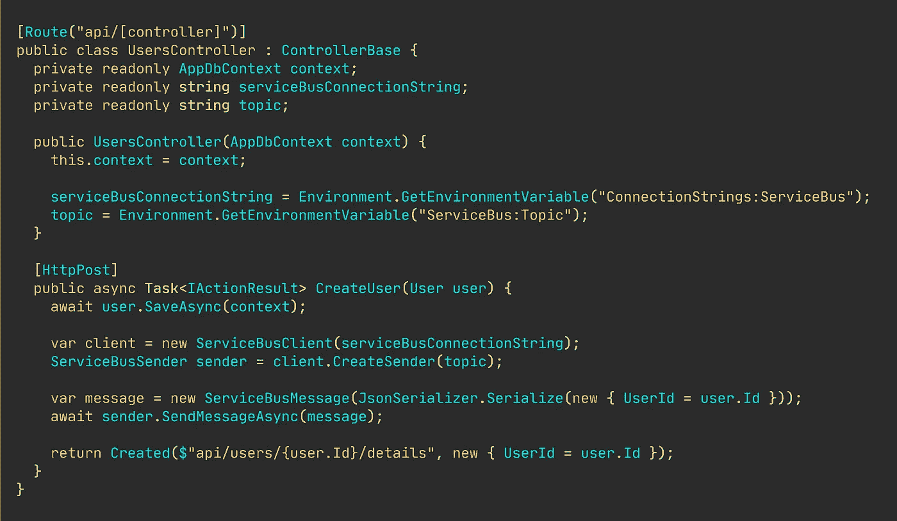
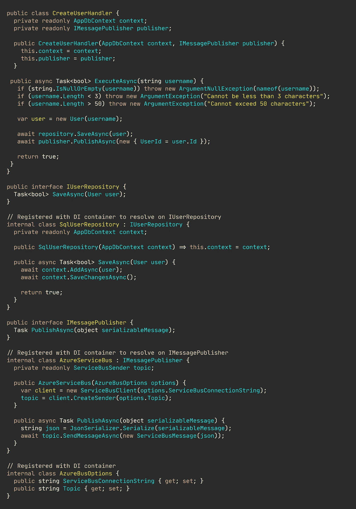
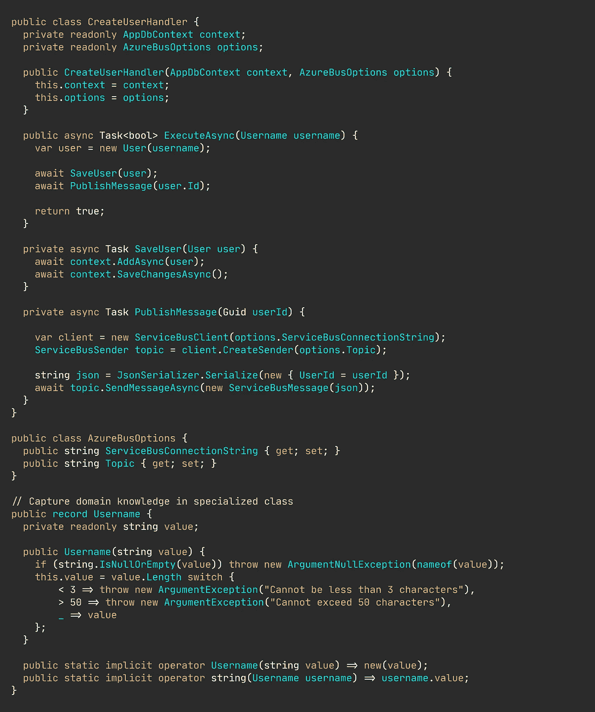
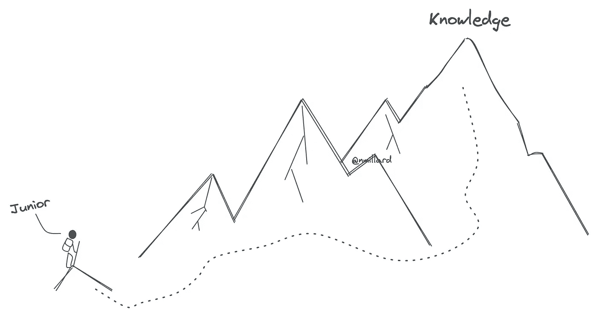

# 如果你想要高级开发人员，那么让初级开发人员接触高级代码

> 原文：<https://levelup.gitconnected.com/if-you-want-senior-developers-then-expose-juniors-to-senior-code-446d04e28def>

## 固执己见的观点

## 为什么“编写初级代码”是个糟糕的建议

图片由[尼克拉斯·米勒德](https://medium.com/u/7c7a43b3d9de?source=post_page-----446d04e28def--------------------------------)提供

"不要使用那种结构(语法、方法、模式或其他)，低年级学生不会理解的！"

从管理的角度来看，这是非常合理的，因为我们可以不雇佣缺乏经验的人。

> 不断简化代码只会让你的初级开发人员保持沉默。

在我看来，把你的代码简化到只需要很少的特定语言知识就能理解的程度，或者简单地整体降低编码素养，是很糟糕的建议。

🔔[想要更多这样的文章吗？在这里签名。](https://nmillard.medium.com/subscribe)

## 初级、中级和高级开发人员的典型特征。

将同样的任务交给初级、中级和高级开发人员，你会(显然)得到截然不同的解决方案。

然而，我认为每个级别生成的代码都有一些共同的特征——我将在本文的后面向您展示一些代码示例。

代码行与经验

我发现大三学生写的代码非常简单。不是因为他们努力追求简单，而是他们仍然在努力解决问题，驯服语言，以及一般的编程概念、原则和方法。

大三学生学习的速度很快，每个角落都会让他们接触到完全“新”的代码。破译某物是好的、坏的还是坏的是很困难的。

大三学生是强迫性精装者。他们无意中将[应用程序设置直接放在代码](/never-store-secrets-in-appsettings-json-3a7404ea50d0)中，或者对所有分支使用`[if-else](/remove-your-if-else-and-switch-cases-1ed2b625b4cf)` [和](/remove-your-if-else-and-switch-cases-1ed2b625b4cf) `[switch](/remove-your-if-else-and-switch-cases-1ed2b625b4cf)` [。](/remove-your-if-else-and-switch-cases-1ed2b625b4cf)

另一方面，中级开发人员知道许多常见的模式和方法。这位开发人员正在达到这样一个点，即通用概念被内在化并应用于解决日常编码问题。中级开发人员的代码过于臃肿，有时感觉通过抽象混淆是咒语。在某些情况下，任务可能比初级任务花费更长的时间，但是会捕捉到更多的边缘情况，并且整体代码质量会更高。

在阅读高级代码时，中级开发人员可能会想“这真的是高级编写的吗？”。高级开发人员知道什么时候抽象有意义，什么时候“更简洁”的代码是更好的选择。

容易调试的代码比聪明更受欢迎。

学长特别擅长编写容易扩展的模块，供其他开发人员使用。每一段可能引起“wtf”时刻的代码都通过注释得到了很好的解释——c[注释被频繁使用](/yes-your-code-need-comments-a96348bf3fb7)来捕捉上下文，远远超过任何“自我记录”的代码段所能捕捉的。

高级开发人员[通过重视](/why-cognitive-and-cyclomatic-complexity-matters-in-software-development-5fce1efb56ab)[干净的](/writing-cleaner-code-with-examples-69be2160b4c1)、[可读的](/writing-readable-code-exemplified-bd387cd93b6b)和可维护的代码来保持循环和认知的低复杂度。资深者知道代码将会被交给其他人，因此需要很好的、平衡的文档。

此外，还会对每个模块、类或方法的测试工作进行分析。

## 让我们看几个代码示例。

我们已经轻轻触及了每个经验层次的一些共性。

我将尝试演示初级、中级和高级如何实现简单的“创建用户”功能，其中用户存储在 SQL 数据库中，消息发布到 Azure 服务总线。

首先，让我们来看看一个**初学者会如何做**——这个例子与我在真实代码中发现的非常相似。

初级实现。

上面的代码在各个方面都太简单了。如果每次输入都有效，代码可能运行得很好，但是最轻微的错误都会引爆应用程序。毫无疑问，一个完全的初学者已经硬编码了服务总线连接字符串和主题——在这种情况下，它们是从环境中提取的，这也是有问题的。

`CreateUser`控制器动作有几个缺陷，比如将所有逻辑都放在一个控制器中，直接从控制器访问数据库，在`User`上有`SaveAsync`方法(是的，我已经看到了这一点)，没有输入检查(从不信任用户)，将`User`作为输入而不是数据传输对象。

一个中级开发人员可能想要炫耀技能，并在不需要的地方应用模式。这种实现可能如下图所示。

中级实现。

我认为这是一个很好的例子，它引发了“写简单的初级代码”的想法。

您会清楚地注意到比初级示例中的代码多得多。有许多间接、抽象、关注点分离、接口和内部类。逻辑不再驻留在控制器中，而是驻留在包含业务逻辑的类中，这在我看来很棒。

`CreateUserHandler`现在依赖于将功能注入其中，而不是承担那些责任。

调试现在变得更加麻烦，尽管总体代码质量在坚持坚实的原则、通过依赖注入的控制反转以及在专用选项类中包装设置方面有所提高。

中级开发人员有时更看重理论上的正确性，而不是所提供的价值。

现在，**高级**知道哪里增值最多，以及如何快速、高效地完成任务。

高级实现。

所以，这里的代码比初级的例子稍微多一点。

这个实现非常固执己见。如果你还没有找到原因，花点时间再看一遍代码…

好吧，让我来解释一下这里发生了什么。

`ExecuteAsync`法短而甜。它没有将工作隐藏在抽象背后，而是简单地放在名字很好的私有方法中，使得调试变得容易。学长使用[专门的领域类来显式地获取和分组特定领域的知识](https://betterprogramming.pub/stop-using-primitive-types-in-domain-classes-c45f5973d640)。使用`Username`与`string`相对，因为有管理用户名的特定规则，这些规则是在这个类(或`record`)中捕获的，而不是像中级开发人员那样在`ExecuteAsync`方法的顶部有保护条款。一个学长通常会编写惯用的代码，正如`Username`构造函数内部的表达式赋值所展示的那样。

抽象用在有意义的地方。假设服务总线仅在创建用户时使用。抽象消息发布带来了什么价值？更容易测试，因为你可以模仿接口？关注点分离，因为`CreateUserHandler`不应该“更新”它的协作类？由于 handler 类完全依赖于数据库和消息发布，所以我认为编写一个简单的集成测试来验证流程工作是有意义的，而不是创建一个只在这一个地方使用的抽象层。

另外要注意的是命名，比如`AzureBusOptions`。有些人可能会对此嗤之以鼻，“类不应该包含特定于技术的命名”。嗯，我们*正在*使用 Azure 服务总线，所以我宁愿让它一清二楚，让系统更容易理解，而不是试图“隐藏”它。

# 教低年级学生成为高年级学生。

代码演示。还有很多。

在常规任务之外留出时间，积极参与并与你的同事和资历较浅的同事分享知识。

让高级或优秀的中级开发人员展示代码、实践、方法、价值观等。是大三学生学习的好方法。

结对编程也是一个极好的学习机会。仅仅看到一个资深者如何导航、解释、解决问题和调试是非常有价值的。

我记得看教程的一些最美好的时刻是当老师出错时，实际上展示了调试过程和修复错误，而不是在后期制作中删除那部分。

# 临别赠言…

让你的代码变得愚蠢只会让你的下级保持“愚蠢”。

让低年级学生接触高级代码，让他们放松一下。它会很快被理解——通过抛出代码演示和定期向你的同事和比你资历浅的人传授一些知识来加速这个过程。

# 让我们保持联系！

[通过在这里](https://nmillard.medium.com/subscribe)注册时事通讯获得类似文章的通知，并查看新的 YouTube 频道[*(@ Nicklas Millard)*](https://www.youtube.com/channel/UCaUy83EAkVdXsZjF3xGSvMw)

*连接上*[*LinkedIn*](https://www.linkedin.com/in/nicklasmillard/)

# 好奇者的资源

*   由 D.L .帕纳斯(1979)设计易于扩展和收缩的软件
*   与初级开发人员相比，高级开发人员的代码看起来如何？关于 Quora 的问题
*   [钢丝圈上的螺纹](https://news.ycombinator.com/item?id=27333801)
*   [只考虑初级开发人员](https://elegantcode.com/2008/12/27/thinking-only-of-the-junior-developer/)