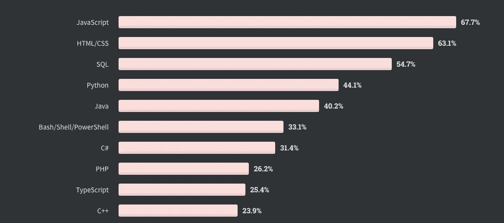

# 如果你想学习编程，这些是你应该考虑学习的语言

> 原文：<https://levelup.gitconnected.com/if-you-want-to-learn-programming-these-are-the-languages-you-should-consider-learning-e02b08aaa64f>

## 深入探究社区是如何采用这些语言的

亚历克斯·丘马克在 [Unsplash](https://unsplash.com/s/photos/programming-language?utm_source=unsplash&utm_medium=referral&utm_content=creditCopyText) 上的照片

软件编程现在是一个热门职业，但它也是一个不断发展的职业——它变化很快，非常非常快。昨天曾经很有价值的技术，今天可能不需要了。曾经风靡一时的编程语言并没有过时。

我最初几年是作为 Oracle 顾问开始的，编写过程、函数、触发器和调优数据库程序等。现在，我甚至没有把它写进我的简历，因为，谁在乎呢。

所以，如果你是这个领域的新手，或者如果你想换工作，或者只是想学点新东西，了解哪些语言需求量大是有帮助的。它可以通过跟踪哪些语言越来越受欢迎来帮助你站在行业的顶端。简而言之，你需要站在隐喻课的最前面。

因此，根据市场调查、求职网站上列出的帖子和个人观察，这里列出了 2021 年最受欢迎的编程语言

# Java Script 语言

JavaScript 是构建交互式网站最理想的编程语言。当与 Node.js 集成时，程序员可以在页面被发送到浏览器之前，使用 JavaScript 在服务器上产生 web 内容，这些内容可用于构建直接在浏览器中运行的游戏和通信应用程序。

根据来自 [StackOverflow](https://insights.stackoverflow.com/survey/2020#technology-programming-scripting-and-markup-languages) 的 2020 年开发者调查，JavaScript 仍然是最常用的编程语言，占 69.7%的比例。而且这种趋势有望继续，主要是因为它是 React、Vue 和 Node 中使用的一种基础语言。

# 计算机编程语言

Python 被广泛认为是一种通用编程语言，由于其简单的语法而易于学习，具有广泛的标准和工具包库，并与其他流行的编程语言如 C 和 C++集成。

根据 HackerRank 的说法，它也是继 Python 之后在美洲招聘经理中第二受欢迎的编程语言。此外，根据来自 [StackOverflow](https://insights.stackoverflow.com/survey/2020#technology-programming-scripting-and-markup-languages) 的 2020 年开发者调查，Python 是第四大最常用的编程语言，占 44%。

随着使用 python 开发的几种流行的数字工具和平台，包括 YouTube、Google Search 和 iRobot 机器，Python 的采用预计将在未来几年内增长。

# 戈朗

根据 [HackerRank](https://info.hackerrank.com/rs/487-WAY-049/images/HackerRank-2020-Developer-Skills-Report.pdf) 的说法，Go 是开发者下一步想学的第一语言。它也连续第三次占据这个位置。

Go 最初由 Google 开发，以其效率和并发执行多个进程的能力而闻名。它是可读的，并且是用于系统级编程的高度安全的语言。尽管它使用与 C 类似的语法，但 Go 是一种出色的语言，提供了顶级的内存安全和管理特性。

如果你仍然不相信，学习 Golang 还会带来 33%的加薪。

# Java 语言(一种计算机语言，尤用于创建网站)

Java 是一种面向对象的语言，易于使用，通常与客户机-服务器应用程序的开发相关联。它还拥有令人难以置信的安全性，可以处理大量数据。

Java 被吹捧为一种“编写一次，在任何地方运行”的语言，它可以有效地在任何操作系统上运行，不管原始代码是用什么操作系统编写的

Java 目前在全球招聘经理最受欢迎的编程语言中排名第三位，并连续两年在 Stack Overflow 最常用语言排行榜中排名第五

# HTML / CSS

HTML 是一种标记语言，这意味着它负责格式化网站上信息的外观。HTML 是进入编程世界最简单的垫脚石之一。

它用于网站开发和维护。

根据 StackOverflow 的 2020 年开发者调查，JavaScript 仍然是第二大最常用的编程语言，占 T2 的 63%

本文最大的投入之一是栈溢出开发者调查。以下是仅基于使用情况的 10 大编程语言:

[Stackoverflow](https://insights.stackoverflow.com/survey/2020#technology-programming-scripting-and-markup-languages) 开发者调查

下面的编程语言没有被列入我的前 5 名，但是如果你想扩展你的编程选择，它们也是值得考虑的:

→打字稿
→科特林
→ R
→ Scala 等

# 参考

1.  [www.northeastern.edu](https://www.northeastern.edu/graduate/blog/most-popular-programming-languages/)
2.  [堆栈溢出](https://insights.stackoverflow.com/survey/2020#technology-programming-scripting-and-markup-languages)
3.  [黑客排名](https://info.hackerrank.com/rs/487-WAY-049/images/HackerRank-2020-Developer-Skills-Report.pdf)
4.  [bootcamp.berkeley.edu](https://bootcamp.berkeley.edu/blog/most-in-demand-programming-languages/)