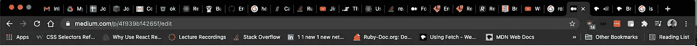
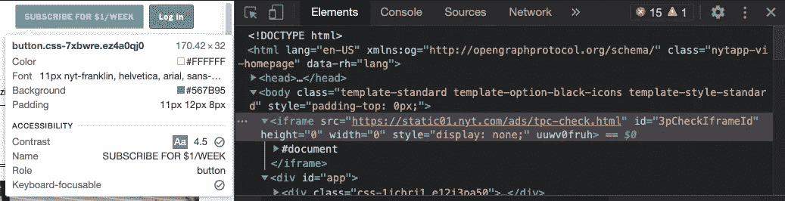
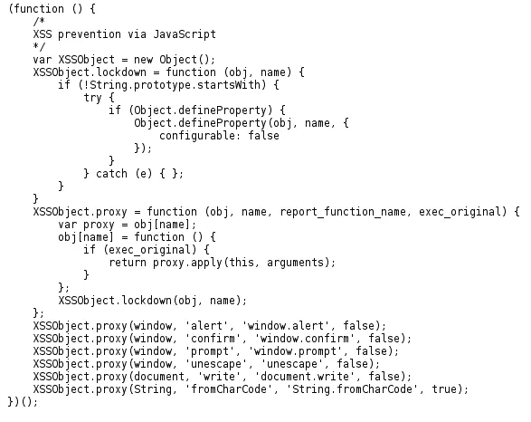

# 井底之蛙

> 原文：<https://levelup.gitconnected.com/iframe-tunnel-vision-4f939bf4265f>


是盗梦空间吗？是井底之蛙吗？真的没那么复杂吗？或者是？这是什么？在《詹姆斯在训练营后学到的东西》的最新章节中，我正在处理的主题。iframe HTML 标签是内嵌框架，将第三方 HTML 文档嵌入标签所在的当前页面。简单地说，它是进入另一个网络世界的直接窗口。大多数情况下，iframe 将被描述为一个浏览上下文。今天，互联网用户最熟悉的浏览环境是我们在浏览器上打开的标签。



总有一天我会得到教训🙃

这些标签中的每一个都代表我的浏览器提供的一个不同的 HTML 文档。iframe 可以被看作是位于另一个 HTML 文档中的选项卡。每个浏览上下文都有自己的会话历史和提供的文档。嵌入的 iframe 是显示 iframe 的父浏览上下文的子浏览上下文。最高级别的浏览上下文是浏览器窗口，它不服务于文档，而是服务于窗口对象。

**窗口:**

*   属性包括长度、内宽、内高、名称等..
*   setInterval()、setTimeout()将事件处理程序绑定到窗口计时器
*   提供 url 的位置
*   提供 back()和 forward()方法的历史记录

**文件:**

*   包含通过解析 HTML 初始化的 DOM
*   通常在 javascript 中与 document.getElementById、document.querySelector 和 document.createElement 一起使用

如今，iframe 最常见的应用是广告。这应该很有意义，因为我们都曾意外或有意点击过网站上发布的广告，然后被重定向到该广告网站。点击那个添加实际上是点击嵌套在你正在浏览的网站中的那个网站！这里，nytimes.com 顶部的 iframe 广告和一个 src 文档被重新路由到一个服务订阅的页面。



以这种形式设计和销售广告在很多方面都是有益的。首先，使用 iframe 保持了主机站点和加载到其中的外部内容(广告)之间的分离。虽然实际的框架大小由托管网站决定，但托管网站不必担心更新第三方内容。他们可以把所有的设计都留给客户，他们也出售了广告空间。其他不太常见但不太常见的 iframe 示例包括嵌入式 youtube 视频、社交媒体、谷歌地图和 rss 提要。所有这些例子，youtube 对广告商来说，都能够运行更新和重新设计，而父浏览上下文或主机可以不受干扰地继续它们自己的开发。

虽然广告是在线使用的最常见的 iframe 形式，但使用 iframe 标签时要考虑的最大问题是安全性。iframe 在技术上保持了父浏览上下文和子/托管浏览上下文之间的分离。作为托管 iframe 的家长，您实际上并没有添加来自第三方网站的代码，但您仍然使自己容易受到可能托管在第三方网站上的恶意软件的攻击。虽然这种分离是安全的，但绝不是防弹的。恶意代码或恶意软件仍可能嵌入到由父母托管的第三方内容中。虽然该代码不在托管站点代码库中，但从技术上来说，它是通过 iframe 窗口托管在网站上的，指向用于[网络钓鱼](https://en.wikipedia.org/wiki/Phishing)的恶意站点。这些网站通常依赖于用户已经熟悉的网站的外观和感觉。想想 www.gooogle.com。

虽然 iframe 标签保持分离，但是标签本身可能会被劫持。如果标签被劫持，它可以用来重定向用户到不同的网站，但它也可以用来注入 HTML 或 javascript 的当前页面。如果攻击者愿意，他们可以使用 javascript 从父浏览上下文中的用户获取会话 id 或 cookies！一些注入甚至在网站上使用 javascript 来跟踪用户的击键😬。



联合航空公司框架注入攻击

劫持一个 src 也可以用来打开一个全新的 DOM 文档，它没有被覆盖的函数，并且会从父域继承它的文档起源值！以这种方式打开父域的密钥使用了一种称为起源继承的策略。

```
<iframe src="javascript:alert(document.domain)"></iframe>
```

如您所见，安全是一个永无止境的循环，黑客和恶意用户总是会想出新的创造性方法来破解应用程序代码并窃取用户信息。令人欣慰的是，今天许多主要的浏览器和网站都创建了验证(防止在 GET 请求中添加可疑字符<>，并使用[内容安全策略(CSP)](https://developer.mozilla.org/en-US/docs/Web/HTTP/CSP) 来托管第三版，以防止大量的 javascript 或 HTML 注入和起源继承。也就是说，使用 iframes 时要小心。它们在许多方面都有帮助，但前提是事先采取了适当的安全措施。

**资源**:

 [## :内嵌框架元素

### 每个嵌入式浏览上下文都有自己的会话历史和文档。嵌入其他内容的浏览上下文是…

developer.mozilla.org](https://developer.mozilla.org/en-US/docs/Web/HTML/Element/iframe)  [## iFrame 注入-攻击和缓解- Secnhack

### 嘿，伙计们，在本教程中，我们将讨论另一个新的注入漏洞，称为“iFrame 注入”…

secnhack.in](https://secnhack.in/iframe-injection-attacks-and-mitigation/) [](https://www.netsparker.com/blog/web-security/frame-injection-attacks/) [## 帧注入攻击

### 这篇博文研究了帧注入攻击。它描述了框架的发明和发展的历史…

www.netsparker.com](https://www.netsparker.com/blog/web-security/frame-injection-attacks/)