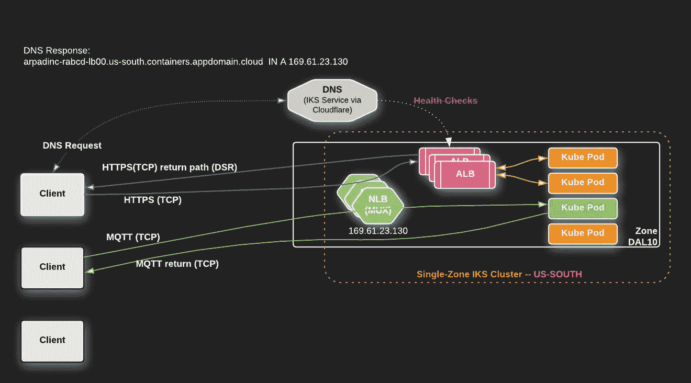
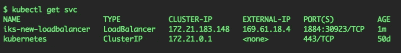
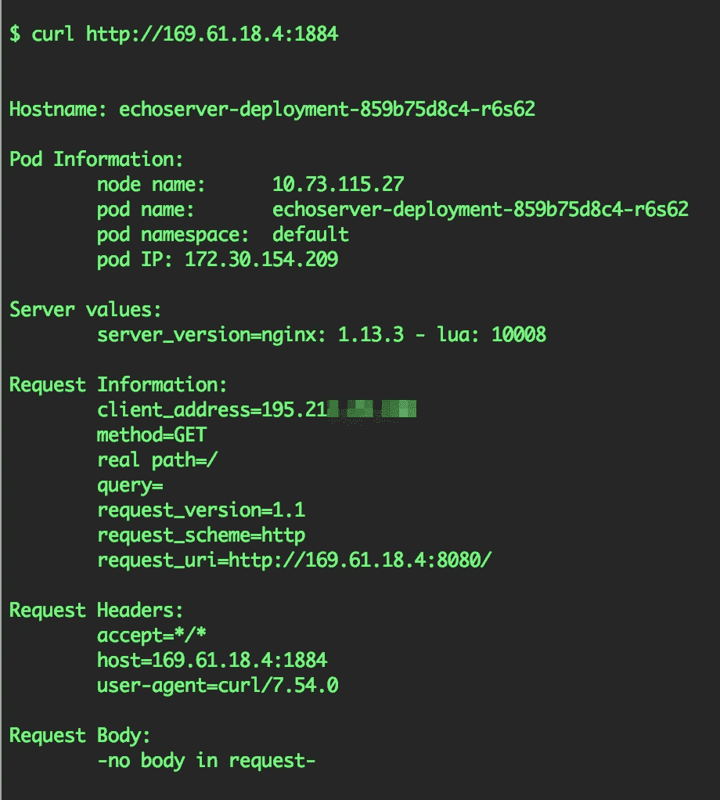
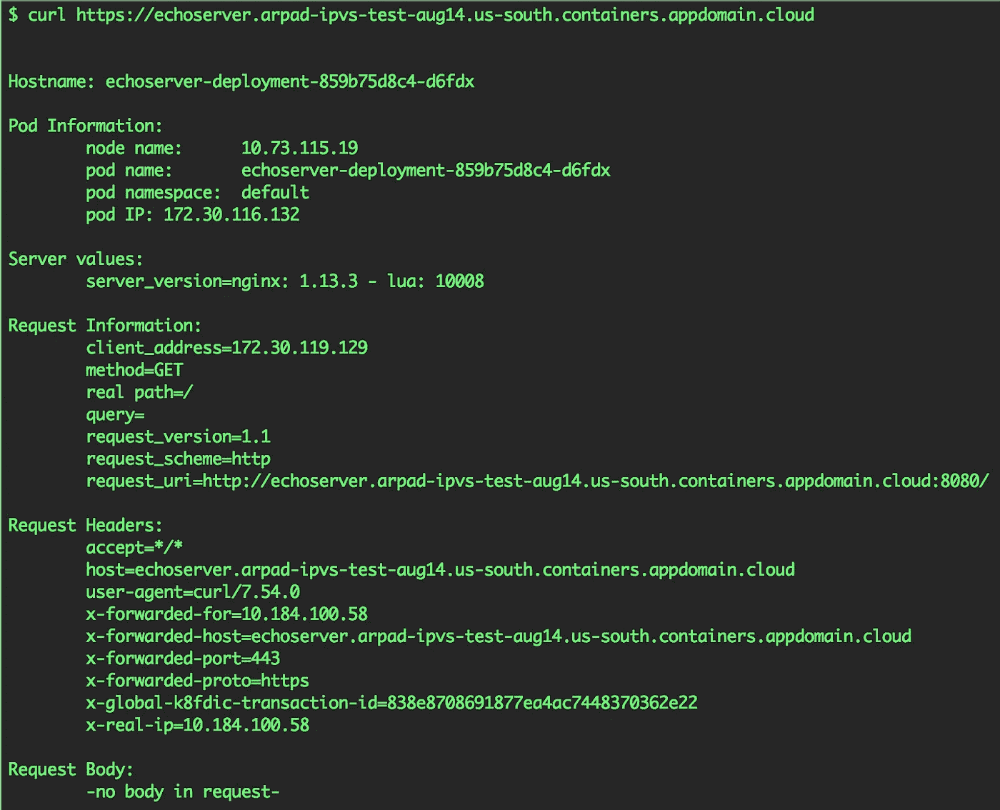
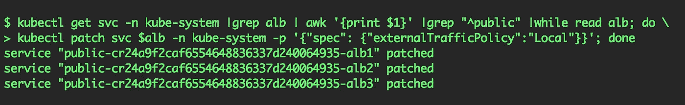
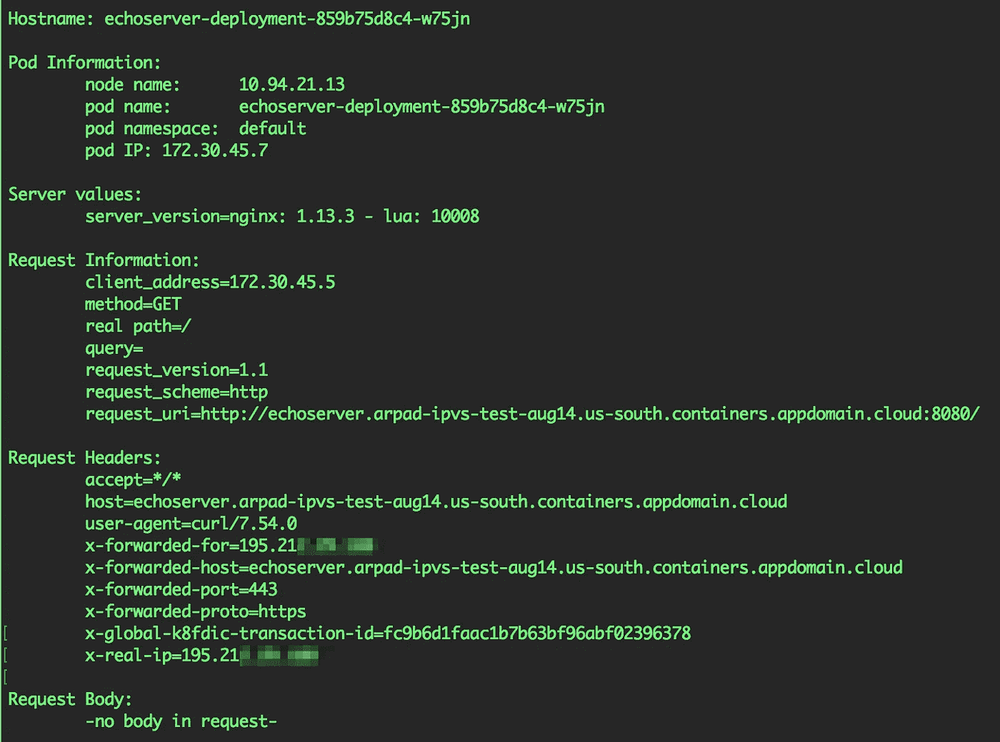

# IKS 部署模式#1:单区域集群，通过负载平衡器(NLB)和 ALB(入口控制器)公开应用

> 原文：<https://levelup.gitconnected.com/iks-deployment-patterns-1-single-zone-cluster-app-exposed-via-loadbalancer-nlb-and-alb-6370560307e4>

最简单的开始方式是什么？
我如何通过 LoadBalancer 服务直接在我的 IBM Cloud Kubernetes 服务(IKS)中部署和公开我的应用程序？
如何保存连接的客户端的源 IP 地址？

# 负载平衡器与 ALB /入口控制器

我应该在什么时候使用哪一个？
`LoadBalancer`通常是第 4 层(OSI 层)负载均衡器，通过使用 NLB(网络负载均衡器)来实现。对于 Kubernetes 集群，这通常意味着 TCP 和 UDP(在某些情况下是 SCTP)。`LoadBalancer`服务对更高层(如应用层)中的任何事物都没有概念，例如，它不理解 HTTP，这是第 7 层协议。

ALB / Ingress 控制器本质上是反向代理，通常在应用程序使用代理理解的协议时使用，并且可以提供额外的特性、功能和价值。通常，微服务是通过 HTTP 连接的(甚至是相互对话)。如果是这种情况，第 7 层代理可以根据 HTTP 头、GET、POST 参数、cookies 等进行智能决策。是一个很好的工具，用于请求路由、应用程序级负载平衡，将更高的协议级(L7)信息合并到路由决策中。ALBs / Ingress 控制器通常作为 Kube pods 中的用户空间守护程序运行。

如果 ALB 不知道协议，比如 MQTT、RTMP、MySQL、PostgreSQL 等二进制协议。类似代理的负载均衡器(如 ALB)并没有比第四层负载均衡器(如`LoadBalancer`服务)有更多的好处。因此，如果您的 ALB 将**而不是**处理 HTTP 请求(如果它没有终止 HTTPS 的 TLS 连接)，我们建议您使用 IKS `LoadBalancer`服务，该服务在数据包处理、转发方面更高效、更快，能够保留连接客户端的源 IP 地址，并横向扩展到多个工作节点。

# 示例部署模式

在本文中，我们将通过下面的部署模式来完成部署示例应用程序的步骤:

# 通过负载平衡器直接公开应用的步骤

1.  [注册](https://console.bluemix.net/registration/premium?)并使用 [IBM 云控制台](https://console.bluemix.net/)创建一个**单区域** IKS 集群。关于[部署集群](https://console.bluemix.net/docs/containers/cs_clusters.html#clusters)以及[单区域集群如何工作](https://console.bluemix.net/docs/containers/cs_clusters_planning.html#single_zone)的文档。重要提示:你必须使用付费层。
2.  下载并应用下面的[示例部署和服务资源 yaml](https://github.com/IBM-Cloud/kube-samples/blob/master/loadbalancer-alb/iks_single-zone_cluster_app_via_LoadBalancer.yaml) ，它将通过端口`1884`上的`LoadBalancer`服务公开`echoserver`应用。
    也可以直接敷:
    
3.  检查`LoadBalancer`服务的 IP 地址:

## 测试应用程序

1.  测试加载您在浏览器中指定的 IP:port 或启动`curl`命令(像我的例子):
    `$ curl [http://{your IP here}:1884/](https://echoserver.arpad-ipvs-test-aug14.us-south.containers.appdomain.cloud/)`
2.  您将看到如下所示的响应

您可以在`client_address`字段中看到源 IP 地址，因为我们在`LoadBalancer`服务资源中应用了`externalTrafficPolicy: Local`。

# 通过 ALB / Ingress 控制器公开 App 的步骤

1.  [注册](https://console.bluemix.net/registration/premium?)并使用 [IBM 云控制台](https://console.bluemix.net/)创建一个**单区域** IKS 集群。关于[部署集群](https://console.bluemix.net/docs/containers/cs_clusters.html#clusters)的文档，特别是[单区域集群如何工作](https://console.bluemix.net/docs/containers/cs_clusters_planning.html#single_zone)。*重要提示:你必须使用付费等级才能使用 ALBs。*
2.  检查是否一切正常，白蛋白是否正常。 [IKS 入口/ALB 备忘单](https://medium.com/@ArpadKun/ibm-cloud-kubernetes-service-ingress-alb-cheat-sheet-1-basics-4fbc1c86b886)上的有用命令。
3.  下载、编辑并应用以下[示例部署和入口资源 yaml](https://github.com/IBM-Cloud/kube-samples/blob/master/loadbalancer-alb/iks_single_or_multi-zone_cluster_app_via_ALB.yaml) ，这将通过端口`80(http)`和`443(https).`
    `$ kubectl apply -f [iks_single_or_multi-zone_cluster_app_via_ALB.yaml](https://raw.githubusercontent.com/IBM-Cloud/kube-samples/master/loadbalancer-alb/iks_single_or_multi-zone_cluster_app_via_ALB.yaml)`上的 ALB / Ingress 控制器公开`echoserver`应用程序注意:不要忘记编辑`Host`和`secretName`部分。
4.  测试加载您在浏览器中指定的主机或启动`curl`命令(像我的例子):
    `$ curl [https://echoserver.arpad-ipvs-test-aug14.us-south.containers.appdomain.cloud/](https://echoserver.arpad-ipvs-test-aug14.us-south.containers.appdomain.cloud/)`
5.  您将看到如下所示的响应

对通过 IKS ALB 传送的成功卷曲的响应

注意，在`x-forwarded-for`和 `x-real-ip`头中，您可以看到 worker 节点的 IP 地址。发生这种情况是因为`kube-proxy`正在 Kubernetes 集群内进行源 NAT，并屏蔽了客户端的原始源 IP。

如果你想启用源 IP 保护，你必须`patch`IKS ALB(你可以在这里找到[关于这一步的进一步文档)。要为群集中的所有公共 ALB 设置源 IP 保留，请运行以下命令:](https://console.bluemix.net/docs/containers/cs_ingress.html#preserve_source_ip)

`$ kubectl get svc -n kube-system |grep alb | awk '{print $1}' |grep "^public" |while read alb; do kubectl patch svc $alb -n kube-system -p '{"spec": {"externalTrafficPolicy":"Local"}}'; done`

应用补丁后，您将看到客户端的原始源 IP 地址显示在`x-forwarded-for`和`x-real-ip`标题中:

# 摘要

随着您对工作负载的了解越来越多，您可以根据需要调整甚至切换模式。不同的应用需要不同的模式；请让我们帮助你的模式！要阅读其他模式，请点击链接到 IBM 云博客或 Medium.com[上的链接](https://medium.com/@ArpadKun/ibm-cloud-kubernetes-service-deployment-patterns-for-maximizing-throughput-and-availability-88a23a99437f)。

# 联系我们

如果您有任何问题，请在这里注册[，通过 Slack 加入我们的团队，并在我们的公共 IBM Cloud Kubernetes 服务 Slack 上的#general channel](https://bxcs-slack-invite.mybluemix.net/) 中加入讨论。