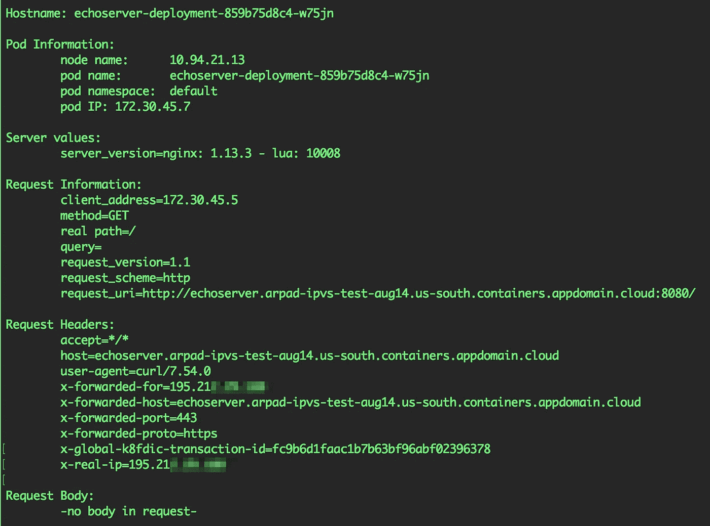

# IKS 部署模式#2:多区域集群，通过 ALB /入口控制器公开应用

> 原文：<https://levelup.gitconnected.com/iks-deployment-patterns-2-multi-zone-cluster-app-exposed-via-alb-ingress-controller-415908418abd>

我应该如何使用 IBM Cloud Kubernetes Service(IKS)ALB 在集群中部署我的应用程序？
如何保存通过 ALB 连接的客户端的源 IP 地址？

# 示例部署模式

在本文中，我们将按照下面的部署模式来完成部署示例应用程序的步骤:

# 步伐

1.  [注册](https://console.bluemix.net/registration/premium?)并使用 [IBM 云控制台](https://console.bluemix.net/)创建一个**多区域** IKS 集群。关于[部署集群](https://console.bluemix.net/docs/containers/cs_clusters.html#clusters)以及[多区域集群如何工作](https://console.bluemix.net/docs/containers/cs_clusters_planning.html#multizone)的文档。*重要提示:您必须使用付费等级才能使用 ALBs。*
2.  检查是否一切正常，白蛋白是否正常。 [IKS 入口/ALB 备忘单](https://medium.com/@ArpadKun/ibm-cloud-kubernetes-service-ingress-alb-cheat-sheet-1-basics-4fbc1c86b886)上的有用命令。
3.  下载、编辑并应用以下[示例部署和入口资源 yaml](https://github.com/IBM-Cloud/kube-samples/blob/master/loadbalancer-alb/iks_single_or_multi-zone_cluster_app_via_ALB.yaml) ，这将通过端口`80(http)`和`443(https).`
    `$ kubectl apply -f [iks_single_or_multi-zone_cluster_app_via_ALB.yaml](https://raw.githubusercontent.com/IBM-Cloud/kube-samples/master/loadbalancer-alb/iks_single_or_multi-zone_cluster_app_via_ALB.yaml)`上的 ALB / Ingress 控制器公开`echoserver`应用程序注意:不要忘记编辑`Host`和`secretName`部分。
4.  测试加载您在浏览器中指定的主机或启动`curl`命令(像我的例子):
    `$ curl https://echoserver.arpad-ipvs-test-aug14.us-south.containers.appdomain.cloud/`
5.  您将看到如下所示的响应

对通过 IKS ALB 传送的成功卷曲的响应

注意，在`x-forwarded-for`和 `x-real-ip`头中，您可以看到 worker 节点的 IP 地址。这是因为`kube-proxy`正在 Kubernetes 集群内进行源 NAT，并屏蔽了客户端的原始源 IP。

如果你想启用源 IP 保护，你必须`patch`IKS ALB(你可以在这里找到[关于这个步骤的更多文档)。要为群集中的所有公共 ALB 设置源 IP 保留，请运行以下命令:](https://console.bluemix.net/docs/containers/cs_ingress.html#preserve_source_ip)

`$ kubectl get svc -n kube-system |grep alb | awk '{print $1}' |grep "^public" |while read alb; do kubectl patch svc $alb -n kube-system -p '{"spec": {"externalTrafficPolicy":"Local"}}'; done`

应用补丁后，您将看到客户端的原始源 IP 地址显示在`x-forwarded-for`和`x-real-ip`标题中:

# 摘要

随着您对工作负载的了解越来越多，您可以根据需要调整甚至切换模式。不同的应用需要不同的模式；请让我们帮助你的模式！要阅读其他模式，请点击链接到 IBM Cloud 博客(T10)或 Medium.com(T12)上的链接。

# 联系我们

如果您有任何问题，请在此注册[通过 Slack 加入我们的团队，并在我们的公共 IBM Cloud Kubernetes 服务 Slack 上的#general channel](https://bxcs-slack-invite.mybluemix.net/) 中加入讨论。