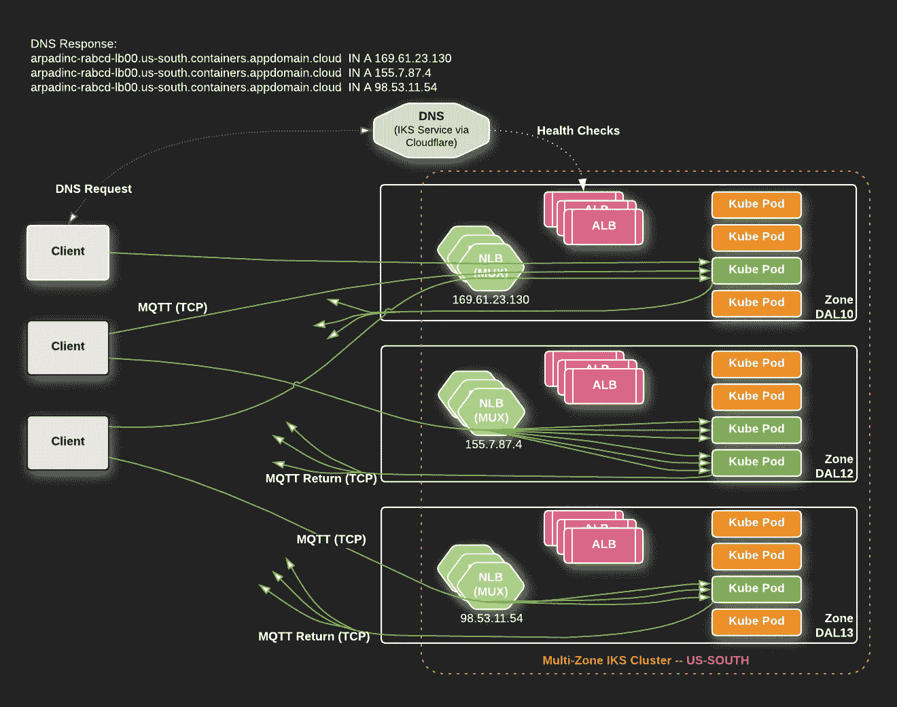
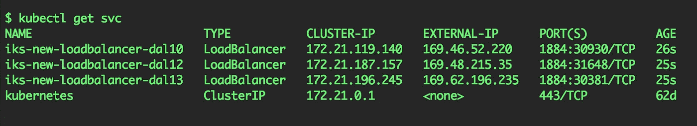

# IKS 部署模式#3:多区域集群，仅使用区域内后端通过负载平衡器公开应用

> 原文：<https://levelup.gitconnected.com/iks-deployment-patterns-3-multi-zone-cluster-app-exposed-via-loadbalancer-using-in-zone-34bd2c43db79>

如何在我的 IBM Cloud Kubernetes 服务(IKS)中直接使用多区域集群中的 LoadBalancer 服务部署和公开我的应用程序，但只使用位于同一可用性区域的本地端点？

# 示例部署模式

在本文中，我们将按照下面的部署模式来完成部署示例应用程序的步骤:

# 步伐

1.  [注册](https://console.bluemix.net/registration/premium?)并使用 [IBM 云控制台](https://console.bluemix.net/)创建一个**多区域** IKS 集群。关于[部署集群](https://console.bluemix.net/docs/containers/cs_clusters.html#clusters)以及[多区域集群如何工作](https://console.bluemix.net/docs/containers/cs_clusters_planning.html#multizone)的文档。*重要提示:您必须使用付费层。*
2.  下载并应用下面的[示例部署和服务资源 yaml](https://github.com/IBM-Cloud/kube-samples/blob/master/loadbalancer-alb/iks_multi-zone_cluster_app_via_LoadBalancer_using_local_endpoints_only.yaml) ，它将通过端口`1884`上的`LoadBalancer`服务在 yaml 中指定的三个可用区域中公开`echoserver`应用程序。
    `$ kubectl apply -f [iks_multi-zone_cluster_app_via_LoadBalancer_using_local_endpoints_only.yaml](https://raw.githubusercontent.com/IBM-Cloud/kube-samples/master/loadbalancer-alb/iks_multi-zone_cluster_app_via_LoadBalancer_using_local_endpoints_only.yaml)`注意:不要忘记编辑标有`NEED TO EDIT!`的行
3.  检查`LoadBalancer`服务的 IP 地址:

## 测试应用程序

1.  测试加载您在浏览器中指定的 IP:port 或启动`curl`命令(像我的例子):
    `$ curl [http://{your IP here}:1884/](https://echoserver.arpad-ipvs-test-aug14.us-south.containers.appdomain.cloud/)`
2.  您将看到如下所示的响应。(对每个`LoadBalancer` IP 地址运行它。)

您可以在`client_address`字段中看到源 IP 地址，因为我们在`LoadBalancer`服务资源中应用了`externalTrafficPolicy: Local`。

# 摘要

随着您对工作负载的了解越来越多，您可以根据需要调整甚至切换模式。不同的应用需要不同的模式；请让我们帮助你的模式！要了解其他模式，请点击这个链接到 IBM 云博客或 Medium.com[的](https://medium.com/@ArpadKun/ibm-cloud-kubernetes-service-deployment-patterns-for-maximizing-throughput-and-availability-88a23a99437f)。

# 联系我们

如果您有任何问题，请在这里注册[，通过 Slack 加入我们的团队，并在我们的公共 IBM Cloud Kubernetes 服务 Slack 上的#general channel](https://bxcs-slack-invite.mybluemix.net/) 中加入讨论。