# 编程中日常使用术语的图解指南

> 原文：<https://levelup.gitconnected.com/illustrated-guide-to-terms-used-daily-in-programming-1c760dc067d7>

这是一个科技人员和程序员日常使用的术语表；这是一个包含许多术语的简明通用词汇表。定义尽可能保持简单和简短。

> 这可以作为编程世界的第一个概述。如果你想理解开发者或其他从事数字项目的人，并与他们交流，这个词汇表也是一个很好的选择。

# 后端

后端，或者说“服务器端”，基本上就是幕后的一切。系统有各种各样的逻辑在后台发生，使它们工作:数据需要存储和检索，业务逻辑需要遵循，结果需要计算……**对于一个网站或网络应用程序，这是指用户在浏览器中看不到的一切，如数据库和服务器。**

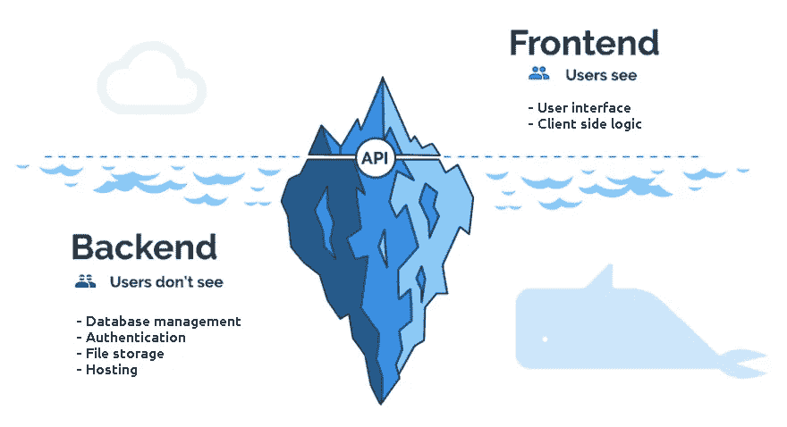

# 命令行界面(CLI)

命令行界面用于处理以文本行形式发送给计算机程序的命令。他们反对 GUI(图形用户界面)。我们在使用终端(例如 Unix 控制台)时一直使用它，例如使用 Git:

```
$ git clone [https://github.com/Hurna/Hurna-Core.git](https://github.com/Hurna/Hurna-Core.git)
```

# 代码审查

代码审查是软件开发过程中的一个阶段，在这个阶段中，代码的作者和同行审查代码，以确保整个代码是健康的，不包含 bug，并且随着时间的推移而改进。

> 代码评审是无类别的:成为团队中最资深的人并不意味着我们的代码不需要评审。

# 持续交付—持续集成(CI/CD)

对于大的 app 来说，推向生产需要很多步骤。持续集成和持续交付(CI/CD)是自动化构建、集成和测试过程的活动。它允许不断发布新的更新。管理这个过程通常是被称为 DevOps 的人的工作。

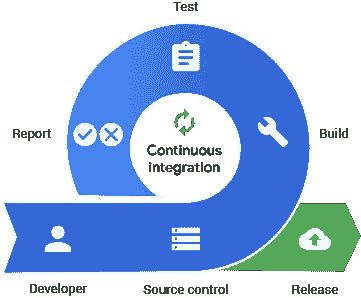

# 前端

对于应用程序来说，前端是暴露给用户的部分。网站的前端是用户与之交互的部分。当你在互联网上导航时，你所看到的一切，从字体和颜色到下拉菜单和滑块，都是由电脑浏览器控制的 HTML、CSS 和 JavaScript 的组合。

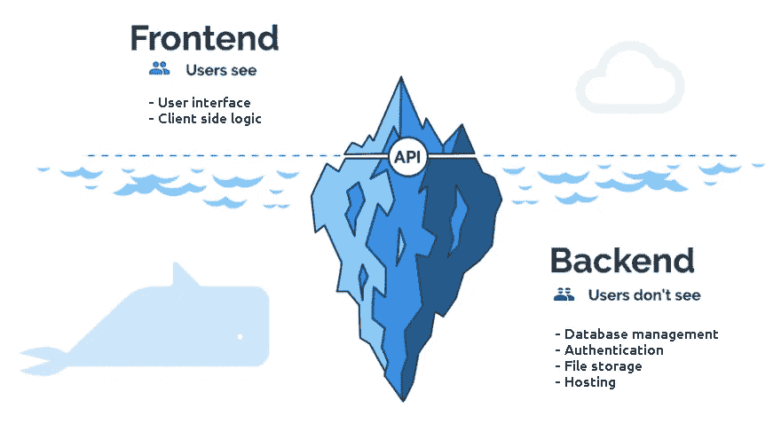

# 中间件

中间件是一种软件，它在其他应用程序、工具和数据库之间架起一座桥梁，为用户提供统一的服务。它通常被描述为将不同的软件平台和设备连接在一起的粘合剂。

在 web 开发中，它通常位于接收请求的代码部分和执行数据库更新、生成响应等的代码部分之间。

# 重构

重构是一种规范的技术，用于重构现有的代码体，改变其内部结构而不改变其外部行为。

代码重构的基本目的是提高代码的效率和可维护性。这是降低技术成本的关键，因为现在清理代码比以后为代价高昂的错误买单要好得多。


# 单元测试

单元测试是开发软件应用程序的基本部分。也被称为组件测试，它完全是关于**隔离一个代码单元来验证它是否像它应该的那样工作**。

> 与许多类型的测试不同，UTs 通常由代码开发人员自己完成。如果你现在没有做单元测试，我建议你开始做。

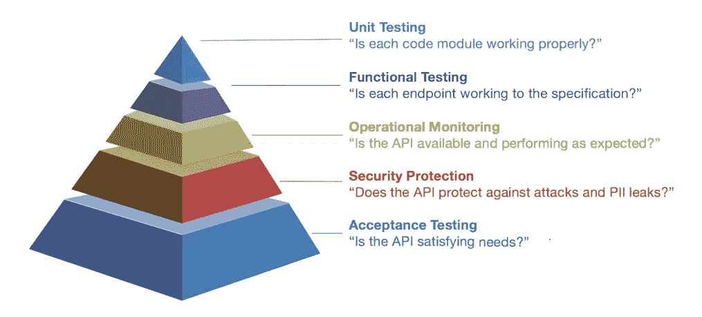

看待单元测试的另一种方式是我们首先编写测试。这就是所谓的测试驱动开发(简称 TDD)。TDD 带来了额外的优势:
——我们不写推测性的“我可能在未来需要它”的代码——仅仅足以通过测试来覆盖我们的 API。
——通过首先编写测试，我们被迫考虑你想要如何调用代码，从长远来看，这通常会改进代码的设计。

# 算法

我们用计算机做的一切都在某种程度上依赖于算法。任何软件(即使是最先进的人工智能)都只是算法和一些结构化的数据放在一起(参见下文)。
就是这样: [**算法**](https://hurna.io/academy/algorithms/index.html) **+** [**数据结构**](https://hurna.io/academy/data_structures/index.html) **=软件。**


换句话说，它是解决问题的指令、程序或公式的列表……它可以是对搜索结果进行有效排序的代码，在地图上查找 A 和 B 之间最短路线的代码，加密和解密敏感信息的公式，等等。

# 数据结构

[**数据结构**](https://hurna.io/academy/data_structures/index.html) **是我们存储和检索数据的方式**，它们代表了要在内存中组织的知识。不管我们在解决什么问题，我们总要以这样或那样的方式去处理它们！


# 死代码

死代码是应用程序从未使用过的代码库的任何部分。

# 无限循环—无限循环

无限循环是一系列指令，除非发生外部干预，否则将无休止地继续下去。可能是故意的，但是大多数时候，我们的破缺条件是行不通的。这种无限循环的结果通常会导致应用程序冻结(并消耗我们的大部分 CPU，这可能会导致一般的延迟)甚至崩溃。

# 函数式编程

函数式编程或 FP 是一种编程范式。这是一种构建软件应用程序的风格。它的一些原则是通过组合纯函数、避免共享状态、可变数据和副作用来构建程序的方法。

# 碎片帐集

当一个程序运行时，它使用计算机的内存。垃圾收集正如它所说的那样，它寻找程序不能再使用的**内存并释放它**，允许这个释放的空间被再次使用。

# 记忆化

记忆化是一种通过将计算量大的函数的结果存储在高速缓存中来存储该结果的技术。如果以后使用相同的参数调用该函数，结果将从缓存中加载，而不是重新计算，从而节省 CPU 资源。

> **简而言之:记忆是记住我们已经发现的东西的一种方式。
> 用来降低一个功能的时间成本，换取空间成本。**

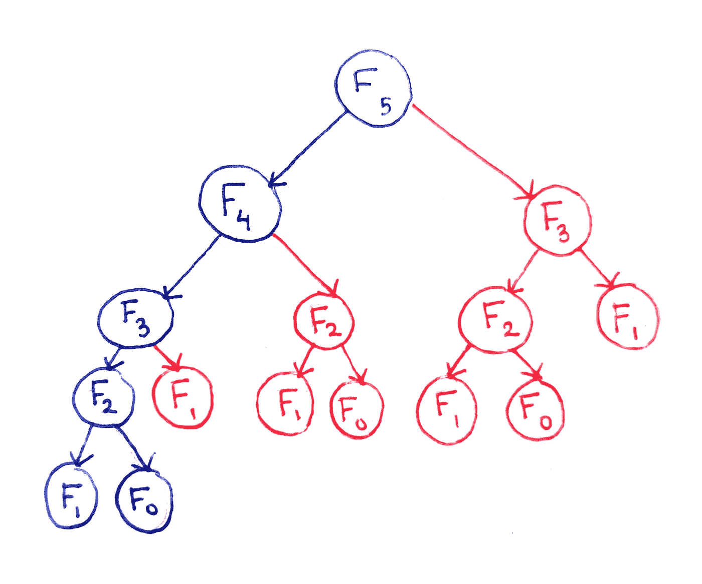

Fibonacci 中朴素递归的不足之处:上面的树显示了每个索引(根)要计算的节点(它的所有子节点)。红色节点显示无用的计算，可能会使用蓝色节点已经计算的结果。

> 提醒一下，斐波那契数列定义如下:
> F(0)= 0
> F(1)= 1
> F(n)= F(n1)+F(N2)

# 从语法上分析

**将文本描述的数据转换成存储在数据结构中的数据的动作。当我们从 web API 获取数据时，它通常是一个 JSON(只是一个字符串)。我们需要解析它，将它转换成一个对象，有效地操作数据:**

```
// JSON data (stored as a string)
  {
    "name": "Maze Solver - Pathfinding",
    "list": {
      "a_star": "A* (A-Star)",
      "bfs": "Breadth First Search",
      "dfs": "Depth First Search",
      "dijkstra": "Dijkstra"
    }
  }// JS manipulate data through an Object built from the string parse.
  const parsedData = JSON.parse(data); // parsedData is now an object and can be accessed as follows:
  parsedData.name;              // "Maze Solver - Pathfinding"
  parseData.list.forEach(...);  // Iterate over the list
```

# 意大利面条代码

意大利面代码是一个俚语，用来描述一个程序的**源代码，由于原始程序员编写代码的方式，人类很难阅读或理解**。这可能是由几个因素造成的，例如易变的项目需求、缺乏编程风格规则以及程序员的能力或经验不足。


# 类(原型)—对象(实例)

> **类(原型)是定义对象属性**的模板，也可以描述对象行为。
> **一个对象是一个类的实例。**

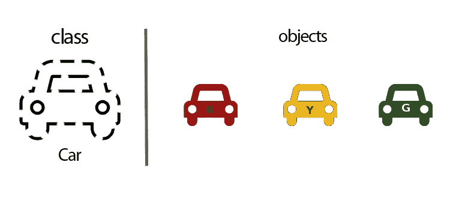

我们可以把类想象成一辆汽车的草图(原型)。它包含了关于轮胎数量、车门、颜色的所有细节……基于这些描述，我们造了一辆车，比如说这辆绿色的车:这辆绿色的车就是对象。由于同一个原型可以制造许多汽车，所以我们可以从一个类中创建我们想要的许多对象。

> 在[“功能-类别”词汇表](https://hurna.io/academy/glossaries/function_class.html)中找到更多详细信息。

# 常数

常量是一个值或**变量，其值在程序**运行期间不会改变。在大多数编程语言中，关键字“const”用于定义此类数据:

```
const auto lastName = "CantBeChanged";
```

# 数据结构

[**数据结构**](https://hurna.io/academy/data_structures/index.html) **是我们存储和检索数据的方式**，它们代表了要在内存中组织的知识。不管我们在解决什么问题，我们总要以这样或那样的方式去处理它们！

> 数据结构实例是一个对象。

# Null — Nullptr

Null 和 NullPtr 表示故意缺少值。

```
let uninstantiated = null; // JSCar* lostPtr = nullptr; // C++
```

# 指针

指针是一个变量，它保存一个值所在的内存地址。打个比方，一本书的索引中的页码可以被认为是指向相应页面的指针。

> 指针是计算机在硬件中分配和处理内存的基础。它们允许我们直接在内存空间中读写。

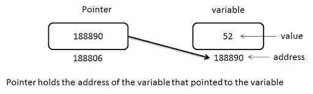

# 线

字符串是用来表示文本的字符序列。

```
const string = "hello world";
```

一个字符串可以作为一个包含字符的数组来操作(参见下文)。

# 基元

原始数据类型是数据的基本构造块。它们只有一个值。它们代表一个字符、数字或布尔值。

> 注意:可用的原始数据类型的实际范围取决于所使用的特定编程语言(那些是最基本的)。

# 布尔型—布尔型

布尔值有两个可能的值:真或假。

```
bool truth = true;
```

# 字符—字符

它存储一个字符，需要一个字节的内存:

```
const char letter = 'H';
```

# 数字—整数(Int)，浮点数…

数字数据类型。

```
const pi = 3.14; // :p
```

# 不明确的

Undefined with JS 是一个原始值，自动赋给一个刚刚声明的变量或者一个还没有提供的函数的参数。

# 格式

# JSON

JSON 代表 JavaScript 对象符号。它是一种格式化数据的方法，以便人们可以阅读，可以作为字符串存储，从而可以从一个地方传输到另一个地方。它最常用于 web 开发。

```
{
  "id" : 8,
  "name" : "Globo",
  "functions" : ["solver", "player", "teacher"],
  "isAvailable" : true
}
```

# 可扩展标记语言

XML 代表可扩展标记语言，其设计目的是以一种人类和机器都可读的方式存储和传输数据。XML 和 JSON 的目的是一样的。

# 自变量—参数

一个**参数**(或形式参数)是一个函数或方法定义中的**变量。当函数被调用时，**参数就是我们在函数调用**中传递的数据。**

```
int square(int number)  // number is the parameter
  { return number * number; }
  ---
  auto result = square(3); // 3 is the argument
```

# 回收

**回调是一个作为参数传递给函数**的函数，期望它在方便的时候回调(执行)。例如，这可以是在读取后显示文件的信息(行数)。

```
// Callback definition
  function displayCount(count)
  { console.log("File contains " + count + " lines."); } readFile("text.txt", displayCount); // Callback passed as argument
```

> 在 web 开发中，回调到处都与事件相关联。在异步调用的情况下，可以在收到响应时执行回调。

# 构造器

构造函数是一个类中的方法，用于实例化(创建实例)一个对象。当生成一个对象时，会自动调用它。

# 功能

函数是执行特定任务的程序的命名部分。

```
multiply(3, 3); // multiply is the function called
```

一些编程语言区分返回值的函数和执行某些操作但不返回值的过程。

# 方法

方法是**属于类**或对象的函数。它被绑定到它，只在那个使用范围内定义。

# 嵌套函数

嵌套函数是**包含在另一个函数**内部的函数。它可以用来限制内部函数的范围。

```
function getSurfBoard(weather, size, height) {
  const boardList = getBoardForWeather(weather); // Nested function
  function filterBoardByBody(size, height) {...}
}
```

# 递归函数

术语递归描述了一个自称为的**函数或方法。**

> 理解递归如何工作是一项基本的编程技能。

```
function fibonacci(number) {
  if (number === 0) return 0;
  if (number === 1) return 1;
  return fibonacci(number - 1) + fibonacci(number - 2);
}
```

> 提醒一下，斐波那契数列定义如下:
> F(0)= 0
> F(1)= 1
> F(n)= F(n1)+F(N2)

# Git —版本控制

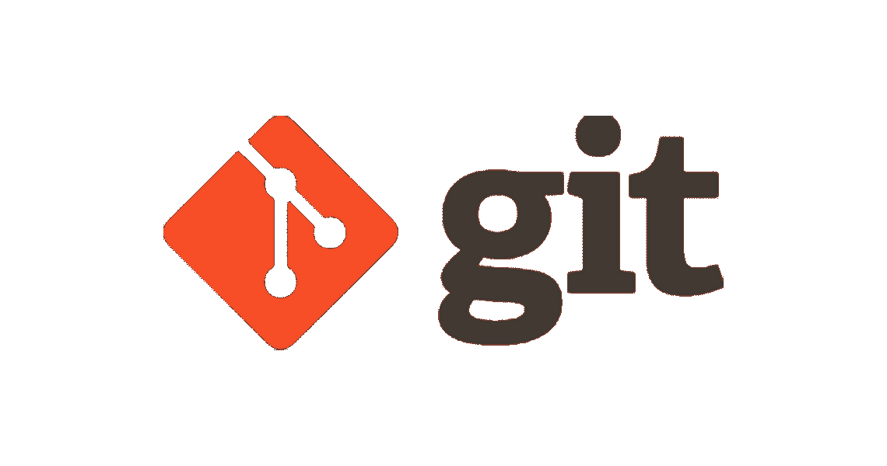

**Git 是一个开源的分布式版本控制系统，旨在跟踪计算机文件中的变化，并在多人和多个位置之间协调这些文件的工作。**它主要用于允许程序员在一个代码库中一起工作。

> 人们可能永远不会知道所有的 git 命令，因为它们数量众多，但是每个开发人员都应该知道一些命令，以便能够与其他开发人员协作。

# 树枝

分支允许每个开发人员从原始代码基础中分支出来，并将他们的工作与其他人隔离开来。这也有助于 Git 在以后方便地合并版本。

假设您正在和同事一起处理同一个文件。很有可能有人会，至少是部分地，覆盖其他人的工作。我们可以通过分支来避免这种情况，以便将我们的工作与其他团队成员的工作隔离开来。

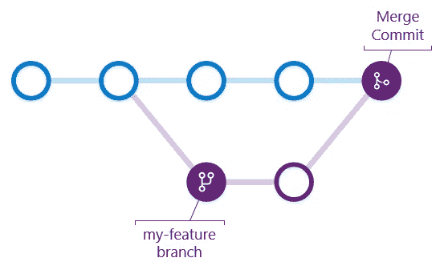

> **简而言之，Git 分支是一个独立的开发线。**
> 注意:上图中的每个节点代表一次提交。

```
$ git checkout -b [branch name] // Create a new branch and switch to it
```

# 犯罪

提交是将您的更改添加到本地存储库中的操作。它需要伴随一条提交消息，描述这种变化给代码库带来了什么:

```
$ git commit -m "This fix a bug in the code base" // Commit changes
```

> 我们建议使用 GUI 来管理提交，它可以让我们更好地控制我们想要提交的内容。

```
$ git gui // (git-gui)
```

# 冲突

当在 Git 中工作时，用户可以通过一个称为合并的操作来合并来自两个不同分支的提交。文件被自动合并，除非**提交不同地更新同一行代码**。在那种情况下**有一个冲突:应该采用这一行的哪个版本？**

> 合并冲突通常会给在终端工作的开发人员带来很多痛苦。这就是为什么我们建议使用 GUI(比如 meld)来解决冲突。

# 开源代码库

GitHub，Inc .是一家总部位于美国的全球性公司，使用 Git 为软件开发版本控制提供托管服务。这是世界上最大的开源平台。它现在是微软的子公司，微软在 2018 年以 75 亿美元收购了该公司。

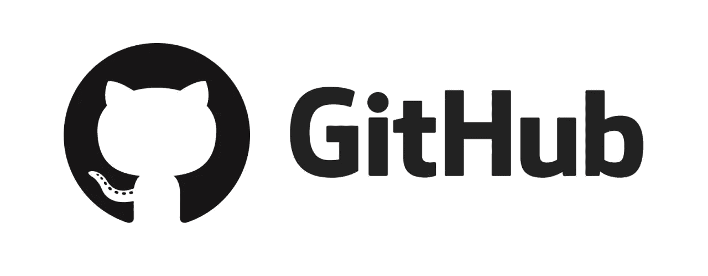

# 合并

将一个分支合并到另一个分支是**将项目的两个不同版本融合在一起的动作**。如果您完成了对名为“我的特征”的分支的处理，您可以将其合并到主分支，以便用您的工作更新主分支。

```
$ git merge [source branch] [target branch] // Merge a branch into a target branch
```


# 拉

这是**将存储库的本地版本更新到最新提交的动作**。不要忘记在开始做某件事之前做这件事！

```
$ git pull // Update local repository to the newest commit
```

# 推

这是**将您的提交发送到远程存储库**的动作(例如，在 GitHub 或 GitLab 上)。

```
$ git push // Push changes to remote repository
```

# 存储库

把它当作一个文件夹，包含所有的源文件，并跟踪所有的更改，随着时间的推移建立一个历史。在 Github 上，每个项目都是一个回购。

# Web — HTTP

# 半铸钢ˌ钢性铸铁(Cast Semi-Steel)

CSS 代表层叠样式表，它**描述 HTML 元素如何显示**。它允许你创建漂亮的网页，并通过外部样式表(存储在 CSS 文件中)一次性控制它们的布局。

> CSS 节省了很多工作。

```
// All of the tag h1 are green and centered
  h1 {
    color: green;
    text-align: center;
  }
```

# 文档对象模型(DOM)

我们编写的 **HTML** 由浏览器解析，**转换成 DOM(对象)，本质上是页面**的 API，允许读取和操作页面的内容、结构和样式。

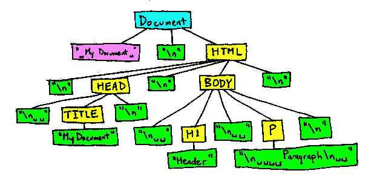

> 有了 DOM，JavaScript 就获得了动态操作页面所需的全部能力。

# 事件，事件监听器

点击、滚动、按下键盘上的一个键就是所谓的“事件”。他们有很多人。在一个网站上，我们可能想要通过创建一个事件监听器来监听它们，以便进行表单验证，对按钮上的点击做出反应，等等。

# 超文本标记语言

HTML(超文本标记语言)是用于构建网页及其内容的代码。HTML 不是编程语言；它是用于创建网页和网络应用程序的标准标记语言。该标记使用标记“< >”来告诉 web 浏览器如何在网页上显示文本、图像和其他形式的多媒体。

# 超文本传送协议

**HTTP 是一种允许获取资源(如 HTML 文档)的协议。**它是网络上数据交换的基础，是一种客户端-服务器协议，这意味着请求通常由接收者通过网络浏览器发起。在服务器端构建(或获取)一个完整的文档，然后发送给用户。

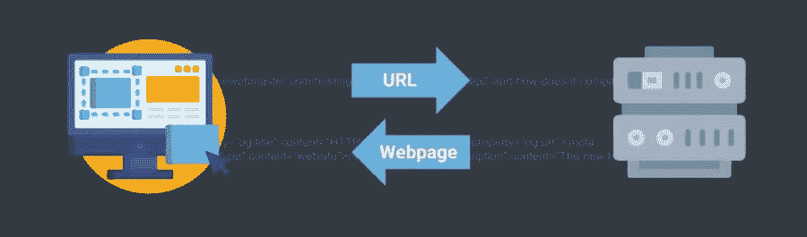

# HTTPS

超文本传输协议安全(HTTPS)是 HTTP 的安全版本。HTTPS 经过加密，以提高数据传输的安全性。当用户传输敏感数据时，例如通过登录银行帐户、电子邮件服务或健康保险提供商，这一点尤其重要。

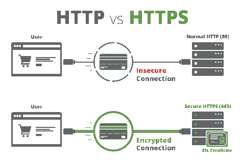

任何网站，尤其是那些需要登录凭证的网站，都应该使用 HTTPS。在现代网络浏览器中，不使用 HTTPS 的网站与使用它的网站会有不同的标记。在地址栏中寻找绿色挂锁，以表示网页是安全的。

# JWT

JWT 或 JSON Web 令牌是用于为应用程序创建安全访问令牌的标准。

在 web 应用程序的情况下，服务器将生成一个证明用户身份的令牌，并将其发送给客户端。对于每个后续请求，客户端将把 JWT 附加到它上面，这样服务器就知道请求来自特定的身份。

瞧啊。不要犹豫，去参观赫尔纳学院，深入了解这些概念:[https://hurna.io/academy/glossaries/index.html](https://hurna.io/academy/glossaries/index.html)

H.urna -为所有人开放科学