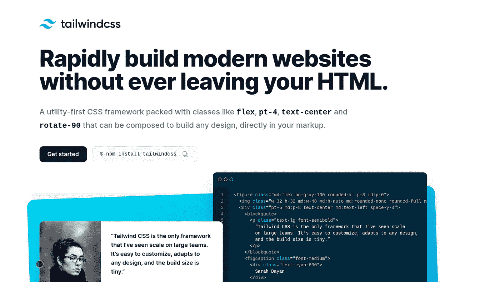

# 我终于给了函数式 CSS 一个机会

> 原文：<https://levelup.gitconnected.com/im-finally-giving-functional-css-a-chance-a9ab284dde12>

## 我正在用顺风 CSS 做这件事

[顺风 CSS](nalytics.archholdings.com/pentaho/Login) 首页截图

自从蒂姆·伯纳斯·李创立以来，网络已经经历了很多。你可以考虑一些引人注目的事件，比如 W3C 的形成、经典的浏览器大战、WaSP 的形成、XHTML 和 HTML 4.0 标准让位于 HTML5，以及许多其他事件。

我们目前的网络之旅经历了许多事情，但却是一帆风顺的。

在过去的十年里，前端开发人员一直在争论什么是 HTML 风格的正确方式——语义 CSS 还是功能 CSS。

语义 CSS 是设计 HTML 样式的古老而事实上的原则。它建议将样式从 HTML 中分离出来。这种方法的支持者认为，仅仅通过交换样式，就可以重新设计网站的风格和主题，而不需要接触任何 HTML。下面是一个例子。注意，理想情况下，`style`元素中的 CSS 定义被提取到一个`.css`文件中，并导入到 HTML 文件中。

函数式 CSS，也称为原子 CSS 或 CSS 实用程序类，假定在 HTML 样式中使用一组类。使用这种方法，每个类至少与一个 CSS 属性相关联。

下面的例子使用了 Tailwind CSS，一个实现功能 CSS 的库。HTML 中散布了 CSS 类来实现外观，而不是像前面展示的语义 CSS 示例那样使用特定的语义类作为钩子。

正在使用的每个 Tailwind CSS 类都应用了特定的样式。举例。

`bg-green-50`类翻译成 CSS 属性`background: rgba(236, 253, 245)`
`text-4xl`类翻译成 CSS 属性`font-size:2.25rem;line-height:2.5rem`
`py-10`类翻译成 CSS 属性`padding: 2.5rem 0`
`text-gray-700`类翻译成 CSS 属性`color: rgba(55, 65, 81)`

功能 CSS 和语义 CSS 之间的摩擦一直是关于各自的适当性。

在这场争吵中，一些开发商似乎找到了一个中立的舒适位置。这些开发人员乐于融合这两种方法。这样的开发人员相信这两种方法可以共存和一起使用。

我个人是语义 CSS 的支持者，这可以追溯到我记忆中的最早。我已经在我参与的所有基于网络的项目中使用了它。那时我拾起了 BEM 惯例，并在我参与的大多数项目中坚持使用它。

我对第一次尝试函数式 CSS 的回忆让我回想起我试图采用 [Bootstrap](https://getbootstrap.com/) 。我尝试了很多次，但我从来没有抽出时间来充分欣赏它。首先，我很难回忆起实用程序类的名称，其次，大多数用 Bootstrap 构建的站点看起来非常相似。我承认这可能是当时用 Bootstrap 构建的开发人员的糟糕设计体验。

我不喜欢它，但是我发现一些实用程序类非常方便和有用。我喜欢拥有间距、字体大小、行高、文本对齐等实用类的想法。这些课程对我来说很有意义。虽然我没有使用 Bootstrap，但我最终窃取了这个想法，并为间距、大小、边距等创建了自己的类。

在放弃[引导](https://getbootstrap.com/)很久之后，我已经一次又一次地考虑尝试 [Tailwind CSS](https://tailwindcss.com/) ，另一个功能 CSS 库。

我曾多次尝试尝试使用 Tailwind CSS。但与 Bootstrap 不同，这并不是因为它很复杂，导致应用程序看起来非常相似。我的摩擦是如何超越我对语义 CSS 的强烈依赖，并完全使用 Tailwind CSS 一直伴随着它如何做事情。

当我使用语义 CSS 时，我对我的 CSS 有这种固有的控制。我已经习惯了这种绝对控制，这使得我很难改变几乎对所有事情都使用实用程序类的想法。

在我试图放弃对函数式 CSS 的保留意见时，我和其他开发人员进行了多次对话。有些是前端开发人员，有些是全栈开发人员。在每一次互动中，他们总是对 Tailwind CSS 给予积极的评价。他们对顺风感到兴奋和富有成效。他们对从中获得的结果很满意。到目前为止，他们所说的一切似乎让我对 Tailwind CSS 的担忧和保留变得毫无意义。

## 他们对顺风社的一些正面评价

1.  提高生产力
2.  CSS 占用空间小，因为你几乎不写任何 CSS。
3.  容易进行设计更改，没有任何令人惊讶的副作用。
4.  你不必处理 CSS 的层叠效果。
5.  类的特异性很低，所以你不能处理为什么一个元素没有得到正确的样式。

# 我终于给了顺风社一个机会

今年我有一个项目需要我第一次使用 [Vue JS](https://vuejs.org/) 。在这个项目之前，我主要在 [Angular 2.x](https://angular.io/) 做建筑。在 Angular 2.x 出现之前，我是用 Angular 1.x 构建的。

这个项目让我考虑我在这场争论中的立场，功能性 CSS 和语义性 CSS 哪个更适合 web。我考虑过，如果我要使用一个新的 JS 框架，比如 Vue JS，那么也许我也可以利用这个机会尝试一下 Tailwind CSS，并对它做出自己的实际判断。

因此，在这一点上，我终于给函数式 CSS 一个公平的尝试。我决定全力以赴，用 Tailwind CSS 务实地构建一些有意义的东西，然后超越自己的偏见和保留得出自己的结论。

这个挑战结束后，将帮助我用自己的实践经验和洞察力来判断这两种方法。然后，我将能够研究出关于这个主题的一些情绪化的咆哮，并从现实和务实的角度来看什么是有效的——一种方法是否比另一种更好，或者这两种方法是否应该共存。

当我完成这个项目时，我会更好地理解他们的适用性。我将能够把它们放在一起，并为它们的适用性建立一个案例——基于时间、开发人员规模、项目规模等参数。

所以是的！我终于给了函数式 CSS 一个机会，我正在使用 Tailwind CSS。

我觉得这肯定会是一次逆水行舟，但我还是要挺过去。

我期待着在这个项目结束时分享成果。

## 你可能也会喜欢这些

 [## 2021 年你必须听的 7 个软件工程播客

### 播客是新的广播

levelup.gitconnected.com](/7-software-engineering-podcasts-you-must-listen-to-in-2021-7424a76af922)  [## 每个初级开发人员成为更好的开发人员必须具备的 5 个习惯

### 是时候重拾曾经富有感染力的激情和热情，成为一名更好的开发人员了

levelup.gitconnected.com](/the-5-habits-every-junior-developer-must-have-to-become-a-better-developer-639374a12e77)  [## 我所知道的每一个优秀的软件开发人员都会认真做的 6 件事

### 我认识的每个优秀的软件开发人员都会做这些事情

levelup.gitconnected.com](/the-6-things-every-good-software-developer-i-know-religiously-does-fd6dd9c2c8f7)