# 我在 Macbook 上编程，这里有一些工具让我的生活变得更简单

> 原文：<https://levelup.gitconnected.com/im-programming-on-a-macbook-and-here-are-the-tools-that-make-my-life-easier-905b74b48c6d>

拉克伦·唐纳德在 Unsplash 上的照片

我可以花几天时间在我的电脑上调整东西。实际上，我有。每当我看到令人讨厌的事情，我都想放下一切，试图马上解决它。它可以是任何东西。来自一个未成年人:*“嘿，我刚刚运行了同一个命令两次，我应该创建一个别名！”*安装随机工具(*“嗯，我想知道是否有一种方法可以在终端中一个长时间运行的任务结束时得到通知，这样我就可以在此期间做其他事情了？”*)。我也喜欢阅读其他人正在使用的工具。这一次，我决定分享我的。

因为这是一篇很长的文章，我不得不把它分成两部分:Mac 应用和 CLI 内容(即将推出！).

## 阿尔弗雷德

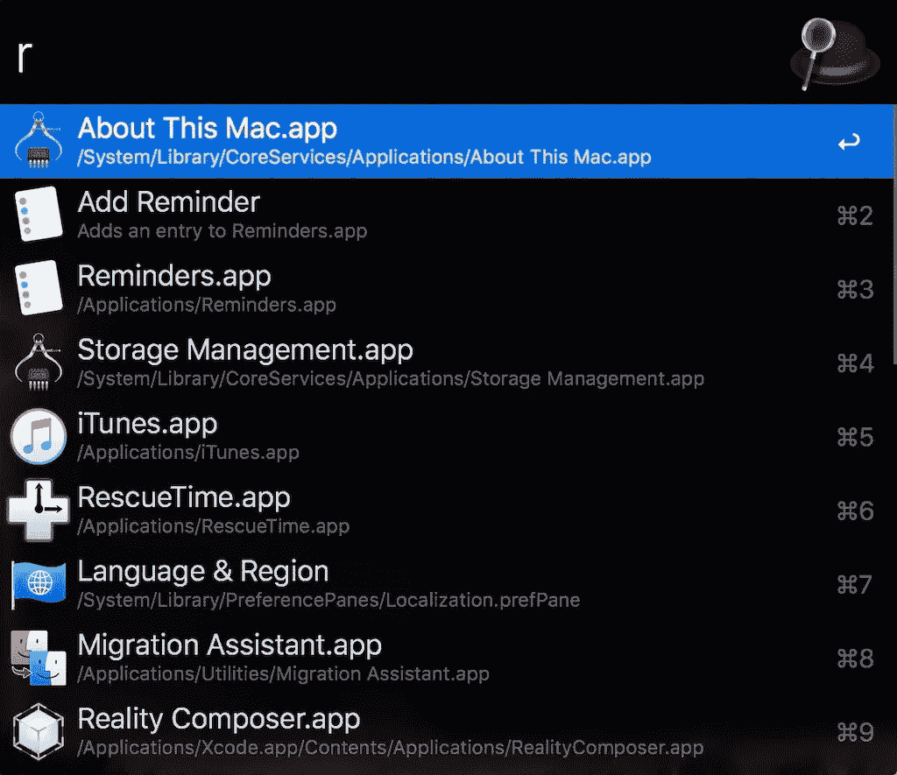

Alfred 是一个启动器——这个应用程序在你按下⌘+Spacebar 时打开，让你快速打开其他应用程序。服用类固醇。我绝对喜欢它！我甚至在拥有 Mac 之前就知道它的存在，我很羡慕 Mac 用户有这么棒的启动器。我在 Windows 上使用了 [Launchy](https://www.launchy.net/) 和在 Linux 上使用了 [GNOME Do](https://en.wikipedia.org/wiki/GNOME_Do) ，它们都很棒(仅仅有一个启动器就会让你感觉更有效率)。

所以当我拿到我的 Mac 时，我做的第一件事就是用阿尔弗雷德替换了聚光灯。即使没有 PowerPack，它也比 Spotlight 强大得多。但是 PowerPack(一个付费扩展)才是它真正出彩的地方。它启用了更多的功能，如文本扩展(这里称为“片段”)或剪贴板历史。但是 Powerpack 的最佳特性是“Alfred Workflows”，这是用户定义的脚本，可以让您自动执行许多任务。我有一堆工作流程，可以快速创建提醒、待办任务、临时电子邮件、兑换货币，或者搜索表情符号和 Unicode 字符。

Alfred 已经有 4 版了，但是我还是没有从 3 版升级。

## 我的阿尔弗雷德工作流程

以下是我和 Alfred 一起使用的一些工作流程:

*   [Alfred Workflow Todoist](https://github.com/moranje/alfred-workflow-todoist)—让我快速将任务添加到 Todoist
*   [转换](http://www.packal.org/workflow/convert) —从一个单位转换到另一个单位。我主要用它来兑换货币。
*   [egg timer](https://github.com/ihowson/EggTimer2)——有点过时的工作流程，但是唯一能让我轻松创建定时器的(我想每工作 60 分钟休息一会儿)
*   [表情符号搜索](https://github.com/jsumners/alfred-emoji)——比 Mac 上默认的表情符号图标面板快得多。
*   [阿尔弗雷德 3 的提醒](https://github.com/surrealroad/alfred-reminders) —键入“20 分钟后做事情”将创建一个 20 分钟后“做事情”的提醒。它让我可以快速设置提醒，而不会从当前任务中分心。
*   [临时电子邮件](https://www.packal.org/workflow/temporaryemail) —当我需要注册一些垃圾邮件服务时，创建一个一次性临时电子邮件。
*   [Toggl](https://github.com/jason0x43/alfred-toggl) —与 [Toggl](https://toggl.com/) 时间跟踪器交互
*   [Unicode 符号搜索](http://www.packal.org/workflow/symbols-search) —快速查找并复制任何 Unicode 符号。

## [磁铁](https://magnet.crowdcafe.com/)

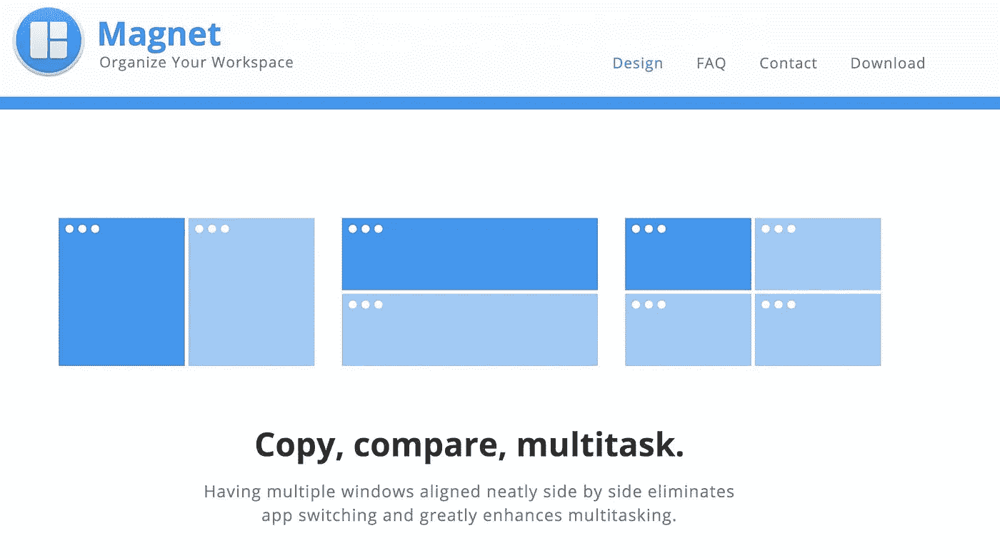

磁铁是一个窗口管理器。令人难以置信的是，Mac 仍然没有内置支持键盘快捷键的窗口管理器。幸运的是，Magnet 填补了这一空白(价格只有几美元)。默认情况下，它使用⌃+⌥作为修饰符，这与我的许多 VS 代码设置相冲突(我使用⌃+⌥作为我所有自定义快捷键的修饰符)。所以我改成了⌘+⌥+⌃.这听起来像是要同时按很多键，但是我用 Karabiner-Elements(下面会提到)将这 3 个键映射到一个键上。

如果你喜欢免费的替代品，还有[矩形](https://github.com/rxhanson/Rectangle)——停产的[眼镜应用](https://www.spectacleapp.com/)的继任者。我开始用 Magnet 是因为 telegraph 没有一些快捷方式(比如“拆分成屏幕的 1/3”)。但是矩形比磁铁有更多的选择，所以它看起来是一个很好的替代品。

如果你错过了一个平铺窗口管理器，还有[紫水晶](https://github.com/ianyh/Amethyst)。我试过，感觉不如 i3 好，就没坚持下来。它缺少基本的功能，比如用`modifier + arrow key`移动到一个特定的方向。

## [Todoist](https://todoist.com/)

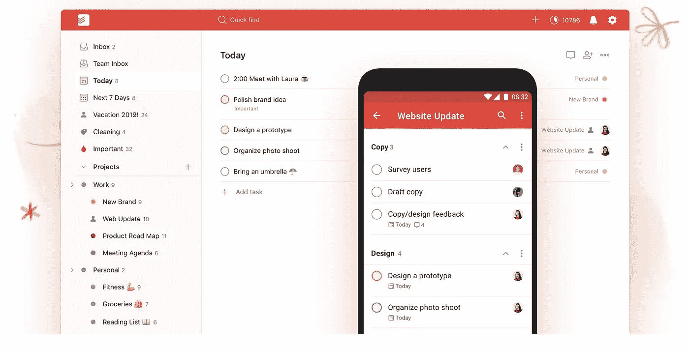

我的待办事项管理器。我尝试使用不同的应用程序(天哪，我想我已经测试了所有的应用程序)，我总是回到 Todoist。我喜欢它干净的界面，“未来 7 天”的视图，以及创建任务时使用特殊快捷方式的能力。例如，如果我添加一个任务:“写一篇博文到 p1 #blog”，它将创建一个“写一篇博文”任务，将截止日期设置为今天，添加“优先级 1”标志，并将其分配给一个名为“blog”的项目整洁！

## [推土机](https://dozermac.com/)

这是我的菜单栏大部分时间的样子:

这就是**真正的**样子:

Dozer 是一个小应用程序，让我的菜单栏易于管理。它可以让我隐藏那些我不经常使用的项目。通过键盘快捷键，我可以快速显示/隐藏它们。如果你需要更多的功能，还有一个名为[酒保](https://www.macbartender.com/)的付费应用，但 Dozer 对我来说非常有用。

## [更好的触摸工具](https://folivora.ai/)

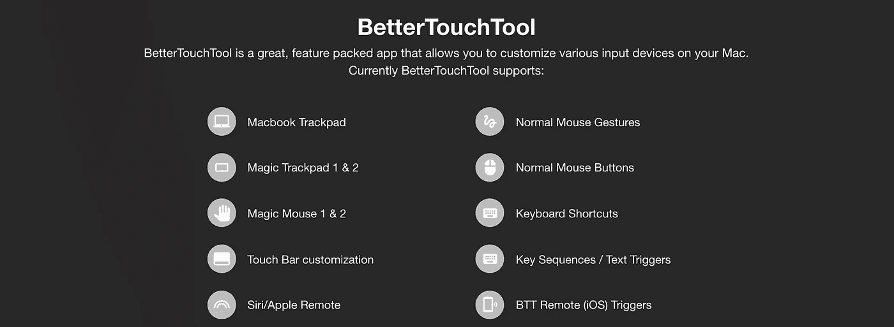

BetterTouchTool(简称 BTT)可以让你为你的 Mac 定制任何输入设备。您可以创建自定触控板或 Magic Mouse 手势、自定键盘快捷键和宏(按键序列)。它带有一个剪贴板管理器和窗口管理器。它可以取代我正在使用的许多其他工具。

但这些功能都不是我决定花 10 美元买这个应用的原因。我买它是为了可以定制我的 Macbook 的 touch bar。在最初的形式下，touch bar 对我来说是不可用的。根据你使用的应用程序而改变的按钮是有史以来最糟糕的想法之一。我不想每次更改当前使用的应用程序时都重新发现 touch bar 上的内容。而且反正一半的按钮都没用。我不想要音量或亮度的滑块！99%的时候，我只需要增加或减少一个等级。我只要按一下按钮就能做到。因此，正如我认识的大多数人一样，我甚至没有使用 touch bar。有一天，我在 HackerNews 上偶然发现了一篇文章，这篇文章解释了如何让 touch bar 真正有用。看完这篇文章，我立刻买了 BTT。

现在在我的 touch bar 上，有(从左到右):

*   Esc 键(那个我不怎么用，但是你不能拆)。
*   一个特殊的按钮，可以将 touch bar 切换回默认的蹩脚的 Mac 版本(再次声明，它是默认存在的，我没有使用它)。
*   打开(或切换到)日历、邮件、Todoist 和 Toggl 应用程序的按钮。我会时不时地使用它们(主要是当我在腿上用 Macbook 工作时，否则我用键盘切换会更快)。
*   显示 Spotify 或 Youtube 上当前正在播放的歌曲的脚本。只有当其中一个应用程序打开时，它才可见。如果我按下歌曲的名字，它将跳到下一首。最佳按钮！永远不会。
*   Spotify/Youtube 的播放/暂停按钮。
*   亮度下调和上调按钮。
*   音量调低、调高和静音按钮。

还有很多其他小部件可以使用——天气、温度、时间和日期、自定义 shell 或苹果脚本。自从我建立了我的触摸栏，BTT 作者已经添加了很多新的，所以我将不得不在某个时候修改它。

## 弗朗兹

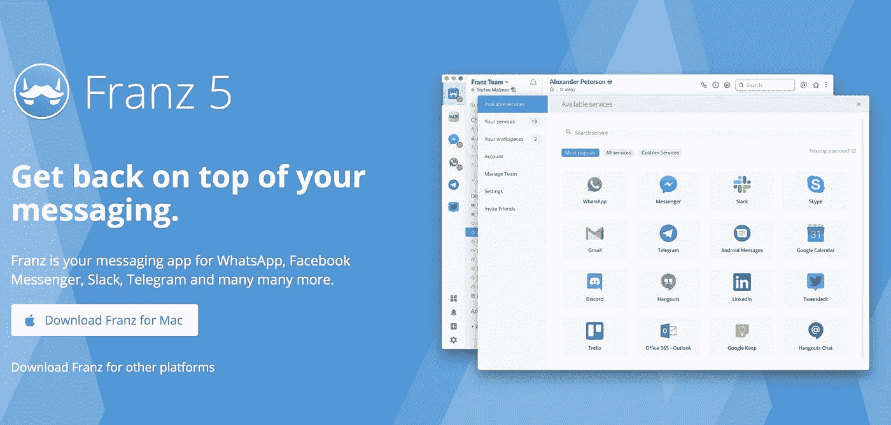

一个应用程序聚合我所有的消息应用程序。这是一个很棒的免费工具，支持大多数消息应用程序。我在 Slack、Skype、WhatsApp、Telegram、Twitter、Hangouts 和 Facebook Messenger 上使用它。唯一的缺点是——你增加的每一项服务都会产生一个新的电子应用。内存消耗有时会非常高。但到目前为止，我还没有找到任何可靠的替代方案。

## [通量](https://justgetflux.com/)

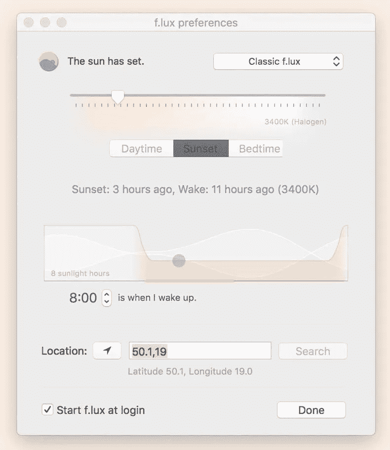

Flux 根据一天中的时间调整屏幕的颜色。在白天的早些时候或者晚上的晚些时候(对于我们大多数程序员来说，通常是一样的)，它会让你的电脑的颜色变得更暖(黄色)。这是一种你只安装一次就忘记了的应用程序。

## [登山扣-元素](https://pqrs.org/osx/karabiner/index.html)

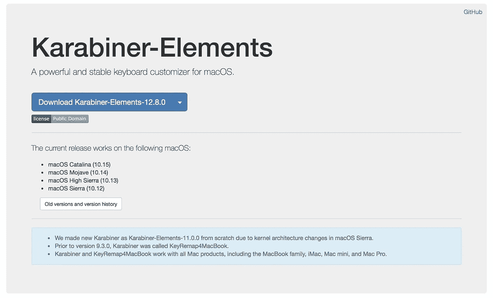

Karabiner-Elements 是一个免费的应用程序，可以定制你的键盘(它与 BetterTouchTool 有很多重复)。您可以交换按键，更改功能键的行为，或者定义一些复杂的宏。我用它做三件事:

*   我已经交换了大写锁定和 Esc 键(我无法相信在这样做之前我是如何生活的)。幸运的是，在我换到触摸条上有无用 Esc 键的 Macbook 之前，我发现了这个技巧。
*   由于我使用的是 [Kinesis Advantage 2 键盘](https://kinesis-ergo.com/shop/advantage2/)，我已经将 Home 键重新映射到⌃(Ctrl)和 End 到⌘+⌥+⌃(这是一个我用 Magnet 进行窗口管理的修改器)的组合。这种组合(通常加上 Shift)被称为[“超级”键](https://statusq.org/archives/2016/09/25/7857/)，它给了你另一个修改键来使用快捷键。以防在 Mac 上有三个修饰键是不够的。
    如果你用的是*【普通】*键盘，我看到有人把“按 Ctrl”映射成 Esc 键，把“按住 Ctrl”映射成 Ctrl 键。这是非常聪明的，因为我们从来不只是按下 Ctrl 它总是与其他键结合使用。这将释放“Esc”(或“大写锁定”，如果你遵循我以前的建议，并交换他们)为您的超级键或任何一种你能想到的疯狂组合。
*   细心的读者可能会注意到，我不再有办法启用大写锁定。“Caps Lock”键现在是我的 Esc，Macbook 不让你重新定义 touch bar 上的“Esc”键。所以我有 2 个 Esc 键，没有大写锁定。这很糟糕——没有大写锁定，我该如何在网上与人辩论？幸运的是，有一个解决方案——我将同时按下**和 Shift** 键映射到 Caps Lock。这听起来很疯狂，但实际上很直观，也很好记。我不知道为什么这不是默认行为。为了让它工作，我必须直接修改 Karabiner-Elements 配置文件。你可以[检查我的 dotfiles 库](https://github.com/switowski/dotfiles/blob/master/.config/karabiner/karabiner.json#L41)看看怎么做。把你不需要的东西拿走，把这个`karabiner.json`放到你的 *~/里。config/karabiner/karabiner . JSON*文件。

## [鱼](https://fishshell.com/)

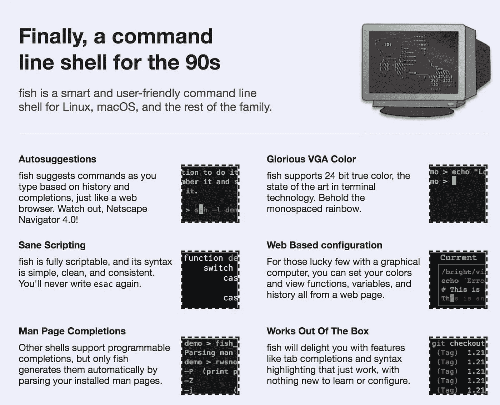

我刚开始用 Linux 的时候，用的是 Bash。然后我就换了 Z 壳。天啊。然后我意识到它变得有点迟钝，主要是在启动的时候。我决定，我没有时间坐下来盯着我的屏幕几乎 2 秒钟，等待它加载。所以当 prezto 是一个很酷的新事物时，我就转而使用它(而不是像今天这样被抛弃的包)。2017 年我换了一台 Macbook。这是一个尝试新事物的好机会！工作上的一些同事当时也在用鱼，看着挺有意思的。它有一些现成的简洁功能，比如自动建议、语法高亮，或者使用⌥+→和⌥+←.在目录间切换所以我试了一下。我喜欢它，所以我今天还在用它。我使用带有几个插件的 [fisher](https://github.com/jorgebucaran/fisher) 包管理器(也有 oh-my-fish，但 fisher 应该更快，所以我坚持使用)。我尽量避免添加太多插件，以使终端启动更快(我平均每天都要启动一堆终端会话，所以那几秒钟累加起来)。

## [上尉](http://captin.mystrikingly.com/)

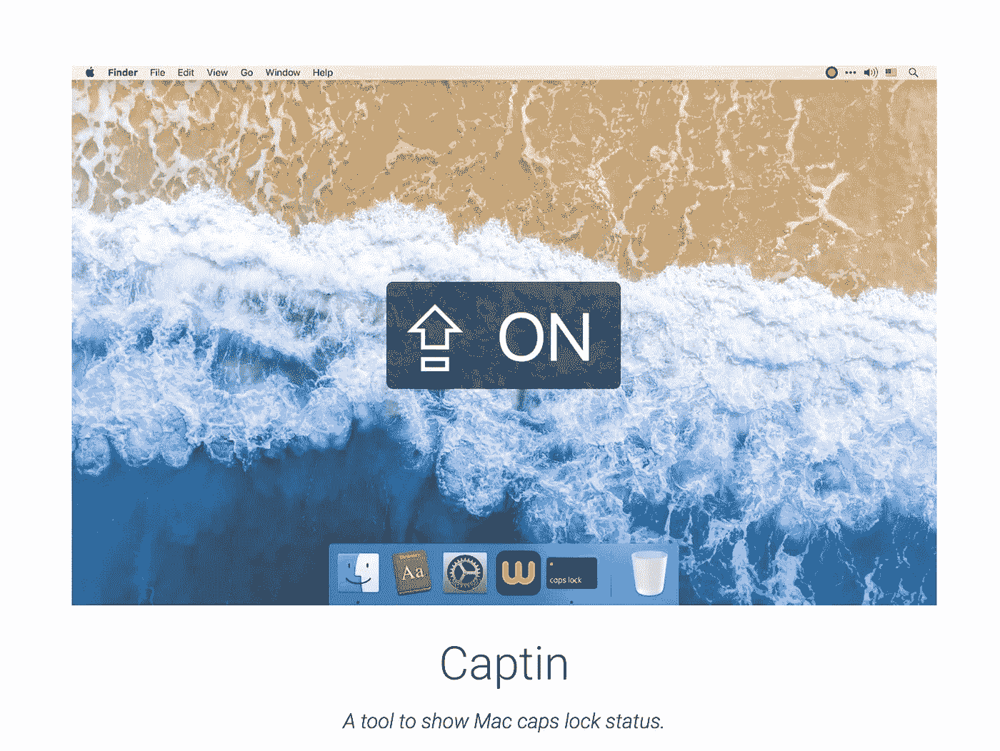

当您打开或关闭大写锁定时，它会显示一个通知。因为我使用了一种稍微不寻常的方式来操作大写锁定，所以当我关闭它时，我喜欢有这个小的视觉(和听觉)提示。

## [安奇](https://apps.ankiweb.net/)

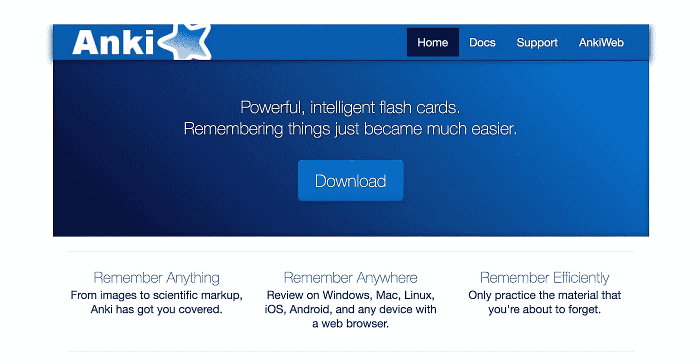

Anki 是一个间隔重复应用程序。在我生命的大部分时间里，我认为我很愚蠢，因为我在记忆东西方面有严重的问题。结果证明我使用了错误的技术。间隔重复是一种简单的机制，可以确保你不会重复你已经记住的东西，而只是那些你记起来有问题的东西。我纯粹在手机上使用 Anki，但在电脑上添加新单词要容易得多。

此外，Anki 不仅对学习新语言有用(尽管我现在正在用它学习日语)！我遇到过一个人，他几个月前开始从事一个非常复杂的软件项目。这个系统有如此多的部分，以至于他(以及团队中的每个新人)都要花很长时间去了解它们是如何工作的。所以他开始用 Anki 制作抽认卡，描述系统的各个部分以及如何使用它们。很快，他团队中的其他人也开始使用 Anki，他们说这比阅读一页又一页的文档要好得多！

## [语法上](https://www.grammarly.com/)

Grammarly 是一个检查你文本中的语法和错别字的应用程序。作为一名非母语人士，它帮助我找到了一些我可能不会注意到的东西。用了几个月免费版，前几天终于买了超值计划。

## [斯基奇](https://evernote.com/intl/en/products/skitch)

在 Mac 上截图很容易。有键盘快捷键可以让你快速截取整个桌面的截图，只是其中的一部分，甚至可以选择一些选项，比如延迟截图，如果你想要一个网站上悬停效果的截图。然后你可以打开截图，放一些箭头或者文字，发给某个人。所以这在很长一段时间里对我有效。直到我找到斯基奇。使用 Skitch，当你截屏时，它会自动打开一个简单的应用程序，并使用一些默认工具对它们进行注释。它有巨大的粉红色箭头，大文本等。完成后，你可以将截图从应用程序拖放到聊天窗口。再也不用打开 Finder 来查找截图，再也不用在预览应用程序中调整文本大小和颜色，或者用 3 条直线粘在一起制作笨拙的箭头。有了 Skitch，我可以在不到 10 秒的时间内截图、注释问题并发送给 Slack 上的某个人。

唯一的缺点是 Sketch 的键盘快捷键不可定制，并且与 Mac 的冲突。最后我改了 Mac 的快捷方式。

## [键盘手](https://github.com/keycastr/keycastr)

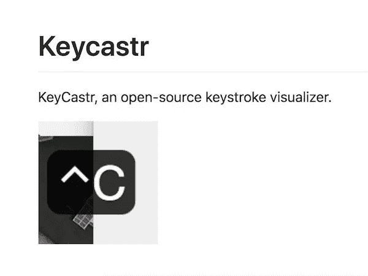

如果你想知道人们在视频中使用什么应用程序来显示他们按下了哪些键，那么 KeyCastr 就是其中之一。我确实用过一次，但是如果我需要录制一些视频，我肯定会再次使用它。

## [LICEcap](https://www.cockos.com/licecap/)

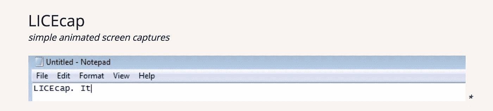

他们说一张图片胜过千言万语。嗯，一张 GIF 大概抵得上 9000 多个字。尤其是当你试图表现出一些错误的行为时。LICEcap 是一款免费软件，可以快速记录你屏幕上的 gif 图片。我喜欢！

## [SimpleMind Lite](https://simplemind.eu/)

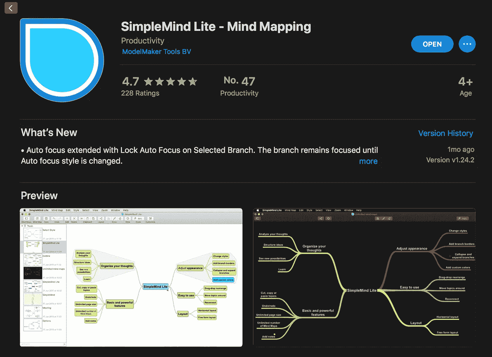

思维导图工具。

## [解归档器](https://theunarchiver.com/)

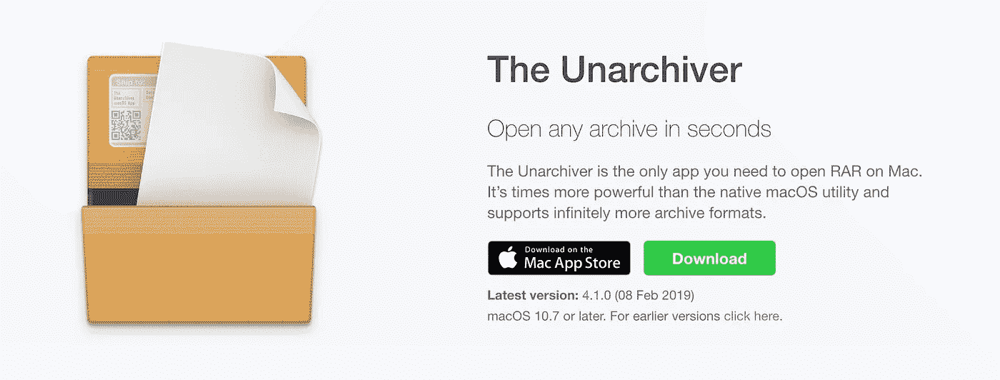

我主要使用它的 CLI 命令`unar`来提取任何类型的归档文件。不用再记住`tar`或`unzip`的旗帜真是太好了！

## [Visual Studio 代码](https://code.visualstudio.com/)

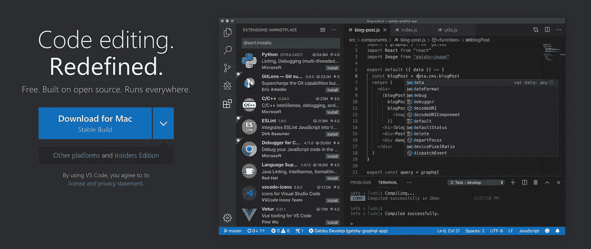

我的代码编辑器。我用了很多年 Sublime，但是当我在换 Macbook 的时候，我决定最终转向 VS Code(在过去两次尝试不成功之后)。

## [工作流程](https://workflowy.com/)

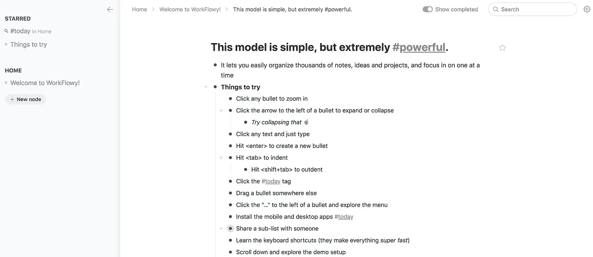

我用它来组织我的长期和短期目标，然后在 Todoist 中转化为可操作的步骤。

# 平凡但强制性的东西

还有一些工具可能每个人都知道，但为了保持列表的完整性，下面列出了这些工具:

*   [Evernote](https://evernote.com/)——一款不需要介绍的笔记应用。如今它不太受欢迎，但我从未真正离开过它。免费计划对我来说还是很好的。
*   [git](https://git-scm.com/) —版本控制工具。
*   vim —我使用 vim 主要是为了快速编辑(不需要成熟 IDE 的小文件或笔记)。
*   [VLC](https://www.videolan.org/vlc/index.html)——视频播放器。我在我所有的 Mac、Windows 和 Linux 电脑上使用它。
*   GIMP——我或许应该学习如何使用那些时髦、漂亮(也很贵)的 Mac 应用程序来编辑图像。但是我太懒了，而且我认识 GIMP 好几年了，所以暂时还好。
*   [Dropbox](https://www.dropbox.com/)——我首选的文件同步工具。
*   [iterm2](https://iterm2.com/) — *事实上的*Mac 终端应用。它运行得很好，把它的配置很好地保存在我的 Dropbox 备份文件夹中，我不打算在短期内把它换成别的东西。
*   VirtualBox——尽管我已经很久没用它了，但它是我的虚拟化工具。回到过去，当我还在家里使用 Windows 时，VirtualBox 是一个很好的工具，可以轻松地安装 Linux 容器，所以我可以实际上做一些编程(这是在 Windows 10 之前，有所有的编程好东西)。
*   点文件。我是 dotfiles 的忠实粉丝，虽然有一些很棒的工具来管理它们(比如 [yadm](https://yadm.io/) 或 [dotbot](https://github.com/anishathalye/dotbot/) )，但我总是使用一些 bash 脚本来管理它们。我尽量让它们保持最新，这样万一笔记本电脑出现故障，我可以用我所有的设置和软件换一台新的。你可以在这里找到我的网站文件。
    如果你使用的是 Mac 或 Linux，你没有点文件，但你想保留你软件的配置，还有 [mackup](https://github.com/lra/mackup) 。它将备份你的大多数应用程序的配置，包括 git、bash 等。(它支持超过 450 个应用程序)放到 Dropbox、iCloud 或类似服务的文件夹中。此外，它会将配置文件替换为指向备份位置的符号链接，以便自动备份它们。只需一个命令，您就可以在不同的计算机上恢复它。
*   [Docker for Mac](https://docs.docker.com/docker-for-mac/)—Docker 的 Mac 客户端。在我有 Mac 之前，我很羡慕 Mac 用户拥有的带有 Kitematic 应用程序的漂亮 Docker 界面。下载图像、列出正在运行的容器，或者通过一个漂亮的 GUI 在其中执行命令，听起来是一个不错的选择。当我换成 Mac 的时候，我已经知道如何使用 Docker，以至于我可以在终端中舒适地做所有这些事情。所以我实际上从来没有用过 GUI(但是如果你是一个*【GUI 人】*，我相信你会爱上它的！).
    更糟糕的是，Docker for Mac 还有一个[内存泄露问题](https://github.com/docker/for-mac/issues/3232)。这是 2018 年已经报道过的事情，并且已经关闭，因为*“这是 Mac 的问题，而不是 Docker 的问题。”*即使人们仍然经常评论他们有这个问题。即使是停止的容器，在运行一段时间后，Docker 也开始消耗相当多的内存(并且它的能耗很高，所以我通常在使用电池时禁用它)。

# 我不使用的工具，但我强烈推荐

最后，有一些很棒的工具我目前没有使用。其中一些是我过去用过的工具。对于其中一些，我还没有找到一个好的用例:

*   我已经试着使用这个终端多路复用器几次了。但是我从来没有坚持过。在 iterm2 中定义快捷方式来分割终端并在其中移动是很容易的，所以我真的不需要一个单独的工具。我也不需要让我的终端会话运行很长时间。如果一个终端*死了*，没关系——我只需要开始一个新的。使用 tmux 的明显原因是当您经常连接到多个服务器时。我不再做了。有了 Docker 和整个 CI/CD 运动，我意识到我越来越不需要在任何地方使用 SSH 了。我在我的本地机器上工作，把我的代码推到 GitHub/GitLab，机器从那里接管。
*   [BitBar](https://getbitbar.com/) —一个很棒的小应用程序，可以让你把任何脚本或程序的输出放到菜单栏中。CPU 使用图表？检查过了。小 menulet 来和 MySQL 交互？码头工人身份？比特币价格？十种不同的电池电量指示器还是你的苹果键盘电池电量指示器？都检查过了！我不使用它的唯一原因是——我现在不需要这些脚本。我只需要显示 RAM 和 CPU 图形，但不幸的是，当我检查时没有 RAM 图形插件，所以我安装了 [MenuMeters](https://member.ipmu.jp/yuji.tachikawa/MenuMetersElCapitan/) 来代替。
*   [安非他命](https://apps.apple.com/us/app/amphetamine/id937984704?mt=12) —防止你的 Macbook 进入睡眠状态。做演示时的好工具。
*   [破折号](https://kapeli.com/dash) —访问文档的绝佳工具。支持几乎所有发明的编程语言，离线工作，你甚至可以直接在 StackOverflow 上搜索。但出于某种原因，我从来没有真正习惯它。
*   一个剪贴板管理器，在我换成 Alfred 之前我用了一段时间。它是免费的。
*   崇高文本(Sublime Text)——多年来，我一直把它作为我的默认编程编辑器。然后我就换成了 VS 代码。我仍然保留 Sublime Text 来快速预览和编辑大文件(尽管我越来越多地为此使用 vim)。
*   缓慢退出应用程序 —当我不小心按下了⌘+Q 而不是⌘+W 时，我很沮丧，我关闭了当前的应用程序。慢速退出应用程序通过添加时间阈值来防止这种情况。默认情况下，你需要按住⌘+q 1 秒钟才能真正关闭应用程序。如果我以前知道它，我可能会使用它，但因为我不知道，我决定重新映射⌘+Q 到一些无用的命令。所以现在是“反转颜色”
*   [小抄](https://mediaatelier.com/CheatSheet/) —当我发现这个小帮手时，我真的很兴奋。当你安装它时，每次你按住⌘键，它会显示一个当前应用程序的快捷方式覆盖。但是后来我意识到我并不是真的用，就卸载了。

## 结论

我从我的同事那里了解了这些工具，浏览了其他人的网站文件，阅读了 HackerNews 上的帖子。如果没有其他人分享他们的工具，我可能还在使用 Nano。所以我希望有人会发现这个列表很有用，并在它的基础上创建一个更好的列表！

准备这些列表也是清理我的 Mac 的一个绝佳机会——我删除了一堆不用的应用程序、脚本和别名。

如果你喜欢这个列表，看看[关于我最喜欢的 CLI 工具的第二部分](https://medium.com/@sebawitowski/my-favorite-cli-tools-c2fa484cee52)！

*原载于 2020 年 1 月 9 日 https://switowski.com**[*。*](https://switowski.com/blog/favorite-mac-tools)*

* [## 编写面试问题

### 一个完整的平台，在这里我会教你找到下一份工作所需的一切，以及…

技术开发](https://skilled.dev)*