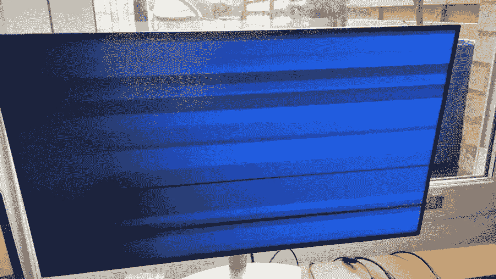

# 我会把我的 M1 苹果退回去。还没准备好。

> 原文：<https://levelup.gitconnected.com/im-sending-my-m1-apple-back-it-s-not-ready-yet-a4b80f23c6b4>

## 作为一名工程师/科学家，该系统对于工作来说问题太多，不可行。

下面这个故事已经过时了。从那以后，我一直在观察 M1 建筑周围的生态系统，并写了一个新的故事，来解决我在下面讨论的问题。

 [## 技术计算的 M1，第二轮:复活

### 我之前写道，我的 M1 Mac 不适合使用*，我要将其退回。后来发生了什么？

levelup.gitconnected.com](/m1-for-technical-computing-round-two-the-resurrection-e81d5594cccf) 

更新大苏尔 11.1 -> 11.2 时系统冻结。这可以通过硬复位(按住电源按钮)恢复。这是我最小的问题！

在阅读了大量关于 M1 Mac 电脑的好评后，我决定尝试一下 Mac Mini，因为我的 2013 Macbook Pro 早就应该提速了。

如果可能的话，我会把这篇文章限制在事实陈述上，因为把它变成咆哮对任何人都没有帮助。但是，这是我的主观看法:

> 这个系统的表现如此糟糕，我真的很失望。请继续阅读，了解 finder 和系统偏好设置不起作用等基础知识，以及软件开发人员会遇到的更多专业问题。
> 
> **我正在经历认知失调，因为有很多好评如潮的评论，但这花费了我很多时间、金钱和沮丧。我不知道为什么会有如此多样的经历。**
> 
> 宣传的速度提升是非常真实的——当它准备好用于专业用途时，这将是一台可怕的机器，但现在还不是。

好吧，主观一点。这里有一些事实与任何考虑 M1 的人相关，尤其是工程师、科学家和软件开发人员。

***这里的一切都是“在写的时候”——情况每天都在发展，这篇文章几个小时内就会过时。但这里有一张截至英国时间 2021 年 2 月 6 日下午 17:33 的快照。***

## 我和我的工作:

我是一名科学家和首席应用程序开发人员( [@thclark on github](https://www.github.com/thclark) )，从事以下工作:

*   用于大气分析和绘图/可视化的 C++库
*   基于 Django 的应用程序，使用 docker 和 docker-compose 部署
*   基于 Python 的数据分析库
*   React 中的前端 UI 开发
*   我使用 git 进行版本控制
*   我经常想使用 finder 与系统上的文件和文件夹进行交互。

我在 Octue 工作，这是一家小公司，其使命是帮助科学家解决气候危机。我们主要研究风能。

## 我买了什么:

一台带 8Gb 内存和 512Gb 硬盘的 M1 mac mini。直到今天早上升级到 11.2 引入了重大的新问题。

## 问题(有一些解决方案)，从最不严重到最严重:

它们也大致按以下顺序出现:

*   **你必须关闭防火墙**(默认情况下它是关闭的，但是[打开它会阻止 docker 启动](https://github.com/docker/for-mac/issues/5140))。码头队踢屁股，所以这个问题可能会被固定的时候，我完成这一点🤣。
*   我在安装自制软件时遇到了问题。那边的团队工作非常非常努力。或许苹果的工程师可以帮他们一把，或者至少给他们颁发某种奖章？我的一个团队使用了迁移助手，他的自制程序看起来不错(但不是本地的)。是在 rosetta 还是 native 上做，或者各自怎么做，都不是很明显。**我的结论是，它应该在本地手动完成，**但请查看自制程序页面，了解最新的操作方法。
*   Big Sur 于 2020 年底发布，但默认系统 **python，2.7 早就过时了(自 2014 年起)，并且可能不安全(自 2020 年 1 月日落之后)**。不是问题，而是观察，真的。
*   `nodejs`可以用 brew 本机安装，(并且有 docker 镜像可用)但是二进制文件还没有构建，所以**如果你需要从 shell 脚本安装 nodejs(即使在 docker 文件中):你不能**。
*   我使用`pyenv`来管理 python，它在自制软件上安装得很好，但是我在安装 python 3.8 时出错了。我相信那是因为我用 homebrew native 安装了`pyenv`，所以**只会安装“python 3 . 9 . 1”**。
*   像`numpy`和`scipy` *这样的科学库似乎*得到了支持，但如果你想让它们获得像 HDF5 和 openBLAS 这样的依赖项，它们仍然必须从源代码手动构建**，这是一个非常耗时的过程**。我从来没有编译过 openBLAS，因为…
*   平台检测给许多不同的库带来了无尽的问题；我分不清它是`aarch64`、`arm64`、`arm64/v8`、`armv8,`、`armv8.4`还是其他一些类似的东西中的一个。我怀疑正确的是`arm64/v8`(因为想必 ARM 在某个时候会想生产其他 64 位芯片！)但是共识似乎是`arm64`而且我可以预见使用`/`字符会有很多问题！非常需要澄清。
*   系统更新偏好设置面板有问题。它起初不让我点击和批准升级到大苏尔 11.2(同样的问题如上？)，然后重启后甚至没有渲染任何内容(空白)。**你可以通过在终端中键入`softwareupdate -l`来解决损坏的软件更新面板**。
*   从 Big Sur 11.1 到 11.2 的更新冻结了我的图形适配器(屏幕上奇怪的蓝色图案)并使机器崩溃，尽管这在硬重启后并没有持续。
*   finder 有问题。系统“选择文件”对话框冻结(直到重新启动)，使用`Esc`可以退出，但阻止你浏览文件夹或点击“选择”。选择文件的能力是必不可少的。
*   从 11.1 到大苏尔 11.2 的更新，把我的 zsh 壳弄坏了。`git`不再工作(没有找到)，它搞乱了我的终端。没有 git 或稳定的终端是我的最后一根稻草。

## 公平地说:

当它工作的时候，速度非常快，非常平稳。一些亮点:

*   GDAL 和相关库的编译时间从 50 分钟(2013 年末，MBP)减少到<8 minutes
*   A particularly complex and slow 【 process was reduced by 10x in duration.
*   Indexing in pycharm, that great nightmare of python developers, seems to run dramatically quicker.

## What it cost:

So far I have spent a full 6 working days to get the system set up, overcome the install problems, persevere, and I’ve made and pushed several issues and a few fixes.

**，这让我们损失了大量计费时间**。远远超过 mac mini 本身，我很遗憾大部分时间我都在遭受沉没成本谬论的折磨。

苹果:如果你正在读这篇文章，我很乐意回去继续工作，为你修复(至少是部分)上述噩梦，然后在这里报告，证明我已经修复了它们。但是你必须赞助我们这样做，因为我们不能用更多的免费劳动力来补贴你的产品生态系统——我们修复了一些东西，尽了我们的一份力。